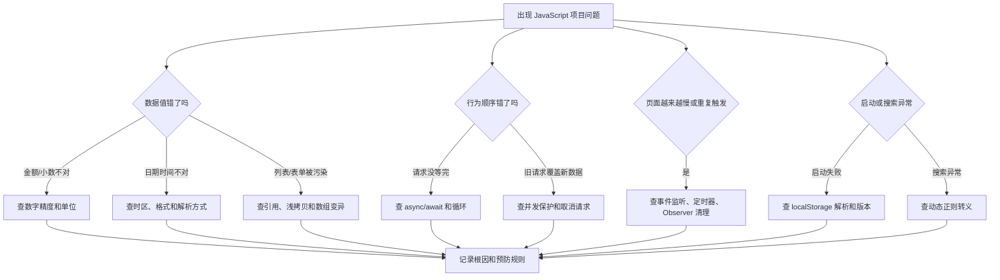
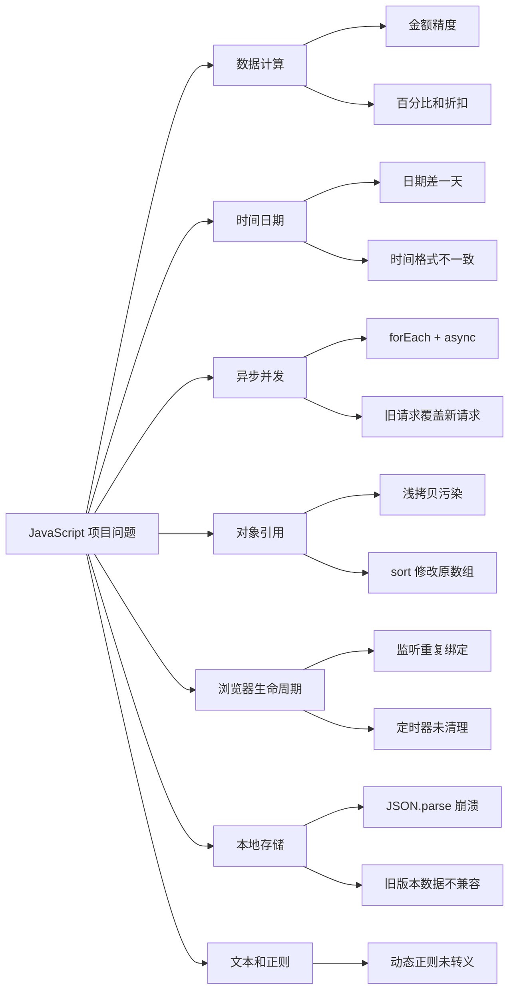
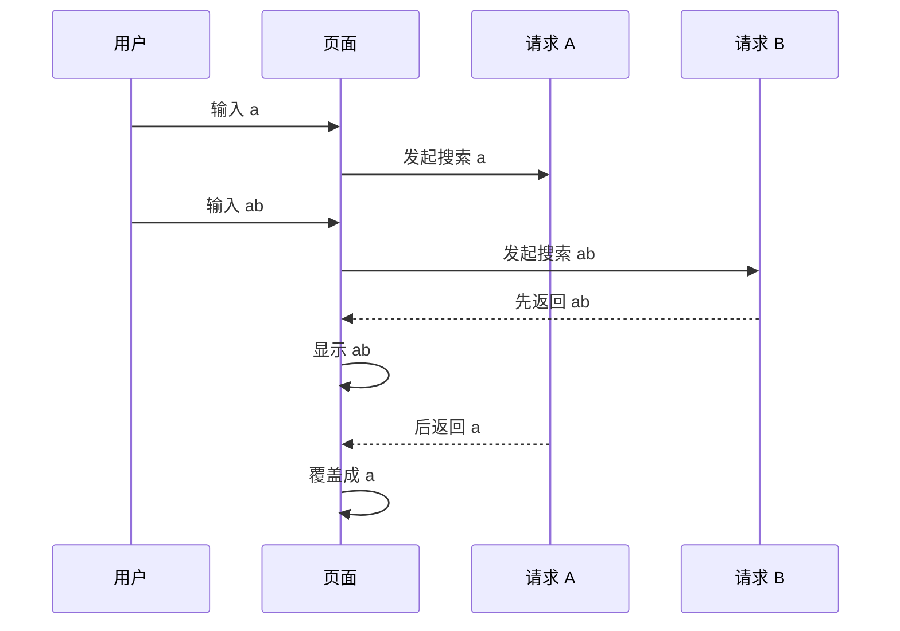

# JavaScript 真实项目问题库

## 这个页面解决什么

这页整理 JavaScript 在真实前端项目中最容易反复踩坑的问题。它不是语法题集合，而是面向项目开发、联调、上线和排障：

- 金额、百分比、折扣计算出现精度误差。
- 日期在不同时区或浏览器里差一天。
- `async/await` 看起来写了，实际请求没有按预期等待。
- 多个请求并发后页面状态互相覆盖。
- 页面切换后事件监听、定时器、Observer 没有清理。
- 深拷贝、排序、数组修改导致原数据被污染。
- localStorage 旧数据让页面启动失败。
- 用户输入拼进正则后搜索或高亮异常。

如果你刚学完 [JavaScript 学习导览](/javascript/introduction)、[异步编程](/javascript/async)、[事件循环](/javascript/event-loop)、[错误处理](/javascript/error-handling) 和 [内存管理](/javascript/memory-management)，这页就是下一步的项目排错清单。

## 排查总流程

JavaScript 问题不要只看报错行。很多问题表面在 UI，根因可能是数据转换、异步顺序、对象引用或浏览器环境。



排查时先收集 4 类证据：

| 证据 | 看什么 |
| --- | --- |
| 输入数据 | 用户输入、接口响应、localStorage、URL 参数 |
| 中间转换 | mapper、filter、sort、format、parse |
| 执行顺序 | 请求发起时间、返回时间、事件触发次数 |
| 输出结果 | 页面显示、提交参数、控制台报错、Network 响应 |

## 问题地图



## 问题 1：`0.1 + 0.2 !== 0.3` 导致金额不准

### 问题现象

- 订单金额显示 `99.899999999`。
- 折扣计算后总价少一分钱或多一分钱。
- 前端显示金额和后端结算金额不一致。
- 表格合计列和详情页金额对不上。

### 影响范围

金额、税率、折扣、积分、库存重量、百分比、图表指标都可能受影响。支付、财务、订单、渠道结算、佣金和发票系统尤其敏感。

### 根因分析

JavaScript 的 `number` 使用 IEEE 754 双精度浮点数。很多十进制小数无法被二进制精确表示。

```js
console.log(0.1 + 0.2) // 0.30000000000000004
```

错误做法是把金额当普通小数一路计算：

```js
const price = 19.9
const count = 3
const discount = 0.8

const total = price * count * discount
```

这段代码在展示上可能通过 `toFixed(2)` 看起来正常，但中间计算和提交参数已经可能出现误差。

### 解决方案

金额使用最小单位，例如“分”，避免小数参与核心计算：

```js
function yuanToCent(value) {
  return Math.round(Number(value) * 100)
}

function centToYuanText(value) {
  return (value / 100).toFixed(2)
}

const priceCent = yuanToCent('19.90')
const count = 3
const discountPercent = 80

const totalCent = Math.round((priceCent * count * discountPercent) / 100)

console.log(centToYuanText(totalCent)) // "47.76"
```

如果业务必须处理高精度小数，例如金融利率、汇率、科学计算，应使用专门的 decimal 库，并把计算规则写进项目文档。

### 预防方式

- 金额字段命名明确单位，例如 `amountCent`、`priceCent`。
- 后端接口和前端类型约定金额单位，不要有的页面用元，有的页面用分。
- 展示格式化和业务计算分开。
- 金额计算写单元测试，覆盖折扣、四舍五入、退货、优惠券叠加。

## 问题 2：日期在页面上差一天

### 问题现象

- 后端返回 `2026-07-01`，页面显示 `2026-06-30`。
- 本地正常，部署到海外服务器或用户切换时区后异常。
- 日期筛选提交后，后端查到的范围比用户选择的少一天。

### 影响范围

报表日期、订单创建时间、合同生效日、生日、排班、活动开始结束时间、导出文件时间列。

### 根因分析

日期问题通常不是单个 API 的问题，而是“日期类型”没有区分清楚。

| 类型 | 含义 | 示例 | 处理方式 |
| --- | --- | --- | --- |
| 日期 | 只表示某一天 | `2026-07-01` | 不要随便转成带时区的 Date |
| 时间点 | 全球唯一时刻 | `2026-07-01T02:30:00Z` | 按用户时区展示 |
| 本地时间 | 某地区的时间 | `2026-07-01 10:30:00` | 需要明确业务时区 |

常见错误是直接解析日期字符串：

```js
const date = new Date('2026-07-01')
console.log(date.toLocaleDateString())
```

`YYYY-MM-DD` 在不同环境中可能被当成 UTC 日期解析，再转成本地时间显示时就可能变成前一天。

### 解决方案

如果字段是“日期”，不要把它当时间点处理：

```js
function formatDateOnly(value) {
  if (!/^\d{4}-\d{2}-\d{2}$/.test(value)) {
    return ''
  }

  const [year, month, day] = value.split('-')
  return `${year}-${month}-${day}`
}
```

如果字段是“时间点”，接口应返回 ISO 时间，并在展示时按用户时区格式化：

```js
function formatDateTime(isoValue, locale = 'zh-CN') {
  return new Intl.DateTimeFormat(locale, {
    year: 'numeric',
    month: '2-digit',
    day: '2-digit',
    hour: '2-digit',
    minute: '2-digit'
  }).format(new Date(isoValue))
}
```

查询范围也要明确边界：

```js
function toDateRangePayload(startDate, endDate) {
  return {
    startDate,
    endDate,
    // 后端按业务时区解释 date-only，而不是前端拼 23:59:59
    type: 'date-only'
  }
}
```

### 预防方式

- 字段文档里写清楚是 date-only、datetime 还是 timestamp。
- 不在页面里随意 `new Date('YYYY-MM-DD')`。
- 报表和筛选接口约定业务时区。
- 日期格式化函数集中管理，不在页面里散落 `toLocaleString()`。

## 问题 3：`forEach` 里写了 `async`，但流程没有等待

### 问题现象

- 批量保存看起来执行完了，但有些请求还在路上。
- loading 提前关闭。
- 批量导入时提示成功，但后台仍在处理。
- 捕获不到循环内部的异步错误。

### 影响范围

批量保存、批量删除、批量校验、文件分片上传、逐个拉取详情、任务队列执行。

### 根因分析

`forEach` 不会等待异步回调，也不会把里面的 Promise 交给外层 `await`。

```js
async function saveAll(items) {
  items.forEach(async (item) => {
    await saveItem(item)
  })

  console.log('done')
}
```

上面的 `done` 会先打印，保存请求还没有全部完成。

### 解决方案

如果要串行执行，用 `for...of`：

```js
async function saveAllInOrder(items) {
  for (const item of items) {
    await saveItem(item)
  }
}
```

如果可以并发执行，用 `Promise.all`：

```js
async function saveAllParallel(items) {
  await Promise.all(items.map((item) => saveItem(item)))
}
```

如果每一项都要记录成功失败，用 `Promise.allSettled`：

```js
async function saveAllWithReport(items) {
  const results = await Promise.allSettled(
    items.map((item) => saveItem(item))
  )

  return results.map((result, index) => ({
    item: items[index],
    ok: result.status === 'fulfilled',
    reason: result.status === 'rejected' ? result.reason : null
  }))
}
```

### 预防方式

- `forEach(async () => {})` 默认视为风险写法。
- 批量操作先决定是串行、并发还是限流并发。
- loading 关闭必须放在真正等待结束之后。
- 批量操作要设计部分失败的结果展示。

## 问题 4：旧请求覆盖新请求，页面显示过期数据

### 问题现象

- 用户快速输入搜索词，最后显示的不是最后一次搜索结果。
- 快速切换 tab，页面展示了上一个 tab 的接口数据。
- 慢网速下更容易复现。

### 影响范围

搜索、远程下拉、自动补全、分页列表、tab 切换、地区联动、地址解析、图表筛选。

### 根因分析

请求返回顺序不等于发起顺序。旧请求晚返回时，如果直接写入页面状态，就会覆盖新请求。



### 解决方案

使用请求序号保护最终写入：

```js
let searchSeq = 0

async function search(keyword) {
  const currentSeq = ++searchSeq
  setLoading(true)

  try {
    const result = await fetchSearchResult(keyword)

    if (currentSeq !== searchSeq) {
      return
    }

    renderList(result.items)
  } finally {
    if (currentSeq === searchSeq) {
      setLoading(false)
    }
  }
}
```

如果使用 `fetch`，也可以取消旧请求：

```js
let controller = null

async function search(keyword) {
  controller?.abort()
  controller = new AbortController()

  const response = await fetch(`/api/search?q=${encodeURIComponent(keyword)}`, {
    signal: controller.signal
  })

  return response.json()
}
```

### 预防方式

- 搜索和筛选类请求默认加防抖。
- 页面卸载时取消未完成请求。
- 只允许最新请求写入页面状态。
- Network 面板里验证请求返回顺序，不只看最后 UI。

## 问题 5：事件监听重复绑定，页面越用越卡

### 问题现象

- 打开弹窗几次后，按一次 Escape 触发多次关闭逻辑。
- 切换页面回来后，滚动监听执行多次。
- 点击一次按钮，日志打印多次。
- 页面越来越卡，但刷新后恢复。

### 影响范围

快捷键、弹窗外点击、滚动监听、窗口 resize、拖拽、Observer、图表实例、Socket 订阅。

### 根因分析

添加监听时没有对应清理，或者每次渲染都重新绑定。

```js
function openDialog() {
  window.addEventListener('keydown', onKeydown)
}
```

如果 `openDialog` 执行多次，就可能重复绑定同一个逻辑。

### 解决方案

用成对的 setup/cleanup 管理生命周期：

```js
function setupDialogKeyboard() {
  function onKeydown(event) {
    if (event.key === 'Escape') {
      closeDialog()
    }
  }

  window.addEventListener('keydown', onKeydown)

  return () => {
    window.removeEventListener('keydown', onKeydown)
  }
}

const cleanupKeyboard = setupDialogKeyboard()

// 弹窗关闭或页面卸载时执行
cleanupKeyboard()
```

也可以使用 `AbortController` 统一清理：

```js
const controller = new AbortController()

window.addEventListener('resize', onResize, {
  signal: controller.signal
})

document.addEventListener('click', onDocumentClick, {
  signal: controller.signal
})

function cleanup() {
  controller.abort()
}
```

### 预防方式

- 任何 `addEventListener` 都要能找到对应清理点。
- 弹窗、路由页面、临时组件关闭时清理监听。
- 避免在频繁执行的函数里重复绑定全局事件。
- 用 Performance 面板和日志计数验证是否重复触发。

## 问题 6：深拷贝用 `JSON.parse(JSON.stringify())` 后数据丢了

### 问题现象

- 日期对象变成字符串。
- `undefined` 字段消失。
- `Map`、`Set`、`RegExp`、函数丢失。
- 循环引用直接报错。
- 表单复制后部分字段类型变了。

### 影响范围

编辑表单、配置表单、复杂筛选条件、低代码表单、图表配置、权限树、菜单树。

### 根因分析

`JSON.stringify` 只适合 JSON 数据。它不是通用深拷贝工具。

```js
const source = {
  createdAt: new Date(),
  remark: undefined,
  pattern: /admin/
}

const copy = JSON.parse(JSON.stringify(source))
```

复制后 `createdAt` 不再是 Date，`remark` 消失，`pattern` 变成 `{}`。

### 解决方案

如果数据确实是可序列化 JSON，可以显式命名：

```js
function cloneJsonData(value) {
  return JSON.parse(JSON.stringify(value))
}
```

如果运行环境支持，优先使用 `structuredClone`：

```js
const copy = structuredClone(source)
```

更推荐针对业务边界写转换函数：

```js
function toUserForm(row) {
  return {
    id: row.id,
    name: row.name,
    roleIds: [...row.roleIds],
    enabled: row.enabled,
    expireDate: row.expireDate
  }
}
```

表单复制通常不需要“完整深拷贝整个对象”，而是只复制表单真正需要的字段。

### 预防方式

- 不把 JSON 深拷贝当成默认工具。
- 表单、提交参数、页面展示分别写 mapper。
- 复杂对象复制要有测试，覆盖 Date、undefined、数组和嵌套对象。
- 后端 DTO 不直接进入表单。

## 问题 7：`sort`、`reverse` 修改原数组，导致列表顺序混乱

### 问题现象

- 切换排序后，原始列表顺序回不去了。
- 多个组件共用一份数组，一个组件排序影响另一个组件。
- 表格数据和导出数据顺序不一致。

### 影响范围

列表排序、排行榜、看板指标、导出预览、树节点排序、拖拽排序。

### 根因分析

`sort` 和 `reverse` 会原地修改数组。

```js
const sorted = users.sort((a, b) => b.score - a.score)
```

这里 `users` 本身已经被改了，`sorted` 不是一份新数组。

### 解决方案

排序前先复制：

```js
function sortUsersByScore(users) {
  return [...users].sort((a, b) => b.score - a.score)
}
```

对于派生列表，保持“原始数据”和“展示数据”分离：

```js
const state = {
  users: [],
  query: {
    sortBy: 'scoreDesc'
  }
}

function getVisibleUsers(users, query) {
  const filtered = users.filter((user) => matchQuery(user, query))

  return [...filtered].sort((a, b) => b.score - a.score)
}
```

### 预防方式

- 把原地变异方法列入代码评审检查：`sort`、`reverse`、`splice`、`fill`。
- 派生数据用函数计算，不覆盖原始数据。
- 导出、表格、统计使用同一份派生函数，避免口径不一致。

## 问题 8：localStorage 旧数据让页面启动失败

### 问题现象

- 页面一打开就白屏。
- 控制台报 `Unexpected token` 或 JSON parse 错误。
- 清空 localStorage 后页面恢复。
- 老用户升级后出问题，新用户正常。

### 影响范围

登录态、主题配置、表格列设置、筛选条件、草稿、任务看板、本地缓存。

### 根因分析

localStorage 里的数据可能被用户、旧版本代码、浏览器插件或异常写入污染。启动时直接 `JSON.parse` 会把整个页面带崩。

```js
const settings = JSON.parse(localStorage.getItem('settings'))
```

旧版本数据结构也可能和新版本不兼容。

### 解决方案

写安全读取函数：

```js
function readJsonStorage(key, fallback) {
  const raw = localStorage.getItem(key)

  if (!raw) return fallback

  try {
    return JSON.parse(raw)
  } catch (error) {
    console.warn(`Invalid localStorage data: ${key}`, error)
    localStorage.removeItem(key)
    return fallback
  }
}
```

给复杂配置加版本：

```js
const CURRENT_VERSION = 2

function readTableSettings() {
  const data = readJsonStorage('tableSettings', null)

  if (!data || data.version !== CURRENT_VERSION) {
    return {
      version: CURRENT_VERSION,
      columns: ['name', 'status', 'createdAt']
    }
  }

  return data
}
```

### 预防方式

- 所有本地缓存都通过统一工具读写。
- localStorage 数据要有默认值和版本迁移策略。
- 登录态和权限态不要永久相信本地缓存，刷新后应向后端恢复。
- 上线后遇到白屏，优先检查 Console 和 localStorage。

## 问题 9：动态正则没有转义，搜索和高亮异常

### 问题现象

- 用户搜索 `a+b`，结果匹配了很多不相关内容。
- 搜索 `[` 直接报正则错误。
- 高亮功能把页面内容标错。
- 日志筛选输入特殊字符后崩溃。

### 影响范围

搜索、高亮、日志过滤、表单校验、批量替换、富文本处理。

### 根因分析

用户输入不能直接拼进 `RegExp`。正则里的 `.`、`*`、`+`、`?`、`[`、`]`、`(`、`)` 等字符有特殊含义。

```js
function highlight(text, keyword) {
  const reg = new RegExp(keyword, 'gi')
  return text.replace(reg, '<mark>$&</mark>')
}
```

当 keyword 是特殊字符时，匹配规则会被改变，甚至直接抛错。

### 解决方案

先转义用户输入：

```js
function escapeRegExp(value) {
  return value.replace(/[.*+?^${}()|[\]\\]/g, '\\$&')
}

function highlight(text, keyword) {
  if (!keyword) return text

  const reg = new RegExp(escapeRegExp(keyword), 'gi')
  return text.replace(reg, '<mark>$&</mark>')
}
```

如果是简单包含搜索，不一定需要正则：

```js
function includesKeyword(text, keyword) {
  return text.toLowerCase().includes(keyword.trim().toLowerCase())
}
```

### 预防方式

- 只有确实需要模式匹配时才用正则。
- 用户输入进入正则前必须转义。
- 搜索、高亮、替换工具函数集中封装。
- 测试用例覆盖 `.`、`*`、`+`、`[`、中文、空格和大小写。

## 问题 10：错误被 `catch` 吞掉，页面没有任何反馈

### 问题现象

- 点击保存后页面没反应。
- 控制台没有明显报错。
- Network 里接口已经失败。
- 用户不知道该重试还是联系管理员。

### 影响范围

请求保存、导入导出、异步校验、上传下载、第三方 SDK 调用、本地存储读写。

### 根因分析

错误被捕获后没有提示、没有日志、没有状态恢复。

```js
try {
  await saveForm()
} catch (error) {
  // 什么都没做
}
```

这会让错误从“可定位问题”变成“用户感觉页面坏了”。

### 解决方案

分层处理错误：

```js
function normalizeError(error) {
  if (error && typeof error === 'object' && 'message' in error) {
    return {
      message: error.message,
      raw: error
    }
  }

  return {
    message: '操作失败，请稍后重试',
    raw: error
  }
}

async function submit() {
  setSubmitting(true)
  clearError()

  try {
    await saveForm()
    showToast('保存成功')
  } catch (error) {
    const normalized = normalizeError(error)
    showError(normalized.message)
    reportError(normalized.raw)
  } finally {
    setSubmitting(false)
  }
}
```

### 预防方式

- `catch` 里至少做三件事之一：用户提示、技术日志、状态恢复。
- 请求错误、业务错误、代码异常要分层。
- 表单提交必须有 loading 和防重复提交。
- 关键操作保留 traceId、请求参数和错误响应，方便联调。

## 上线前检查清单

| 检查项 | 合格标准 |
| --- | --- |
| 金额计算 | 核心计算使用最小单位或 decimal，不直接用小数连续计算 |
| 日期处理 | date-only 和 datetime 分开，不随意 `new Date('YYYY-MM-DD')` |
| 异步循环 | 没有风险 `forEach(async () => {})` |
| 并发请求 | 搜索和筛选只允许最新请求写入状态 |
| 事件监听 | 每个全局监听、定时器、Observer 都有清理点 |
| 数据复制 | 表单复制使用 mapper，不直接绑定列表行 |
| 数组排序 | 派生排序不修改原数组 |
| 本地缓存 | localStorage 读取有 try/catch、默认值和版本 |
| 动态正则 | 用户输入进入正则前已转义 |
| 错误处理 | catch 不吞错误，页面有反馈，日志可追踪 |

## 下一步学习

如果你想补基础，回到 [JavaScript 学习导览](/javascript/introduction)。  
如果你想做项目练习，继续做 [JavaScript 任务看板从零到项目](/javascript/task-board-project)。  
如果问题已经进入 Vue 页面状态、路由、权限或组件生命周期，继续看 [Vue 真实项目问题库](/projects/issues-vue) 和 [前端页面与状态问题](/projects/issues-frontend)。
