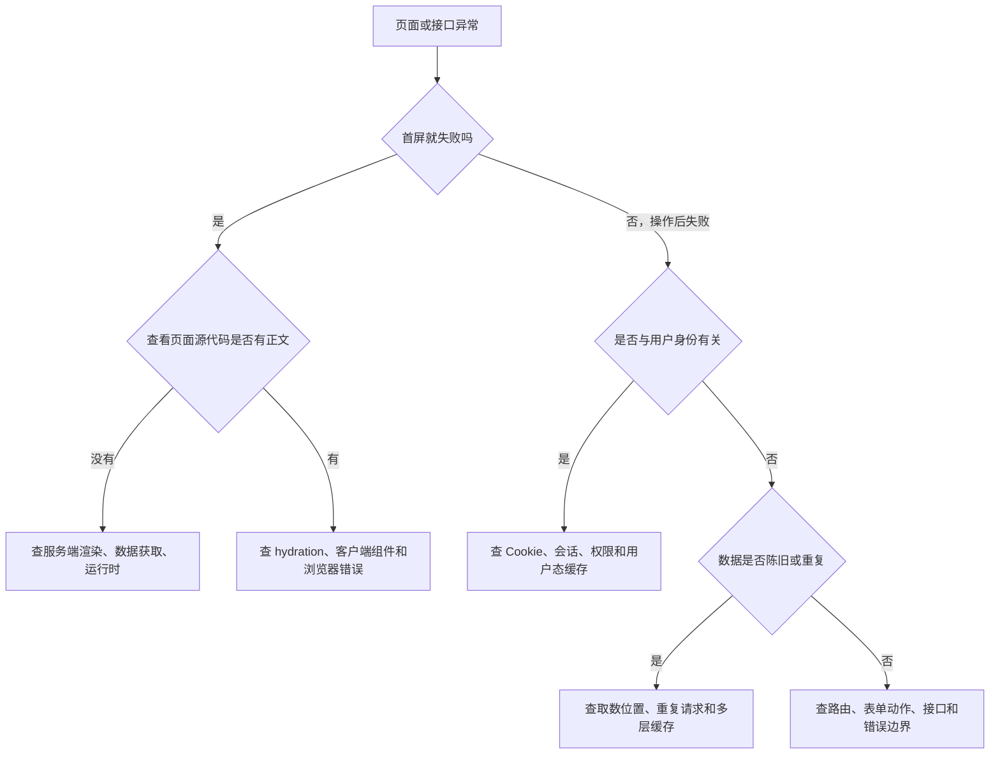
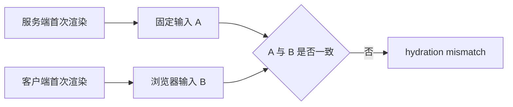
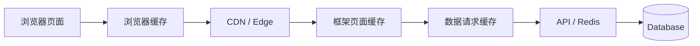
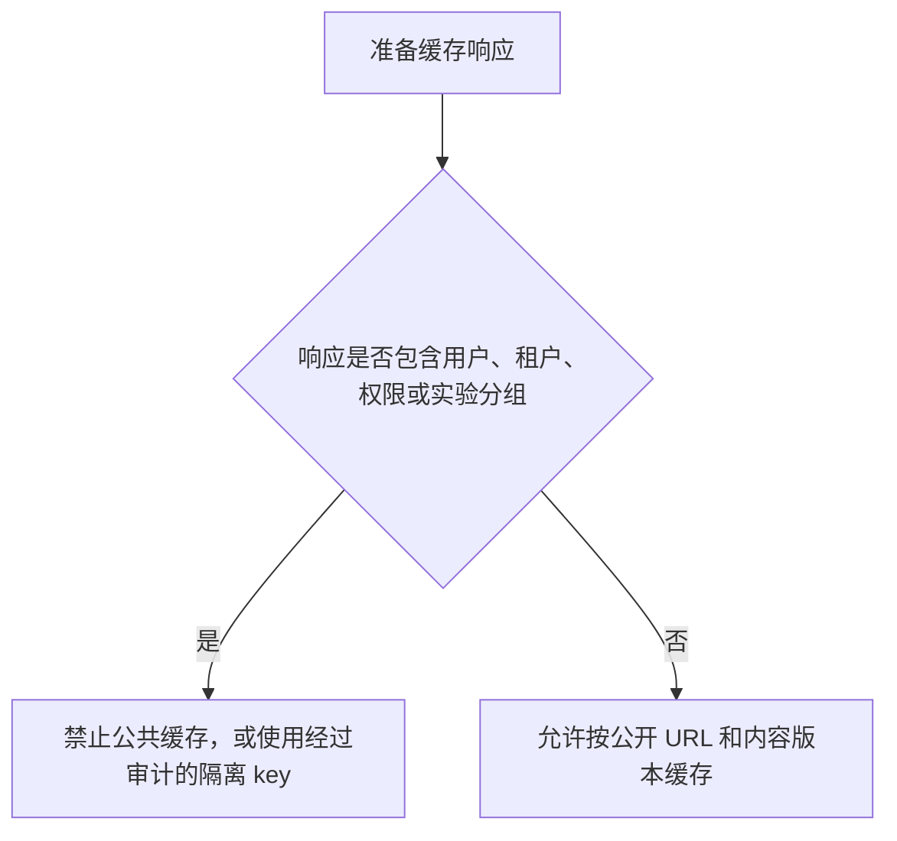
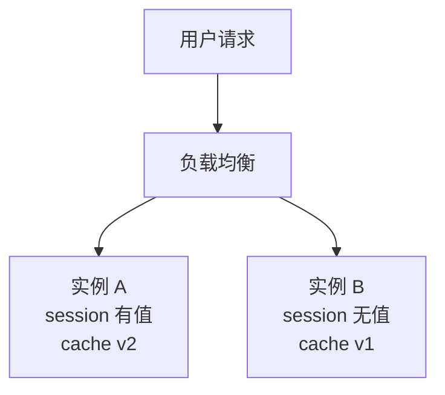

# Nuxt / Next 真实项目问题库

## 这份问题库解决什么

Nuxt、Next 项目的故障经常横跨浏览器、框架服务器、缓存、API 和部署平台。同一个“页面不对”可能有完全不同的根因：

- 服务端没有拿到数据。
- 服务端 HTML 正确，但 hydration 失败。
- 页面被 CDN 或框架缓存。
- 用户态被错误放进公共缓存。
- 本地 Node 环境可用，Edge 或静态托管不可用。
- 站内跳转正常，直接刷新路由失败。

本页不按 API 分类，而是按项目现象分类。每个问题都给出症状、证据、根因、修复、预防和验收方式。

## 适合谁看

适合正在开发或维护 Nuxt、Next 项目，并遇到以下情况的人：

- hydration mismatch、页面闪烁或首屏内容变化。
- 数据重复请求、数据不更新或用户数据串号。
- SSR 登录态失效、401/403 混乱、无限重定向。
- 构建成功但部署后 404、500 或接口不可用。
- Serverless、Edge、多实例环境行为和本地不同。

如果还没有运行环境心智模型，先看 [图解 Nuxt / Next 元框架核心概念](/meta-frameworks/visual-guide)。

## 先用现象分流



## 通用证据清单

不要先改代码。先收集：

```text
1. 完整 URL、复现账号、发生时间和部署版本
2. 是直接刷新、站内跳转，还是表单操作后发生
3. 页面源代码中是否已经有目标正文
4. 浏览器 Console、Network、请求状态码和响应头
5. 服务端日志、traceId、接口耗时和异常堆栈
6. Cache-Control、Age、ETag、CDN 命中信息
7. 当前是 Node、Docker、Serverless、Edge 还是静态部署
8. 最近是否改过环境变量、缓存规则、路由或依赖
```

任何日志和截图都要移除 Cookie、Authorization、访问令牌、密码和私密环境变量。

## 问题 1：hydration mismatch，页面打开后闪一下

### 症状

- 控制台出现 hydration 不一致警告。
- 服务端首屏显示“未登录”，随后变成用户头像。
- 日期、随机推荐、主题或屏幕宽度在接管后变化。
- 某个组件只在刷新时错，站内跳转正常。

### 证据

1. 使用“查看页面源代码”记录服务端输出。
2. 在 DevTools Elements 中记录 hydration 后 DOM。
3. 对比差异是否来自时间、随机数、locale、浏览器 API 或用户态。
4. 检查是否在模块顶层读取 `window`、`localStorage`、`navigator`。

### 常见根因



- `new Date()` 在两端时间或时区不同。
- `Math.random()` 每次生成不同结果。
- 首屏根据 localStorage 选择主题或语言。
- 服务端读不到登录态，客户端 store 却认为已登录。
- 第三方组件在服务端和客户端输出结构不同。

### 修复

- 把稳定初始值从服务端传给客户端。
- 时间使用统一时区和明确格式，必要时 hydration 后再显示本地格式。
- 浏览器专用逻辑放客户端生命周期或 Client Component。
- 登录态使用服务端可验证的 Cookie 会话。
- 对不支持 SSR 的组件建立尽可能小的客户端边界。

### 预防

- 评审时检查首屏是否依赖非确定输入。
- E2E 同时覆盖刷新和站内跳转。
- 引入组件库前验证 SSR 支持。

### 验收

- 清空缓存并硬刷新多次，不再出现警告。
- 服务端 HTML 和客户端第一次渲染语义一致。
- 页面不再闪烁或整块重建。

## 问题 2：首屏同一个接口请求两次

### 症状

- 服务端日志记录一次，浏览器 Network 又记录一次。
- 页面首屏先有数据，随后进入 loading 再显示相同数据。
- API 成本和页面流量接近两倍。

### 证据

- 给请求增加 traceId 和调用位置。
- 区分服务端请求日志与浏览器请求。
- 检查组件挂载时是否无条件再次 fetch。
- 检查 Nuxt 是否使用普通 `$fetch` 代替可复用 payload 的 composable。
- 检查 Next 是否在 Server Component 和 Client Component 各取一次。

### 根因

服务端取数结果没有被首屏复用，或者客户端把“首次加载”和“用户主动刷新”写成同一个无条件 effect。

### 修复

- Nuxt 页面首屏使用适合 SSR 的 `useFetch` / `useAsyncData`，并提供稳定 key。
- Next 让 Server Component 读取首屏数据，再将必要结果传给 Client Component。
- 客户端请求只用于交互后的刷新、分页或实时更新。
- 避免多个嵌套组件各自请求同一资源。

### 预防

建立首屏请求预算：记录页面正常首屏应有几次 API 调用，并在性能检查中对比。

### 验收

一次硬刷新中，同一首屏资源只出现设计允许的请求次数；服务端与浏览器日志可以解释每一次调用。

## 问题 3：页面数据更新后一直是旧内容

### 症状

- CMS 或数据库已更新，线上详情仍旧。
- 本地开发正常，生产环境旧。
- 换浏览器、无痕窗口仍旧。
- API 是新数据，但 HTML 还是旧数据。

### 证据路径



从外到内逐层记录：响应正文、响应头、生成时间、缓存 key 和数据版本。不要一上来清空所有缓存，那会丢失根因证据。

### 常见根因

- 页面在构建时生成，内容更新没有触发新构建。
- 路径或标签重新验证漏了列表页。
- CDN 缓存时间比框架缓存更长。
- API 或 Redis 使用了错误 key。
- 多实例只清了一个实例的本地缓存。

### 修复

- 明确由哪一层负责新鲜度。
- 内容发布后同时刷新详情、列表、首页和 sitemap 的相关缓存。
- 多实例使用共享缓存或广播失效事件。
- 缓存 key 包含 locale、slug、租户等真实边界。

### 预防

每类页面记录“允许旧多久”和“由谁触发失效”，并在发布流水线记录刷新结果。

### 验收

更新测试内容后，在承诺的新鲜度时间内，匿名访问、直接刷新和站内导航都看到新内容。

## 问题 4：不同用户看到相同的私有数据

### 症状

- 用户 B 偶尔看到用户 A 的昵称、订单或学习进度。
- 只在线上 CDN 或多实例环境发生。
- 退出登录后仍短暂显示上一个用户数据。

### 风险等级

这是数据泄漏，优先级高于普通页面错误。先停止相关页面的公共缓存，保留必要证据，再检查影响范围。

### 常见根因

- 用户态页面使用公共缓存。
- 缓存 key 只有 URL，没有用户、租户或权限边界。
- 服务端模块级变量保存了上一个请求的用户数据。
- 客户端 store 在退出登录时没有清理。

### 修复

- 用户页面和接口返回 `private, no-store` 或等价策略。
- 删除跨请求共享的可变用户状态。
- 服务端每次从当前请求会话确定用户。
- 退出登录清理客户端缓存，并使服务端会话失效。
- 审计 CDN 和框架缓存中是否已经存在私有响应。

### 预防



### 验收

使用两个测试账号交替登录、刷新和跨设备访问，任何情况下都不会读取另一账号数据；响应头与缓存日志符合私有策略。

## 问题 5：SSR 刷新后登录态丢失

### 症状

- 从登录页跳到后台正常，刷新后回到登录页。
- 客户端组件能读到用户，Server Component 或 Nuxt 服务端请求读不到。
- 首屏先显示未登录，随后又登录。

### 根因

访问令牌或用户对象只保存在 localStorage、sessionStorage 或客户端 store。服务器处理首次请求时没有浏览器存储。

### 修复

- 使用 HttpOnly、Secure、SameSite 配置合理的 Cookie 会话。
- 服务端通过当前请求 Cookie 验证 session。
- 客户端状态从服务端会话结果初始化，不作为安全权威。
- 服务端请求转发到下游 API 时按框架规则传递必要 Cookie 或身份上下文。

### 预防

登录测试必须包括：

1. 登录后站内跳转。
2. 登录后硬刷新。
3. 复制受保护 URL 到新标签页。
4. 会话过期后再次操作。

### 验收

四种进入方式都得到一致身份；会话过期后明确返回 401 或跳转登录，不出现闪烁和循环。

## 问题 6：页面守卫通过了，接口仍可越权

### 症状

- 无权限按钮已隐藏，但手动请求 Route Handler / Server API 能成功。
- 修改请求体中的 `userId`、`tenantId` 后能读写其他数据。

### 根因

- 把客户端路由守卫当成服务端授权。
- 接口相信浏览器提交的身份字段。
- 数据访问层没有对象级权限检查。

### 修复


- `userId`、`tenantId` 来自服务端会话，不来自请求体。
- Route Handler / Server API 每次验证会话。
- Service 或 DAL 检查当前用户是否能操作目标资源。
- 高风险动作记录操作者、资源、结果和 traceId。

### 预防

增加反向权限测试：普通用户不能调用管理员接口，用户 A 不能读写用户 B 资源。

### 验收

绕过页面直接请求接口时，未登录返回 401，无权限返回 403，不可见资源按策略返回 404；数据库没有发生越权写入。

## 问题 7：登录页无限重定向

### 症状

- 浏览器提示重定向次数过多。
- `/login` 和 `/dashboard` 互相跳转。
- 登录成功后又立即回登录页。

### 证据

- 在 Network 中保留日志，查看 3xx Location 链。
- 记录每次中间件判断的 URL、会话状态和目标地址。
- 检查登录页是否也被 auth middleware 保护。

### 常见根因

- 公共路由和受保护路由匹配规则重叠。
- 中间件读到过期 Cookie，页面读到新会话。
- `redirect` 参数没有规范化，返回自身。
- CDN 缓存了带登录跳转的响应。

### 修复

- 明确 public、protected、auth-only 三类路由。
- 登录页跳过未登录重定向。
- 只允许站内安全路径作为 redirect。
- 会话创建完成后再跳转。
- 登录跳转响应不得公共缓存。

### 验收

未登录访问后台只跳一次登录页；登录成功只跳一次目标页；已登录访问登录页行为明确且没有循环。

## 问题 8：环境变量服务端有值，客户端是 undefined

### 症状

- 服务端日志能读取变量，浏览器组件读取不到。
- 本地 `.env` 正常，平台部署后 undefined。
- 为了修复，开发者准备把密钥改成公开变量。

### 根因

元框架故意区分服务端私有变量和可编译进客户端的公开变量。客户端读不到私有变量是正确的安全行为。

### 修复

先按用途分类：

| 变量 | 读取位置 |
| --- | --- |
| 数据库 URL、会话密钥 | 服务端 |
| 第三方私密 API key | 服务端，通过 BFF 调用 |
| 公开站点 URL | 可以公开 |
| 公开 API base | 可以公开，但不能包含密钥 |

Nuxt 使用 runtime config 区分私有和 public；Next 只把显式公开前缀的变量交给浏览器。具体命名以当前框架文档为准。

### 预防

- 项目启动时在服务端校验必填变量，但日志只输出变量名和是否存在。
- README 记录作用域，不记录真实值。
- 构建产物扫描不应出现服务端密钥。

### 验收

客户端只得到允许公开的配置；服务端功能正常；浏览器 bundle、页面源代码和日志中找不到私密值。

## 问题 9：本地正常，静态部署后 API 404

### 症状

- 本地 `/api/*` 正常。
- 部署到对象存储、GitHub Pages 或纯静态服务器后 404。
- 页面 HTML 能打开，但登录、搜索或表单提交失效。

### 根因

静态部署只能提供构建产物，没有持续运行的 Node、Serverless 或 Edge 执行环境。Server API / Route Handler 没有地方运行。

### 修复

选择一种：

- 改用支持服务端能力的平台或 Node/Docker 部署。
- 把 API 独立部署，并让静态站调用外部 API。
- 如果功能本来可以构建时完成，改成真正的静态数据生成。

### 预防

部署选型前列出项目能力：SSR、接口路由、Cookie 会话、数据库访问、图片处理、定时任务。平台必须逐项支持。

### 验收

生产环境直接调用 API 返回预期状态；重启或重新部署后依然可用；部署文档说明运行时和回滚方式。

## 问题 10：只有二级路由刷新 404

### 症状

- 从首页点击 `/courses/vue` 正常。
- 复制 URL 到新标签页或刷新后 404。
- 某些动态 slug 正常，其他不正常。

### 常见根因

- 静态托管没有生成对应路径，也没有正确回退。
- 动态路由在构建时无法枚举。
- base path、资源路径或代理规则不一致。
- 平台把请求交给错误服务。

### 修复

- 静态导出时生成全部允许访问的动态路径。
- SSR 部署时让所有页面路由进入框架服务器。
- 同步检查框架 base、反向代理、CDN 和静态资源路径。
- 区分“页面 404”和“页面内 API 404”。

### 预防

冒烟测试必须直接打开至少一个动态详情 URL，而不是只从首页点击。

### 验收

首页、列表、动态详情、404 页面在新标签页和硬刷新中都返回正确状态与资源。

## 问题 11：组件库只在 SSR 或构建时报 window is not defined

### 症状

- Vite SPA 中正常，迁移 Nuxt / Next 后服务端报错。
- 开发中的客户端导航正常，生产构建失败。
- 错误堆栈来自编辑器、图表、地图或富文本依赖。

### 根因

依赖在模块加载阶段直接读取 `window`、`document` 或其他浏览器 API，服务端导入时就已经失败。

### 修复

- 检查库是否声明支持 SSR。
- 将浏览器专用组件放入小型客户端边界，并延迟加载。
- 避免在服务端模块顶层导入有副作用的浏览器库。
- 必要时选择支持 SSR 的替代库。

只在代码外层加 `if (typeof window !== 'undefined')` 不一定有效，因为依赖可能在 import 时已经访问 `window`。

### 预防

引入重型 UI 库前，用最小 SSR 页面同时执行开发、生产构建和直接刷新测试。

### 验收

生产构建通过；直接刷新包含该组件的页面不报错；客户端功能正常；没有把整页不必要地改为客户端渲染。

## 问题 12：Serverless 或 Edge 上偶发超时

### 症状

- 本地 Node server 稳定，线上首次请求很慢。
- 大文件、长任务、数据库连接偶发失败。
- Edge 环境提示 Node API 或二进制依赖不可用。

### 证据

- 区分冷启动、业务耗时和下游等待。
- 记录平台执行时长、内存、区域和超时原因。
- 检查数据库连接建立次数和连接池策略。
- 检查依赖是否要求完整 Node.js、原生二进制或可写文件系统。

### 常见根因

- 每次函数启动都创建昂贵连接。
- 同步执行图片处理、导出或长任务。
- Edge runtime 不支持某个 Node API。
- 数据库离运行区域过远。
- 多实例使用本地内存维护必须共享的状态。

### 修复

- 把长任务放队列，接口返回任务 ID。
- 使用平台和数据库推荐的连接方式。
- Edge 只承载兼容、短时、低延迟逻辑。
- 需要完整 Node 能力时选择 Node / Serverless Node runtime。
- 会话和关键缓存使用共享存储。

### 预防

部署前建立能力矩阵，不要把“能构建”当作“运行时完全兼容”。

### 验收

冷启动和热请求都在目标时间内；压力下数据库连接不失控；运行时错误率和超时率可观测。

## 问题 13：多实例下缓存和会话不一致

### 症状

- 同一个用户刷新几次，偶尔登录、偶尔未登录。
- 内容更新后部分请求新、部分请求旧。
- 重启某个实例后问题暂时消失。

### 根因

会话或缓存放在进程内存中，而负载均衡把请求分配到不同实例。



### 修复

- 会话存到共享数据库、Redis 或平台会话服务。
- 内容缓存使用共享版本或可靠失效广播。
- 不把必须一致的业务状态只放模块级变量。
- 粘性会话只能作为特定场景方案，不能替代正确状态设计。

### 预防

本地用两个应用实例和一个负载均衡做最小验证，尤其是登录和缓存刷新。

### 验收

请求轮换到不同实例时，会话和内容版本保持一致；失效事件能覆盖所有实例。

## 问题 14：错误边界把真实状态码吞成 200

### 症状

- 页面显示“课程不存在”，Network 却是 200。
- 搜索引擎收录不存在页面。
- 监控认为请求成功，用户却看到错误页。

### 根因

组件捕获所有异常后渲染普通提示，没有让框架返回对应 404、401、403 或 500 语义。

### 修复

- 资源不存在调用框架 404 能力。
- 未登录与无权限区分 401、403。
- 预期业务错误展示可理解提示。
- 未知系统错误进入错误边界并保留 traceId。
- 不要用 200 包装所有失败。

### 预防

集成测试同时断言页面文字和 HTTP 状态码。

### 验收

不存在资源返回 404，权限错误符合接口契约，系统错误进入监控；SEO 和可用性监控能正确识别。

## 问题复盘模板

```md
# 事故标题

## 影响

- 开始和结束时间：
- 影响路由和用户：
- 是否涉及数据泄漏或错误写入：

## 现象

- 刷新 / 站内导航 / 操作后：
- 浏览器证据：
- 服务端证据：
- 缓存与部署证据：

## 根因

- 直接原因：
- 为什么现有测试没有发现：

## 修复

- 临时止损：
- 根因修复：
- 数据或缓存清理：

## 验收

- 正常路径：
- 边界路径：
- 回归测试：

## 预防

- 代码：
- 测试：
- 监控：
- 文档：
```

## 排错完成标准

不能以“刷新后好了”作为完成标准。至少满足：

- 能稳定复现原问题，或有足够生产证据还原链路。
- 根因能解释全部已知现象。
- 修复位于真正错误边界，而不是掩盖表现。
- 正常流程、失败流程和相邻边界都验证通过。
- 对高风险问题补自动化测试或监控。
- 缓存、环境、部署或权限行为同步写入项目文档。

## 下一步学习

回到 [Nuxt / Next 从零到项目：课程内容平台](/meta-frameworks/project-from-zero) 完成至少两个故障演练，再进入 [Nuxt / Next 专项练习](/roadmap/meta-framework-practice)，把排错过程作为练习交付物，而不是只完成页面功能。
