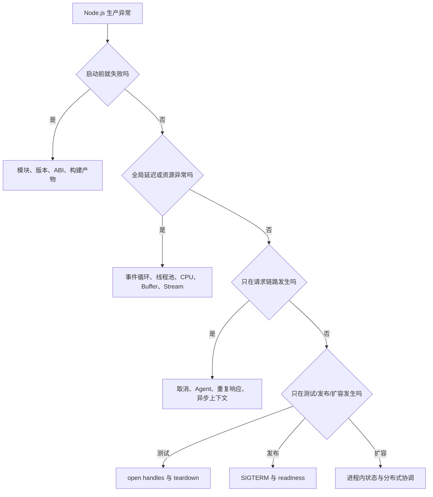
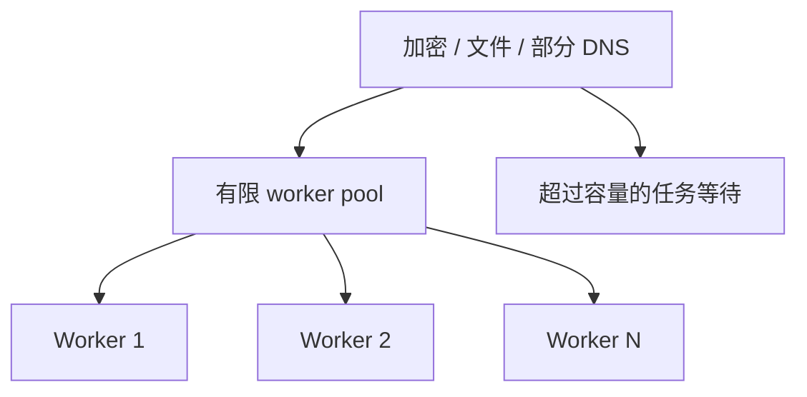
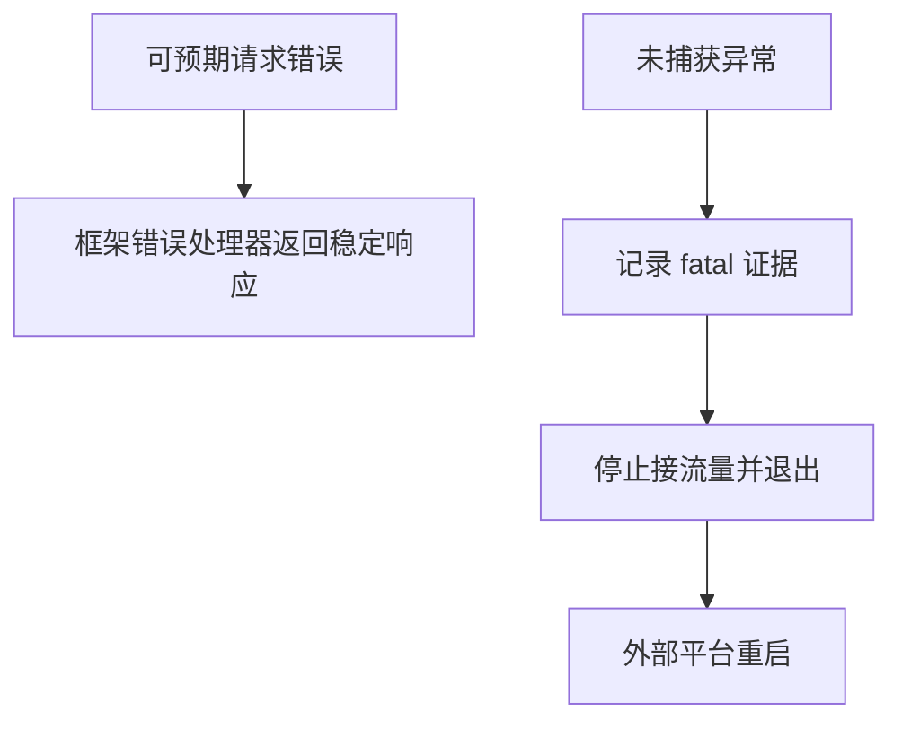
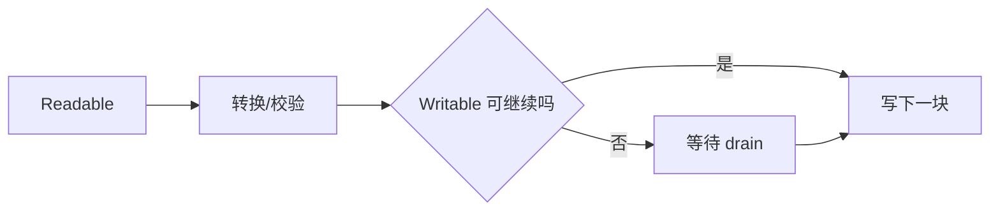
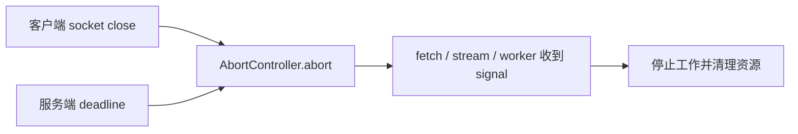
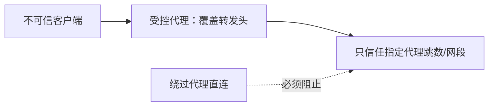
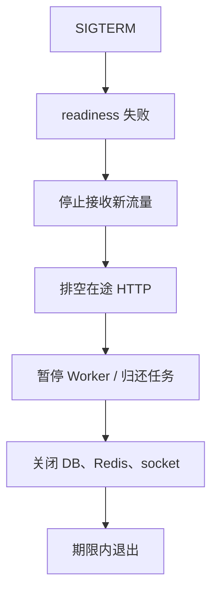
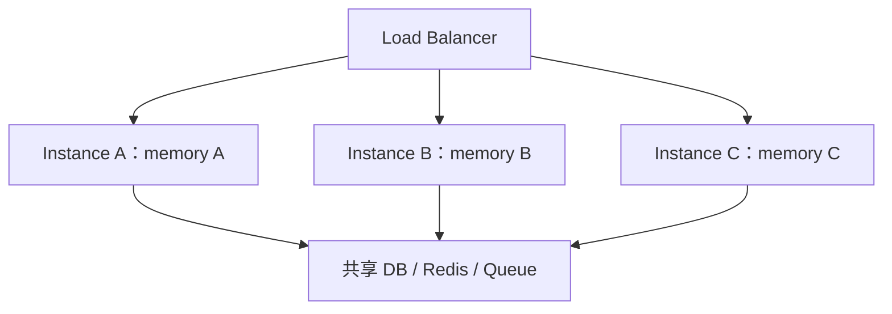

# Node.js 真实项目问题库

## 适合谁看

适合已经能写 Node.js API 或脚本，但遇到生产入口、事件循环、Stream、Buffer、进程信号、HTTP 连接或多实例问题时仍主要靠重启和猜测的人。

本页只收录 **Node.js 运行时特有问题**。接口参数、幂等、事务、401/403、慢 SQL 和通用部署问题继续查看 [后端接口与服务问题](/projects/issues-backend)；端口、环境变量和基础 CORS 使用 [Node.js 常见问题](/node/troubleshooting) 快速处理。

## 按现象快速定位

| 现象 | 优先检查 | 对应问题 |
| --- | --- | --- |
| 开发能跑，生产入口报模块错误 | `type`、导入后缀、构建目录 | 1 |
| 容器加载 `.node` 文件失败 | Node ABI、CPU、libc、安装阶段 | 2 |
| 少量请求拖慢全部接口 | 事件循环延迟、CPU profile | 3 |
| 加密、文件、DNS 同时变慢 | libuv worker pool | 4 |
| Heap 稳定但 RSS 上涨 | Buffer、native memory、流缓冲 | 5 |
| 重连后事件执行多次 | EventEmitter listener | 6 |
| 进程随机退出或带病运行 | rejection、exception、退出策略 | 7 |
| 大文件触发 OOM | Stream 与背压 | 8 |
| 客户端断开后后台仍在跑 | AbortSignal、deadline | 9 |
| `ECONNRESET`、socket 枯竭 | Agent/Dispatcher、响应消费 | 10 |
| `headers already sent` | 多分支响应与异步竞态 | 11 |
| 代理后 IP/HTTPS 判断错误 | 转发头与信任边界 | 12 |
| request id 丢失或串线 | AsyncLocalStorage | 13 |
| 测试通过但进程不退出 | open handles 与 teardown | 14 |
| 发布时丢请求 | SIGTERM 与关闭顺序 | 15 |
| 扩容后状态不一致或任务重复 | 进程内状态、多实例 | 16 |

## 统一排查总图



## 证据记录模板

```text
Node 主版本、CPU 架构、操作系统/libc：
启动命令与最终入口：
错误发生时间和影响比例：
request id / trace id：
事件循环延迟 P50/P99：
CPU、heapUsed、external、arrayBuffers、RSS：
活动 socket、timer、worker、listener 数：
客户端是否已经断开：
SIGTERM 与退出时间线：
第一条反常证据：
根因：
修复：
回归与预防：
```

只写“内存高”“接口慢”“偶发报错”无法复盘。至少固定 Node 版本、时间范围、负载和第一条异常指标。

## 问题 1：开发能跑，生产出现 ESM/CJS 或入口错误

### 现象

- `tsx src/server.ts` 正常，`node dist/server.js` 报 `ERR_MODULE_NOT_FOUND`。
- `require()` 加载 ESM 包时报 `ERR_REQUIRE_ESM`。
- 构建成功，但 Docker CMD 指向不存在的目录。

### 必采证据

```bash
node --version
node -p "require('./package.json').type"
find dist -maxdepth 3 -type f | sort
node --trace-uncaught dist/src/server.js
```

同时检查最终 JavaScript，而不是只看 `.ts` 源码：相对导入是否带 `.js` 后缀，构建后目录是否与 `start`、Dockerfile 一致。

### 根因


开发运行器可能替你解析 `.ts`、路径别名或扩展名；生产 Node 只执行实际文件和 Node 模块规则。

### 修复与回归

- 使用 `module/moduleResolution: NodeNext`，ESM 相对导入写 `.js`。
- `start`、Docker CMD 和构建产物只保留一个权威入口。
- CI 必须实际运行生产入口的 smoke test，不只执行 `tsc`。
- 从空目录执行 `npm ci && npm run build && npm start`。

## 问题 2：Native Addon 在容器或服务器无法加载

### 现象

- 报 `NODE_MODULE_VERSION`、`invalid ELF header` 或找不到 `.node` 文件。
- macOS 安装的依赖复制进 Linux 镜像后启动失败。
- Alpine 与 Debian 镜像之间切换后原生包崩溃。

### 必采证据

```bash
node -p "process.versions.modules"
node -p "process.platform + ' ' + process.arch"
npm ls
```

记录镜像基础发行版、glibc/musl、安装依赖时的 Node 版本和运行时 Node 版本。

### 根因

原生依赖的二进制与 Node ABI、操作系统、CPU 架构和 libc 绑定。把宿主机 `node_modules` 复制到不同平台，相当于把错误平台的二进制带入镜像。

### 修复与回归

- 在目标镜像的 build stage 内执行 `npm ci`。
- 不把宿主机 `node_modules` 放进镜像。
- 固定 build/runtime Node 主版本和基础镜像家族。
- 多架构镜像分别构建并在对应架构执行启动测试。
- 优先评估纯 JavaScript、WASM 或有稳定预编译产物的依赖。

## 问题 3：同步 CPU 任务拖慢全部请求

### 现象

少数大 JSON、复杂正则、图片处理或报表计算出现时，所有无关健康检查和接口 P99 一起升高，但数据库与网络耗时正常。

### 必采证据

- `monitorEventLoopDelay()` 的 P99。
- CPU profile 和 flame graph。
- 单个请求输入大小、JSON 序列化时间和同步函数耗时。
- CPU 使用率与吞吐变化，不只看平均接口耗时。

### 最小复现

```js
import { monitorEventLoopDelay } from 'node:perf_hooks'

const delay = monitorEventLoopDelay({ resolution: 20 })
delay.enable()

setInterval(() => {
  console.log({ eventLoopP99Ms: delay.percentile(99) / 1e6 })
  delay.reset()
}, 1000).unref()
```

### 修复

1. 先限制输入大小和算法复杂度。
2. 把可拆分计算放入 Worker Threads 池或后台队列。
3. 避免每请求创建新 Worker；测量创建与传输成本。
4. 大结果使用分页、流式输出或预计算。

### 回归

在相同并发下同时请求 CPU 路由和 `/health/live`。修复后健康检查 P99 不应随计算任务线性恶化。

## 问题 4：libuv Worker Pool 被占满

### 现象

大量 `crypto.scrypt`、`pbkdf2`、某些文件系统或 DNS 操作并发时，它们互相排队；普通异步代码看似没有同步循环，延迟仍突然上升。

### 心智模型



### 证据

- 分别测量任务排队前后耗时。
- 统计同类任务并发数与输入成本。
- 将 CPU profile 与事件循环延迟对照；线程池排队时事件循环不一定很高。

### 修复与取舍

- 对密码哈希、压缩和文件操作做并发限制。
- 不要把 `UV_THREADPOOL_SIZE` 当作无成本旋钮；增大线程数会增加 CPU 和内存竞争。
- 高成本任务放到独立 Worker/任务服务，保护在线 API。
- 对登录同时做账户/IP 限流，避免昂贵哈希被放大成拒绝服务。

## 问题 5：Heap 稳定但 RSS 持续上涨

### 现象

V8 heapUsed 没有明显增长，容器 RSS 却持续上涨并最终 OOM；重启后暂时恢复。

### 先看四个值

```js
const memory = process.memoryUsage()
console.log({
  rss: memory.rss,
  heapUsed: memory.heapUsed,
  external: memory.external,
  arrayBuffers: memory.arrayBuffers
})
```

### 根因候选

- Buffer/ArrayBuffer 占用 V8 堆外内存。
- Stream 消费者过慢，内部 buffer 累积。
- 原生依赖分配的内存未及时释放。
- 大量并发 socket、压缩上下文或线程栈。
- 分配器碎片使 RSS 不立即归还操作系统。

### 修复

不要只增加 `--max-old-space-size`，它主要调整 V8 old space。先按 heap/external/arrayBuffers/RSS 分层，限制并发和缓冲，使用 heap snapshot、诊断报告和实际负载复现。原生内存问题要结合依赖版本和平台最小复现。

## 问题 6：`MaxListenersExceededWarning` 与重复事件

### 现象

- 每次重连、请求或热更新后通知多执行一次。
- 控制台出现 `MaxListenersExceededWarning`。
- 内存随 listener 数增长。

### 常见错误

```js
function handleRequest(request) {
  bus.on('permission-updated', () => refreshFor(request.userId))
}
```

每次请求都在长期存活的 emitter 上注册 listener，而且没有移除。

### 证据与修复

```js
import { getEventListeners } from 'node:events'

console.log(getEventListeners(bus, 'permission-updated').length)
```

- 把进程级 listener 注册放在启动阶段，只注册一次。
- 短期 listener 使用 `once()` 或在 `finally`/关闭事件移除。
- 不要仅提高 `setMaxListeners()`；警告是泄漏信号，不是容量配置建议。
- 回归测试重复连接/断开 100 次后 listener 数应回到基线。

## 问题 7：未处理 rejection 或 exception 让进程崩溃/带病运行

### 现象

- 进程无响应后被平台重启。
- 团队添加 `uncaughtException` 后不再退出，但状态越来越异常。
- Promise 没有被 `await`，错误脱离请求边界。

### 正确边界



### 修复

- 请求 Promise 必须 `await` 或显式返回。
- 后台任务使用统一 supervisor，捕获并上报失败。
- `uncaughtExceptionMonitor` 可记录但不改变默认退出。
- 如果监听 `unhandledRejection`，记录后进入有期限的关闭流程，不继续长期服务。
- 写操作依靠事务、幂等键和队列确认抵抗进程中断。

### 回归

注入一个请求内错误和一个真正未处理 rejection：前者得到稳定 500，进程仍健康；后者产生 fatal 日志并由测试进程观察到非零退出或受控重启。

## 问题 8：大文件上传或导出触发 OOM

### 现象

代码使用 `readFile`、`Buffer.concat` 或把全部查询结果放进数组；文件越大，RSS 按文件大小增长，多并发时容器被杀。

### 正确流向



### 修复

- 使用 `stream.pipeline()` 组合读取、转换和写入。
- 限制单文件、总请求体、文件数、并发和处理时长。
- 客户端断开时销毁上游 Stream 和临时文件。
- 数据库导出使用 cursor/分页流，不一次性加载全部行。
- 错误路径也要清理临时对象和部分上传。

### 回归

上传 1 GB 测试流时观察 RSS 应在稳定范围内，而不是接近 1 GB；慢消费者下生产者能暂停，取消后文件描述符和临时文件回到基线。

## 问题 9：客户端断开后上游工作仍继续

### 现象

用户关闭页面后，Node 仍执行数据库查询、外部 HTTP、生成报表或写对象存储；大量取消请求耗尽资源。

### 取消链



### 修复

- 为每个外部调用设置总 deadline 和 `AbortSignal`。
- 将请求关闭事件映射到 AbortController。
- 只把 signal 传给真正支持取消的库；不支持时需要隔离或主动销毁资源。
- 已提交的数据库写入不能假装取消，应返回未知结果并通过幂等查询确认。

### 回归

开始一个稳定 5 秒的上游请求，1 秒后断开客户端。上游日志应记录 abort，连接和并发槽位应尽快释放。

## 问题 10：出站请求 `ECONNRESET`、socket 枯竭或排队

### 现象

- 高峰期偶发 `socket hang up`、`ECONNRESET`。
- 文件描述符和 TIME_WAIT 快速上升。
- 请求在业务代码前已排队，但应用只看上游响应时间。

### 证据

- 对 `node:http`/`https`：Agent 的 active、free、pending socket 数和 `maxSockets`。
- 对全局 `fetch`：它基于 Undici，检查 dispatcher 配置和连接统计，不套用 `http.Agent` 参数。
- 上游 keep-alive timeout、代理 idle timeout、DNS 和客户端 deadline。
- 响应体是否被完全消费或取消。

### 修复

- 复用有边界的连接池，设置最大连接、空闲超时和总请求 deadline。
- 不要为每次请求创建新 Agent/Dispatcher。
- 对不可重试错误快速失败；只对幂等操作做有限退避重试。
- Node 24 的 `agentKeepAliveTimeoutBuffer` 可让客户端稍早于服务端关闭即将过期的 keep-alive socket，但仍需实际压测。

## 问题 11：`ERR_HTTP_HEADERS_SENT`

### 现象

一个请求偶发返回两次：先超时或错误响应，稍后异步任务又尝试成功响应。

### 常见错误

```js
if (!user) reply.code(404).send({ message: 'not found' })
const result = await updateUser(user)
return reply.send(result)
```

缺少 `return`，404 后继续执行。另一个常见根因是 callback 与 Promise 同时完成，或者 timeout 与主任务竞态。

### 修复与回归

- 每条发送响应的分支立即 `return`。
- 不在同一 handler 混用 callback、`reply.send()` 和返回 payload。
- 用 AbortSignal 让超时真正取消任务，不只提前发送 504。
- 并发触发成功/超时边界，断言只有一次响应且没有未处理错误。

## 问题 12：反向代理后 IP、HTTPS 或 Secure Cookie 错误

### 现象

- 所有请求 IP 都是代理地址。
- 应用误判 HTTP，Secure Cookie 不设置或重定向循环。
- 直接访问应用端口时可伪造 `X-Forwarded-For` 绕过 IP 限流。

### 信任链



### 修复

- 网络层阻止公网直接访问应用端口。
- 只信任明确代理地址、网段或跳数，不无条件信任全部 forwarded headers。
- 代理覆盖而不是追加来自客户端的危险头。
- 在真实代理拓扑下测试客户端 IP、协议、host、重定向和 Cookie。

## 问题 13：AsyncLocalStorage 上下文丢失或串线

### 现象

并发请求日志缺 request id，或极少数日志带了另一个用户/请求的上下文；普通 Promise 链正常，某个旧 callback 库后开始丢失。

### 正确入口

```js
import { AsyncLocalStorage } from 'node:async_hooks'

const requestContext = new AsyncLocalStorage()

function runRequest(requestId, work) {
  return requestContext.run({ requestId }, work)
}
```

### 排查和修复

- 在每个可疑异步边界后记录 `getStore()`，找到第一次变成 `undefined` 的位置。
- callback API 优先 `promisify`；无法转换时使用 `AsyncResource` 绑定上下文。
- 优先使用 `run()`，不要在共享事件处理器里随意 `enterWith()`。
- 不把可变用户对象放入长期共享 store；保存不可变 ID 和 trace 信息。

### 回归

并发运行 1000 个带不同 request id 的异步链路，随机加入 timer、Promise、I/O 和目标第三方库，断言每个日志只出现自己的 ID。

## 问题 14：测试通过但 Node 进程不退出

### 现象

所有断言通过，测试命令一直挂着；加入 `--test-force-exit` 后 CI 变绿，但连接和资源泄漏仍存在。

### 常见 open handles

- 没有 `pool.end()` 的数据库池。
- 没有 `app.close()` 的 HTTP Server。
- 仍被 `ref` 的 interval/timeout。
- 未关闭的 socket、Worker、MessagePort、文件 watcher。
- 队列或 Redis 客户端仍在重连。

### 修复

- 每个创建资源的 fixture 必须在 `after`/`finally` 对称关闭。
- 纯单元测试不要导入会在模块顶层启动服务的 `server.ts`；测试 `buildApp()`。
- 需要后台 timer 但不应阻止退出时谨慎使用 `unref()`，仍要提供显式关闭。
- `forceExit` 只能作为诊断线索，不能替代 teardown。

## 问题 15：发布时 SIGTERM 丢失请求或任务

### 现象

滚动发布期间 502/500 增加、事务中断、队列任务重复；进程收到 SIGTERM 后立即 `process.exit(0)`。

### 正确顺序



### 修复与回归

- 信号处理器必须幂等，避免 SIGTERM/SIGINT 重复关闭。
- 设置总关闭期限，超时记录 fatal 并非零退出。
- 关闭数据库应晚于 HTTP 排空。
- 队列任务使用幂等键；Worker 关闭要等待或让任务安全重新投递。
- 在部署环境真实发送 SIGTERM，不只调用某个内部函数。

## 问题 16：多实例后状态不一致或任务重复

### 现象

- 用户请求落到另一个实例后登录态消失。
- 内存缓存各自保留不同权限。
- 每个副本都执行同一 cron，邮件发送 N 次。
- WebSocket 只能收到当前实例消息。

### 单进程假设如何失效



### 修复

| 状态 | 推荐边界 |
| --- | --- |
| 会话 | 共享 session store 或可验证 token |
| 权限缓存 | Redis + 明确失效，数据库仍是事实源 |
| cron | 分布式锁、唯一调度器或队列 repeatable job |
| WebSocket 广播 | Pub/Sub adapter |
| 上传文件 | 对象存储，不依赖本地临时目录长期存在 |
| 队列任务 | 至少一次语义 + 业务幂等键 |

### 回归

至少启动两个实例，让请求随机分配；执行登录、权限变更、定时任务和消息广播。结果应与实例选择无关，任务重复也不能产生重复业务副作用。

## 回归检查总表

| 类别 | 必须保留的自动或半自动检查 |
| --- | --- |
| 模块与构建 | 空目录 `npm ci`、build、生产入口 smoke test |
| 事件循环 | CPU 故障下 event-loop P99 与健康检查 P99 |
| 内存 | heap、external、arrayBuffers、RSS 分层曲线 |
| Stream | 慢消费者、大文件、取消和错误清理 |
| HTTP 客户端 | socket 上限、deadline、响应消费和重试预算 |
| 异步上下文 | 高并发 request id 隔离 |
| 测试 | 无强制退出，所有资源显式 teardown |
| 发布 | SIGTERM 排空和关闭期限 |
| 多实例 | 状态与任务结果不依赖命中实例 |

## 参考资料

- [Node.js Modules](https://nodejs.org/api/modules.html)
- [Node.js ECMAScript Modules](https://nodejs.org/api/esm.html)
- [Don't Block the Event Loop](https://nodejs.org/en/learn/asynchronous-work/dont-block-the-event-loop)
- [Node.js Worker Threads](https://nodejs.org/api/worker_threads.html)
- [Node.js Streams](https://nodejs.org/api/stream.html)
- [Node.js Process](https://nodejs.org/api/process.html)
- [Node.js Events](https://nodejs.org/api/events.html)
- [Node.js Async Context](https://nodejs.org/api/async_context.html)
- [Node.js HTTP Agent](https://nodejs.org/api/http.html#class-httpagent)
- [Node.js Global Fetch](https://nodejs.org/api/globals.html#fetch)
- [Node.js Diagnostics](https://nodejs.org/api/report.html)

## 下一步学习

按 [Node.js 专项练习](/roadmap/node-practice) 主动复现这些问题。还没有可运行项目时，先完成 [Node 权限 API 从零到项目](/node/permission-api-project) 和 [Redis 缓存与 BullMQ 队列项目](/node/cache-queue-project)；接口、事务和通用后端问题继续查看 [后端接口与服务问题](/projects/issues-backend)。
