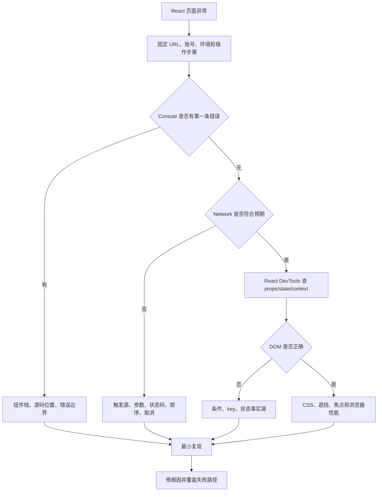
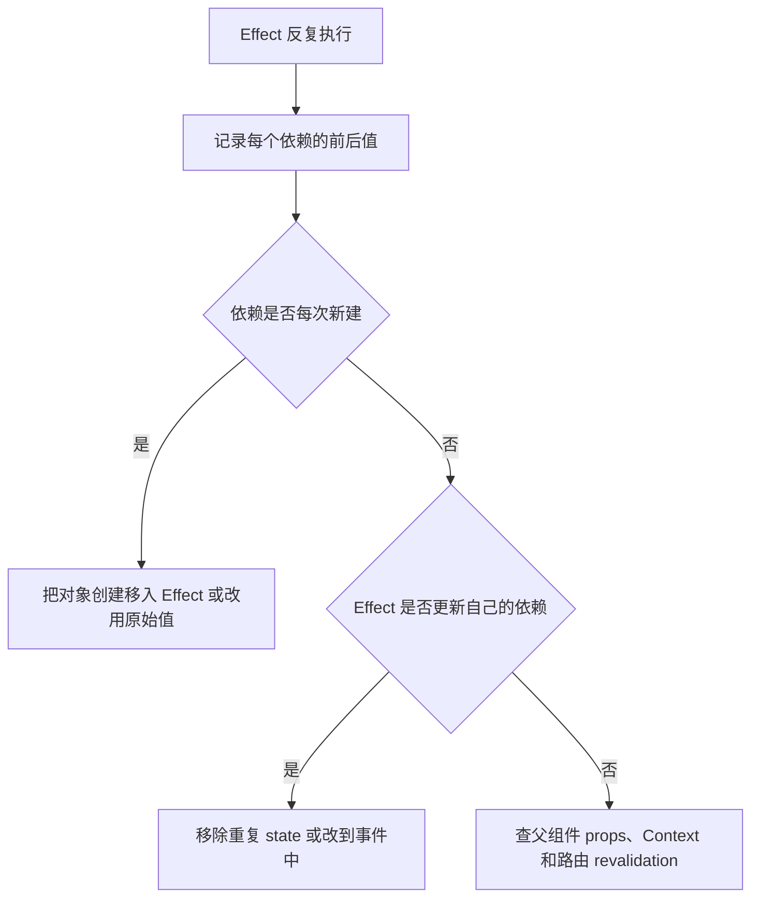
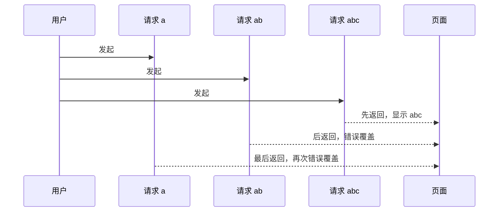
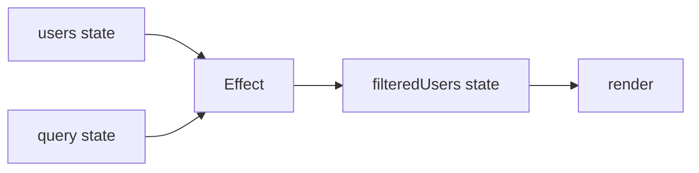
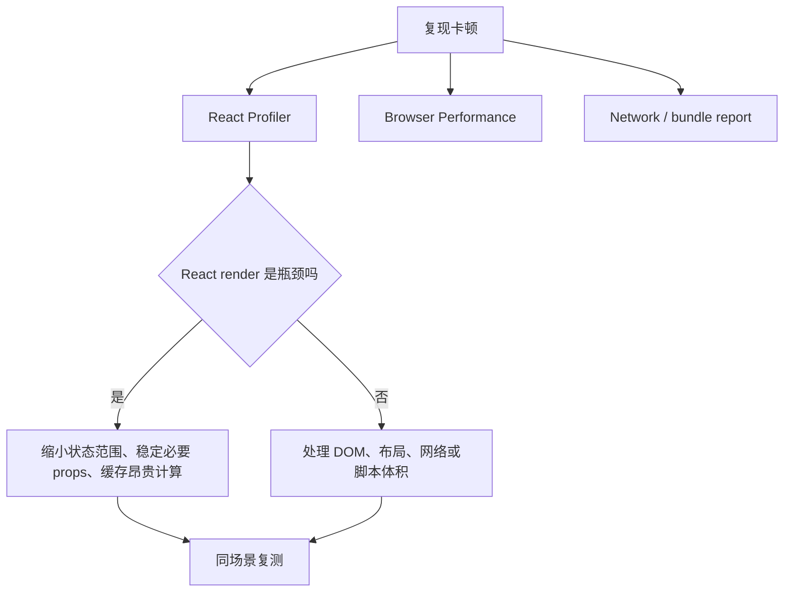
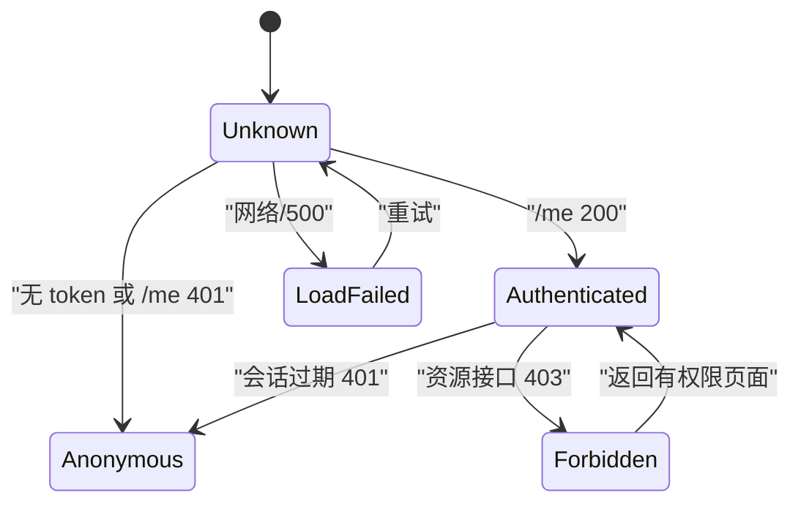

# React 真实项目问题库

## 适合谁看

适合已经能写 React 组件和 Hooks，但在列表、表单、请求、路由、权限或上线后问题上经常靠试错的人。本页按“现象 -> 证据 -> 根因 -> 修复 -> 回归”整理问题，示例以 Vite 客户端管理台为主。

先读 [图解 React 核心概念](/react/visual-guide)，再回到这里处理项目问题。没有渲染、快照、身份和 Effect 生命周期模型时，很容易把症状修成另一个症状。

## 按现象快速定位

| 现象 | 优先看 |
| --- | --- |
| 开发环境请求两次 | 问题 1 |
| 页面持续请求或 Maximum update depth | 问题 2 |
| 定时器、订阅读到旧值 | 问题 3 |
| 快速搜索后显示旧结果 | 问题 4 |
| 改了数组或对象但界面不更新 | 问题 5 |
| 列表输入框、展开状态跟错行 | 问题 6 |
| 两份 state 经常不同步 | 问题 7 |
| controlled/uncontrolled 警告 | 问题 8 |
| 编辑表单还没保存，列表已经变化 | 问题 9 |
| Context 更新导致整页重渲染 | 问题 10 |
| 加了 memo 仍然卡 | 问题 11 |
| 深层路由刷新 404 | 问题 12 |
| 401/403 跳转循环或页面闪烁 | 问题 13 |
| 隐藏按钮但接口仍可调用 | 问题 14 |
| 发布后出现 chunk 404 白屏 | 问题 15 |
| Error Boundary 没捕获错误 | 问题 16 |

## 统一排查总图



### 证据记录模板

```md
## 问题标题

### 环境
- URL：
- 版本/commit：
- 浏览器和视口：
- 开发或生产：

### 最小复现步骤
1.
2.
3.

### 证据
- Console 第一条错误：
- Network 请求顺序与状态：
- React DevTools props/state/context：
- Profiler commit：

### 根因

### 修复

### 回归与预防
```

不要从最后一条连锁报错开始修。第一条错误、第一条异常请求和第一次错误状态变化通常更接近根因。

## 问题 1：开发环境请求两次

### 现象

- 本地进入页面时同一个接口出现两次。
- 生产预览可能只有一次。
- 有时第二次请求会先 cleanup 第一次。

### 常见根因

1. Strict Mode 在开发环境额外执行 setup/cleanup，用于暴露不对称 Effect。
2. 路由 loader 已请求一次，组件 Effect 又请求一次。
3. 父子组件分别请求同一资源。
4. 一次来自页面加载，一次来自 mutation 后 revalidation。

### 先收集证据

- 给请求封装记录调用来源，不只看 URL。
- 检查请求 Initiator 和调用栈。
- 对比 `npm run dev` 与生产 preview。
- 搜索 loader、Effect、事件和请求缓存中所有调用点。

```text
GET /api/users source=route-loader navigation=initial
GET /api/users source=UsersPage.effect component=UsersPage
```

如果来源不同，关闭 Strict Mode 也不会解决重复事实源。

### 修复

列表由路由负责时，只保留 loader：

```ts
export async function usersLoader({ request }: LoaderFunctionArgs) {
  const url = new URL(request.url)
  return getUsers(url.searchParams, request.signal)
}
```

订阅型 Effect 必须能安全重连：

```tsx
useEffect(() => {
  const unsubscribe = subscribeToNotifications(handleMessage)
  return unsubscribe
}, [])
```

### 回归

```text
[ ] 请求只有一个明确事实源
[ ] Strict Mode 下 setup/cleanup 对称
[ ] 生产 preview 行为已验证
[ ] mutation 后的 revalidation 次数可解释
```

## 问题 2：Effect 无限循环

### 现象

- Network 持续刷请求。
- Console 出现 maximum update depth。
- CPU 占用升高，页面卡死。

### 典型错误

```tsx
const filters = { q, status }

useEffect(() => {
  getUsers(filters).then(setUsers)
}, [filters])
```

每次 render 都创建新对象，Effect 认为依赖变化；请求结束又设置 state，形成循环。

### 决策路径



### 修复

```tsx
useEffect(() => {
  const controller = new AbortController()
  getUsers({ q, status }, controller.signal).then(setUsers)
  return () => controller.abort()
}, [q, status])
```

如果请求由 URL 决定，优先移到 route loader；如果只是 `filtered = users.filter(...)`，直接在 render 计算，不需要 Effect。

### 不要这样修

- 删除 lint 要求的依赖。
- 用空数组强行“只执行一次”。
- 到处 `useMemo`，却保留两份重复 state。

## 问题 3：定时器或订阅读到旧 state

### 现象

- interval 永远从初始值加一。
- WebSocket 回调使用旧筛选条件。
- 延迟提交发送了旧表单草稿。

### 根因

回调捕获了创建它的那次 render 快照：

```tsx
useEffect(() => {
  const timer = window.setInterval(() => {
    setCount(count + 1)
  }, 1000)
  return () => window.clearInterval(timer)
}, [])
```

### 修复

依赖上一次 state 时使用 updater：

```tsx
useEffect(() => {
  const timer = window.setInterval(() => {
    setCount((current) => current + 1)
  }, 1000)
  return () => window.clearInterval(timer)
}, [])
```

如果订阅确实要随 `roomId` 变化，就把它作为依赖并重建订阅。不要用 ref 把所有依赖藏起来；ref 适合“要读取最新值但变化不驱动订阅重建”的明确场景。

### 回归

- 切换依赖前后分别发送事件。
- 卸载组件后确认回调停止。
- 使用 fake timers 验证连续更新。

## 问题 4：旧请求覆盖新请求

### 现象

用户依次搜索 `a`、`ab`、`abc`，最后页面却显示 `a` 的结果。

### 时间线



### 修复方案

优先级通常是：

1. 路由 loader 传递 `request.signal`。
2. Effect cleanup 使用 `AbortController`。
3. 请求库使用稳定 query key 和内建取消/失效。
4. 无法取消时使用请求序号忽略过期结果。

```tsx
useEffect(() => {
  const controller = new AbortController()
  loadUsers(query, { signal: controller.signal })
    .then(setUsers)
    .catch((error) => {
      if (error.name !== 'AbortError') setError(error)
    })
  return () => controller.abort()
}, [query])
```

### 验证

在 DevTools Network 使用 Slow 3G，快速输入三次。最终结果、URL 和最新请求参数必须一致；被取消请求不应显示错误 Toast。

## 问题 5：修改对象后界面不更新

### 现象

- 对象内容在 Console 看起来已经改变。
- 组件没有重新 render，或 memo 子组件仍显示旧值。

### 错误写法

```tsx
user.status = 'disabled'
setUser(user)
```

引用没有变化，而且原对象已经被污染。

### 修复

```tsx
setUser((current) => ({ ...current, status: 'disabled' }))

setUsers((current) => current.map((item) =>
  item.id === userId ? { ...item, status: 'disabled' } : item
))
```

### 证据

在修复前后记录：

```ts
console.log(Object.is(previousUser, nextUser))
```

但不要把“新引用”误解成所有层级都必须无脑深拷贝。只复制发生变化路径上的对象；更重要的是不要把服务端数据和表单草稿共享同一可变引用。

## 问题 6：列表输入框或展开状态跟错行

### 现象

- 删除第一行后，第二行输入值跑到第一行。
- 排序后，展开面板对应错误用户。
- 切换编辑对象，表单仍保留上一人的 state。

### 根因

```tsx
items.map((item, index) => <Row key={index} item={item} />)
```

React 用位置和 key 识别组件。index 在插入、删除、排序后不能代表业务身份。

### 修复

```tsx
const rows = items.map((item) => <Row key={item.id} item={item} />)

const form = <UserForm key={editingUserId ?? 'create'} userId={editingUserId} />
```

### 回归

1. 在第二行输入未保存内容。
2. 删除第一行或改变排序。
3. 确认草稿仍跟随同一业务 id。
4. 从编辑 A 切到 B，确认表单按产品要求保留或重置。

## 问题 7：派生 state 不同步

### 现象

- `users` 更新了，`filteredUsers` 还是旧值。
- `firstName` 改了，`fullName` 晚一次更新。
- Effect 链导致多次 render 和短暂错误 UI。

### 错误模型



### 修复模型

```tsx
const filteredUsers = users.filter((user) =>
  user.displayName.toLowerCase().includes(query.toLowerCase())
)
```

昂贵到有实际证据时再使用：

```tsx
const filteredUsers = useMemo(
  () => expensiveFilter(users, query),
  [users, query]
)
```

`useMemo` 缓存计算，不会把错误的事实源设计变正确。

## 问题 8：controlled/uncontrolled 警告

### 现象

Console 提示输入框从 uncontrolled 变成 controlled，或反向变化；字段可能无法稳定清空。

### 根因

初次 `value` 是 `undefined`，接口回来后变成字符串：

```tsx
<input value={user.displayName} onChange={handleChange} />
```

### 修复

表单初始值从一开始就固定类型：

```tsx
function UserForm() {
  const [form, setForm] = useState<UserFormValues>(() => ({
    username: '',
    displayName: '',
    email: '',
    roleCodes: []
  }))

  return (
    <input
      value={form.displayName}
      onChange={(event) => setForm((current) => ({
        ...current,
        displayName: event.target.value
      }))}
    />
  )
}
```

如果字段由 DOM 管理，就使用 `defaultValue` 并保持 uncontrolled，不要在同一生命周期中来回切换。

## 问题 9：编辑表单污染列表

### 现象

用户在弹窗中修改名称但还没保存，背景表格已经变化；点击取消也无法恢复。

### 根因

表单直接引用并修改列表项：

```tsx
setEditingUser(row)
editingUser.displayName = nextName
```

### 修复

创建独立草稿：

```tsx
function toUserForm(user: UserDTO): UserFormValues {
  return {
    username: user.username,
    displayName: user.displayName ?? '',
    email: user.email,
    roleCodes: [...user.roleCodes]
  }
}

const [form, setForm] = useState(() => toUserForm(user))
```

保存成功后重新验证服务端列表。取消只丢弃草稿，不需要“反向恢复”被污染的 DTO。

## 问题 10：Context 更新导致整页重渲染

### 现象

- 在全局搜索框输入一个字符，后台大量组件 render。
- Provider 的所有消费者都在 Profiler 中更新。

### 常见根因

- 把会话、主题、搜索草稿、列表数据和弹窗状态放在同一 Context。
- Provider 每次内联创建新的 `{ user, logout }` 对象。
- 高频状态本可以放在局部组件。

### 修复顺序

1. 把高频状态下沉到最近使用位置。
2. 按稳定职责拆 Context，例如 Session 与 Theme。
3. 确认消费者是否真的都需要整个对象。
4. 最后才考虑稳定 provider value 或外部 store selector。

```tsx
const value = useMemo(() => ({ currentUser, logout }), [currentUser, logout])
return <SessionContext value={value}>{children}</SessionContext>
```

这只能稳定引用，不能修复“一个 Context 承担所有状态”的边界问题。

### 验证

用 Profiler 录制同一段输入操作，对比 commit 时长、实际 render 组件和用户可感知延迟。

## 问题 11：加了 memo 仍然卡

### 现象

- `React.memo`、`useMemo`、`useCallback` 加了很多。
- 页面仍卡顿，代码却更难读。

### 常见原因

- props 每次都是新对象或新函数，memo 比较永远不命中。
- 真正瓶颈是 5000 个 DOM 节点。
- 昂贵工作发生在浏览器 layout/paint，不在 React render。
- 一个顶层 Context 仍让所有消费者更新。
- 网络或大 bundle 被误判为 render 性能。

### 正确流程



大列表优先分页或虚拟化；表单输入卡顿优先检查是否每次让整个页面重渲染；首屏慢优先检查 chunk 和请求瀑布。

## 问题 12：深层路由刷新 404

### 现象

- 从首页点击 `/users/123` 正常。
- 地址栏直接访问或刷新 `/users/123` 返回托管平台 404。

### 根因

客户端路由只在应用 JS 加载后接管。服务器收到深层 URL 时仍要返回应用 HTML。

### 修复

- 配置静态托管 SPA fallback 到 `index.html`。
- 排除 `/api/*`、静态资源和真实文件，不能所有 404 都返回 HTML。
- 如果部署在子路径，统一 Vite `base`、路由 basename 和资源路径。

### 验证

```text
[ ] 新标签直接打开深层 URL
[ ] 强制刷新
[ ] 资源请求仍返回 JS/CSS，不是 index.html
[ ] 未知 API 返回 JSON 404，不是应用 HTML
[ ] 浏览器后退、前进和复制链接正常
```

## 问题 13：401/403 跳转循环

### 现象

- 页面在 `/login` 与 `/users` 之间闪烁。
- 403 被当成未登录，持续清 token。
- 多个并发 401 同时触发多个跳转和 Toast。

### 状态边界



### 修复原则

- 401 表示身份无效：清会话并进入登录流程。
- 403 表示身份有效但无权：保留会话并显示无权限。
- 网络错误和 500 不能伪装成未登录。
- 登录页发现已有 token，也必须验证会话后再跳转。
- 将会话恢复集中在根 loader 或会话层，避免每个页面各自跳转。

## 问题 14：按钮隐藏了但接口仍能调用

### 现象

页面没有“删除用户”按钮，但用户在 DevTools 或脚本中仍能调用接口成功。

### 根因

后端把前端按钮可见性当作授权。浏览器中的 JavaScript、路由和状态都由用户控制。

### 修复

后端每个敏感接口必须验证：

```text
身份是谁
要操作哪个资源
执行什么动作
是否满足角色、权限和资源范围
是否记录审计事实
```

前端仍保留 `PermissionGate` 改善体验，但测试必须包含绕过 UI 直接请求接口并得到 403。

## 问题 15：发布后 chunk 404 白屏

### 现象

- 用户长时间打开旧页面，发布新版本后点击懒加载路由白屏。
- Network 中旧 hash 的 JS chunk 404。
- 盲目自动刷新后可能进入循环。

### 根因

旧 HTML/运行中应用引用旧 chunk，部署过程已经删除或不可访问；也可能 CDN 缓存 HTML 太久，静态资源缓存策略错误。

### 修复方向

- 带 hash 静态资源长期缓存并保留一段发布窗口。
- HTML 使用短缓存或 revalidate，避免长期引用旧清单。
- 发布采用原子切换，避免 HTML 和资源半更新。
- 捕获明确的动态导入失败，提示用户刷新。
- 自动刷新最多一次，并用 session 标记防止无限循环。
- 关键系统提供版本接口、发布监控和回滚。

### 验证

1. 打开旧版本页面不刷新。
2. 发布新版本。
3. 点击尚未加载的懒路由。
4. 检查旧 chunk 是否仍可用，或页面是否给出可恢复提示。
5. 验证恢复逻辑不会循环。

## 问题 16：Error Boundary 没捕获错误

### 现象

项目已经有 Error Boundary，但点击按钮后的错误、`setTimeout` 内错误或请求失败仍出现在 Console，没有显示兜底页。

### 原因

Error Boundary 主要处理后代渲染过程中的错误。事件处理函数、普通异步回调、服务端业务失败需要在自己的边界处理。

### 修复

```tsx
async function handleSave() {
  setSaving(true)
  setError('')
  try {
    await saveUser(values)
  } catch (error) {
    setError(toUserMessage(error))
  } finally {
    setSaving(false)
  }
}
```

路由 loader/action 的异常交给 route error boundary；组件事件 mutation 使用明确状态；无法恢复的 render 错误交给组件或路由错误边界。不要用一个全局边界吞掉所有问题。

## 团队预防清单

```text
[ ] 列表和详情各自只有一个服务端数据事实源
[ ] Effect 只同步外部系统，setup/cleanup 对称
[ ] state 更新不直接修改对象和数组
[ ] 动态列表使用稳定业务 key
[ ] URL 状态与组件 state 不重复保存
[ ] 请求支持取消、过期结果忽略或库级竞态处理
[ ] 401、403、409、422、500 有不同页面行为
[ ] 表单 DTO 与列表 DTO 不共享可变引用
[ ] 性能修改前后都有 Profiler 或浏览器证据
[ ] 深层 URL、旧 chunk 和生产缓存策略经过验证
[ ] 前端权限不替代后端授权
[ ] 每个线上问题都有回归测试或检查项
```

## 参考资料

- [React：State as a Snapshot](https://react.dev/learn/state-as-a-snapshot)
- [React：Preserving and Resetting State](https://react.dev/learn/preserving-and-resetting-state)
- [React：Synchronizing with Effects](https://react.dev/learn/synchronizing-with-effects)
- [React：You Might Not Need an Effect](https://react.dev/learn/you-might-not-need-an-effect)
- [React：StrictMode](https://react.dev/reference/react/StrictMode)
- [React Router：Data Loading](https://reactrouter.com/start/data/data-loading)

## 下一步学习

选择本页至少五个问题，在 [React 专项练习](/roadmap/react-practice) 中主动注入并记录证据。需要完整项目上下文时回到 [React 管理台从零到项目](/react/project-admin)；只想快速定位时先看 [React 常见问题](/react/troubleshooting)。
