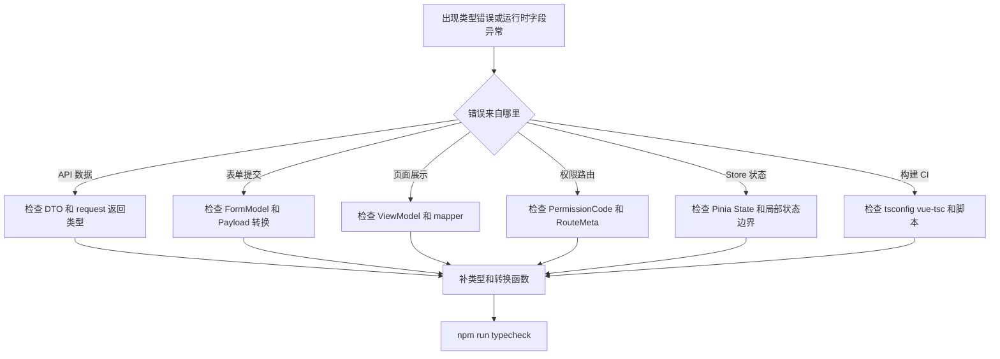
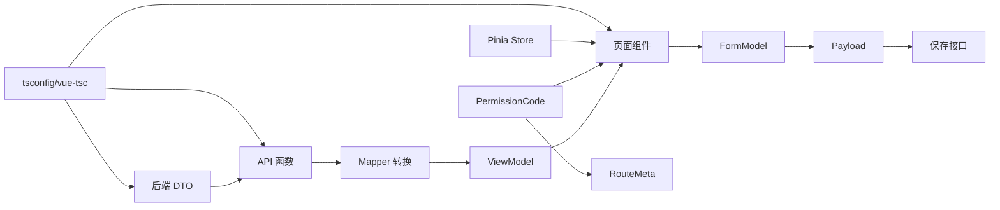
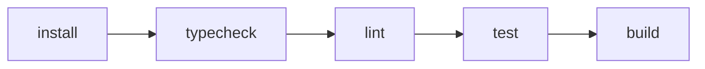

# TypeScript 类型边界问题库

## 这个页面解决什么

这个页面专门整理 TypeScript 在真实前端项目里最常见的类型边界问题。它不是语法速查，而是帮助你排查这些问题：

- 接口字段变了，页面没有在开发阶段发现。
- 表单能编辑，但提交给后端的字段不对。
- 权限码写错，按钮不显示或路由进不去。
- Pinia Store 类型越来越乱，页面互相影响。
- 路由 meta、第三方库、LocalStorage、枚举和分页类型经常报错。
- 本地 dev 能跑，CI 或 build 才报类型错误。

如果你刚做完 [TypeScript 类型边界从零到项目](/typescript/type-boundary-project)，这篇就是下一步的实战排错清单。

## 排查总流程

遇到 TypeScript 类型问题时，先按下面顺序排查：



核心原则：先判断问题属于哪一层，再改对应边界，不要用 `as any` 直接绕过去。

## 类型边界总图



大多数 TypeScript 项目问题都可以归到这几类边界：

| 边界 | 常见错误 | 正确做法 |
| --- | --- | --- |
| API 边界 | request 返回 any | API 函数返回明确泛型 |
| DTO 边界 | 页面直接用后端字段 | DTO 先转 ViewModel |
| 表单边界 | FormModel 直接提交 | FormModel 转 Payload |
| 权限边界 | 字符串散落 | 权限码集中 const 定义 |
| 路由边界 | meta 没类型 | 扩展 RouteMeta |
| Store 边界 | 局部状态塞全局 | Store 只放跨页面共享状态 |
| 构建边界 | 只跑 dev | typecheck 接入 build/CI |

## 问题 1：接口字段变了，页面没报错

### 问题现象

- 后端把 `user_name` 改成 `username`。
- 本地页面仍能打开，但列表用户名变成空。
- TypeScript 没有报错。

### 影响范围

所有接口返回值被当成 `any` 的页面。

### 根因分析

常见写法是：

```ts
const result = await request.get('/users')
rows.value = result.items.map((item) => ({
  name: item.user_name
}))
```

这里 `item` 是 `any`，字段写错不会被发现。

### 解决方案

给 API 函数补返回类型：

```ts
export interface UserDTO {
  id: number
  user_name: string
  status: 0 | 1
}

export interface PageResult<T> {
  items: T[]
  total: number
}

export async function fetchUsers(): Promise<PageResult<UserDTO>> {
  return request.get<PageResult<UserDTO>>('/users')
}
```

页面只能使用明确类型：

```ts
const page = await fetchUsers()
rows.value = page.items.map(toUserView)
```

### 预防方式

- request 层不要默认返回 `any`。
- API 函数必须声明 `Promise<具体类型>`。
- DTO 字段变化时先改类型，再看编译错误定位影响范围。

## 问题 2：DTO 直接进入页面模板

### 问题现象

页面里到处出现：

```vue
{{ row.user_name }}
{{ row.status === 1 ? '启用' : '禁用' }}
{{ formatDate(row.created_at) }}
```

后端字段一变，多个页面一起坏。

### 影响范围

列表、详情、导出、弹窗和子组件都会被后端字段牵连。

### 根因分析

DTO 是接口形态，不是页面形态。页面直接依赖 DTO，会让展示逻辑、接口字段和格式化逻辑混在一起。

### 解决方案

建立 ViewModel：

```ts
export interface UserView {
  id: number
  name: string
  enabledText: string
  createdText: string
}

export function toUserView(dto: UserDTO): UserView {
  return {
    id: dto.id,
    name: dto.user_name,
    enabledText: dto.status === 1 ? '启用' : '禁用',
    createdText: formatDateTime(dto.created_at)
  }
}
```

模板只使用 ViewModel：

```vue
{{ row.name }}
{{ row.enabledText }}
{{ row.createdText }}
```

### 预防方式

- 页面表格行类型用 `UserView[]`，不要用 `UserDTO[]`。
- DTO 到 ViewModel 的转换函数放在 `model` 或 `mapper` 目录。
- 格式化、枚举翻译、可空兜底都放进转换层。

## 问题 3：表单类型和提交类型混在一起

### 问题现象

表单里是：

```ts
enabled: true
roleOptions: [{ label: '管理员', value: 'admin' }]
```

后端要求：

```ts
status: 1
role_codes: ['admin']
```

保存时字段不匹配，后端返回 400。

### 影响范围

新增、编辑、复制、批量导入等所有有表单提交的功能。

### 根因分析

表单模型是为了交互舒服，提交参数是为了接口契约稳定。两者不能强行共用一个类型。

### 解决方案

拆成两个类型：

```ts
export interface UserFormModel {
  name: string
  enabled: boolean
  roleCodes: string[]
}

export interface SaveUserPayload {
  user_name: string
  status: 0 | 1
  role_codes: string[]
}

export function toSaveUserPayload(form: UserFormModel): SaveUserPayload {
  return {
    user_name: form.name.trim(),
    status: form.enabled ? 1 : 0,
    role_codes: [...form.roleCodes]
  }
}
```

### 预防方式

- 所有保存接口都必须有 `toXxxPayload`。
- 表单类型允许服务交互，Payload 类型只服务接口。
- 不在点击保存按钮里散写字段转换。

## 问题 4：编辑弹窗污染列表数据

### 问题现象

- 打开编辑弹窗。
- 修改角色多选。
- 不点保存直接关闭。
- 列表里的角色已经变化。

### 影响范围

用户编辑、角色编辑、菜单编辑、商品编辑等弹窗表单。

### 根因分析

表单直接引用了列表行对象或数组：

```ts
form.value = row
```

或者：

```ts
roleCodes: row.roleCodes
```

数组和对象是引用类型，弹窗修改会影响原数据。

### 解决方案

创建表单时复制需要编辑的数据：

```ts
export function createUserForm(row: UserView): UserFormModel {
  return {
    id: row.id,
    name: row.name,
    enabled: row.enabled,
    roleCodes: [...row.roleCodes]
  }
}
```

如果对象层级更深，用明确的转换函数，不要盲目 JSON 深拷贝。

### 预防方式

- 表单初始化必须通过 `createXxxForm`。
- 数组字段都复制。
- 保存成功后再刷新列表或局部替换列表数据。

## 问题 5：权限码字符串拼错

### 问题现象

按钮不显示，但用户确实有权限。

代码里写的是：

```ts
hasPermission('user:udpate')
```

实际权限是：

```ts
user:update
```

### 影响范围

按钮权限、菜单权限、路由权限、接口权限说明。

### 根因分析

权限码作为普通字符串散落在页面里，拼错不会被 TypeScript 发现。

### 解决方案

集中定义权限码：

```ts
export const permissionCodes = {
  userView: 'user:view',
  userCreate: 'user:create',
  userUpdate: 'user:update',
  userDelete: 'user:delete'
} as const

export type PermissionCode =
  (typeof permissionCodes)[keyof typeof permissionCodes]
```

页面使用常量：

```ts
hasPermission(permissionCodes.userUpdate)
```

### 预防方式

- 禁止页面直接写权限字符串。
- 权限码新增、修改、删除都从统一文件开始。
- 后端返回权限码时也使用同一套枚举或生成脚本同步。

## 问题 6：路由 meta 字段写错

### 问题现象

路由配置写了：

```ts
meta: {
  requireAuth: true,
  permission: 'user:view'
}
```

守卫读取的是：

```ts
to.meta.requiresAuth
to.meta.requiredPermission
```

结果路由没有被拦截。

### 影响范围

动态路由、权限路由、页面标题、缓存 keepAlive。

### 根因分析

Vue Router 的 `meta` 默认比较宽松，不扩展类型时，写错字段也可能不报错。

### 解决方案

补充类型声明：

```ts
import 'vue-router'
import type { PermissionCode } from '@/types/permission'

declare module 'vue-router' {
  interface RouteMeta {
    title: string
    requiresAuth?: boolean
    requiredPermission?: PermissionCode
    keepAlive?: boolean
  }
}
```

路由配置使用正确字段：

```ts
meta: {
  title: '用户管理',
  requiresAuth: true,
  requiredPermission: permissionCodes.userView
}
```

### 预防方式

- 给 RouteMeta 做模块增强。
- 权限字段使用 `PermissionCode`。
- 路由守卫不要读取未声明字段。

## 问题 7：Pinia Store 变成全局杂物间

### 问题现象

Store 里出现：

```ts
keyword: string
dialogVisible: boolean
selectedRowIds: number[]
formModel: UserFormModel
```

多个页面切换后，搜索条件、弹窗状态和表单互相影响。

### 影响范围

后台系统里的列表页、弹窗、详情页和跨页面状态。

### 根因分析

把页面局部状态放进全局 Store，会让生命周期变长，页面销毁后状态仍然存在。

### 解决方案

Store 只放跨页面共享状态：

```ts
export interface AuthState {
  token: string
  user: AuthUser | null
  permissionCodes: PermissionCode[]
}
```

页面状态放在页面 composable：

```ts
export function useUserListState() {
  const query = reactive<UserListQuery>({
    page: 1,
    pageSize: 20
  })
  const dialogVisible = ref(false)
  const selectedRowIds = ref<number[]>([])

  return {
    query,
    dialogVisible,
    selectedRowIds
  }
}
```

### 预防方式

- 先问“这个状态是否跨页面共享”。
- 登录态、权限码、全局偏好可以进 Store。
- 表单、弹窗、列表筛选优先留在页面。

## 问题 8：接口枚举出现未知值

### 问题现象

后端新增状态 `2`，前端类型仍然是：

```ts
status: 0 | 1
```

页面显示空白，或者构建时一堆类型错误。

### 影响范围

订单状态、审批状态、支付状态、任务状态、用户状态。

### 根因分析

枚举类字段既要类型约束，也要运行时兜底。接口一旦扩展新值，前端不能直接崩。

### 解决方案

先保留接口真实类型，再做展示映射：

```ts
export type UserStatus = 0 | 1 | 2

const userStatusText: Record<UserStatus, string> = {
  0: '禁用',
  1: '启用',
  2: '待激活'
}

export function getUserStatusText(status: number) {
  return userStatusText[status as UserStatus] ?? '未知状态'
}
```

如果后端会频繁扩展枚举，可以让 DTO 使用 `number`，在 ViewModel 转换层做兜底。

### 预防方式

- 枚举字段必须有未知值兜底。
- 重要枚举变更要进入接口变更清单。
- 展示层不要直接写 `status === 1 ? ...`。

## 问题 9：LocalStorage 数据类型不可信

### 问题现象

从 localStorage 读取用户偏好：

```ts
const config = JSON.parse(localStorage.getItem('config')!)
theme.value = config.theme
```

某天用户页面白屏。

### 影响范围

主题配置、筛选缓存、用户偏好、草稿箱、客户端缓存。

### 根因分析

localStorage 是外部输入，可能为空、被手动修改、版本过旧或 JSON 损坏。不能把它当成可信类型。

### 解决方案

用 `unknown` 和类型守卫：

```ts
interface UserPreference {
  theme: 'light' | 'dark'
  pageSize: number
}

function isUserPreference(value: unknown): value is UserPreference {
  if (!value || typeof value !== 'object') return false
  const record = value as Record<string, unknown>
  return (
    (record.theme === 'light' || record.theme === 'dark') &&
    typeof record.pageSize === 'number'
  )
}

export function loadPreference(): UserPreference {
  try {
    const raw = localStorage.getItem('preference')
    const parsed: unknown = raw ? JSON.parse(raw) : null
    if (isUserPreference(parsed)) return parsed
  } catch {
    // ignore invalid cache
  }

  return {
    theme: 'light',
    pageSize: 20
  }
}
```

### 预防方式

- 所有外部输入先当 `unknown`。
- 读取缓存必须有默认值。
- 缓存结构升级时要考虑兼容旧数据。

## 问题 10：开发能跑，构建才报类型错误

### 问题现象

- `npm run dev` 正常。
- `npm run build` 或 CI 报一堆类型错误。
- 团队以为是构建环境问题。

### 影响范围

Vue、React、Vite、组件库项目和 Monorepo。

### 根因分析

开发服务器主要负责快速启动和热更新，不等于完整类型检查。很多 Vue SFC、props、emits、模板类型问题，要靠 `vue-tsc` 或构建流程发现。

### 解决方案

脚本里明确加入 typecheck：

```json
{
  "scripts": {
    "typecheck": "vue-tsc --noEmit",
    "build": "vue-tsc --noEmit && vite build"
  }
}
```

CI 顺序建议：



### 预防方式

- 提交前至少跑一次 `npm run typecheck`。
- build 脚本必须包含 typecheck。
- 对 warning 和 error 做区分，真正的类型错误不能忽略。

## 问题 11：第三方库没有类型

### 问题现象

引入库时报错：

```text
Could not find a declaration file for module 'some-lib'
```

### 影响范围

图表、地图、编辑器、拖拽、老旧 JS SDK。

### 根因分析

库没有内置 TypeScript 类型，也没有安装对应的 `@types` 包。

### 解决方案

优先安装官方或社区类型：

```bash
npm i -D @types/some-lib
```

如果没有类型，补最小声明：

```ts
declare module 'some-lib' {
  export interface SomeLibOptions {
    container: HTMLElement
    readonly?: boolean
  }

  export function createEditor(options: SomeLibOptions): {
    destroy(): void
  }
}
```

不要直接写：

```ts
declare module 'some-lib'
```

这种写法会让整个库变成 `any`。

### 预防方式

- 新增第三方库时检查类型支持。
- 只声明当前项目用到的最小 API。
- 把声明文件放到 `src/types` 或 `types` 目录，并确保 tsconfig include 覆盖。

## 问题 12：泛型封装过度复杂

### 问题现象

团队封装了非常复杂的类型：

```ts
type DeepFormPayload<T, K extends keyof T, M = ...> = ...
```

结果新同事看不懂，类型报错也无法定位。

### 影响范围

表单生成器、权限配置器、低代码平台、组件库。

### 根因分析

业务项目里的类型首先要服务可读性。过度抽象会让类型系统变成新的维护负担。

### 解决方案

优先使用清晰直写类型：

```ts
interface UserFormModel {
  name: string
  roleCodes: string[]
  enabled: boolean
}

interface SaveUserPayload {
  user_name: string
  role_codes: string[]
  status: 0 | 1
}
```

只有当多个模块真的重复，并且抽象后更容易理解，才提取泛型。

### 预防方式

- 业务类型优先直写。
- 泛型要有明确业务名字。
- 类型报错信息必须能让业务开发读懂。
- 抽象前先确认重复是否稳定。

## 上线前检查清单

上线前检查 TypeScript 类型边界：

- API 函数没有裸 `request.get('/xxx')`。
- request 层没有默认返回 `any`。
- 页面列表行使用 ViewModel，不直接使用 DTO。
- 表单提交通过 `toXxxPayload`。
- 权限码统一从 `permissionCodes` 引用。
- RouteMeta 已声明 title、requiresAuth、requiredPermission。
- Pinia Store 没有页面局部弹窗和表单状态。
- LocalStorage 读取有 try/catch、默认值和类型守卫。
- 枚举展示有未知值兜底。
- 第三方库类型声明不使用裸 `declare module`。
- `npm run typecheck` 通过。
- build 脚本包含 typecheck。

## 继续学习

继续学习：

- [TypeScript 类型边界从零到项目](/typescript/type-boundary-project)
- [TypeScript 项目落地实践](/typescript/project-practice)
- [Vue 项目集成](/typescript/vue-integration)
- [前端页面与状态问题](/projects/issues-frontend)
- [前后端联调排查](/projects/integration-debugging)
