# Vue Admin 消息通知、未读数与实时提醒问题排查专题

## 这个页面解决什么

这一页是 Vue Admin 的消息通知专项问题库，专门排查这些真实项目中反复出现的问题：

- 铃铛未读数和站内信列表对不上。
- 同一条审批待办重复弹出多次。
- 切换账号后看到上一位用户的未读数。
- SSE 或 WebSocket 一直重连。
- 点击通知进入 404、403 或错误业务详情。
- 全部已读后又恢复未读。
- 工作台待办数量、铃铛数量、审批列表数量三者不一致。
- 轮询定时器越来越多，页面越用越卡。
- 离线期间的新消息没有补回来。
- 通知太多，用户忽略真正重要的提醒。

它和 [Vue Admin 消息通知、站内信、实时提醒与已读闭环实战](/vue/admin-notification-center) 的关系是：

- 通知闭环实战讲“消息中心应该怎么设计”。
- 本页讲“消息中心出问题时怎么定位、怎么修、怎么验证”。
- [消息通知项目案例](/projects/notification-center-case) 讲更通用的后端业务建模、模板、接收人和发送通道。

## 适合谁看

- 已经做了顶部铃铛、站内信列表、未读数、已读未读的人。
- 正在接审批待办、导入导出任务、系统公告、安全告警的人。
- 正在调试轮询、SSE、WebSocket 实时提醒的人。
- 想把通知类问题沉淀成团队排障 SOP 的人。

## 先不要猜，先收集证据

通知类问题最容易误判。因为它同时涉及页面状态、请求、实时连接、登录态、权限、后端事件、数据库和多标签页。

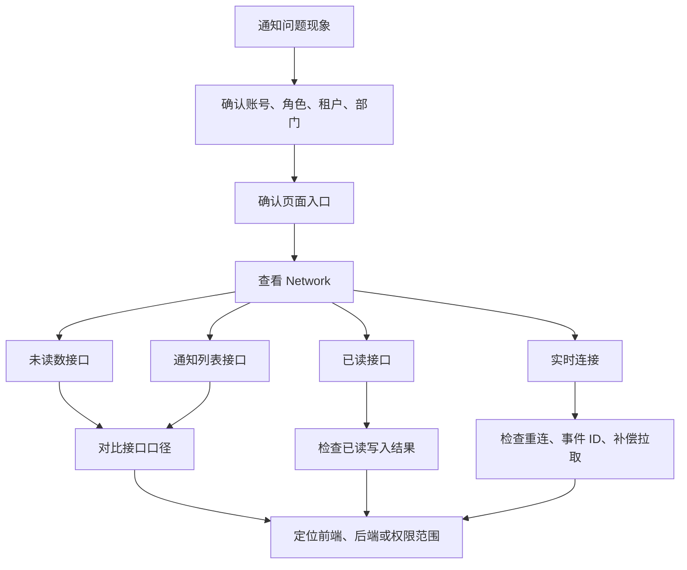

最小证据清单：

| 证据 | 要看什么 | 为什么 |
| --- | --- | --- |
| 账号上下文 | userId、角色、部门、租户、数据范围 | 通知是否可见取决于身份 |
| 页面路径 | 当前路由、是否从工作台或铃铛进入 | 判断问题发生在哪个入口 |
| 未读数接口 | `/unread-count` 的响应和时间 | 判断铃铛数字来源 |
| 列表接口 | 查询参数、分页、筛选、响应总数 | 判断列表口径 |
| 已读接口 | id、批量 ids、响应状态、traceId | 判断已读是否真正落库 |
| 实时事件 | eventId、eventType、payload、时间 | 判断是否重复、漏消息或旧事件 |
| 本地状态 | Pinia、composable、缓存 key | 判断是否旧账号或旧租户污染 |
| 后端日志 | traceId、通知 id、接收人、幂等 key | 判断是否重复生成或权限过滤错误 |

## 总体排查路径

遇到通知问题，先判断它是“数量问题”“重复问题”“实时问题”“权限问题”还是“跳转问题”。

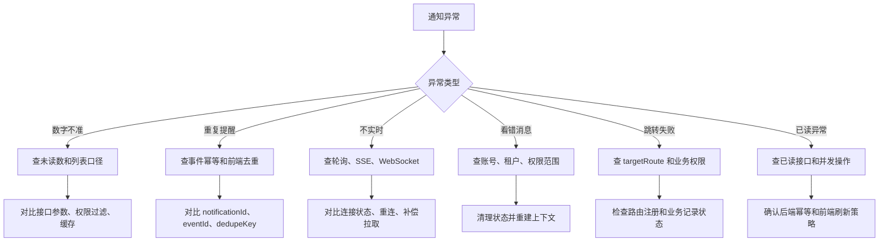

## 问题 1：铃铛未读数和列表未读数不一致

### 现象

- 顶部铃铛显示 `5`。
- 进入消息中心，只能看到 `3` 条未读。
- 刷新后数字偶尔变正确，过一会又不一致。

### 影响范围

几乎所有有未读数的后台都会遇到，尤其是同时存在审批、系统公告、文件任务、安全告警和多租户权限时。

### 常见根因

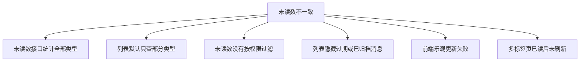

最常见的是接口口径不一致：

| 接口 | 实际口径 |
| --- | --- |
| 未读数接口 | 统计当前用户所有未读通知 |
| 列表接口 | 默认只查 `in_app`，或者只查最近 30 天 |
| 工作台接口 | 只查审批待办和高优先级提醒 |

如果页面没有告诉用户口径差异，用户就会认为系统错了。

### 排查步骤

1. 打开 Network，记录未读数接口响应。
2. 记录列表接口的 query 参数，包括 `type`、`readStatus`、`priority`、`pageSize`、时间范围。
3. 使用同一账号切到“全部类型 + 未读 + 不限时间”。
4. 对比后端日志中当前用户可见的未读通知数量。
5. 检查前端是否在已读成功前就减少本地未读数。

### 修复方案

前端要让口径清楚：

```ts
export interface UnreadCountDTO {
  total: number
  approvalTodo: number
  fileTask: number
  systemAnnouncement: number
  securityAlert: number
}
```

列表默认筛选要明确：

```ts
const query = reactive({
  keyword: '',
  type: undefined,
  readStatus: 'unread',
  priority: undefined,
  includeArchived: false,
  page: 1,
  pageSize: 20
})
```

已读后不要只做本地 `count--`：

```ts
async function markRead(id: string) {
  await markNotificationRead(id)
  await Promise.all([
    fetchList(),
    refreshUnreadCount()
  ])
}
```

### 验证方式

- 用同一个账号分别打开铃铛、消息中心、工作台，记录三个数量。
- 单条已读后，三个入口都刷新到同一口径。
- 批量已读后，未读数不会变成负数。
- 切换筛选条件时，页面要说明当前列表只展示一部分消息。

### 预防方式

- 后端接口文档必须写清统计口径。
- 前端页面必须写清默认筛选条件。
- 工作台、铃铛、消息中心不要各自维护独立未读数。
- 重要接口响应建议带 `scopeDescription` 或分类数量。

## 问题 2：同一条通知重复弹出

### 现象

- 同一条审批待办弹出两次。
- WebSocket 重连后又弹一次旧消息。
- 刷新页面后历史未读被当成新消息弹窗。

### 常见根因

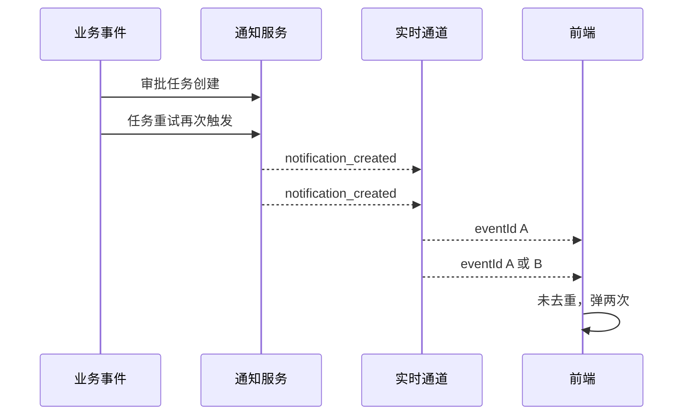

可能原因：

| 层级 | 原因 |
| --- | --- |
| 业务层 | 同一业务事件被触发多次 |
| 通知层 | 没有 `dedupeKey`，重复落库 |
| 实时层 | 重连后重放旧事件 |
| 前端层 | 没有根据 `eventId` 或 `notificationId` 去重 |
| UI 层 | 对历史未读列表逐条弹窗 |

### 排查步骤

1. 找到重复弹窗的通知标题和时间。
2. 查看两个弹窗的 `notificationId` 是否相同。
3. 查看实时事件的 `eventId` 是否相同。
4. 如果 `notificationId` 不同，查后端是否重复落库。
5. 如果 `notificationId` 相同，查前端是否重复处理同一事件。
6. 检查页面初始化时是否把最近消息列表当成实时新消息处理。

### 修复方案

前端只对实时新事件弹窗，不对列表拉取结果弹窗：

```ts
const handledEventIds = new Set<string>()

function handleRealtimeEvent(event: RealtimeEventDTO) {
  if (handledEventIds.has(event.eventId)) return
  handledEventIds.add(event.eventId)

  if (event.eventType !== 'notification_created') return
  if (!event.notification) return

  showNotificationToast(event.notification)
  refreshUnreadCount()
}
```

后端要提供业务幂等键：

```text
dedupeKey = sourceModule + ":" + sourceBizId + ":" + notificationType + ":" + receiverId
```

同一个审批任务给同一个审批人，只能生成一条待办通知。

### 验证方式

- 模拟同一个实时事件连续推送两次，前端只弹一次。
- WebSocket 断开重连后，不弹历史旧消息，只刷新未读数。
- 后端同一 `dedupeKey` 重复创建时返回已有通知或跳过创建。

### 预防方式

- 通知记录表增加 `dedupeKey` 唯一约束或业务唯一索引。
- 实时事件必须有 `eventId`。
- 前端事件去重缓存要按用户清理。
- 历史未读只更新铃铛，不做强弹窗。

## 问题 3：切换账号后显示上一位用户的未读数

### 现象

- A 用户退出后，B 用户登录。
- 页面右上角短暂显示 A 用户未读数。
- B 用户打开铃铛时看到 A 的最近消息。

### 根因

通知状态是跨页面共享状态，如果退出登录时没有清理，就会残留。

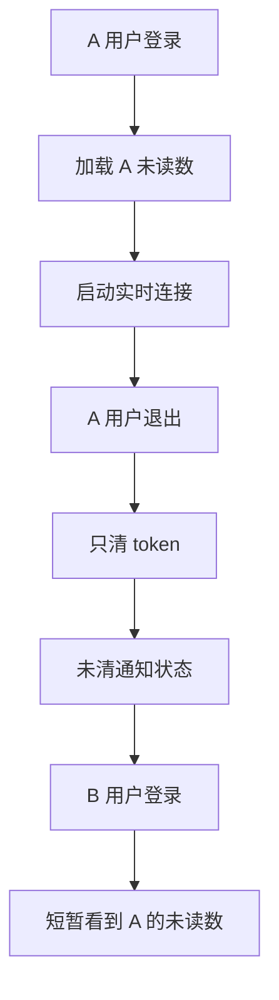

常见遗漏：

- 没有清空 `unreadCount`。
- 没有清空最近消息列表。
- 没有关闭 SSE 或 WebSocket。
- 没有停止轮询。
- 旧请求返回后覆盖新用户状态。
- `lastEventId` 没有按 userId 隔离。

### 修复方案

登出时清理通知模块：

```ts
export function resetNotificationContext() {
  resetUnreadCount()
  clearRecentNotifications()
  stopNotificationPolling()
  disconnectNotificationRealtime()
  clearHandledEventIds()
  clearLastEventId()
}
```

在统一登出流程中调用：

```ts
async function logout() {
  resetNotificationContext()
  authStore.reset()
  permissionStore.reset()
  await router.replace('/login')
}
```

对异步请求增加用户上下文校验：

```ts
async function refreshUnreadCountSafely() {
  const requestUserId = authStore.userId
  const result = await getUnreadCount()

  if (requestUserId !== authStore.userId) return
  unreadCount.value = result
}
```

### 验证方式

1. A 用户登录，制造 5 条未读。
2. A 用户退出。
3. B 用户登录，B 未读数应该从加载状态开始，不应显示 A 的 5。
4. 打开铃铛，只能看到 B 的消息。
5. Network 中旧用户请求返回后不能覆盖 B 的状态。

### 预防方式

- 所有跨页面共享状态都必须写 reset 方法。
- 退出登录、切换租户、切换组织时统一调用 reset。
- 实时连接和轮询不能脱离登录态生命周期。

## 问题 4：SSE 或 WebSocket 一直重连

### 现象

- 控制台不断打印 connected、disconnected、reconnecting。
- 后端日志大量出现鉴权失败。
- 页面卡顿，Network 里有很多 pending 或 failed 连接。

### 常见根因

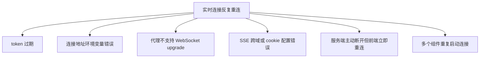

### 排查步骤

| 步骤 | 检查 |
| --- | --- |
| 1 | 连接 URL 是否是当前环境 |
| 2 | 请求是否带 token 或 cookie |
| 3 | 失败状态是 401、403、404、502 还是网络错误 |
| 4 | Nginx 或 Vite proxy 是否支持 WebSocket |
| 5 | 是否多个组件重复调用 `connect()` |
| 6 | 失败后是否没有退避，立即重连 |

### 修复方案

鉴权失败不要无限重连：

```ts
function handleRealtimeError(error: RealtimeError) {
  connected.value = false

  if (error.status === 401 || error.status === 403) {
    disconnect()
    authStore.handleSessionExpired()
    return
  }

  scheduleReconnect()
}
```

重连要退避：

```ts
const reconnectDelays = [3000, 5000, 10000, 30000]
let reconnectAttempt = 0

function scheduleReconnect() {
  const delay = reconnectDelays[Math.min(reconnectAttempt, reconnectDelays.length - 1)]
  reconnectAttempt += 1

  reconnectTimer = window.setTimeout(() => {
    connect()
  }, delay)
}
```

连接成功后重置：

```ts
function handleConnected() {
  connected.value = true
  reconnectAttempt = 0
  refreshUnreadCount()
}
```

### 验证方式

- token 过期时只触发登录失效流程，不继续重连。
- 断网后恢复网络，会重连并刷新未读数。
- 同一个浏览器标签页只有一个实时连接。
- 切换账号后旧连接关闭，新连接使用新账号。

### 预防方式

- 实时连接放在后台 Layout 或全局初始化，不要每个页面都建连接。
- 连接状态要能在开发环境可视化，例如显示 connected/reconnecting。
- 后端返回明确关闭原因，前端按原因处理。

## 问题 5：点击通知进入 404 或 403

### 现象

- 点击站内信后跳到 404。
- 点击审批通知后提示无权限。
- 点击导出完成通知后进入错误任务详情。

### 根因

通知只是入口，真正的页面还依赖路由注册、业务记录状态和权限。

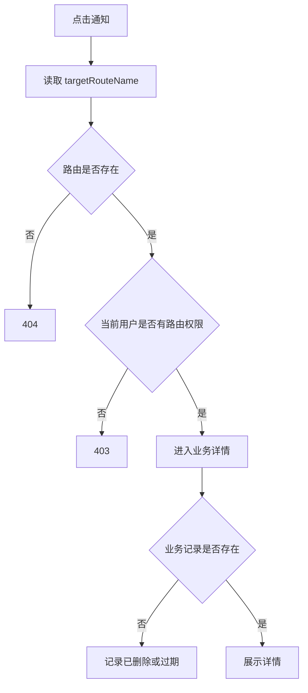

常见原因：

- 后端返回的 `targetRouteName` 和前端路由 name 不一致。
- 动态路由还没加载完成就执行跳转。
- 用户收到通知后权限被回收。
- 原业务记录已删除、归档或跨租户。
- 通知保存的是旧版本路由参数。

### 修复方案

跳转前做路由和权限校验：

```ts
function canNavigateToNotificationTarget(notification: NotificationDTO) {
  if (!notification.targetRouteName) {
    return { ok: false, reason: 'missing_target' }
  }

  if (!router.hasRoute(notification.targetRouteName)) {
    return { ok: false, reason: 'route_not_found' }
  }

  if (!permissionStore.canAccessRoute(notification.targetRouteName)) {
    return { ok: false, reason: 'forbidden' }
  }

  return { ok: true }
}
```

失败时给出可理解提示：

| reason | 提示 |
| --- | --- |
| `missing_target` | 这条消息没有配置跳转目标 |
| `route_not_found` | 当前版本暂不支持打开该消息目标 |
| `forbidden` | 你当前没有权限查看该业务记录 |
| `record_deleted` | 原业务记录已删除或归档 |
| `expired` | 该任务已过期，请到历史记录中查看 |

### 验证方式

- 通知目标路由存在时能正常跳转。
- 路由不存在时不进入空白页。
- 无权限时显示 403 友好提示。
- 业务记录删除后，消息详情页仍能解释原因。

### 预防方式

- 后端和前端约定稳定的 `targetRouteName`。
- 新增业务通知时同步补路由映射测试。
- 通知详情页要能独立展示消息内容，不完全依赖业务详情。

## 问题 6：全部已读后又恢复未读

### 现象

- 点击“全部已读”，铃铛变成 0。
- 几秒后又变回 12。
- 列表里有些消息仍然是未读。

### 常见根因

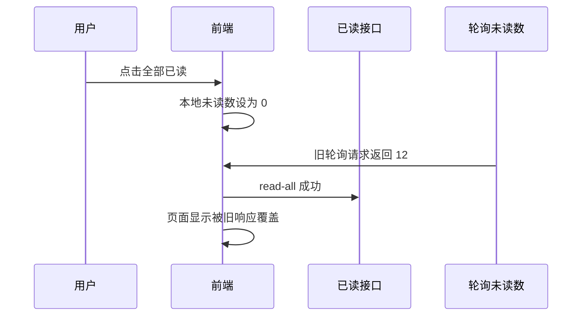

或者后端“全部已读”的范围和前端理解不一致：

- 前端以为全部消息。
- 后端只处理当前页。
- 后端只处理当前筛选条件。
- 后端排除了高优先级强提醒。

### 修复方案

已读动作不要在接口成功前改成最终状态：

```ts
async function markAllRead() {
  markingAllRead.value = true
  try {
    await markAllNotificationsRead()
    await Promise.all([
      fetchList(),
      refreshUnreadCount()
    ])
  } finally {
    markingAllRead.value = false
  }
}
```

轮询响应要防旧请求覆盖：

```ts
let unreadRequestSeq = 0

async function refreshUnreadCount() {
  const seq = ++unreadRequestSeq
  const result = await getUnreadCount()

  if (seq !== unreadRequestSeq) return
  unreadCount.value = result
}
```

### 验证方式

- 点击全部已读时禁用按钮，避免重复点击。
- 全部已读成功后重新拉列表和未读数。
- 慢网络下旧轮询响应不能覆盖新状态。
- 后端文档明确“全部已读”的范围。

### 预防方式

- 所有改变未读数的动作以服务端最终结果为准。
- 对轮询类接口增加请求序号或取消旧请求。
- UI 文案区分“全部已读”和“本页已读”。

## 问题 7：轮询定时器越来越多

### 现象

- 页面使用一段时间后，未读数接口每 30 秒请求多次。
- 切换路由后请求越来越频繁。
- 控制台看到多个 `setInterval` 没有清理。

### 根因

常见写法是在多个页面或组件里启动轮询：

```ts
onMounted(() => {
  setInterval(refreshUnreadCount, 30000)
})
```

但没有在组件卸载时清理，或者每次进入页面都会启动一个新定时器。

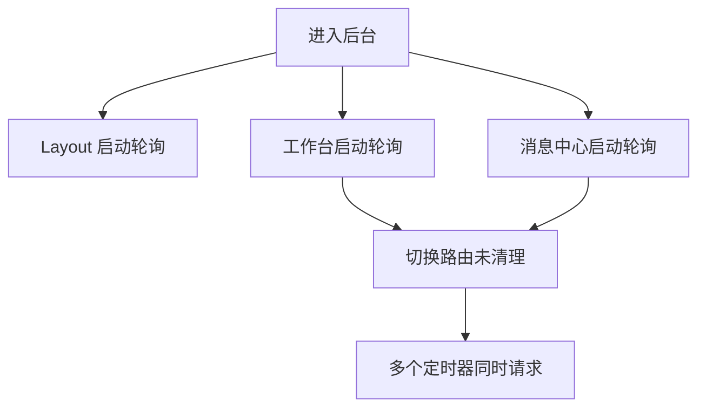

### 修复方案

轮询只在一个入口启动，通常是后台 Layout：

```ts
let pollingTimer: number | undefined

export function startNotificationPolling() {
  if (pollingTimer) return

  refreshUnreadCount()
  pollingTimer = window.setInterval(() => {
    refreshUnreadCount()
  }, 30000)
}

export function stopNotificationPolling() {
  if (!pollingTimer) return

  window.clearInterval(pollingTimer)
  pollingTimer = undefined
}
```

Layout 中使用：

```ts
onMounted(() => {
  startNotificationPolling()
})

onBeforeUnmount(() => {
  stopNotificationPolling()
})
```

退出登录时也要停止：

```ts
function logout() {
  stopNotificationPolling()
  resetNotificationContext()
}
```

### 验证方式

- 进入后台后，只有一个未读数轮询。
- 在工作台、消息中心、审批列表之间切换，轮询数量不增加。
- 退出登录后不再请求未读数接口。

### 预防方式

- 轮询、实时连接、全局键盘事件这类副作用必须有 start/stop。
- 页面组件不要各自启动全局轮询。
- 开发环境可打印轮询启动次数，超过 1 次直接警告。

## 问题 8：离线期间的新消息没有补回来

### 现象

- 用户断网 5 分钟。
- 期间产生了审批待办。
- 网络恢复后铃铛没有增加，必须刷新页面才看到。

### 根因

实时通道只负责“在线期间推送”，断线期间必须用接口补偿。

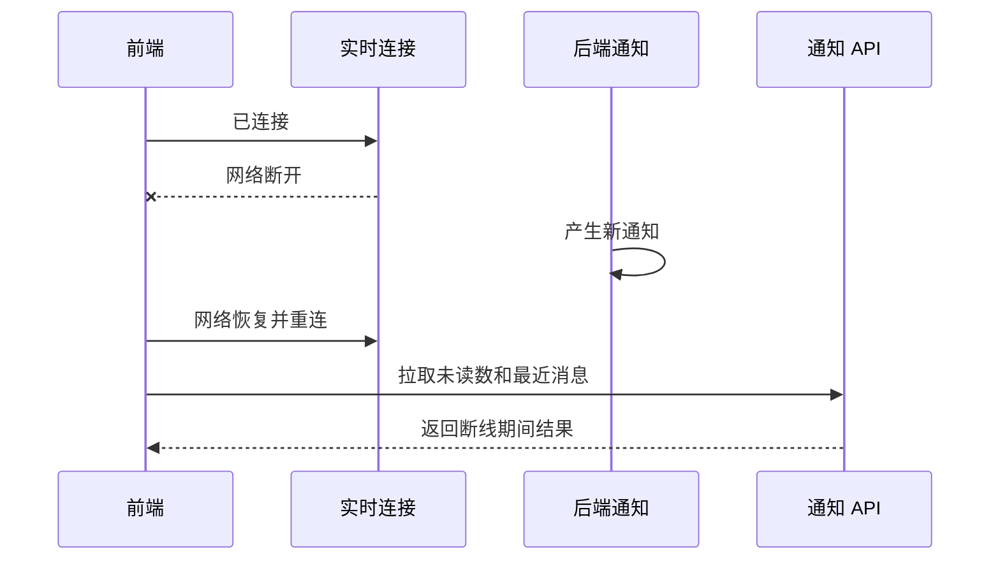

### 修复方案

重连成功后执行补偿拉取：

```ts
async function handleRealtimeConnected() {
  connected.value = true
  reconnectAttempt = 0

  await Promise.all([
    refreshUnreadCount(),
    refreshRecentNotifications()
  ])
}
```

如果后端支持 `lastEventId`，重连时传给后端：

```ts
const url = lastEventId.value
  ? `/api/notifications/events?lastEventId=${lastEventId.value}`
  : '/api/notifications/events'
```

但即使支持 `lastEventId`，仍建议刷新未读数，因为事件补偿可能有上限。

### 验证方式

1. 打开后台，建立实时连接。
2. 断网或停止后端实时服务。
3. 后端创建一条新通知。
4. 恢复连接。
5. 铃铛和最近消息能自动更新。

### 预防方式

- 实时连接只作为增量提醒，不作为唯一数据来源。
- 重连后必须刷新服务端当前状态。
- 页面重新可见时刷新未读数。

## 问题 9：工作台、铃铛和审批待办数量不一致

### 现象

- 工作台显示 8 个待办。
- 铃铛显示 10 条未读。
- 审批待办列表显示 6 条。

### 根因

这三个数字本来可能不是同一个口径，但页面没有说明。

| 入口 | 可能口径 |
| --- | --- |
| 工作台待办 | 只统计需要处理的审批任务 |
| 铃铛未读 | 统计所有未读通知 |
| 审批待办列表 | 只统计当前筛选条件下的审批任务 |

### 修复方案

给每个数字明确命名：

- 工作台：`待处理审批`
- 铃铛：`未读消息`
- 审批列表：`当前筛选结果`

不要把所有数字都叫“待办”。

如果确实要求一致，后端应该提供同一个聚合接口：

```ts
export interface WorkbenchTodoSummaryDTO {
  approvalTodoCount: number
  unreadNotificationCount: number
  urgentNotificationCount: number
}
```

### 验证方式

- 三个入口的文案能说明数字含义。
- 点击工作台待办进入审批待办列表时，筛选条件一致。
- 点击铃铛进入消息中心时，筛选为未读消息。

### 预防方式

- 指标命名要和业务口径一致。
- 不同口径不要用同一个字段名。
- README 或接口文档记录每个数字的统计范围。

## 问题 10：通知太多，用户忽略重要消息

### 现象

- 用户长期有几十条未读。
- 所有系统公告都弹窗。
- 真正需要处理的审批待办被淹没。

### 根因

通知系统没有分级、偏好和频控。

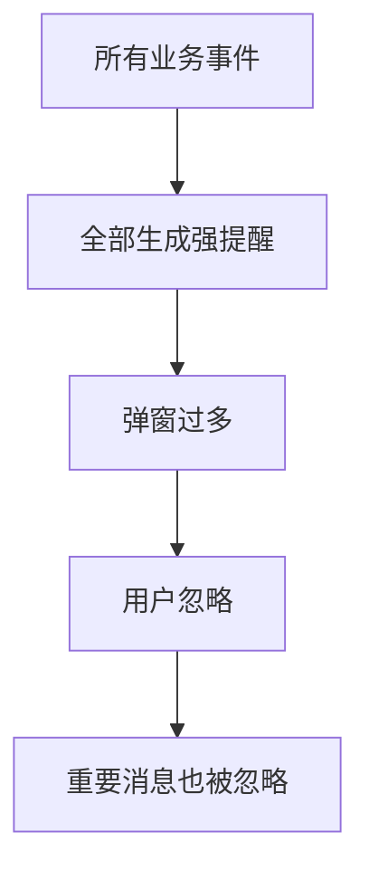

### 修复方案

按优先级处理：

| 优先级 | 示例 | 前端表现 |
| --- | --- | --- |
| urgent | 安全风险、付款异常 | 强提醒、不可关闭偏好 |
| high | 审批待办、任务失败 | 弹窗 + 站内信 |
| normal | 审批结果、导出完成 | 站内信，可轻提示 |
| low | 系统公告、周报 | 只进入消息中心 |

偏好设置要区分：

- 是否进入站内信。
- 是否弹窗。
- 是否发邮件。
- 是否进入免打扰。

### 验证方式

- 系统公告不再频繁弹窗。
- 审批待办仍能及时提醒。
- 安全告警不能被普通用户关闭。
- 用户偏好保存失败时不假装成功。

### 预防方式

- 新增通知类型时必须定义优先级和默认提醒方式。
- 通知模板评审时检查是否真的需要强提醒。
- 工作台只展示高价值提醒。

## 常用排障 SQL 思路

如果你能查数据库，可以按这个方向向后端同学要证据。字段名按项目实际情况调整：

```sql
-- 当前用户未读通知数量
select count(*)
from notification_receiver
where receiver_id = :userId
  and read_status = 'unread'
  and deleted = false;

-- 某条业务事件是否重复生成通知
select dedupe_key, count(*)
from notification
where source_module = :sourceModule
  and source_biz_id = :sourceBizId
group by dedupe_key
having count(*) > 1;

-- 当前用户最近通知
select n.id, n.type, n.title, r.read_status, r.read_at, n.created_at
from notification n
join notification_receiver r on r.notification_id = n.id
where r.receiver_id = :userId
order by n.created_at desc
limit 20;
```

前端不一定直接写 SQL，但要知道应该向后端要哪类证据。

## 回归测试清单

| 场景 | 验证点 |
| --- | --- |
| 单条已读 | 列表行、铃铛、工作台同步刷新 |
| 批量已读 | 选中项已读，未选中项不受影响 |
| 全部已读 | 按约定范围全部已读，旧轮询不覆盖 |
| 重复事件 | 同一个 eventId 只处理一次 |
| 断线重连 | 重连后刷新未读数和最近消息 |
| 退出登录 | 停止轮询、断开实时连接、清空通知状态 |
| 切换账号 | 不显示上一个账号的未读数和最近消息 |
| 多标签页 | 一个标签页已读后，另一个标签页能刷新 |
| 无权限跳转 | 显示明确 403 提示，不进入空白页 |
| 业务记录删除 | 消息详情能说明记录不存在或已归档 |

## 线上排障记录模板

```md
# 消息通知问题排障记录

## 问题现象

## 影响范围

- 账号：
- 角色：
- 租户：
- 页面：
- 通知类型：

## 复现步骤

## 前端证据

- 未读数接口：
- 列表接口：
- 已读接口：
- 实时事件：
- 控制台错误：

## 后端证据

- traceId：
- notificationId：
- eventId：
- dedupeKey：
- 接收人计算：

## 根因

## 修复方案

## 回归验证

## 预防措施
```

## 和其他文档怎么配合

| 你要做什么 | 继续看 |
| --- | --- |
| 设计消息通知闭环 | [Vue Admin 消息通知、站内信、实时提醒与已读闭环实战](/vue/admin-notification-center) |
| 处理请求错误和登录态 | [Vue Admin 请求封装与错误处理闭环手册](/vue/admin-request-error-handling) |
| 排查 401、403、数据范围 | [Vue Admin 请求、权限与数据问题排查专题](/projects/issues-vue-admin-request) |
| 理解审批待办来源 | [Vue Admin 审批流、状态机、待办与审计闭环实战](/vue/admin-approval-workflow) |
| 理解工作台数量口径 | [Vue Admin 工作台、统计卡片、图表看板与数据刷新闭环实战](/vue/admin-dashboard-analytics) |
| 做完整消息通知项目 | [消息通知项目案例](/projects/notification-center-case) |
| 不知道从哪层排查 | [项目排障方法论](/projects/debugging-playbook) |

## 下一步学习

如果你还没有实现通知中心，先回到 [Vue Admin 消息通知、站内信、实时提醒与已读闭环实战](/vue/admin-notification-center)，按业务事件、通知记录、未读数、实时提醒、已读未读和通知偏好建立基础闭环。

如果你已经能稳定处理通知问题，继续补 [Vue Admin 专项练习](/roadmap/vue-admin-practice)，把“消息铃铛未读数不一致”“重复通知”“切换账号状态污染”“实时连接重连补偿”写成可复现、可验收的练习任务。
