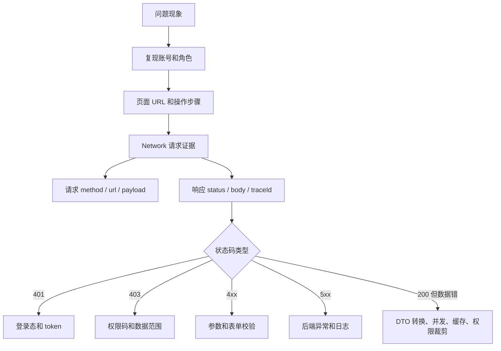
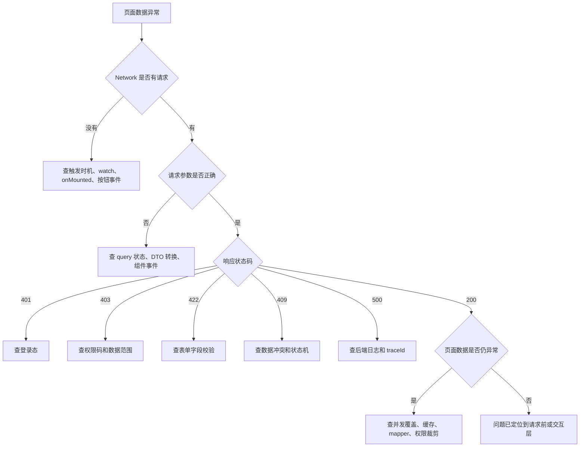
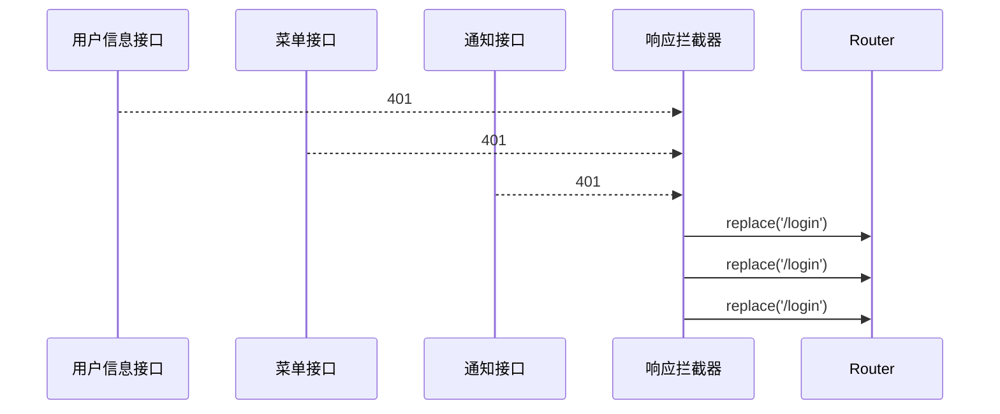
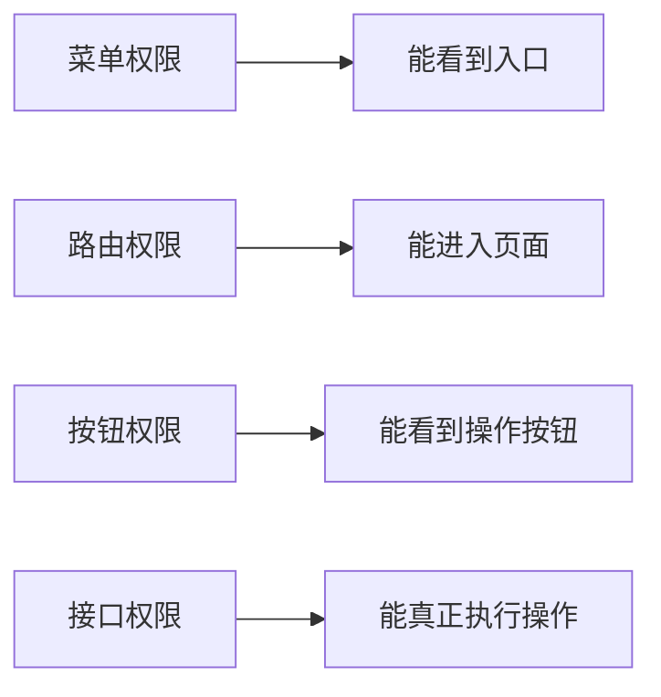
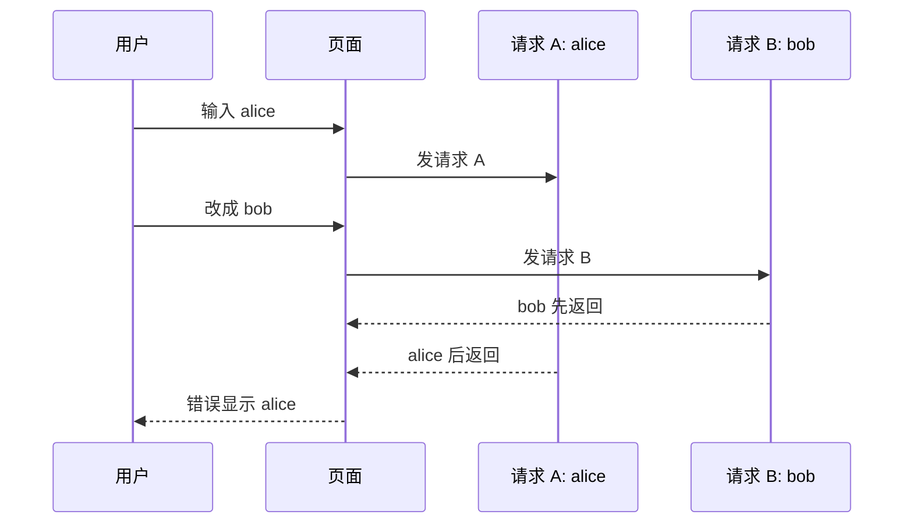
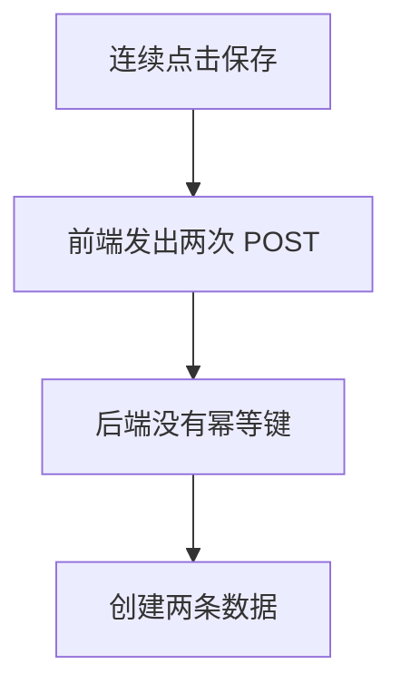
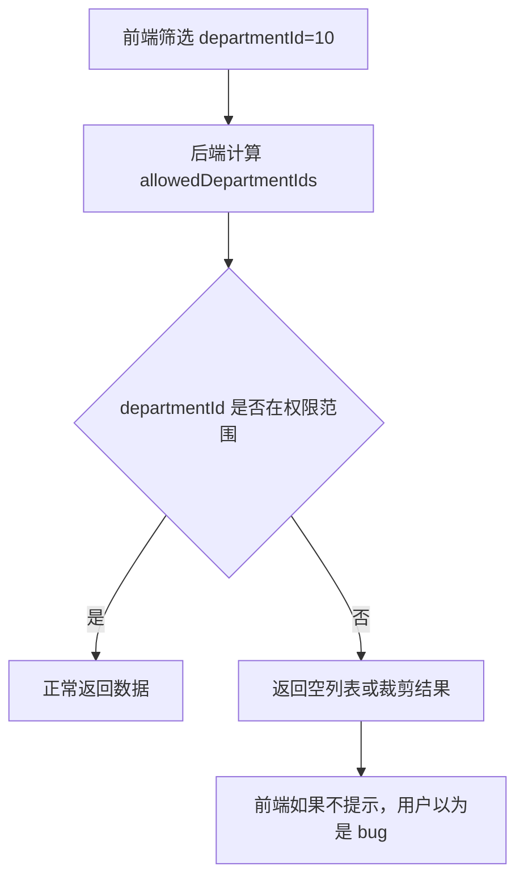
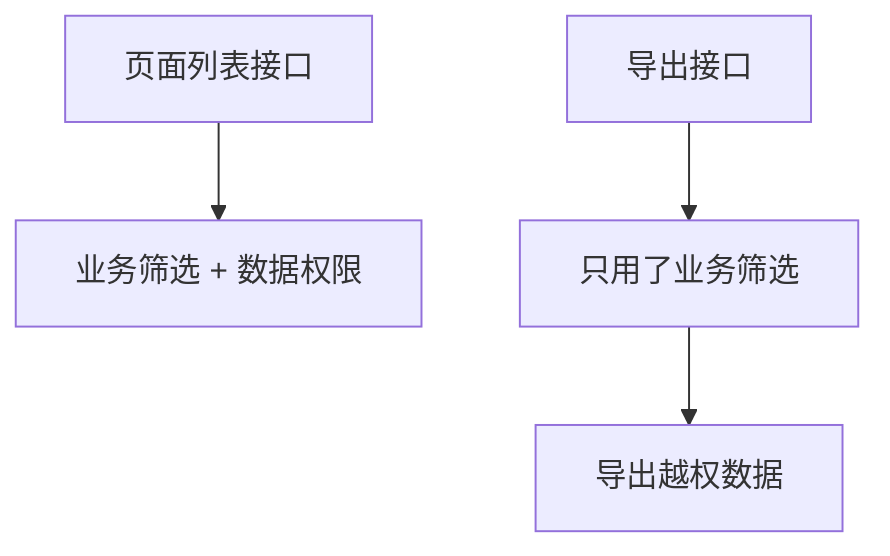

# Vue Admin 请求、权限与数据问题排查专题

## 这个页面解决什么

这一页是 [Vue 真实项目问题库](/projects/issues-vue) 的 Vue Admin 请求专题，专门排查后台项目里最常见、最耗时间的问题：

- 登录过期后重复弹窗、重复跳登录。
- 明明有菜单，接口却返回 403。
- 列表搜索后旧数据覆盖新数据。
- 保存按钮连点产生重复数据。
- 页面列表和导出文件数据不一致。
- 用户说“看不到数据”，但不知道是筛选、权限还是后端查询问题。
- 后端返回 422，但前端只弹一句“请求失败”。
- 页面一直 loading，用户不知道还能不能操作。

它和 [Vue Admin 请求封装与错误处理闭环手册](/vue/admin-request-error-handling) 的关系是：

- [Vue Admin Mock 到真实接口联调实战](/vue/admin-mock-to-api) 讲“切真实接口前后要怎么组织证据和边界”。
- 请求闭环手册讲“应该怎么设计”。
- 本页讲“出问题时怎么定位、怎么修、怎么预防”。

## 适合谁看

- 正在做 Vue 3 + TypeScript 后台管理系统的人。
- 正在联调登录、权限、列表、导出、数据权限的人。
- 想把真实问题沉淀成问题库、排障 SOP 和上线检查清单的人。
- 遇到 401、403、重复请求、数据范围裁剪、导出错位、表单错误映射的人。

## 先收集证据

请求类问题不要先猜。先把证据补齐，再判断是哪一层的问题。



最小证据清单：

| 证据 | 看什么 | 为什么 |
| --- | --- | --- |
| 账号 | 用户、角色、部门、数据范围 | 权限问题必须有身份上下文 |
| URL | 当前页面和路由参数 | 判断是否路由或页面复用问题 |
| Request URL | 请求路径和 query | 判断参数是否发对 |
| Request Payload | body、FormData、导出条件 | 判断前端传参是否符合约定 |
| Request Headers | Authorization、tenant、trace id | 判断认证、租户和日志关联 |
| Response Status | 200、400、401、403、409、422、500 | 判断错误分类 |
| Response Body | code、message、data、traceId | 判断业务错误和后端日志 |
| UI 状态 | loading、empty、error、disabled | 判断页面状态是否被卡住 |

## 总体排查路径

先判断问题属于“请求没发对”“后端没按预期返回”“前端处理错了”还是“权限/数据范围本来就限制了”。



## 问题 1：登录过期后重复弹窗、重复跳登录

### 现象

- 页面静置一段时间后 token 过期。
- 切回页面时多个接口同时返回 401。
- 页面连续弹出多次“登录已过期”。
- 路由重复跳转到 `/login`，有时还保留旧菜单或旧标签页。

### 影响范围

所有后台项目都会遇到，尤其是首页同时请求用户信息、权限、菜单、字典、通知数量时。

### 根因

多个并发请求都进入响应拦截器，每个拦截器都执行：

- 清 token。
- 清用户信息。
- 跳登录页。
- 弹提示。



### 解决方案

加一次性处理锁。

```ts
let handlingUnauthorized: Promise<void> | null = null

export function handleUnauthorizedOnce() {
  if (handlingUnauthorized) return handlingUnauthorized

  handlingUnauthorized = handleUnauthorized().finally(() => {
    handlingUnauthorized = null
  })

  return handlingUnauthorized
}
```

登出要清理完整上下文：

```ts
async function handleUnauthorized() {
  authStore.reset()
  permissionStore.reset()
  tabsStore.reset()
  removeDynamicRoutes(router)

  await router.replace({
    path: '/login',
    query: { redirect: router.currentRoute.value.fullPath }
  })
}
```

### 预防方式

- 401 只代表未登录或登录失效。
- 并发 401 只跳转一次。
- 清理 token 时同步清菜单、权限码、动态路由、标签页、KeepAlive。
- 写一个“token 过期后多个请求同时失败”的测试或手工检查项。

## 问题 2：有菜单但接口返回 403

### 现象

- 用户能看到菜单。
- 页面也能进入。
- 点击“删除”“导出”“授权”时接口返回 403。

### 根因

菜单权限、按钮权限、接口权限不是同一个东西。



常见错误：

- 只给了菜单权限，没有给按钮权限。
- 前端按钮判断用了 `system:user:delete`，后端接口校验 `api:user:delete`。
- 页面里写死管理员角色，后端按权限码判断。
- 权限缓存没刷新。

### 排查顺序

| 步骤 | 检查 |
| --- | --- |
| 1 | 当前用户有哪些角色 |
| 2 | 权限接口返回了哪些 permissionCodes |
| 3 | 菜单 meta.permission 是什么 |
| 4 | 按钮组件判断的 permission 是什么 |
| 5 | 后端接口实际校验的 permission 是什么 |
| 6 | 权限变更后版本号是否刷新 |

### 解决方案

建立按钮和接口映射表：

```ts
export const USER_PERMISSION_MAP = {
  list: {
    button: 'system:user:list',
    api: 'api:system:user:list'
  },
  delete: {
    button: 'system:user:delete',
    api: 'api:system:user:delete'
  }
} as const
```

前端没有按钮权限时隐藏或禁用，后端没有接口权限时返回 403。

### 预防方式

- 菜单、按钮、接口权限统一进入权限树。
- 高风险接口必须有后端校验。
- 直接请求无权限接口应该返回 403。
- 权限变更要刷新权限版本。

## 问题 3：403 被误处理成 401

### 现象

- 用户已登录。
- 点击无权限按钮后被踢回登录页。
- 用户重新登录后仍然没有权限。

### 根因

前端把所有失败都当作登录失效处理，或者后端无权限时返回了 401。

### 正确边界

| 状态 | 含义 | 前端动作 |
| --- | --- | --- |
| 401 | 未登录或登录过期 | 清上下文，跳登录 |
| 403 | 已登录但无权限 | 展示无权限，不跳登录 |

### 解决方案

```ts
if (status === 401) {
  await handleUnauthorizedOnce()
  throw new AppError(message, 'unauthorized', status)
}

if (status === 403) {
  throw new AppError(message, 'forbidden', status)
}
```

页面级 403：

```vue
<ForbiddenState v-if="error?.type === 'forbidden'" />
```

操作级 403：

```ts
if (isAppError(error) && error.type === 'forbidden') {
  showWarning('你没有执行该操作的权限')
  return
}
```

### 预防方式

- 后端明确 401/403 语义。
- 前端响应拦截器不要把 403 跳登录。
- 权限按钮只是体验，接口 403 才是安全兜底。

## 问题 4：快速搜索后旧数据覆盖新数据

### 现象

- 输入 `alice` 搜索后很快改成 `bob`。
- 页面先显示 `bob`，又被 `alice` 的旧结果覆盖。
- Network 里两个请求都成功。

### 根因

请求返回顺序和发起顺序不一致。慢请求后返回，覆盖了新请求状态。



### 解决方案一：请求序号

```ts
let requestSeq = 0

async function load() {
  const seq = ++requestSeq
  const querySnapshot = { ...query }
  const result = await api.getList(querySnapshot)

  if (seq !== requestSeq) return

  items.value = result.items
  total.value = result.total
}
```

### 解决方案二：AbortController

MDN 文档说明 `AbortController` 可用于中止一个或多个 Web 请求。用它取消旧请求，可以减少无效响应。

```ts
let controller: AbortController | undefined

async function load() {
  controller?.abort()
  controller = new AbortController()

  try {
    const result = await api.getList({ ...query }, { signal: controller.signal })
    items.value = result.items
  } finally {
    controller = undefined
  }
}
```

### 预防方式

- 列表查询都使用 query 快照。
- 搜索、筛选、分页变化后旧请求不能覆盖新状态。
- 被取消的请求不进入错误态。

## 问题 5：打开页面请求发了两次

### 现象

- 进入列表页，Network 中同一个接口请求两次。
- 页面 loading 闪烁。
- 后端日志里重复查询。

### 常见原因

| 原因 | 例子 |
| --- | --- |
| `onMounted` 请求一次，`watch` immediate 又请求一次 | `onMounted(load)` + `watch(query, load, { immediate: true })` |
| 父组件和子组件都请求列表 | Page 请求，Table 也请求 |
| KeepAlive 激活时重复请求 | `onMounted` 和 `onActivated` 都无条件请求 |
| 搜索表单初始化触发 change | 默认值设置时触发请求 |

### 解决方案

确定唯一加载入口。

```ts
watch(
  () => [query.page, query.pageSize, query.keyword, query.status],
  () => {
    load()
  },
  { immediate: true }
)
```

或者：

```ts
onMounted(() => {
  load()
})

function search() {
  query.page = 1
  load()
}
```

两种选一种，不要都用。

### 预防方式

- 页面 README 写清楚“列表由谁加载”。
- 子组件只 emit 事件，不直接请求后端。
- KeepAlive 页面区分首次加载和重新激活。

## 问题 6：重复点击保存产生重复数据

### 现象

- 用户连续点两次保存。
- 后端创建两条记录。
- 页面刷新后看到重复数据。

### 根因

前端没有 `submitting` 防重，后端没有幂等或唯一约束。



### 解决方案

前端：

```ts
const submitting = ref(false)

async function submit() {
  if (submitting.value) return

  submitting.value = true
  try {
    await service.save(form.value)
  } finally {
    submitting.value = false
  }
}
```

后端：

- 唯一索引：用户名、手机号、业务单号。
- 幂等键：`Idempotency-Key`。
- 状态机：已提交不能再次提交。

### 预防方式

- 保存、删除、导出、审批都要独立 loading。
- 高风险操作后端必须幂等。
- 前端按钮禁用不是安全保证，只是体验优化。

## 问题 7：列表数据被数据权限裁剪，用户以为是 bug

### 现象

- 用户选择一个部门后列表为空。
- 管理员账号能看到数据，普通账号看不到。
- 用户认为“搜索坏了”。

### 根因

后端根据当前用户的数据范围裁剪了查询结果，但前端没有说明。



### 解决方案

接口返回 `scopeSummary`：

```ts
interface ScopeSummary {
  scopeType: string
  appliedDepartmentNames: string[]
  clippedByPermission: boolean
}
```

页面提示：

```vue
<DataScopeAlert
  v-if="pageResult.scopeSummary?.clippedByPermission"
  :departments="pageResult.scopeSummary.appliedDepartmentNames"
/>
```

### 排查顺序

1. 当前账号所属部门是什么。
2. 角色 `dataScope` 是什么。
3. 前端选择了哪个部门筛选。
4. 后端计算出的 `allowedDepartmentIds` 是什么。
5. 业务数据的 `department_id` 是什么。

### 预防方式

- 列表页展示当前数据范围提示。
- 数据权限裁剪返回 `scopeSummary`。
- 排障时保留用户、角色、部门、业务数据 ID。

## 问题 8：导出文件比页面列表多

### 现象

- 页面筛选后只有 30 条。
- 导出文件有 200 条。
- 导出包含了用户无权查看的数据。

### 根因

导出接口没有复用列表查询条件和数据权限过滤。



### 解决方案

导出必须使用同一份查询模型：

```ts
export interface OrderQuery {
  keyword?: string
  status?: string
  departmentId?: number
  dateRange?: [string, string]
}
```

后端导出：

- 读取当前用户。
- 计算数据范围。
- 应用同列表一致的业务筛选。
- 保存 query snapshot。
- 记录导出审计。

### 预防方式

- 导出和列表复用同一套查询服务。
- 导出任务记录筛选条件、用户、行数、字段范围。
- 敏感导出做水印、审批或二次鉴权。

## 问题 9：后端返回 422，前端只提示请求失败

### 现象

- 表单保存失败。
- 后端返回字段校验错误。
- 前端只弹“请求失败”，用户不知道改哪个字段。

### 根因

请求层把所有错误都转成普通 Error，丢掉了字段错误详情。

### 解决方案

保留 `validation` 类型：

```ts
if (status === 422) {
  throw new AppError(message, 'validation', status, code, traceId, data)
}
```

字段映射：

```ts
function applyValidationErrors(error: AppError) {
  if (error.type !== 'validation') return false

  const details = error.detail as { field: string; message: string }[]

  for (const item of details) {
    formErrors[item.field] = item.message
  }

  return true
}
```

### 预防方式

- 422 表示字段级校验失败。
- 字段错误显示在字段旁边。
- toast 只作为补充，不替代表单错误提示。

## 问题 10：页面一直 loading

### 现象

- 接口失败或取消后页面一直转圈。
- 用户不知道能不能重试。
- 控制台可能有错误，但页面无反馈。

### 根因

常见写法：

```ts
loading.value = true
const result = await api.getList()
items.value = result.items
loading.value = false
```

如果请求中间 throw，`loading.value = false` 不会执行。

### 解决方案

所有请求状态在 `finally` 关闭。

```ts
loading.value = true
error.value = undefined

try {
  const result = await api.getList()
  items.value = result.items
} catch (value) {
  error.value = normalizeError(value)
} finally {
  loading.value = false
}
```

### 预防方式

- 页面级 loading、按钮 submitting、导出 exporting 分开。
- catch 不能空处理。
- error 状态要有重试入口。

## 问题 11：环境变量错导致请求打到旧环境

### 现象

- 本地看起来正常，测试环境请求到旧 API。
- 登录接口访问了错误域名。
- 切环境后页面仍然请求旧地址。

### 根因

- `.env` 文件命名错误。
- 构建时环境变量没有生效。
- 代码里写死了 API 地址。
- 旧部署产物被缓存。

### 排查顺序

| 步骤 | 检查 |
| --- | --- |
| 1 | 构建命令使用了哪个 mode |
| 2 | `VITE_API_BASE_URL` 是否出现在构建日志 |
| 3 | 浏览器 Network 实际请求域名 |
| 4 | 产物是否被 CDN 或浏览器缓存 |
| 5 | Nginx 是否代理到旧后端 |

### 解决方案

- API 地址只来自环境变量。
- 构建日志打印当前环境和 API 地址。
- 发布后验证登录、列表、导出接口域名。
- 清理旧缓存或产物。

## 问题 12：trace id 没有贯穿前后端

### 现象

- 前端报错了，但后端找不到对应日志。
- 后端说接口没有收到，前端说已经请求。
- 排查只能靠时间点猜。

### 解决方案

每个请求加 `X-Trace-Id`：

```ts
request.interceptors.request.use((config) => {
  config.headers.set('X-Trace-Id', createTraceId())
  return config
})
```

错误提示保留 trace id：

```vue
<ErrorState :message="error.message" :trace-id="error.traceId" />
```

### 预防方式

- 联调模板必须包含 trace id。
- 后端日志记录 trace id。
- 错误页展示 trace id。

## 上线前检查清单

| 检查项 | 必须确认 |
| --- | --- |
| 401 | token 过期后只跳登录一次 |
| 403 | 已登录无权限不跳登录 |
| 动态权限 | 权限变更后菜单、按钮、接口一致 |
| 并发请求 | 快速搜索不会旧数据覆盖新数据 |
| 重复提交 | 保存、删除、审批、导出按钮都有独立状态 |
| 数据范围 | 列表显示当前可见范围或裁剪提示 |
| 导出 | 导出和列表数据范围一致 |
| 表单校验 | 422 字段错误能定位到具体字段 |
| 页面状态 | loading、empty、error、refreshing 分清 |
| trace id | 前端错误和后端日志能关联 |
| 环境变量 | 构建产物请求正确 API 地址 |

## 如何写入团队问题库

每次真实修复后，补一条记录：

```text
问题标题：
影响范围：
复现步骤：
请求证据：
根因：
修复方案：
预防措施：
相关提交：
```

不要只写“修复接口问题”。好的问题库条目应该让下一个人能快速判断：

- 是否是同类问题。
- 应该先看哪个证据。
- 改哪一层最合适。
- 如何防止再次发生。

## 和其他文档怎么配合

| 你要做什么 | 继续看 |
| --- | --- |
| 从 mock 切到真实接口 | [Vue Admin Mock 到真实接口联调实战](/vue/admin-mock-to-api) |
| 设计请求封装 | [Vue Admin 请求封装与错误处理闭环手册](/vue/admin-request-error-handling) |
| 查 Vue 项目常见问题 | [Vue 真实项目问题库](/projects/issues-vue) |
| 学通用排障方法 | [项目排障方法论](/projects/debugging-playbook) |
| 查联调问题 | [前后端联调排查](/projects/integration-debugging) |
| 做导入导出项目 | [数据导入导出项目案例](/projects/import-export-case) |
| 做组织数据权限 | [Vue Admin 组织架构与数据权限实现手册](/vue/admin-organization-data-permission) |

## 官方参考

- [Axios Interceptors](https://axios-http.com/docs/interceptors)
- [MDN AbortController](https://developer.mozilla.org/en-US/docs/Web/API/AbortController)
- [Vue Router 导航守卫](https://router.vuejs.org/guide/advanced/navigation-guards.html)
- [Pinia Actions](https://pinia.vuejs.org/core-concepts/actions.html)

## 下一步学习

如果你正在开发 Vue Admin，可以按这个顺序继续补：

1. 把本页的 12 个问题做成项目 README 的“排障索引”。
2. 在交付检查清单中加入 401、403、导出、数据范围和 trace id 检查。
3. 继续看 [项目交付检查清单](/projects/delivery-checklist)，把问题预防前移到上线前。
