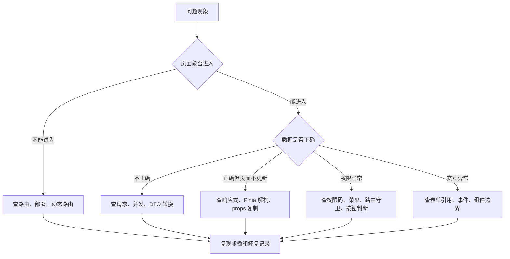
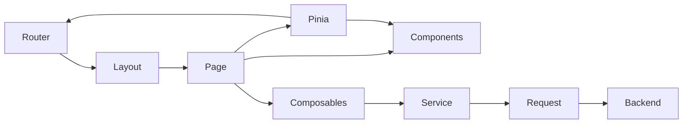
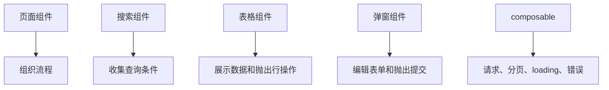

# Vue 真实项目问题库

## 这个页面解决什么

这一页专门收集 Vue 3 项目里最常见、最容易在真实业务中复现的问题。它和 [Vue 常见问题](/vue/troubleshooting) 的区别是：这里不只解释单个 API，而是按项目链路排查问题。

适合排查这些场景：

- 登录成功后刷新丢菜单。
- 动态路由注册了但页面仍然 404。
- Pinia 状态明明改了，页面却不更新。
- 弹窗编辑污染了列表。
- `watch`、`onMounted` 导致重复请求。
- KeepAlive 页面缓存导致数据不刷新。
- 权限按钮显示错位。
- Vue Admin 消息铃铛、未读数和实时提醒不一致。
- 列表切换条件后显示旧数据。
- 组件拆分后 props 和 emits 变乱。
- 构建时才发现 Vue 类型错误。

每个问题都按“现象、影响范围、根因、解决方案、预防方式”组织，方便你在项目里直接对照排查。

如果问题已经明确属于 Vue Admin 的通知中心，例如未读数不准、重复提醒、SSE/WebSocket 重连、切换账号后旧消息残留，直接进入 [Vue Admin 消息通知、未读数与实时提醒问题排查专题](/projects/issues-vue-admin-notification)。

## 排查总流程

遇到 Vue 页面异常时，不要先猜是 Vue 的问题。真实项目里更常见的是路由、状态、请求、类型、权限和缓存边界没理清。



## Vue 项目链路总图



判断问题位置时，可以先问：

- URL 和路由是否正确。
- 页面组件是否被复用或缓存。
- 数据是否从 service 正确返回。
- 状态是否还保持响应式。
- 权限是否从同一份数据计算。
- 子组件是否越界修改父组件数据。

## 问题 1：刷新后动态菜单丢失

### 现象

- 登录后菜单正常。
- 刷新页面后菜单为空。
- 直接访问 `/system/users` 可能进入空白页或 404。
- 控制台没有明显报错。

### 影响范围

影响所有依赖动态菜单和动态路由的后台项目，尤其是菜单由后端返回、路由在前端运行时注册的项目。

### 根因

Pinia 默认是内存状态，刷新浏览器后会重新创建应用实例。登录后生成的菜单和动态路由如果只存在内存里，刷新后就丢了。

常见错误做法：

```ts
router.beforeEach((to) => {
  if (!permissionStore.menus.length) {
    return '/login'
  }
})
```

这段逻辑把“菜单为空”当成“未登录”，但用户可能只是刷新了页面。

### 解决方案

只持久化 token，刷新后重新恢复用户上下文：

```ts
router.beforeEach(async (to) => {
  const authStore = useAuthStore()
  const permissionStore = usePermissionStore()

  if (!to.meta.requiresAuth) return true

  if (!authStore.token) {
    return {
      path: '/login',
      query: { redirect: to.fullPath }
    }
  }

  if (!permissionStore.ready) {
    await permissionStore.loadUserPermissions()
    addDynamicRoutes(permissionStore.routes)

    return to.fullPath
  }

  return true
})
```

`return to.fullPath` 的意义是：动态路由注册完成后，让 Vue Router 重新匹配当前地址。

### 预防方式

- 应用启动时不要假设 Pinia 已有菜单。
- 路由守卫必须能恢复用户信息、权限和动态路由。
- token、用户信息、权限、菜单的恢复顺序写进 README。
- 给“刷新深层页面”写上线前检查项。

## 问题 2：动态路由注册了但仍然 404

### 现象

- 后端返回了菜单。
- 前端也执行了 `router.addRoute()`。
- 但是访问动态页面仍然进入 404。

### 影响范围

动态菜单、角色权限、租户菜单、插件式后台都容易遇到。

### 根因

通常有 4 类：

1. 动态路由注册太晚，当前导航已经完成。
2. 注册的父路由名称不对。
3. 动态路由 path 和菜单 path 不一致。
4. 404 捕获路由放得太早，提前匹配了所有路径。

### 解决方案

动态路由注册完成后重新进入目标路由：

```ts
if (!permissionStore.ready) {
  const routes = await permissionStore.loadRoutes()

  routes.forEach((route) => {
    router.addRoute('Root', route)
  })

  return to.fullPath
}
```

404 路由放在静态路由末尾，但要确保动态路由有机会注册：

```ts
export const fallbackRoutes = [
  {
    path: '/:pathMatch(.*)*',
    name: 'NotFound',
    component: () => import('@/shared/pages/NotFoundPage.vue')
  }
]
```

如果项目使用后端菜单生成路由，建议把菜单和路由转换写成纯函数：

```ts
export function mapMenuToRoute(menu: MenuDTO): RouteRecordRaw {
  return {
    path: menu.path,
    name: menu.routeName,
    component: pageModules[menu.component],
    meta: {
      title: menu.title,
      permission: menu.permission
    }
  }
}
```

### 预防方式

- 菜单 path 和路由 path 使用同一份后端字段或统一转换。
- 动态路由注册后必须重新匹配当前路由。
- 404 路由不要先于动态路由吞掉路径。
- 给菜单转路由函数补测试。

## 问题 3：Pinia 解构后页面不更新

### 现象

- Store 里状态已经变化。
- Vue DevTools 能看到 Store 值更新。
- 页面模板却仍然显示旧值。

### 影响范围

登录态、用户信息、主题、权限、字典、全局配置都可能出现。

### 根因

直接从 store 解构普通属性，会丢失响应式引用。

错误示例：

```ts
const userStore = useUserStore()
const { profile, permissions } = userStore
```

`profile` 和 `permissions` 只是当前值，不再跟随 store 更新。

### 解决方案

使用 `storeToRefs`：

```ts
import { storeToRefs } from 'pinia'

const userStore = useUserStore()
const { profile, permissions } = storeToRefs(userStore)
```

方法可以直接解构：

```ts
const { fetchProfile, logout } = userStore
```

### 预防方式

- Store 状态用 `storeToRefs`。
- Store action 可以直接解构。
- 在团队规范里写清 Pinia 解构规则。
- Code review 时重点看 `const { xxx } = store`。

## 问题 4：编辑弹窗污染列表数据

### 现象

- 点击编辑打开弹窗。
- 在弹窗中修改用户名。
- 还没有点保存，列表里的用户名已经变了。
- 点击取消后列表仍然保持修改后的内容。

### 影响范围

列表编辑、详情抽屉、低代码表单、审批意见编辑、配置项编辑都常见。

### 根因

表单直接引用了表格行对象：

```ts
function openEditDialog(row: UserListItem) {
  form.value = row
  dialogVisible.value = true
}
```

对象是引用类型，表单修改的就是列表行本身。

### 解决方案

打开弹窗时复制对象：

```ts
function createEditForm(row: UserListItem): UserFormState {
  return {
    id: row.id,
    name: row.name,
    mobile: row.mobileText === '-' ? '' : row.mobileText,
    roleIds: [...row.roleIds],
    enabled: row.enabled
  }
}

function openEditDialog(row: UserListItem) {
  form.value = createEditForm(row)
  dialogVisible.value = true
}
```

提交成功后重新加载列表：

```ts
async function submitForm() {
  const payload = toSaveUserPayload(form.value)

  await updateUser(payload.id!, payload)
  dialogVisible.value = false
  await loadUsers()
}
```

### 预防方式

- 表格行数据只用于展示。
- 表单状态单独创建。
- 提交参数通过转换函数生成。
- 编辑弹窗关闭时重置表单。

## 问题 5：watch 和 onMounted 导致重复请求

### 现象

- 进入列表页，请求发了两次。
- 搜索一次，接口也发了两次。
- 开发环境更明显，生产环境偶发。

### 影响范围

列表页、详情页、看板页、搜索页、字典加载都容易出现。

### 根因

常见写法是 `onMounted` 请求一次，同时 `watch` 又设置了 `immediate: true`。

```ts
onMounted(() => {
  loadUsers()
})

watch(
  () => query.keyword,
  () => {
    loadUsers()
  },
  { immediate: true }
)
```

两个入口都会触发请求。

### 解决方案

明确唯一数据入口。

方案一：只使用 `onMounted`，搜索按钮手动触发：

```ts
onMounted(loadUsers)

function search() {
  query.page = 1
  return loadUsers()
}
```

方案二：只使用 `watch` 的 `immediate`：

```ts
watch(
  () => [query.keyword, query.status, query.page],
  () => {
    loadUsers()
  },
  { immediate: true }
)
```

不要两个方案混用。

### 预防方式

- 每个页面写清“谁负责首次加载”。
- 搜索表单优先用按钮触发，减少自动请求。
- 自动搜索要配防抖和并发保护。
- 子组件不直接请求父组件已经请求的数据。

## 问题 6：快速搜索后显示旧结果

### 现象

- 输入 `a` 后发出请求 A。
- 很快输入 `admin` 后发出请求 B。
- B 先返回，页面显示 admin 结果。
- A 后返回，又把页面覆盖成 a 的结果。

### 影响范围

搜索、远程下拉、看板筛选、自动补全、级联选择器都常见。

### 根因

多个请求并发时，返回顺序不等于发起顺序。

### 解决方案

用请求序号保护：

```ts
let requestSeq = 0

async function loadUsers() {
  const currentSeq = ++requestSeq
  loading.value = true

  try {
    const result = await fetchUsers(query)

    if (currentSeq !== requestSeq) return

    rows.value = result.list.map(mapUserDTO)
    total.value = result.total
  } finally {
    if (currentSeq === requestSeq) {
      loading.value = false
    }
  }
}
```

也可以用 `AbortController` 取消旧请求，但要确保 request 封装支持 signal。

### 预防方式

- 自动搜索必须防抖。
- 并发请求必须有“只接受最后一次结果”的策略。
- loading 关闭也要判断是否仍是当前请求。
- 复杂页面把请求并发策略写进 composable。

## 问题 7：KeepAlive 缓存导致页面数据不刷新

### 现象

- 从列表页进入详情页再返回。
- 列表页保留了旧查询条件和旧数据。
- 期望刷新，但 `onMounted` 没有再次执行。

### 影响范围

后台列表页、标签页布局、详情返回列表、工作台页面都常见。

### 根因

`KeepAlive` 会缓存组件实例。组件重新激活时不会再次执行 `onMounted`，而是执行 `onActivated`。

### 解决方案

区分首次加载和再次激活：

```ts
import { onActivated, onMounted } from 'vue'

let initialized = false

onMounted(async () => {
  await loadUsers()
  initialized = true
})

onActivated(() => {
  if (!initialized) return

  if (route.query.refresh === '1') {
    loadUsers()
  }
})
```

如果从详情页回来一定要刷新，可以在路由 query 或状态中传递刷新标记。

### 预防方式

- 使用 KeepAlive 前写清哪些页面要缓存。
- 缓存页面用 `onActivated` 处理重新激活逻辑。
- 不要把所有页面都默认缓存。
- 对列表页保留查询条件和刷新数据要有明确规则。

## 问题 8：权限按钮显示错位

### 现象

- 用户没有新增权限，但新增按钮仍然显示。
- 用户有编辑权限，但编辑按钮不显示。
- 切换账号后按钮权限没有更新。

### 影响范围

后台管理、B 端系统、低代码平台、多租户系统都常见。

### 根因

常见根因：

- 权限码散落裸字符串，拼写不一致。
- 菜单权限、路由权限、按钮权限来自不同数据。
- 登出或切换账号时没有清空旧权限。
- 按钮组件内部缓存了旧权限判断。

### 解决方案

集中定义权限码：

```ts
export const USER_PERMISSIONS = {
  VIEW: 'user:view',
  CREATE: 'user:create',
  UPDATE: 'user:update',
  DELETE: 'user:delete'
} as const
```

统一从 permissionStore 判断：

```ts
const permissionStore = usePermissionStore()

const canCreate = computed(() => {
  return permissionStore.has(USER_PERMISSIONS.CREATE)
})
```

登出时清理权限：

```ts
function logout() {
  authStore.clearToken()
  userStore.reset()
  permissionStore.reset()
  router.replace('/login')
}
```

### 预防方式

- 权限码集中定义。
- 菜单、路由、按钮使用同一份权限数据。
- 切换账号、退出登录必须清空权限。
- 前端隐藏按钮只是体验，后端接口仍要鉴权。

## 问题 9：组件拆分后 props 和 emits 越来越乱

### 现象

- 子组件 props 十几个。
- emit 事件名字不统一。
- 子组件既改父组件状态，又自己发请求。
- 一个弹窗组件只能在一个页面用，换个页面就全是兼容逻辑。

### 影响范围

列表页、表单弹窗、搜索区、表格操作列、业务抽屉都常见。

### 根因

拆组件时只按视觉切块，没有按职责切块。

错误方向：

- 搜索组件既展示输入，又自己请求列表。
- 表格组件既展示数据，又修改全局 Store。
- 弹窗组件既编辑表单，又刷新列表。

### 解决方案

按职责划分组件边界：



事件命名使用业务动作：

```ts
const emit = defineEmits<{
  search: []
  reset: []
  edit: [row: UserListItem]
  delete: [row: UserListItem]
  submit: [form: UserFormState]
}>()
```

### 预防方式

- 页面组件负责流程。
- 子组件负责展示和局部输入。
- 请求和列表流程放 composable。
- 子组件不要直接改父级业务状态。
- props 超过 8 个时重新检查组件边界。

## 问题 10：v-if 和 v-for 写在同一个元素上导致逻辑混乱

### 现象

- 列表过滤条件变复杂。
- 页面偶尔出现空白。
- 某些行显示和权限判断不一致。
- 代码可读性很差。

### 影响范围

菜单渲染、权限按钮、表格操作、列表筛选都常见。

### 根因

把过滤逻辑写到模板里：

```vue
<button
  v-for="action in actions"
  v-if="permissionStore.has(action.permission)"
  :key="action.code"
>
  {{ action.label }}
</button>
```

模板里同时处理循环、过滤和权限判断，后续很难维护。

### 解决方案

先用 `computed` 得到可显示列表：

```ts
const visibleActions = computed(() => {
  return actions.filter((action) => {
    return permissionStore.has(action.permission)
  })
})
```

模板只负责渲染：

```vue
<button
  v-for="action in visibleActions"
  :key="action.code"
>
  {{ action.label }}
</button>
```

### 预防方式

- 模板只表达结构，不塞复杂判断。
- 过滤、排序、权限计算放 computed。
- `v-for` 必须使用稳定业务 key。
- 不要使用 index 作为可变列表 key。

## 问题 11：组件库样式突然变形

### 现象

- 按钮高度异常。
- 表格列被压扁。
- Switch 变成椭圆。
- 弹窗内部间距错乱。
- 升级组件库后问题更明显。

### 影响范围

使用 Element Plus、Ant Design Vue、Arco Design、TDesign、Naive UI 等组件库的项目都可能遇到。

### 根因

通常是业务 CSS 污染了组件库内部 DOM：

```css
.toolbar button {
  width: 100%;
}

.page div {
  display: flex;
}

.panel * {
  box-sizing: border-box;
}
```

这些选择器太宽，会影响组件库内部元素。

### 解决方案

业务样式命中明确业务 class：

```css
.user-page__toolbar {
  display: flex;
  gap: 12px;
  align-items: center;
}

.user-page__create-button {
  flex: 0 0 auto;
}
```

如果需要改组件库样式，优先使用：

- 组件 props。
- 主题 token。
- CSS 变量。
- 官方暴露的 class 或 API。

### 预防方式

- 禁止 `.xxx div`、`.xxx span`、`.xxx button`、`.xxx *` 这类业务样式。
- 固定尺寸元素设置 `flex-shrink: 0`。
- 修改全局样式后检查表格、按钮、弹窗、表单、开关。
- 窄屏下验证是否有横向溢出。

## 问题 12：构建时才发现 Vue 类型错误

### 现象

- `npm run dev` 能跑。
- `npm run build` 报 props、emit、路由 meta 或模板类型错误。
- CI 才失败，本地开发阶段没发现。

### 影响范围

Vue 3 + TypeScript 项目都可能遇到，尤其是模板类型、组件 props 和路由 meta。

### 根因

开发服务器优先保证快速反馈，不一定执行完整类型检查。模板类型、`.vue` 类型、路由 meta 扩展等问题经常在 `vue-tsc` 阶段暴露。

### 解决方案

保留独立类型检查命令：

```json
{
  "scripts": {
    "typecheck": "vue-tsc --noEmit",
    "build": "vue-tsc --noEmit && vite build"
  }
}
```

对复杂组件明确 props 和 emits：

```ts
defineProps<{
  rows: UserListItem[]
  loading: boolean
}>()

defineEmits<{
  edit: [row: UserListItem]
  delete: [row: UserListItem]
}>()
```

### 预防方式

- 提交前运行 typecheck。
- CI 必须跑 build。
- RouteMeta、组件 props、emits 都要有类型。
- 避免为了快速通过使用 `any`。

## 上线前检查清单

| 检查项 | 必须确认 |
| --- | --- |
| 深层路由刷新 | `/users`、`/users/1` 直接刷新不 404 |
| 动态路由恢复 | 刷新后菜单和权限能恢复 |
| Pinia 响应式 | Store 解构使用 `storeToRefs` |
| 表单隔离 | 编辑弹窗不直接引用列表行 |
| 请求并发 | 快速搜索不会被旧请求覆盖 |
| 重复请求 | 首次进入页面只触发一次关键请求 |
| KeepAlive | 缓存页面有重新激活策略 |
| 权限 | 菜单、路由、按钮和接口错误一致 |
| 组件边界 | 子组件不越权发请求和改全局状态 |
| 样式 | 没有宽泛选择器污染组件库 |
| 类型检查 | `vue-tsc` 或构建通过 |

## 继续学习

- [Vue 从零到项目落地](/vue/project-from-zero)
- [Vue 常见问题](/vue/troubleshooting)
- [Vue Admin 请求、权限与数据问题排查专题](/projects/issues-vue-admin-request)
- [TypeScript 类型边界问题库](/projects/issues-typescript)
- [前端页面与状态问题](/projects/issues-frontend)
- [真实项目问题库](/projects/real-world-issues)
