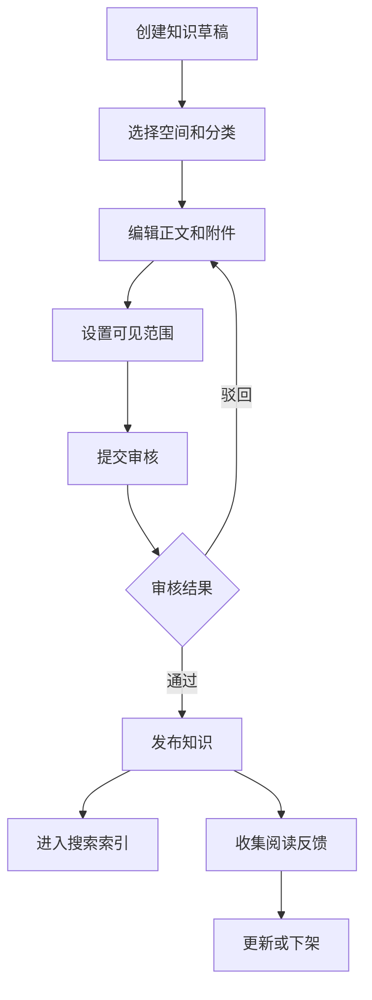
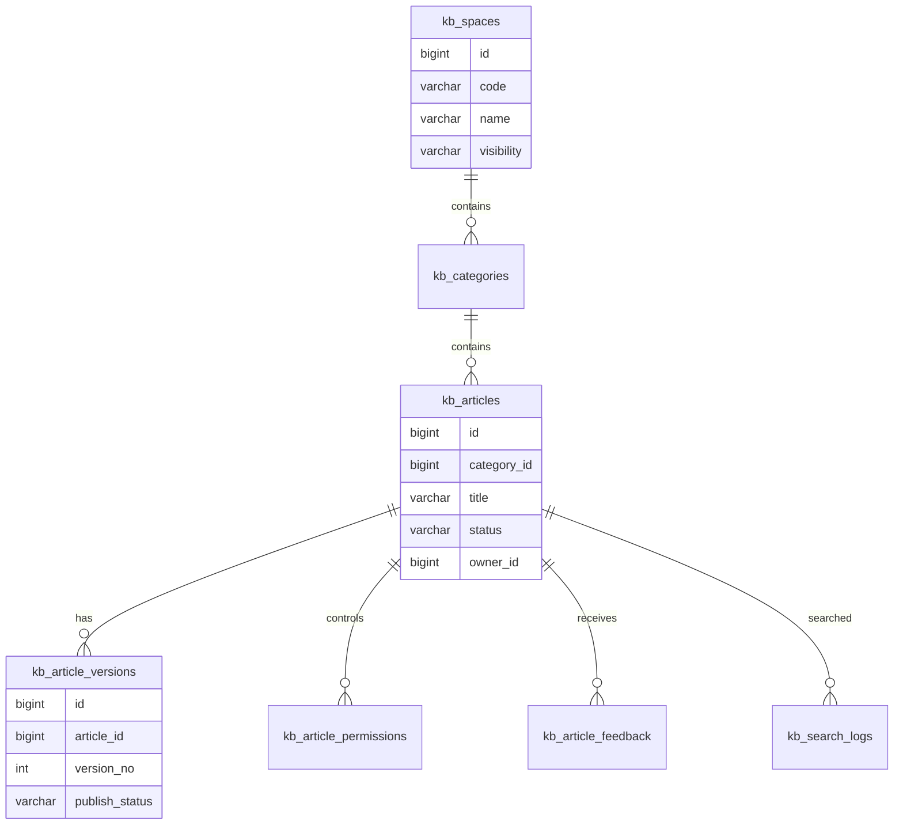
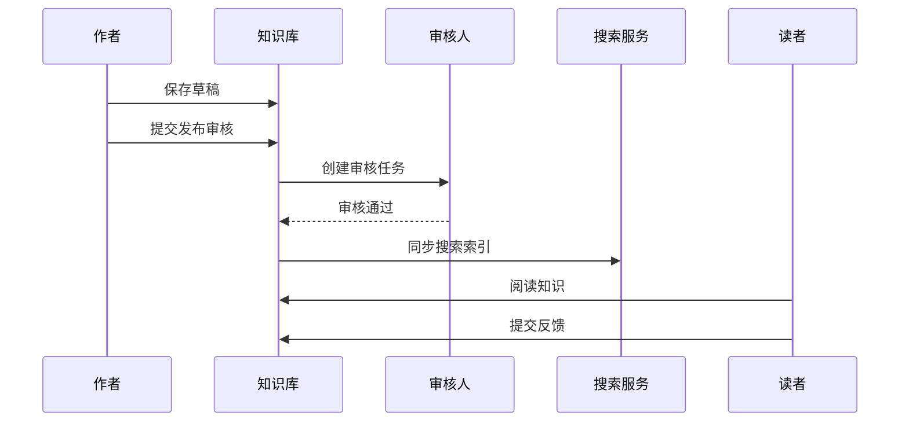

# 知识库平台项目案例

## 适合谁看

适合需要做企业内部文档、帮助中心、客服知识库、产品知识库、权限文档、版本发布、全文搜索和知识反馈的开发者。

知识库平台不是“写文章列表”。真实项目里，知识会有分类、标签、作者、审核、发布、版本、权限、搜索、反馈和失效治理。没有治理机制的知识库，最后会变成一堆没人敢相信的旧文档。

## 业务目标

第一版知识库平台支持：

- 创建空间和分类。
- 编写知识文档。
- 支持草稿、审核和发布。
- 支持版本记录。
- 支持权限范围。
- 支持全文搜索。
- 支持读者反馈。
- 支持过期提醒和知识治理。

## 知识生产链路

知识库要有发布链路。草稿内容、审核内容和线上可见内容不能混在一起。

## 数据模型

## 推荐表结构

| 表 | 作用 | 关键字段 |
| --- | --- | --- |
| `kb_spaces` | 知识空间 | `code`、`name`、`visibility`、`owner_id` |
| `kb_categories` | 分类目录 | `space_id`、`parent_id`、`name`、`sort_no` |
| `kb_articles` | 知识主表 | `category_id`、`title`、`status`、`owner_id` |
| `kb_article_versions` | 知识版本 | `article_id`、`version_no`、`content`、`published_at` |
| `kb_article_permissions` | 权限范围 | `article_id`、`target_type`、`target_id` |
| `kb_article_feedback` | 读者反馈 | `article_id`、`feedback_type`、`content`、`status` |
| `kb_search_logs` | 搜索日志 | `keyword`、`result_count`、`clicked_article_id` |
| `kb_review_records` | 审核记录 | `article_id`、`action`、`comment`、`operator_id` |

权限建议同时支持空间级、分类级和文章级，但第一版要限制覆盖规则。层级太多会让用户不知道到底谁能看。

## 知识发布流程

搜索索引要和发布状态一致。未发布、无权限、已下架的文章不应该出现在搜索结果里。

## 权限与搜索

| 场景 | 处理方式 | 常见风险 |
| --- | --- | --- |
| 公开帮助中心 | 所有人可见 | 注意 SEO 和缓存 |
| 企业内部知识 | 登录后可见 | 离职人员权限回收 |
| 部门知识 | 指定部门可见 | 部门调整后权限同步 |
| 项目知识 | 项目成员可见 | 项目结束后的归档 |
| 敏感知识 | 指定人员可见 | 搜索摘要不能泄露内容 |

搜索不是简单查标题。真实知识库要支持标题、正文、标签、分类、作者和更新时间，并且搜索结果必须经过权限过滤。

## 前端页面拆分

| 页面 | 作用 | 注意点 |
| --- | --- | --- |
| 知识空间 | 展示不同业务空间 | 空间入口不要过多 |
| 分类树 | 浏览目录结构 | 移动端要避免树形结构挤占首屏 |
| 文章详情 | 阅读正文和附件 | 展示版本、更新时间和负责人 |
| 编辑器 | 编写知识内容 | 自动保存草稿 |
| 发布审核 | 审核新文章和变更 | 展示变更对比 |
| 搜索页 | 搜索知识内容 | 支持权限过滤和高亮 |
| 反馈中心 | 处理“没帮助”“内容过期”等反馈 | 反馈要能闭环 |

## 实际项目常见问题

### 问题 1：搜索结果里出现了无权限知识

说明只在详情页做了权限校验。搜索索引查询阶段也必须传入当前用户权限范围，并过滤不可见文章。

### 问题 2：文档很多，但没人相信

通常是没有负责人、更新时间和反馈闭环。每篇知识都要有 owner，并在内容过期或收到负反馈后进入治理流程。

### 问题 3：分类树越来越乱

分类应该表达稳定业务结构，标签用于表达临时主题。不要把每个活动、版本、客户都建成分类。

## 验收清单

- 知识空间、分类和文章边界清晰。
- 文章支持草稿、审核、发布、下架。
- 发布内容有版本记录。
- 搜索结果经过权限过滤。
- 文章详情展示负责人和更新时间。
- 读者反馈能分派和处理。
- 过期知识有提醒。
- 附件权限和文章权限一致。
- 搜索日志能帮助发现无结果关键词。
- 分类和标签有维护规则。

## 下一步学习

继续学习 [搜索中心项目案例](/projects/search-center-case)、[AI 文档问答从零到项目](/ai-engineering/doc-qa-project) 和 [审计中心项目案例](/projects/audit-center-case)。
