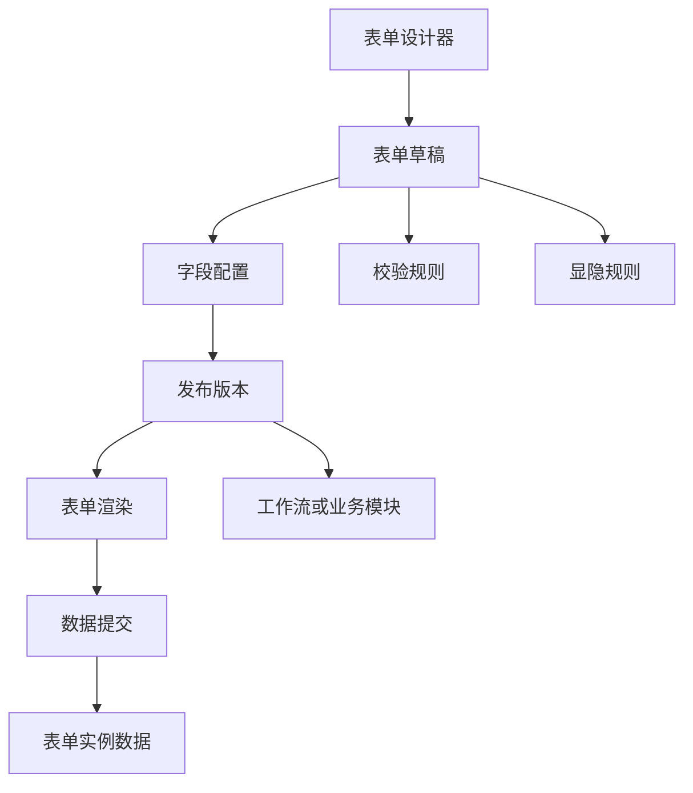
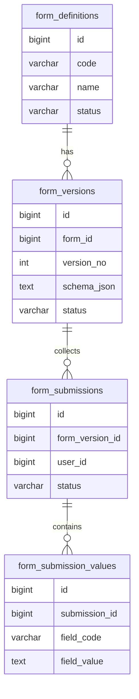
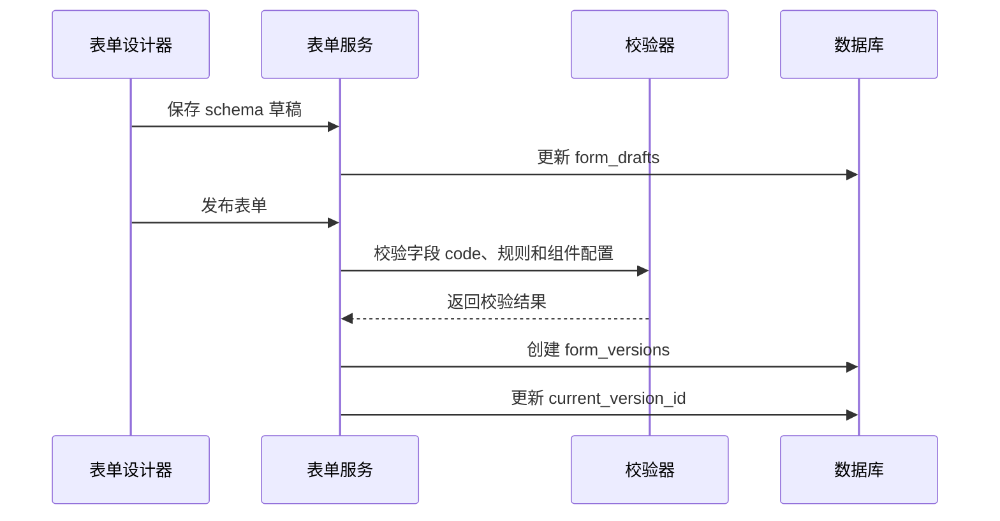

# 低代码表单项目案例

## 适合谁看

适合需要做动态表单、表单设计器、字段权限、条件显隐、表单校验、表单版本和表单数据收集的开发者。

低代码表单不是“把表单配置保存成 JSON”。真实项目里，表单会影响数据结构、校验规则、字段权限、流程审批、导入导出、历史版本和统计报表。设计不好，表单一改，历史数据无法展示，流程也可能无法继续。

## 业务目标

第一版低代码表单模块支持：

- 拖拽配置字段。
- 支持文本、数字、日期、选择、附件等组件。
- 支持字段必填、格式和范围校验。
- 支持条件显隐。
- 支持字段权限。
- 支持表单草稿和发布版本。
- 支持表单数据提交和查看。
- 支持表单版本兼容历史数据。

## 模块关系图



设计态和运行态要分开。用户正在填写的表单应该绑定发布版本，而不是绑定随时会变化的草稿。

## 数据模型



## 推荐表结构

| 表 | 作用 | 关键字段 |
| --- | --- | --- |
| `form_definitions` | 表单定义 | `code`、`name`、`status`、`current_version_id` |
| `form_drafts` | 表单草稿 | `form_id`、`schema_json`、`updated_by` |
| `form_versions` | 发布版本 | `form_id`、`version_no`、`schema_json`、`published_at` |
| `form_submissions` | 表单提交 | `form_version_id`、`user_id`、`status` |
| `form_submission_values` | 字段值 | `submission_id`、`field_code`、`field_value` |
| `form_permission_rules` | 字段权限 | `form_version_id`、`field_code`、`role_code`、`permission` |

表单数据可以按字段行存储，也可以整份 JSON 存储。第一版如果查询统计需求不强，可以保存 JSON；如果要按字段筛选和统计，建议关键字段结构化。

## 发布流程



字段 `field_code` 发布后不要随意修改。它是历史数据和业务逻辑识别字段的关键。

## 字段配置示例

```json
{
  "fieldCode": "customer_name",
  "label": "客户名称",
  "component": "input",
  "required": true,
  "visibleWhen": {
    "field": "customer_type",
    "operator": "equals",
    "value": "enterprise"
  }
}
```

不要让用户直接写任意 JavaScript 作为显隐规则。更稳妥的方式是提供受控表达式。

## 前端页面拆分

| 页面或组件 | 作用 | 注意点 |
| --- | --- | --- |
| 表单列表 | 管理表单定义 | 区分草稿、已发布、停用 |
| 表单设计器 | 拖拽字段和配置属性 | 字段 code 要稳定 |
| 字段属性面板 | 配置校验、默认值、显隐 | 复杂规则要有预览 |
| 发布检查页 | 检查字段冲突和规则错误 | 发布后生成版本 |
| 表单填写页 | 用户填写表单 | 渲染指定版本 |
| 表单数据页 | 查看提交数据 | 历史数据按原版本展示 |

## 常见问题

### 问题 1：修改字段名称后历史数据丢失

通常是把 `label` 当成字段标识。字段标识应使用稳定 `field_code`，展示名称可以变。

### 问题 2：发布后流程里的表单打不开

工作流实例必须绑定表单版本。不能直接引用最新草稿或最新版本。

### 问题 3：动态表单查询很慢

如果所有字段都放 JSON，按字段筛选会很慢。高频筛选字段要同步到结构化列或索引表。

## 验收清单

- 表单草稿和发布版本分离。
- 字段 code 稳定且唯一。
- 发布前校验组件配置和规则。
- 提交数据绑定表单版本。
- 历史数据能按原版本展示。
- 字段权限由后端校验。
- 条件显隐使用受控表达式。
- 高频查询字段有结构化策略。
- 表单发布、停用、删除有审计记录。

## 下一步学习

继续学习 [工作流配置器项目案例](/projects/workflow-builder-case)、[文件中心项目案例](/projects/file-center-case) 和 [前端页面与状态问题](/projects/issues-frontend)。
