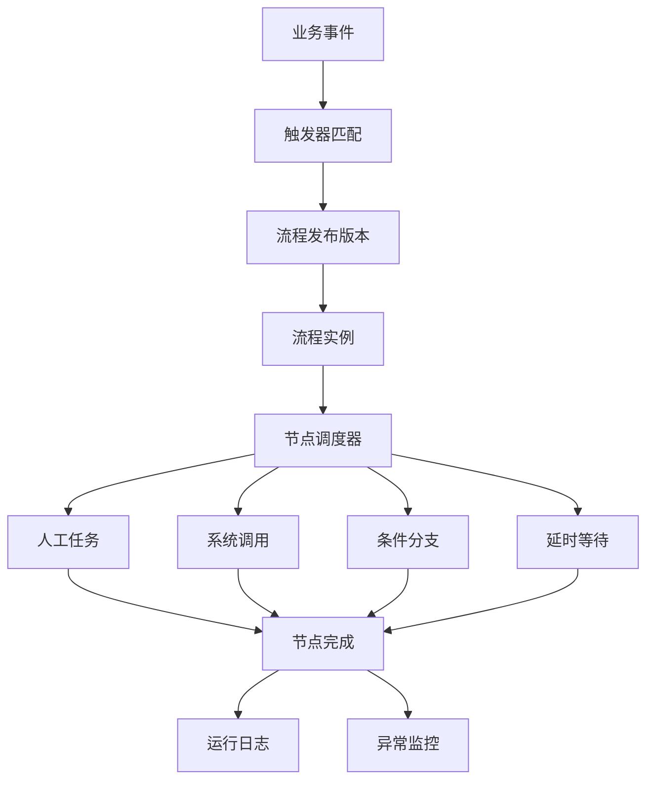
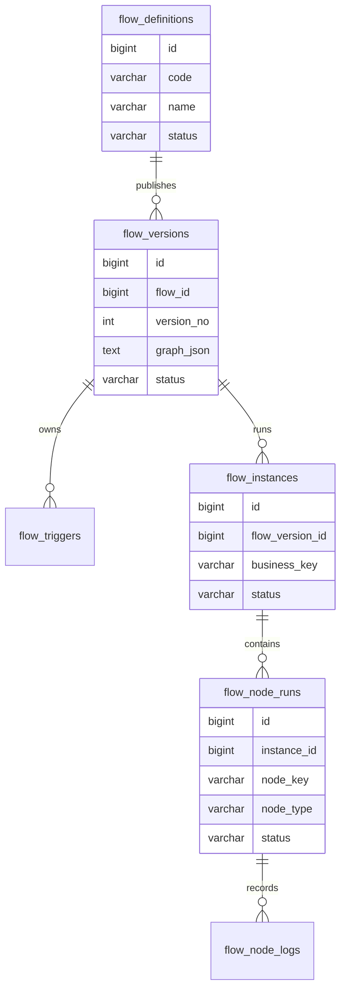
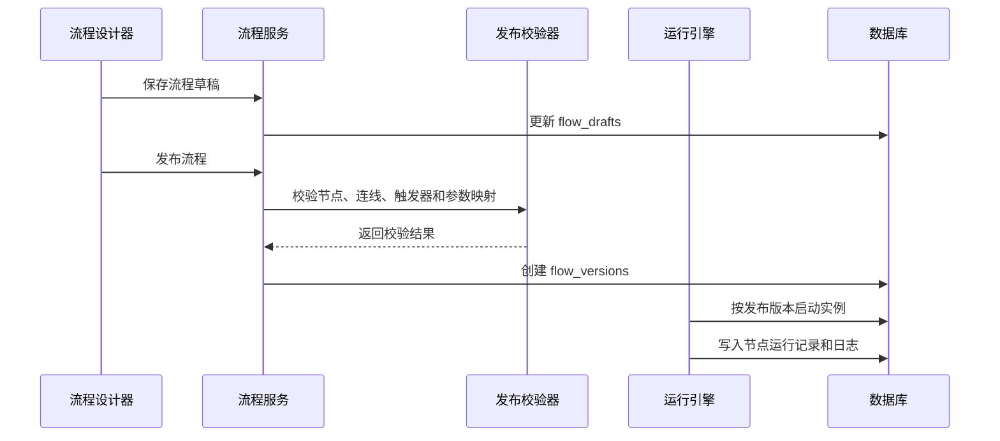

# 低代码流程平台项目案例

## 适合谁看

适合需要做流程编排、自动化任务、业务规则、人工节点、系统节点、Webhook、流程版本和运行监控的开发者。

低代码流程平台和普通审批流不一样。审批流主要解决“谁审批、谁通过、谁驳回”，低代码流程平台还要解决“什么时候触发、调用哪些系统、失败后怎么补偿、流程升级后历史任务怎么继续”。如果只保存一份流程 JSON，后面很容易出现旧实例跑不动、新版本影响历史任务、系统节点重复调用等问题。

## 业务目标

第一版低代码流程平台支持：

- 通过设计器配置流程节点和连线。
- 支持人工任务、系统调用、条件分支、延时等待和结束节点。
- 支持流程草稿、发布版本和停用。
- 支持业务事件触发流程。
- 支持流程实例按发布版本运行。
- 支持节点失败重试和人工补偿。
- 支持流程运行日志、耗时统计和异常告警。
- 支持节点输入输出数据快照。

## 流程平台整体链路

核心原则：配置态、发布态、运行态必须分开。设计器保存的是草稿，运行实例引用的是发布版本，节点执行记录保存的是当时的输入输出快照。

## 数据模型

## 推荐表结构

| 表 | 作用 | 关键字段 |
| --- | --- | --- |
| `flow_definitions` | 流程定义主表 | `code`、`name`、`status`、`current_version_id` |
| `flow_drafts` | 流程草稿 | `flow_id`、`graph_json`、`updated_by` |
| `flow_versions` | 发布版本 | `flow_id`、`version_no`、`graph_json`、`published_at` |
| `flow_triggers` | 触发器配置 | `flow_version_id`、`event_code`、`condition_json` |
| `flow_instances` | 流程实例 | `flow_version_id`、`business_key`、`status` |
| `flow_node_runs` | 节点运行记录 | `instance_id`、`node_key`、`node_type`、`status`、`retry_count` |
| `flow_node_logs` | 节点日志 | `node_run_id`、`input_snapshot`、`output_snapshot`、`error_message` |
| `flow_compensation_tasks` | 补偿任务 | `node_run_id`、`compensation_type`、`status`、`operator_id` |

不要只用一张表保存流程运行结果。流程实例和节点运行记录要分开，否则很难追踪哪个节点失败、哪个节点重试、哪个节点被人工跳过。

## 节点类型设计

| 节点类型 | 解决什么问题 | 关键配置 | 风险点 |
| --- | --- | --- | --- |
| 触发节点 | 定义流程如何启动 | 事件编码、过滤条件 | 重复事件导致重复实例 |
| 人工任务 | 需要人处理的任务 | 处理人、超时、表单 | 处理人为空导致卡住 |
| 系统调用 | 调外部 API 或内部服务 | 接口、参数映射、超时 | 重复调用和接口失败 |
| 条件分支 | 按数据走不同路径 | 条件表达式、默认分支 | 条件冲突或无命中 |
| 延时等待 | 定时后继续执行 | 等待时间、唤醒条件 | 调度丢失或重复唤醒 |
| 结束节点 | 标记流程结束 | 结束状态、通知动作 | 分支没有到达结束节点 |

条件表达式和参数映射要使用受控 DSL。不要允许用户直接写任意 JavaScript 或 SQL。

## 发布和运行流程

发布校验至少要检查开始节点、结束节点、孤立节点、循环风险、系统节点超时、条件默认分支、人工节点处理人兜底和参数映射缺失。

## 前端页面拆分

| 页面或组件 | 作用 | 注意点 |
| --- | --- | --- |
| 流程定义列表 | 管理流程启停和版本 | 展示当前发布版本和最近运行结果 |
| 流程设计器 | 拖拽节点、连线、配置节点 | 设计器只编辑草稿 |
| 节点配置面板 | 配置触发器、条件、API、处理人 | 必填项要实时校验 |
| 发布检查页 | 展示校验结果和风险提示 | 发布前明确影响范围 |
| 实例列表 | 查看运行中的流程 | 支持按状态、业务单号、版本筛选 |
| 实例轨迹页 | 查看节点运行路径 | 展示每个节点的输入输出和耗时 |
| 异常补偿页 | 人工处理失败节点 | 记录补偿人、原因和结果 |

实例轨迹页非常重要。低代码平台出问题时，用户最需要知道“流程卡在哪个节点、当时输入是什么、为什么失败”。

## 常见问题

### 问题 1：流程发布后，旧实例突然跑错路径

旧实例引用了最新流程配置，而不是启动时的发布版本。流程实例必须绑定 `flow_version_id`，节点执行时从该版本读取图结构。

### 问题 2：系统节点失败后重复扣款或重复发消息

系统节点没有幂等键。每次外部调用都要带业务幂等键，例如 `flowInstanceId + nodeKey + attemptNo`，外部服务也要支持幂等。

### 问题 3：条件分支看起来配置正确，但运行时没有命中

通常是字段类型不一致，例如页面上是数字，运行数据里是字符串。条件引擎要在发布时校验字段类型，并在运行日志里记录实际参与判断的数据。

### 问题 4：流程设计器越做越复杂，用户不敢改

需要提供发布前校验、影响范围提示、版本对比和灰度发布。低代码平台不能只关注“能配置”，还要让用户知道“改了会影响谁”。

## 验收清单

- 草稿、发布版本和运行实例分离。
- 流程实例绑定固定版本。
- 发布前校验节点、连线、条件、触发器和参数映射。
- 系统节点具备超时、重试、幂等和补偿策略。
- 人工节点有兜底处理人。
- 条件节点有默认分支。
- 节点运行记录保存输入输出快照。
- 实例轨迹可定位节点耗时和错误。
- 版本变更有审计记录。
- 停用流程不影响历史实例。

## 下一步学习

继续学习 [工作流配置器项目案例](/projects/workflow-builder-case)、[审批流项目案例](/projects/approval-workflow-case)、[规则引擎项目案例](/projects/rule-engine-case) 和 [消息队列项目案例](/projects/message-queue-case)。
