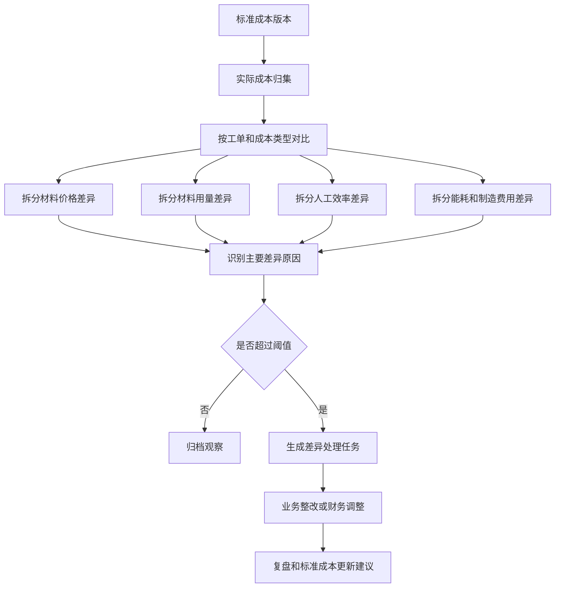
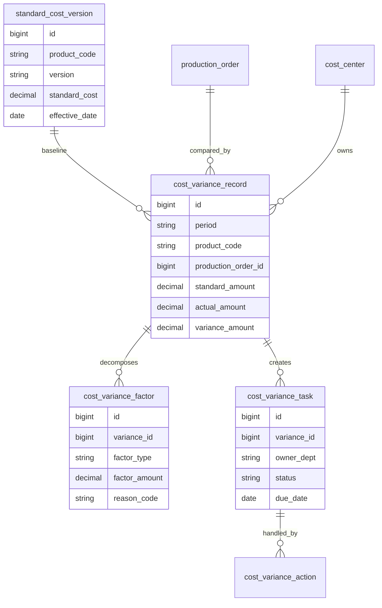
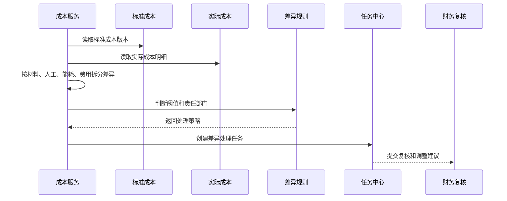
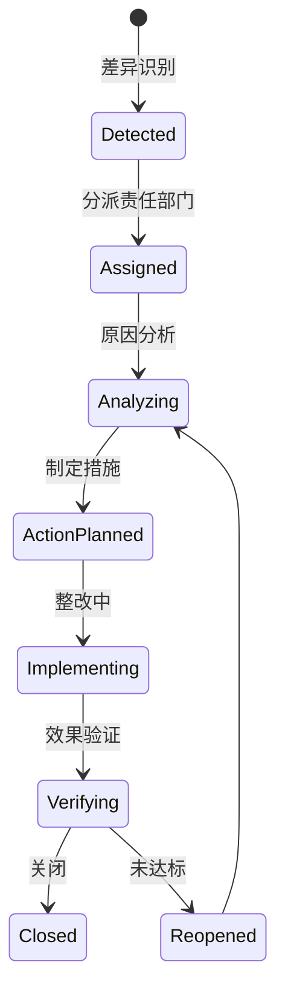
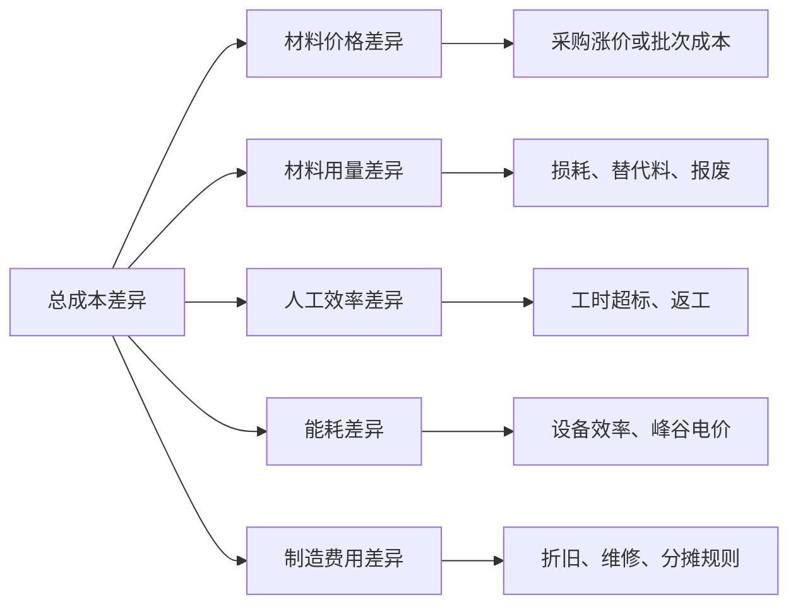

# 制造成本差异分析项目案例

## 适合谁看

如果你已经看过生产成本核算，但还不清楚“成本为什么超了、超在哪里、谁来处理”，可以继续看这一篇。

制造成本差异分析关注标准成本和实际成本之间的差异。它不是简单报表，而是把材料价格、材料用量、人工效率、制造费用、能耗、良率和异常损失拆开分析。

## 业务目标

成本差异分析要回答 6 个问题：

- 哪些产品、工单、产线或成本中心成本偏离明显。
- 差异来自材料价格、材料用量、人工效率、能耗还是制造费用。
- 差异是一次性异常，还是长期趋势。
- 差异是否由报废、返工、停机、采购涨价或工艺变更造成。
- 哪些差异需要业务整改、财务调整或管理层复盘。
- 差异处理后，下一期标准成本或生产策略是否要调整。

成本核算告诉你“花了多少钱”，成本差异分析告诉你“为什么多花或少花”。

## 制造成本差异分析链路

差异分析要从“总成本差异”拆到“可行动原因”。否则报表只能告诉你超支，却无法指导生产、采购或财务下一步做什么。

## 核心概念

| 概念 | 说明 | 项目里的典型字段 |
| --- | --- | --- |
| 标准成本 | 理论或预算成本 | standard_cost |
| 实际成本 | 本期实际归集成本 | actual_cost |
| 价格差异 | 单价变化导致的差异 | price_variance |
| 用量差异 | 消耗数量变化导致的差异 | usage_variance |
| 效率差异 | 工时、机时、产量效率变化 | efficiency_variance |
| 费用差异 | 制造费用预算和实际差异 | overhead_variance |
| 差异阈值 | 触发分析或审批的标准 | variance_threshold |
| 差异任务 | 超阈值后的处理闭环 | variance_task |

成本差异不一定都是坏事。低于标准成本也要分析，可能是效率提升，也可能是漏记成本。

## 数据模型

差异记录要保存拆分因素。只保存一个差异金额，后续无法判断是采购价格问题、生产损耗问题还是财务分摊问题。

## 推荐表结构

| 表 | 用途 | 关键字段 |
| --- | --- | --- |
| cost_variance_record | 差异主记录 | period、product_code、order_no、standard_amount、actual_amount、variance_amount |
| cost_variance_factor | 差异因素 | variance_id、factor_type、factor_amount、reason_code |
| cost_variance_threshold | 差异阈值 | product_line、cost_type、threshold_rate、threshold_amount |
| cost_variance_task | 差异处理任务 | variance_id、owner_dept、assignee_id、due_date、status |
| cost_variance_action | 处理动作 | task_id、action_type、action_result、evidence_file_id |
| standard_cost_adjustment_suggestion | 标准成本调整建议 | product_code、suggested_cost、reason、approval_status |

差异阈值要支持百分比和金额两种方式。小金额高比例和大金额低比例的处理优先级不同。

## 差异拆分流程

差异拆分最好按批次执行，并保存结果。不要每次打开页面都实时重算，否则结账后报表可能随来源数据变化。

## 差异任务状态设计

成本差异任务要有闭环。否则每个月都发现同样的问题，却没有人负责处理。

## 差异因素拆解

这种拆解图可以直接用于页面上的“差异原因树”。用户先看到总差异，再逐层下钻到原因。

## 前端页面拆分

| 页面 | 主要功能 | 新手容易漏掉 |
| --- | --- | --- |
| 差异总览 | 按期间、产品、工厂、成本中心看差异 | 同时展示金额和比例 |
| 产品差异页 | 产品维度材料、人工、费用差异 | 支持和历史周期对比 |
| 工单差异页 | 单个工单的标准实际对比 | 能追到领料、报工和能耗 |
| 差异因素页 | 价格、用量、效率、费用拆分 | 因素要支持下钻来源 |
| 差异任务页 | 分派、分析、整改、复核 | 任务要有责任部门和截止时间 |
| 标准成本建议页 | 根据长期差异建议调标 | 调标需要审批和版本 |
| 差异报表页 | 趋势、Top N、责任部门、关闭率 | 不只看金额，还要看闭环效率 |

差异总览页不要只做一张表。最好提供 Top 差异、趋势图、责任部门和未关闭任务入口。

## 接口拆分建议

| 接口 | 方法 | 说明 |
| --- | --- | --- |
| /api/cost-variances | GET | 查询成本差异列表 |
| /api/cost-variances/:id | GET | 查询差异详情 |
| /api/cost-variances/calculate | POST | 执行差异计算 |
| /api/cost-variances/:id/factors | GET | 查询差异因素拆分 |
| /api/cost-variance-tasks | GET/POST | 查询和创建差异任务 |
| /api/cost-variance-tasks/:id/actions | POST | 提交处理动作 |
| /api/standard-cost-suggestions | GET/POST | 查询和创建标准成本调整建议 |

差异计算接口通常要异步执行，因为它会读取大量成本明细和历史标准成本。

## 实际项目常见问题

### 问题 1：差异金额对不上成本报表

常见原因是差异分析使用的数据期间和成本结账期间不一致。

解决方式：

- 差异计算必须绑定成本期间。
- 使用已锁定的成本明细。
- 报表展示数据版本和计算批次。
- 结账后变更通过调整批次处理。

### 问题 2：所有差异都归到“其他”

原因分类太粗，业务无法行动。

解决方式：

- 建立差异原因字典。
- 系统自动拆分基础因素，人工补充业务原因。
- 原因字典按材料、人工、能耗、费用分类。
- 高频“其他”原因定期治理。

### 问题 3：低于标准成本也被忽略

低成本可能是效率提升，也可能是漏记成本。

解决方式：

- 正差异和负差异都设置阈值。
- 对连续低于标准的产品生成调标建议。
- 对异常低成本检查是否漏领料或漏报工。
- 财务复核后再确认收益。

### 问题 4：差异任务没人关闭

报表发现问题后没有任务流转。

解决方式：

- 超阈值差异自动生成任务。
- 按因素类型匹配责任部门。
- 任务有截止日期、处理动作和验证结果。
- 管理报表展示未关闭差异。

## 权限与审计

| 权限 | 建议 |
| --- | --- |
| 查看差异 | 按工厂、产品线、成本中心授权 |
| 执行计算 | 成本会计或系统任务 |
| 分派任务 | 财务或成本管理负责人 |
| 提交整改 | 责任部门处理人 |
| 关闭任务 | 财务复核人或成本负责人 |
| 调整标准成本 | 财务负责人审批，生成新版本 |

成本差异涉及经营敏感数据，不能对所有生产人员开放完整金额。

## 验收清单

- 成本差异能按产品、工单、成本中心和期间查询。
- 差异能拆成价格、用量、效率、能耗和费用因素。
- 差异计算使用已确认的成本版本和期间。
- 超阈值差异能自动生成处理任务。
- 处理任务有分析、整改、验证和关闭记录。
- 标准成本调整建议不会直接覆盖历史版本。
- 差异报表能展示趋势、Top 差异和闭环情况。

## 下一步学习

建议继续阅读：

- [生产成本核算项目案例](/projects/production-cost-accounting-case)
- [生产能耗分析项目案例](/projects/production-energy-analysis-case)
- [生产质量异常项目案例](/projects/production-quality-exception-case)
- [生产设备异常项目案例](/projects/production-equipment-exception-case)
