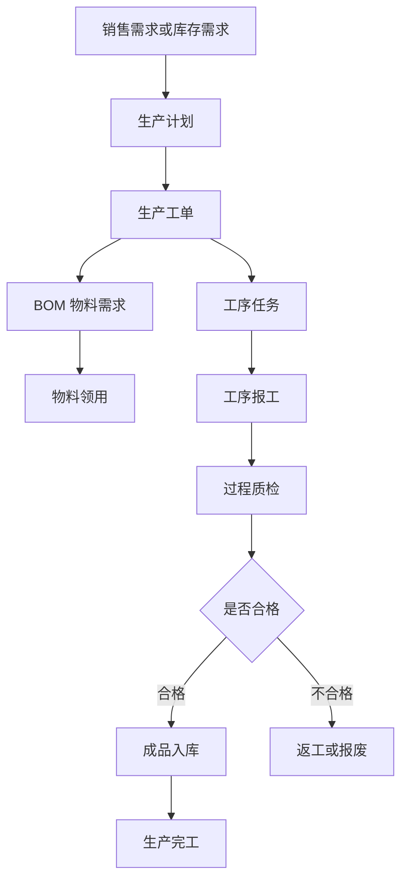
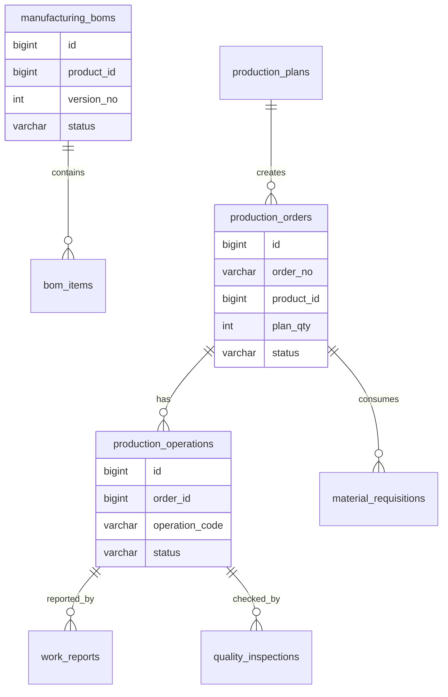
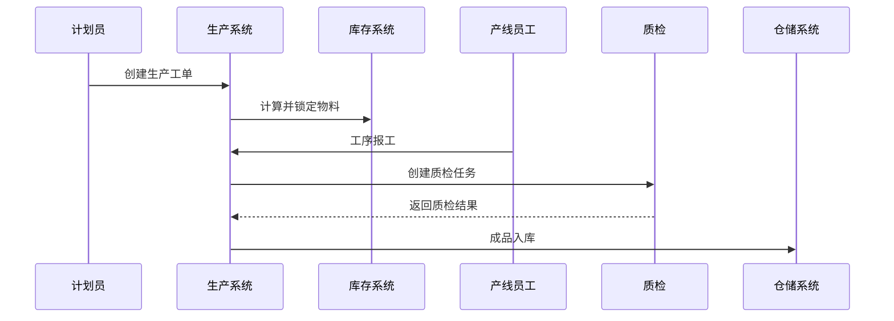

# 生产制造项目案例

## 适合谁看

适合需要做生产计划、工单、BOM、工序、报工、质检、设备、物料领用和生产进度看板的开发者。

生产制造系统不是“创建一张生产单”。真实项目里，它会连接销售订单、物料库存、BOM、产线、工序、设备、人员、质检和入库。生产过程越长，越需要状态、批次、工序和质量记录，否则无法解释生产进度和质量问题。

## 业务目标

第一版生产制造支持：

- 维护产品 BOM。
- 创建生产计划。
- 创建生产工单。
- 拆分工序任务。
- 支持物料领用。
- 支持工序报工。
- 支持过程质检。
- 支持成品入库。
- 支持生产看板。

## 生产执行链路

生产系统的核心是把计划、物料、工序和质量串起来。只记录最终产量，无法管理过程。

## 数据模型

## 推荐表结构

| 表 | 作用 | 关键字段 |
| --- | --- | --- |
| `manufacturing_boms` | 产品 BOM | `product_id`、`version_no`、`status`、`effective_at` |
| `bom_items` | BOM 明细 | `bom_id`、`material_sku_id`、`quantity`、`loss_rate` |
| `production_plans` | 生产计划 | `plan_no`、`product_id`、`plan_qty`、`due_date` |
| `production_orders` | 生产工单 | `order_no`、`plan_id`、`product_id`、`status` |
| `production_operations` | 工序任务 | `order_id`、`operation_code`、`sort_no`、`status` |
| `material_requisitions` | 物料领用 | `order_id`、`material_sku_id`、`required_qty`、`issued_qty` |
| `work_reports` | 报工记录 | `operation_id`、`worker_id`、`good_qty`、`defect_qty` |
| `quality_inspections` | 质检记录 | `operation_id`、`inspection_result`、`defect_reason` |

BOM 必须有版本。产品结构变更后，历史工单仍然要能追溯当时使用的 BOM。

## 工单执行流程

物料领用和成品入库要和库存系统联动。生产系统只保存过程，库存系统负责数量账。

## 生产状态

| 对象 | 状态 | 注意点 |
| --- | --- | --- |
| 生产计划 | 草稿、已下达、已取消、已完成 | 下达后生成工单 |
| 生产工单 | 待开工、生产中、暂停、已完工、已关闭 | 关闭后只读 |
| 工序任务 | 未开始、进行中、待质检、已完成、返工 | 返工要记录原因 |
| 物料领用 | 待领料、部分领料、已领料 | 影响开工条件 |
| 质检任务 | 待检、合格、不合格、让步通过 | 不合格要处理 |

## 前端页面拆分

| 页面 | 作用 | 注意点 |
| --- | --- | --- |
| BOM 管理 | 维护产品结构 | 发布后生成版本 |
| 生产计划 | 安排生产数量和日期 | 关联需求来源 |
| 生产工单 | 跟踪工单状态 | 展示计划、物料、工序 |
| 物料领用 | 管理领料和退料 | 和库存联动 |
| 工序报工 | 员工填报产量和工时 | 移动端或车间屏适配 |
| 质量检验 | 记录检验结果 | 不合格可返工 |
| 成品入库 | 完工入库 | 关联批次和质检 |
| 生产看板 | 展示进度、良率、异常 | 按产线和工单筛选 |

## 实际项目常见问题

### 问题 1：工单完成了但物料库存没扣

物料领用不能只记录在生产系统。领料确认后必须写库存出库或锁定消耗。

### 问题 2：产品换了 BOM 后历史工单对不上

历史工单要保存 BOM 版本快照。不要每次查询都读取当前最新 BOM。

### 问题 3：不良品原因无法统计

质检记录要结构化保存缺陷类型、工序、责任环节和处理方式，不能只写备注。

## 验收清单

- BOM 有版本和生效状态。
- 生产计划、工单、工序层级清晰。
- 工单能计算物料需求。
- 物料领用和库存联动。
- 工序报工记录良品和不良品。
- 质检结果影响工序状态。
- 不合格支持返工、报废或让步通过。
- 成品入库关联工单和批次。
- 生产看板能展示进度和良率。
- 工单关闭后关键数据只读。

## 下一步学习

继续学习 [库存管理项目案例](/projects/inventory-management-case)、[仓储物流项目案例](/projects/warehouse-logistics-case) 和 [IoT 设备管理项目案例](/projects/iot-device-management-case)。
