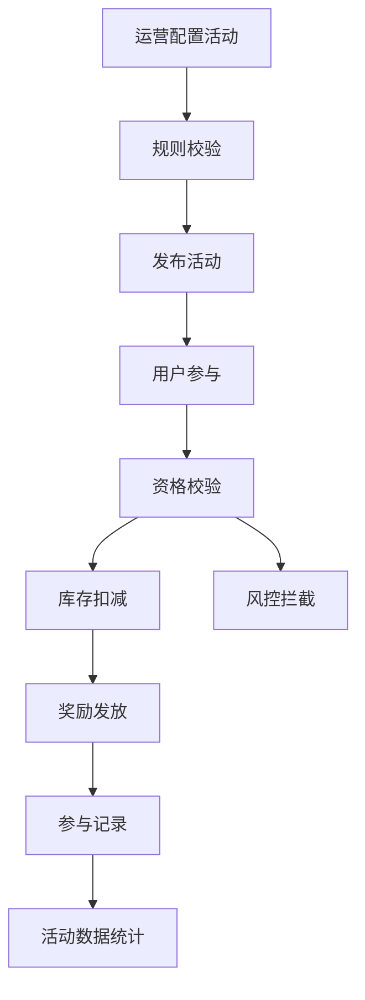
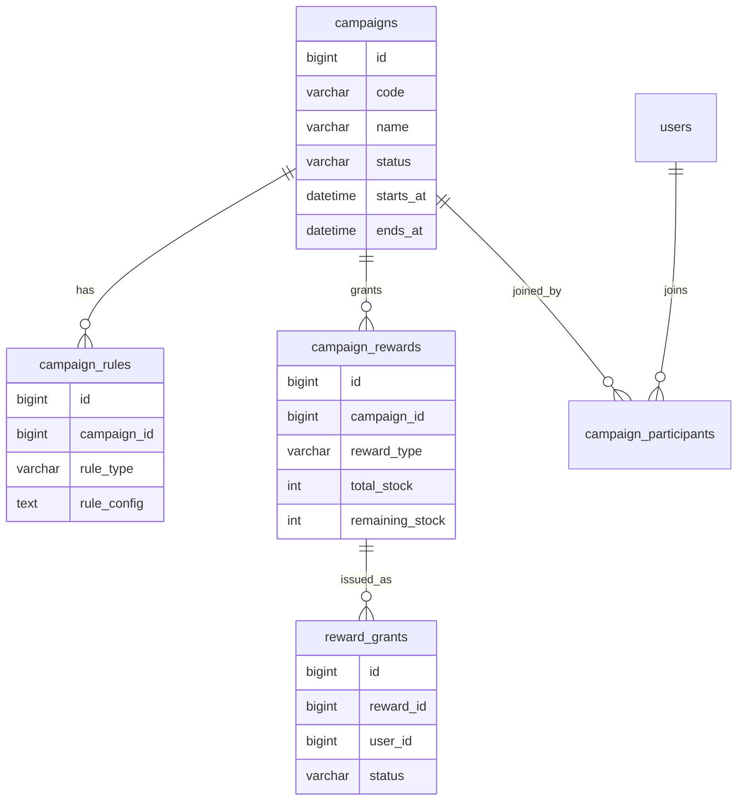
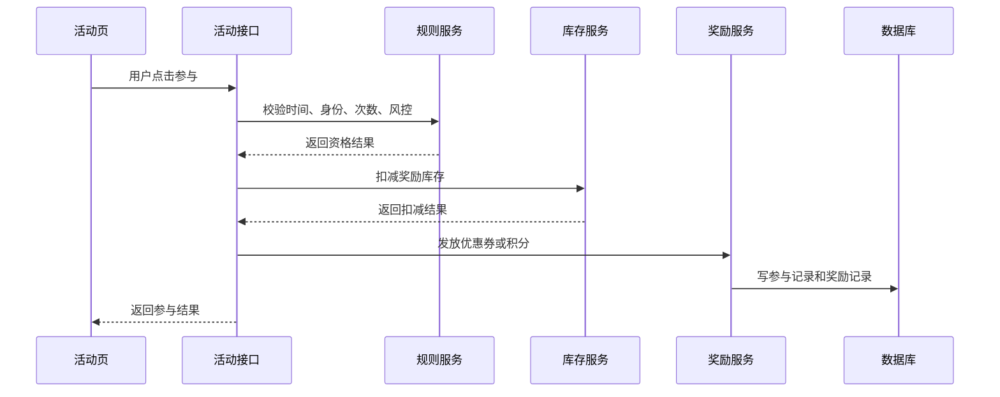

# 运营活动项目案例

## 适合谁看

适合需要做优惠券、活动报名、限时折扣、邀请奖励、积分任务、抽奖、活动页面配置和运营数据统计的开发者。

运营活动不是“加一张活动表”。真实项目里，运营活动会涉及活动规则、时间窗口、库存、资格校验、风控、并发领取、奖品发放、回滚、数据统计和活动复盘。活动上线后流量可能突然升高，因此规则和并发控制必须提前设计。

## 业务目标

第一版运营活动模块支持：

- 创建活动。
- 配置活动时间和参与范围。
- 配置奖励规则。
- 支持优惠券或积分发放。
- 支持参与资格校验。
- 支持库存和次数限制。
- 支持活动数据看板。
- 支持活动上下线和复盘。

## 活动链路图

活动规则要后端执行。前端可以展示活动页，但不能决定用户是否有资格或是否中奖。

## 数据模型

## 推荐表结构

| 表 | 作用 | 关键字段 |
| --- | --- | --- |
| `campaigns` | 活动主表 | `code`、`name`、`status`、`starts_at`、`ends_at` |
| `campaign_rules` | 活动规则 | `rule_type`、`rule_config`、`priority` |
| `campaign_rewards` | 活动奖励 | `reward_type`、`total_stock`、`remaining_stock` |
| `campaign_participants` | 参与记录 | `campaign_id`、`user_id`、`participated_at` |
| `reward_grants` | 奖励发放 | `reward_id`、`user_id`、`status` |
| `campaign_metrics` | 活动指标 | `campaign_id`、`metric_code`、`metric_value` |

规则配置可以用 JSON，但规则类型、活动状态、库存等关键字段必须结构化。

## 参与流程

库存扣减和奖励发放要考虑并发。不能先查库存再直接扣减，否则高并发下会超发。

## 活动规则示例

| 规则 | 示例 | 注意点 |
| --- | --- | --- |
| 时间规则 | 7 月 1 日到 7 月 7 日 | 统一使用服务端时间 |
| 人群规则 | 仅新用户 | 新用户定义要清楚 |
| 次数规则 | 每人每天 1 次 | 唯一键要覆盖日期 |
| 库存规则 | 总共 1000 张券 | 扣减必须原子化 |
| 风控规则 | 同设备最多 3 次 | 风控命中要有记录 |

规则越多，越需要把规则执行结果记录下来，便于客服解释“为什么我不能参加”。

## 前端页面拆分

| 页面 | 作用 | 注意点 |
| --- | --- | --- |
| 活动列表 | 查看活动状态 | 区分草稿、进行中、结束 |
| 活动配置页 | 配置时间、人群、奖励 | 表单要有规则预览 |
| 活动发布页 | 发布前检查配置 | 展示库存、规则和风险 |
| 活动参与页 | 用户参与活动 | 结果提示要明确 |
| 活动数据页 | 查看参与、转化、成本 | 指标口径要固定 |
| 发放记录页 | 查看奖励发放状态 | 支持失败补发 |

## 常见问题

### 问题 1：优惠券被超发

通常是库存扣减不是原子操作。要使用数据库条件更新、Redis 原子扣减或队列串行化处理。

### 问题 2：用户说符合条件但不能参加

规则服务要记录每条规则的判断结果。否则客服无法解释失败原因。

### 问题 3：活动结束后数据对不上

参与记录、奖励发放和数据看板口径不一致。活动开始前要定义指标口径，结束后按同一口径复盘。

## 验收清单

- 活动有草稿、发布、进行中、结束状态。
- 活动时间用服务端判断。
- 参与资格由后端规则服务判断。
- 库存扣减是原子操作。
- 每次参与有记录。
- 奖励发放可追踪、可补偿。
- 风控拦截有记录。
- 活动数据口径固定。
- 活动发布和下线有审计日志。

## 下一步学习

继续学习 [数据看板项目案例](/projects/analytics-dashboard-case)、[消息队列项目案例](/projects/message-queue-case) 和 [真实项目问题库](/projects/real-world-issues)。
