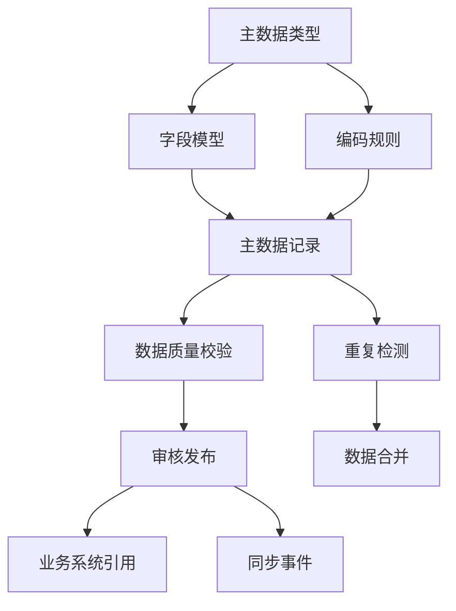
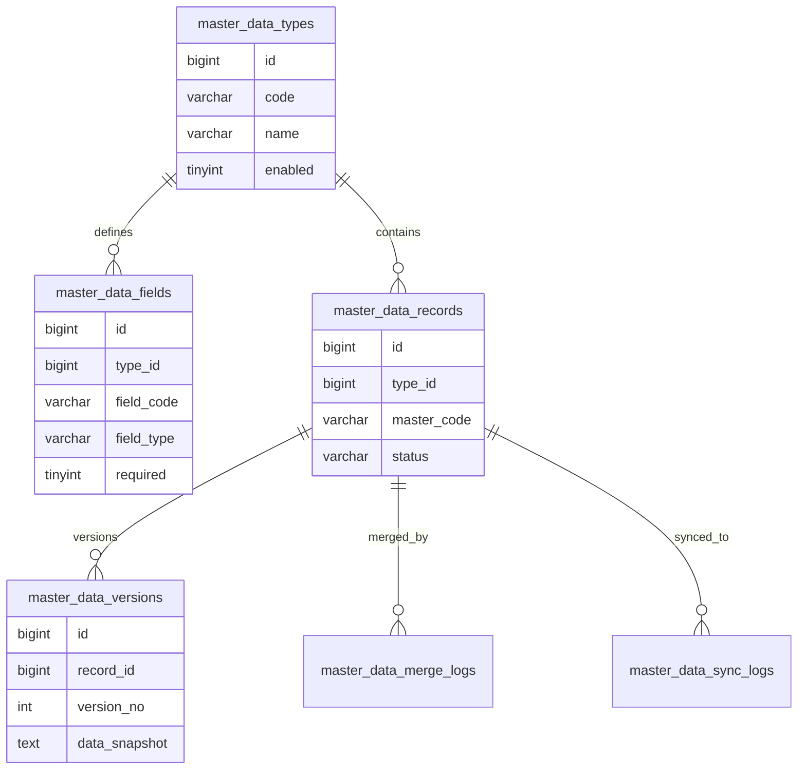
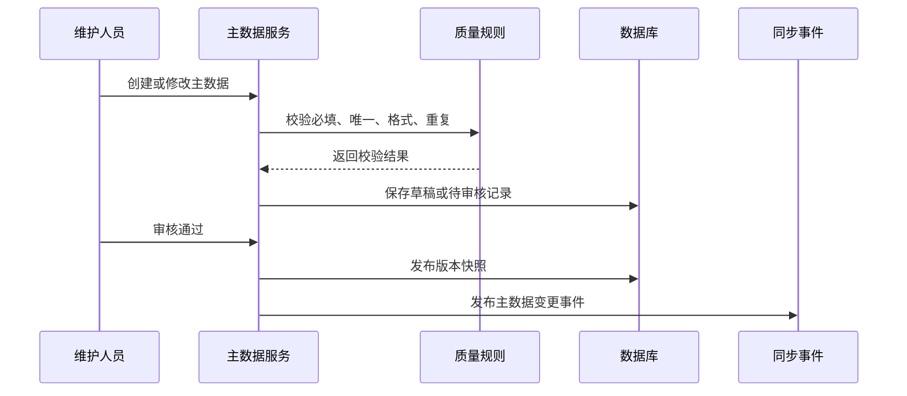

# 主数据管理项目案例

## 适合谁看

适合需要做客户主数据、商品主数据、供应商主数据、组织主数据、编码规则、数据合并、数据质量和系统间数据同步的开发者。

主数据管理不是“多建几张基础资料表”。真实项目里，同一个客户、商品或供应商可能来自多个系统，字段标准不一致，编码重复，历史引用很多。主数据管理的目标是让关键业务对象有统一身份、统一编码、统一质量规则和可追溯的变更过程。

## 业务目标

第一版主数据管理模块支持：

- 定义主数据类型。
- 配置字段和编码规则。
- 创建、审核和启用主数据。
- 检测重复数据。
- 合并重复主数据。
- 记录变更历史。
- 向业务系统同步主数据。
- 统计数据质量问题。

## 模块关系图

主数据的核心是“统一身份”。业务系统可以有自己的业务表，但关键对象要能关联到稳定的主数据 ID。

## 数据模型

## 推荐表结构

| 表 | 作用 | 关键字段 |
| --- | --- | --- |
| `master_data_types` | 主数据类型 | `code`、`name`、`enabled` |
| `master_data_fields` | 字段定义 | `field_code`、`field_type`、`required`、`unique_flag` |
| `master_data_records` | 主数据记录 | `type_id`、`master_code`、`status` |
| `master_data_versions` | 版本快照 | `record_id`、`version_no`、`data_snapshot` |
| `master_data_merge_logs` | 合并记录 | `source_record_id`、`target_record_id`、`reason` |
| `master_data_sync_logs` | 同步记录 | `record_id`、`target_system`、`status` |

关键字段要结构化保存，动态扩展字段可以放 JSON，但唯一性、编码、状态和引用关系不能只藏在 JSON 里。

## 发布流程

发布后要生成版本快照。后续业务争议要能回答“当时这条客户主数据是什么样”。

## 数据质量规则

| 规则 | 示例 | 处理方式 |
| --- | --- | --- |
| 必填 | 客户名称不能为空 | 阻止保存 |
| 唯一 | 客户统一社会信用代码唯一 | 阻止发布 |
| 格式 | 手机号、邮箱、税号格式 | 提示字段错误 |
| 重复 | 名称相似、证件号相同 | 进入疑似重复列表 |
| 引用 | 已被订单引用的数据不能删除 | 禁止删除，只能停用 |

重复检测不要只做完全相等。实际项目里要支持名称相似、证件号相同、手机号相同等多种线索。

## 前端页面拆分

| 页面 | 作用 | 注意点 |
| --- | --- | --- |
| 主数据类型 | 管理客户、商品、供应商等类型 | 类型变更要谨慎 |
| 字段模型 | 配置字段和校验规则 | 关键字段不应随意删除 |
| 主数据列表 | 查询和维护记录 | 状态、编码、质量问题要明显 |
| 主数据详情 | 查看版本和引用 | 展示被哪些业务使用 |
| 重复数据处理 | 合并疑似重复记录 | 合并前必须预览影响 |
| 同步日志 | 查看同步到各系统结果 | 支持失败重试 |

## 常见问题

### 问题 1：两个系统客户编码不一致

不要直接用外部系统编码作为主键。主数据要生成自己的 `master_code`，外部编码作为映射关系保存。

### 问题 2：合并客户后历史订单找不到客户

合并不能删除源记录。要保留源记录到目标记录的映射，历史引用可以继续追溯。

### 问题 3：同步到下游系统失败

主数据发布和下游同步要解耦。发布成功后写同步事件，下游失败进入重试和告警，不应回滚主数据发布。

## 验收清单

- 主数据类型和字段模型清晰。
- 主数据有稳定编码。
- 关键字段有质量校验。
- 发布生成版本快照。
- 重复数据可识别、可合并、可追溯。
- 被业务引用的数据不能物理删除。
- 下游同步有日志和重试。
- 数据质量问题可统计。
- 合并、发布、停用都有审计记录。

## 下一步学习

继续学习 [组织架构项目案例](/projects/organization-case)、[消息队列项目案例](/projects/message-queue-case) 和 [审计中心项目案例](/projects/audit-center-case)。
