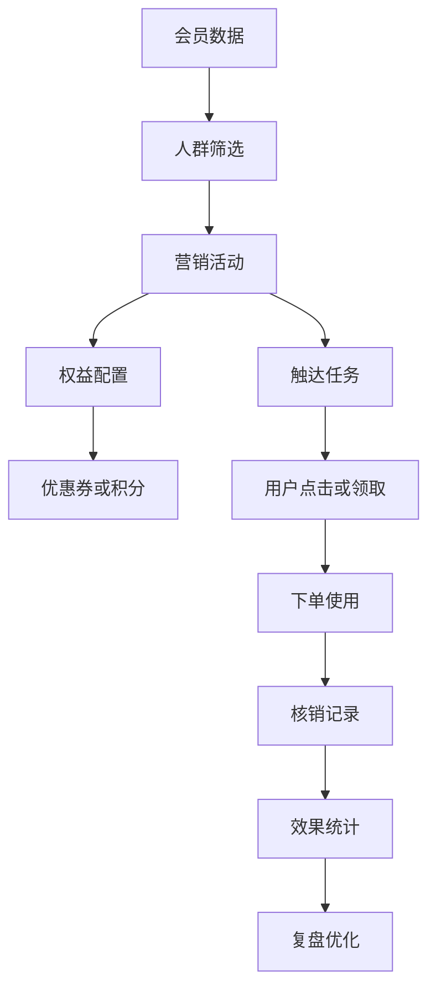
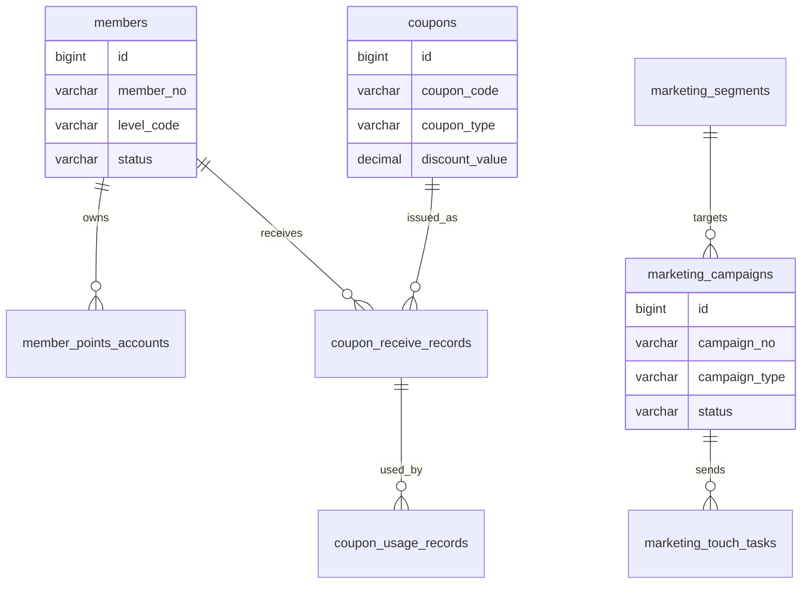
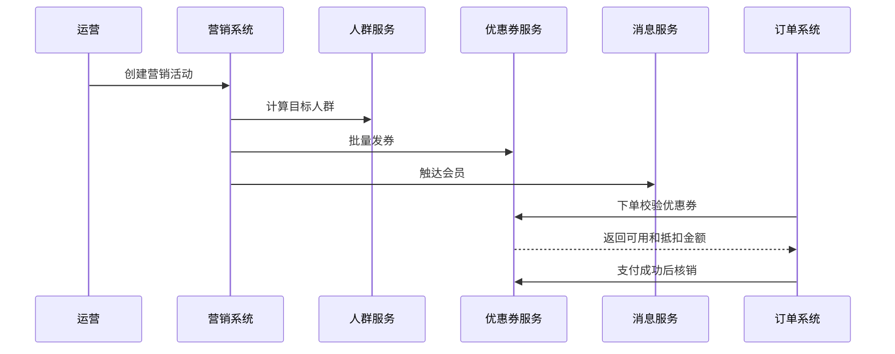

# 会员营销项目案例

## 适合谁看

适合需要做会员等级、积分、优惠券、营销活动、人群包、触达任务、复购分析和营销效果评估的开发者。

会员营销不是“发几张优惠券”。真实项目里，营销要明确目标人群、触达渠道、活动规则、权益发放、使用核销、效果统计和风险控制。否则很容易出现优惠券超发、用户重复领取、活动成本失控、效果无法评估。

## 业务目标

第一版会员营销支持：

- 维护会员等级。
- 管理积分账户。
- 创建优惠券。
- 创建人群包。
- 配置营销活动。
- 支持站内信、短信、邮件等触达。
- 支持优惠券领取和核销。
- 支持营销效果统计。

## 会员营销链路

营销系统要从活动目标开始设计。不同目标会影响人群、权益、触达和效果指标。

## 数据模型

## 推荐表结构

| 表 | 作用 | 关键字段 |
| --- | --- | --- |
| `members` | 会员档案 | `member_no`、`level_code`、`status`、`joined_at` |
| `member_levels` | 会员等级 | `level_code`、`name`、`upgrade_rule`、`benefit_config` |
| `member_points_accounts` | 积分账户 | `member_id`、`available_points`、`frozen_points` |
| `coupons` | 优惠券模板 | `coupon_code`、`coupon_type`、`threshold_amount`、`valid_rule` |
| `coupon_receive_records` | 领券记录 | `coupon_id`、`member_id`、`status`、`expired_at` |
| `coupon_usage_records` | 核销记录 | `receive_id`、`order_no`、`used_amount`、`used_at` |
| `marketing_segments` | 人群包 | `segment_no`、`rule_config`、`member_count` |
| `marketing_campaigns` | 营销活动 | `campaign_no`、`target_segment_id`、`budget_amount`、`status` |
| `marketing_touch_tasks` | 触达任务 | `campaign_id`、`channel`、`send_status`、`sent_at` |

优惠券模板和用户领券记录要分开。模板定义规则，领券记录代表某个用户持有的一张券。

## 优惠券发放流程

优惠券核销要在支付成功后确认，支付失败或订单取消时要释放优惠券。

## 营销规则

| 规则 | 示例 | 注意点 |
| --- | --- | --- |
| 领取限制 | 每人限领 1 张 | 后端必须校验 |
| 使用门槛 | 满 100 减 20 | 金额用 decimal 或整数分 |
| 有效期 | 领取后 7 天有效 | 保存到领券记录 |
| 人群限制 | 仅高价值会员 | 使用时也要校验 |
| 预算限制 | 活动总成本 5 万 | 防止超发 |
| 风控限制 | 同设备批量领券 | 接入风控规则 |

## 前端页面拆分

| 页面 | 作用 | 注意点 |
| --- | --- | --- |
| 会员列表 | 查看会员等级、积分和状态 | 支持按价值和活跃筛选 |
| 会员等级 | 配置升级和权益 | 规则变更要有版本 |
| 积分流水 | 查看积分增减 | 每次变化有业务来源 |
| 优惠券 | 配置券模板 | 区分模板和用户券 |
| 人群包 | 配置筛选条件 | 展示预计人数 |
| 营销活动 | 配置目标、权益和触达 | 活动发布后谨慎修改 |
| 触达记录 | 查看发送状态 | 失败可重试 |
| 效果分析 | 查看领取、使用、转化和成本 | 口径要固定 |

## 实际项目常见问题

### 问题 1：优惠券被重复领取

领取接口必须用会员、活动和优惠券做幂等约束。不要只靠前端按钮禁用。

### 问题 2：活动成本超出预算

发券前要检查库存和预算，核销后要统计实际成本。高风险活动可以分批发放。

### 问题 3：营销效果无法评估

活动要记录触达、打开、领取、使用和转化链路。只知道发了多少券，不知道有多少订单来自活动，就无法复盘。

## 验收清单

- 会员等级、积分和优惠券边界清晰。
- 优惠券模板和领券记录分离。
- 领券、锁券、核销、释放具备幂等性。
- 人群包可复用并保存规则快照。
- 营销活动有预算和库存控制。
- 触达任务有发送记录。
- 效果统计覆盖触达、领取、使用和转化。
- 高风险营销动作接入风控。
- 活动变更有审计。
- 金额和积分流水可追踪。

## 下一步学习

继续学习 [运营活动项目案例](/projects/marketing-campaign-case)、[门店零售管理项目案例](/projects/retail-store-management-case) 和 [风控中心项目案例](/projects/risk-control-center-case)。
