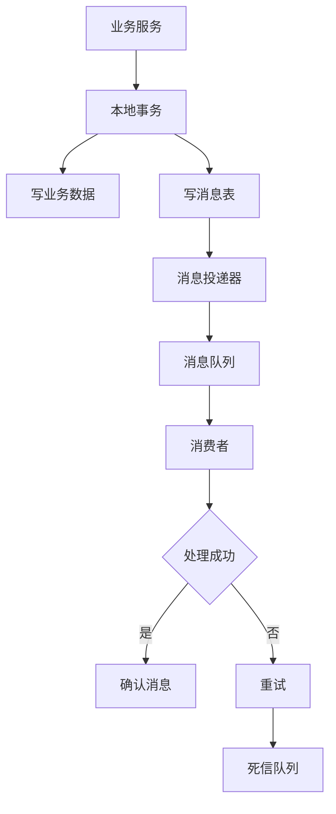
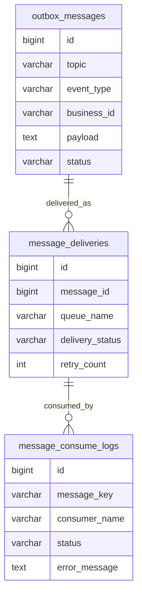
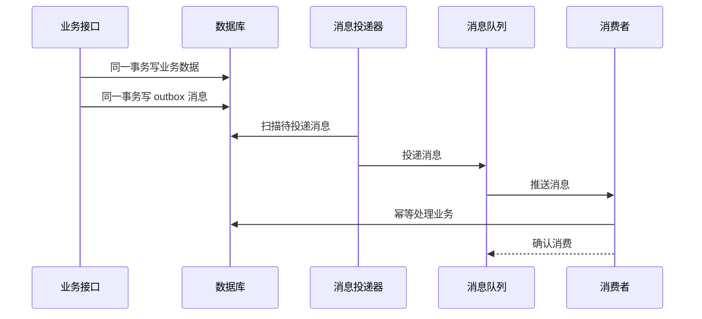

# 消息队列项目案例

## 适合谁看

适合需要做异步处理、事件驱动、削峰填谷、订单通知、搜索索引同步、任务解耦和最终一致性的开发者。

消息队列不是“把慢操作丢到后台”。真实项目里，它会带来新的问题：消息丢失、重复消费、消费失败、顺序不一致、死信、积压、幂等和排查困难。只有理解这些问题，队列才会让系统更稳定。

## 业务目标

第一版消息队列模块支持：

- 业务事件发布。
- 消费者异步处理。
- 消息状态记录。
- 重复消费幂等。
- 失败重试。
- 死信队列。
- 消息积压监控。
- 消费日志和告警。

## 消息链路图



如果业务数据写入成功但消息发送失败，会造成状态不一致。常见做法是使用本地消息表或事务消息，保证业务变更和消息记录一起提交。

## 数据模型



## 推荐表结构

| 表 | 作用 | 关键字段 |
| --- | --- | --- |
| `outbox_messages` | 本地消息表 | `topic`、`event_type`、`business_id`、`payload`、`status` |
| `message_deliveries` | 投递记录 | `message_id`、`queue_name`、`delivery_status`、`retry_count` |
| `message_consume_logs` | 消费记录 | `message_key`、`consumer_name`、`status`、`error_message` |
| `dead_letter_messages` | 死信消息 | `topic`、`payload`、`failed_reason`、`handled_flag` |
| `message_offsets` | 消费位点 | `consumer_group`、`topic`、`offset_value` |

不是所有项目都需要自己建这些表。如果使用成熟 MQ，也仍然建议保存关键业务消息的消费日志，方便排查。

## 发布流程



这种方式牺牲一点实时性，但能降低“业务成功、消息丢失”的风险。

## 适用场景

| 场景 | 为什么适合队列 | 注意点 |
| --- | --- | --- |
| 支付成功后发通知 | 不阻塞支付主流程 | 通知必须幂等 |
| 订单创建后同步搜索索引 | 解耦搜索服务 | 允许短暂延迟 |
| 导入完成后生成报告 | 后台处理耗时任务 | 要有任务状态 |
| 数据变更后刷新缓存 | 削峰和解耦 | 处理乱序消息 |
| 会员到期提醒 | 批量异步发送 | 控制频率和重试 |

不要把所有逻辑都塞进队列。用户必须立即得到结果的校验和核心写入，仍然应该在同步接口里完成。

## 消费幂等

消费者要假设消息可能重复到达。

```ts
async function consumePaymentSuccess(message: PaymentSuccessEvent) {
  const consumed = await consumeLogRepository.exists(message.messageKey, 'payment-success-consumer')
  if (consumed) {
    return
  }

  await transaction(async () => {
    await subscriptionService.activateIfPending(message.orderNo)
    await consumeLogRepository.markSuccess(message.messageKey, 'payment-success-consumer')
  })
}
```

幂等的关键是：同一条消息重复处理时，业务结果不变。

## 前端和管理页

| 页面 | 作用 | 注意点 |
| --- | --- | --- |
| 消息概览 | 查看主题、队列、积压数量 | 面向运维和开发 |
| 消息详情 | 查看 payload 和状态 | 脱敏敏感字段 |
| 消费日志 | 查看成功、失败、重试 | 支持按业务 ID 查询 |
| 死信队列 | 人工处理失败消息 | 重新投递前要确认影响 |
| 告警配置 | 配置积压和失败告警 | 告警要有负责人 |

## 常见问题

### 问题 1：消息重复消费导致用户收到两条通知

消费者没有幂等。通知类消息可以用 `event_type + business_id + receiver_id` 做唯一键，重复消息直接跳过。

### 问题 2：消息积压越来越多

先看消费速度、消费者是否报错、下游服务是否慢、单条消息处理是否过重。必要时横向扩容消费者或拆分队列。

### 问题 3：搜索索引偶尔是旧数据

可能是消息乱序。可以在消息里带 `version` 或 `updated_at`，消费者只接受更新版本的数据。

## 验收清单

- 业务事件有明确 topic 和 event type。
- 业务写入和消息记录能保持一致。
- 消费者支持幂等。
- 失败消息能重试。
- 超过重试次数进入死信。
- 消息积压可监控。
- 消费失败有日志和告警。
- 重新投递死信前需要人工确认。
- payload 不包含不必要的敏感信息。

## 下一步学习

继续学习 [任务调度项目案例](/projects/task-scheduler-case)、[消息通知项目案例](/projects/notification-center-case) 和 [后端接口与服务问题](/projects/issues-backend)。
