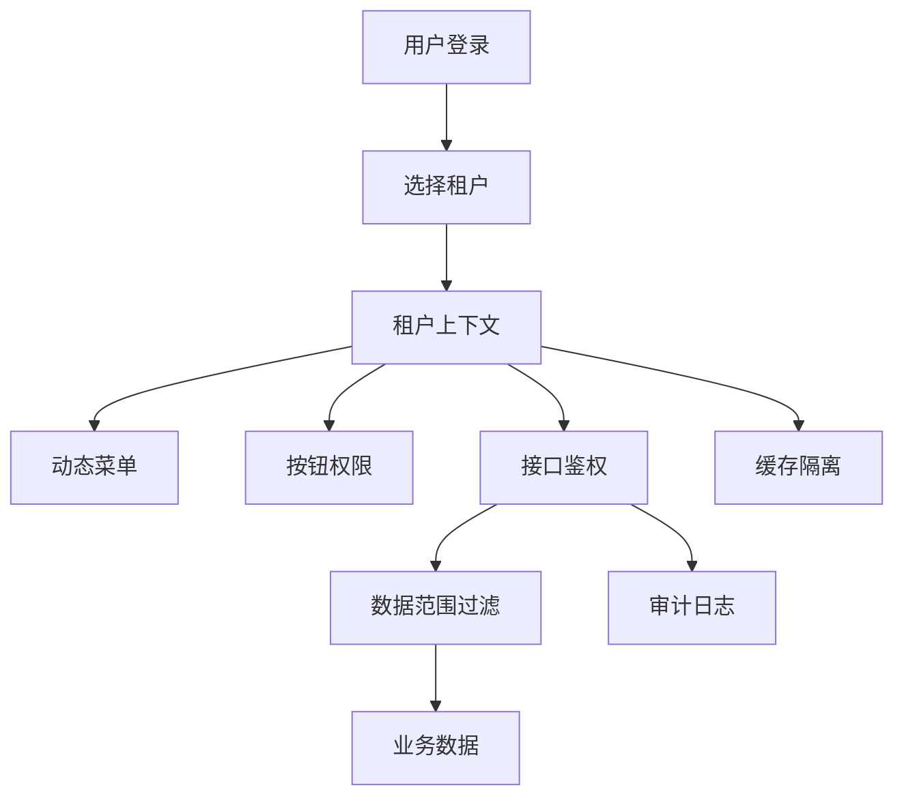
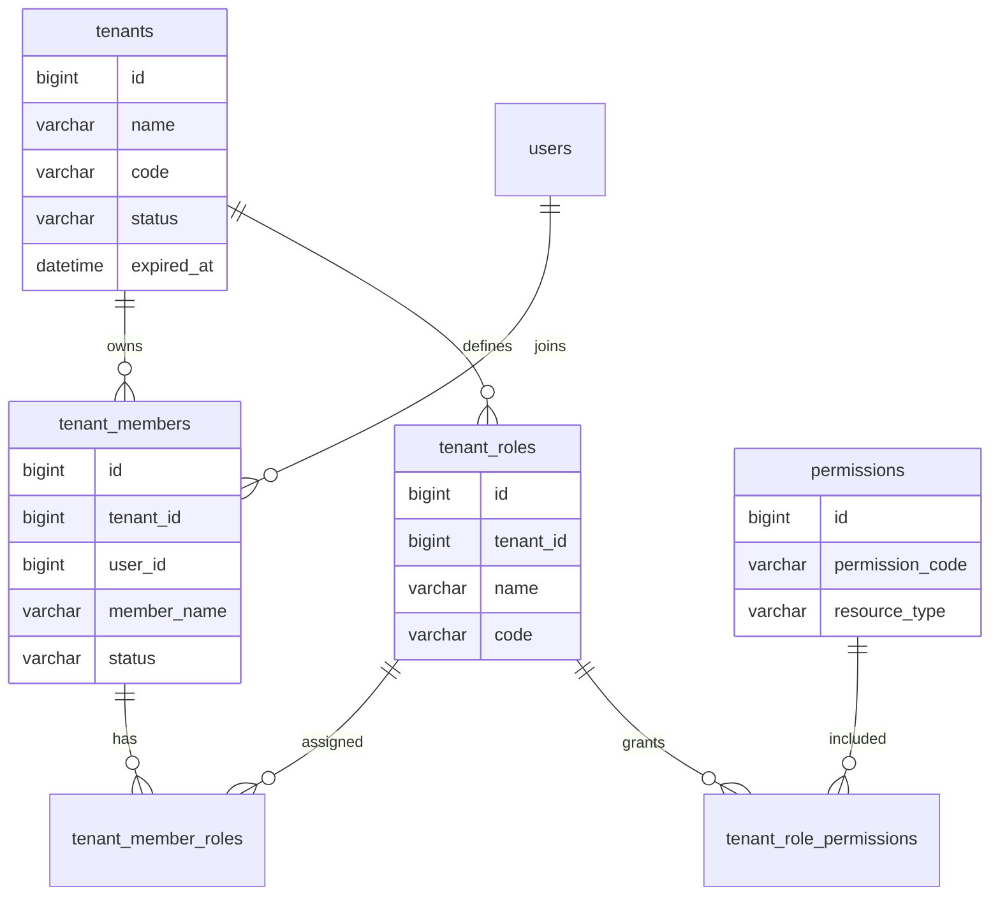
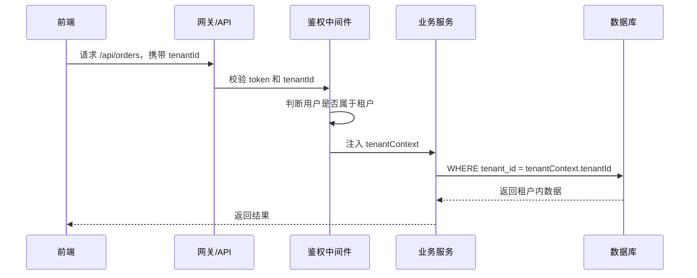

# 多租户权限项目案例

## 适合谁看

适合正在做 SaaS 控制台、企业后台、代理商系统、集团多组织系统，或者需要让多个客户共用一套系统但数据互相隔离的开发者。

多租户不是“表里加一个 `tenant_id` 就结束”。真实项目里，多租户会影响登录、菜单、角色、数据查询、缓存、文件、消息、审计日志、定时任务和运维排查。只要有一个地方忘记带租户条件，就可能出现严重的数据越权。

## 业务目标

第一版多租户权限模块支持：

- 一个系统服务多个租户。
- 用户登录后进入自己的租户空间。
- 同一个用户可以加入多个租户。
- 租户内有自己的角色、菜单和按钮权限。
- 业务数据必须按租户隔离。
- 后端接口统一校验租户上下文。
- 审计日志记录租户、用户、角色和操作来源。
- 支持超级管理员查看租户列表，但不能默认跨租户读取业务数据。

## 核心关系图



要点：租户上下文必须成为请求链路的一部分，而不是只存在于前端页面状态里。

## 租户模型



### 为什么不要只用用户角色表

如果直接把角色绑定到用户，会出现一个问题：同一个用户在 A 租户是管理员，在 B 租户可能只是普通成员。角色必须绑定在“租户成员”上，而不是只绑定在“用户”上。

## 推荐表结构

| 表 | 作用 | 关键字段 |
| --- | --- | --- |
| `tenants` | 租户主表 | `id`、`name`、`code`、`status`、`expired_at` |
| `tenant_members` | 租户成员 | `tenant_id`、`user_id`、`member_name`、`status` |
| `tenant_roles` | 租户内角色 | `tenant_id`、`name`、`code` |
| `tenant_member_roles` | 成员角色关系 | `tenant_member_id`、`role_id` |
| `permissions` | 系统权限点 | `permission_code`、`resource_type` |
| `tenant_role_permissions` | 租户角色权限 | `tenant_id`、`role_id`、`permission_id` |
| `audit_logs` | 审计日志 | `tenant_id`、`user_id`、`action`、`resource_id` |

所有业务表都要明确租户策略：

| 数据类型 | 是否需要 `tenant_id` | 说明 |
| --- | --- | --- |
| 租户业务数据 | 是 | 订单、客户、项目、文件、审批等 |
| 全局字典 | 不一定 | 例如国家、省市、系统内置枚举 |
| 系统权限点 | 不一定 | 权限码通常是平台级定义 |
| 审计日志 | 是 | 便于按租户排查和导出 |
| 定时任务记录 | 视情况 | 如果任务处理租户数据，必须记录 |

## 请求链路



前端传 `tenantId` 只是表达用户当前选择，不能作为可信来源。后端必须用登录态重新校验用户是否属于该租户。

## 前端页面拆分

| 页面 | 作用 | 注意点 |
| --- | --- | --- |
| 租户选择页 | 登录后选择当前工作空间 | 多租户用户必须先选择 |
| 租户管理页 | 平台管理员维护租户 | 高风险操作需要二次确认 |
| 成员管理页 | 租户管理员邀请、禁用成员 | 不能删除历史业务关联成员 |
| 角色权限页 | 租户内分配菜单和按钮权限 | 权限树要区分菜单、按钮、接口 |
| 审计日志页 | 查看租户内操作记录 | 支持按用户、动作、资源筛选 |

## 后端实现要点

### 1. 统一租户上下文

不要在每个接口里手写：

```ts
const tenantId = req.headers['x-tenant-id']
```

更推荐在鉴权中间件里统一解析、校验并注入：

```ts
interface TenantContext {
  tenantId: string
  tenantCode: string
  userId: string
  memberId: string
  permissionCodes: string[]
}
```

后续业务服务只读取可信的 `tenantContext`。

### 2. 查询必须默认带租户条件

```ts
async function listOrders(ctx: TenantContext, query: OrderQuery) {
  return orderRepository.findMany({
    tenantId: ctx.tenantId,
    keyword: query.keyword,
    status: query.status
  })
}
```

不要把 `tenantId` 暴露成普通筛选条件让前端随便传。

### 3. 缓存 key 必须带租户

```ts
function permissionCacheKey(tenantId: string, memberId: string) {
  return `tenant:${tenantId}:member:${memberId}:permissions`
}
```

如果缓存 key 少了租户，A 租户的权限结果可能被 B 租户命中。

## 常见问题

### 问题 1：超级管理员为什么不能默认绕过租户过滤

超级管理员可以管理租户，但不应该在普通业务接口里默认跨租户读数据。更稳妥的方式是提供独立的“平台管理接口”，并在审计日志里明确记录跨租户操作原因。

### 问题 2：导出数据时出现其他租户数据

常见原因是导出接口复用了后台查询，但忘记传入租户上下文。导出、批量任务、定时任务和异步队列都要显式携带租户信息。

### 问题 3：切换租户后菜单还是旧的

通常是权限缓存、前端路由缓存或 Pinia 状态没有按租户清理。切换租户时要清空菜单、按钮权限、当前页缓存和业务筛选条件。

## 验收清单

- 登录后能选择租户。
- 用户不能进入未加入的租户。
- 每个业务表都有明确租户策略。
- 普通业务查询默认带 `tenant_id`。
- 缓存 key 包含租户维度。
- 文件、消息、导出和审计日志都记录租户。
- 超级管理员跨租户操作有单独接口和审计记录。
- 自动化测试覆盖“访问其他租户数据失败”。

## 下一步学习

继续学习 [权限系统案例](/projects/permission-case-study)、[数据库安全与审计](/database/security-audit) 和 [Node 权限 API 从零到项目](/node/permission-api-project)。
