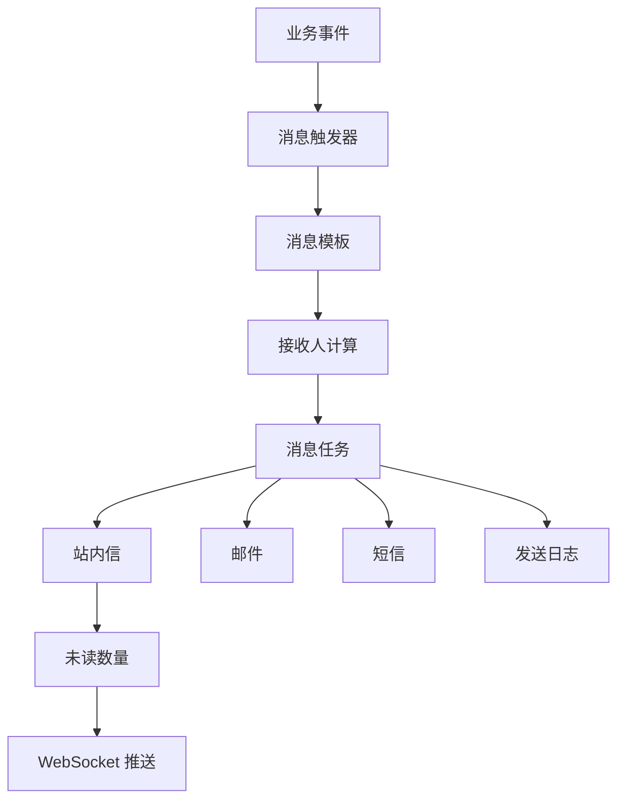
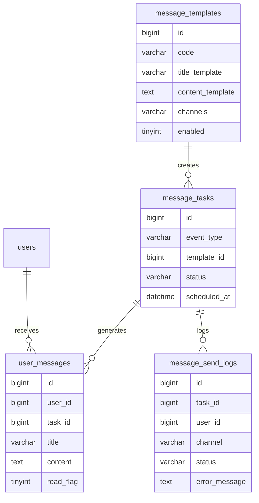
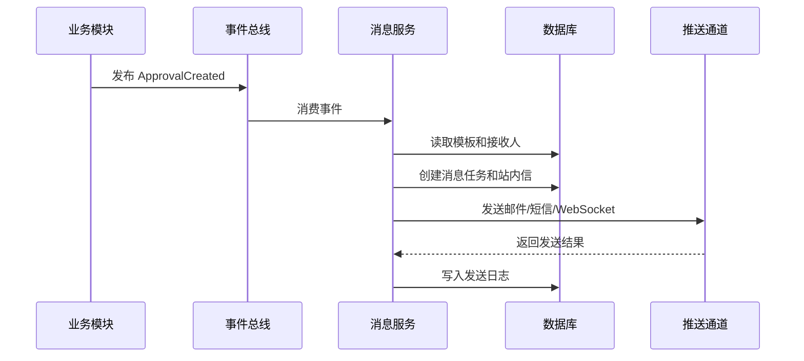

# 消息通知项目案例

## 适合谁看

适合需要做站内信、审批提醒、系统公告、待办通知、短信邮件推送、WebSocket 实时消息的开发者。

消息通知看起来只是“给用户发一条消息”，但真实项目里会涉及触发时机、消息模板、接收人计算、已读未读、重试、去重、频控、站内信和外部通道的一致性。

## 业务目标

第一版消息中心支持：

- 系统公告。
- 站内信。
- 审批待办提醒。
- 消息已读、未读。
- 按用户、角色、部门发送。
- 支持站内信、邮件、短信等通道扩展。
- 支持失败重试和发送日志。
- 支持 WebSocket 推送未读数量。

## 先看消息中心

一条业务事件可能生成站内信，同时触发 WebSocket、邮件或短信。用户读状态与外部通道发送状态必须分开保存。

<DocFigure
  src="/images/projects/notification-center-unread.webp"
  alt="消息中心展示审批提醒、报表完成和权限更新消息，以及站内信、WebSocket、邮件和短信通道状态"
  caption="用户消息记录负责已读未读，发送任务负责渠道重试；二者共享业务事件但不是同一个状态。"
  :width="1440"
  :height="900"
/>

图中邮件重试不会撤销已经送达的站内信。消费者应使用 `event_id + user_id + template_code` 做幂等，避免队列重试时给同一用户生成重复消息。

## 消息链路图

建议把“业务事件”和“消息发送”解耦。订单、审批、文件等业务模块只抛出事件，不直接关心短信网关或邮件服务。

## 数据模型

## 推荐表结构

| 表 | 作用 | 关键字段 |
| --- | --- | --- |
| `message_templates` | 消息模板 | `code`、`title_template`、`content_template`、`channels` |
| `message_tasks` | 消息发送任务 | `event_type`、`template_id`、`status`、`scheduled_at` |
| `user_messages` | 用户站内信 | `user_id`、`title`、`content`、`read_flag` |
| `message_send_logs` | 通道发送日志 | `channel`、`status`、`retry_count`、`error_message` |
| `message_preferences` | 用户通知偏好 | `user_id`、`channel`、`enabled` |

站内信和外部通道日志建议分开存。站内信是产品数据，发送日志是排错数据。

## 发送流程

如果项目早期没有消息队列，可以先用数据库任务表加定时任务处理，但接口里不要同步等待所有通道发送完成。

## 接收人计算

| 场景 | 接收人来源 | 注意点 |
| --- | --- | --- |
| 审批待办 | 当前节点审批人 | 角色审批要展开到具体用户 |
| 系统公告 | 全部用户或指定租户 | 大批量消息要分页生成 |
| 部门通知 | 部门成员 | 要处理部门层级和禁用用户 |
| 角色通知 | 拥有角色的成员 | 多租户项目要限制租户 |
| 个人消息 | 指定用户 | 要校验用户是否存在且可接收 |

接收人计算必须是后端逻辑，不能由前端传一组用户 ID 后直接发送。

## 前端页面拆分

| 页面或组件 | 作用 | 注意点 |
| --- | --- | --- |
| 消息铃铛 | 展示未读数量 | 数字要限制最大显示，例如 `99+` |
| 消息列表 | 查看站内信 | 支持全部、未读、已读筛选 |
| 消息详情 | 查看消息内容 | 打开详情后可自动标记已读 |
| 消息模板管理 | 配置标题和内容模板 | 需要预览变量替换结果 |
| 通知偏好 | 用户选择通知渠道 | 系统强制消息不能被关闭 |
| 发送日志 | 排查邮件短信失败 | 支持按通道、状态、时间筛选 |

## 未读数量设计

未读数量可以从数据库实时查询，也可以缓存。

| 方案 | 优点 | 风险 |
| --- | --- | --- |
| 实时 count | 简单、准确 | 用户量大时查询压力高 |
| Redis 计数 | 性能好 | 要处理读写一致性 |
| 定时汇总 | 压力小 | 数字不够实时 |

第一版可以先实时 count，并给 `user_id + read_flag` 建索引。数据量上来后再加 Redis 计数。

## 常见问题

### 问题 1：同一个审批提醒收到两次

常见原因是事件重复消费或接口重复提交。消息任务要有幂等键，例如 `event_type + business_id + template_code + receiver_id`。

### 问题 2：未读数量和列表不一致

可能是缓存没有同步更新，也可能是批量已读只更新了列表表，没有更新计数。先明确未读数量的权威来源，再处理缓存失效。

### 问题 3：短信失败但用户以为业务失败了

外部通道失败不一定代表业务失败。业务结果和通知结果要分开，通知失败进入重试和告警，不要让主业务事务被短信服务拖垮。

## 验收清单

- 业务模块只发布事件，不直接调用短信或邮件。
- 消息模板支持变量预览。
- 接收人由后端计算。
- 站内信支持未读、已读、批量已读。
- 未读数量能实时或准实时更新。
- 外部通道发送失败有日志和重试。
- 重复事件不会生成重复消息。
- 大批量公告不会阻塞接口响应。

## 下一步学习

继续学习 [审批流项目案例](/projects/approval-workflow-case)、[WebSocket](/browser/websocket) 和 [后端接口与服务问题](/projects/issues-backend)。
