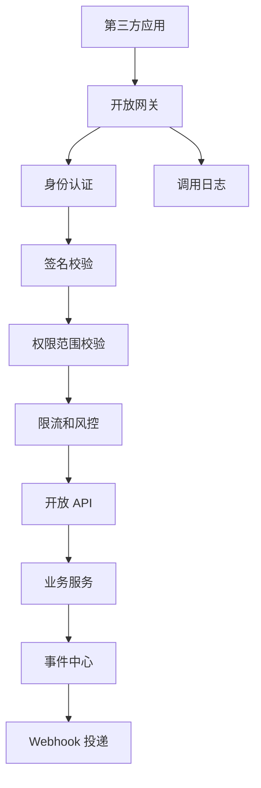
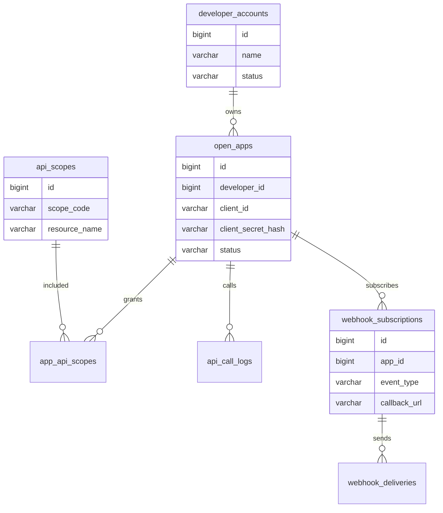
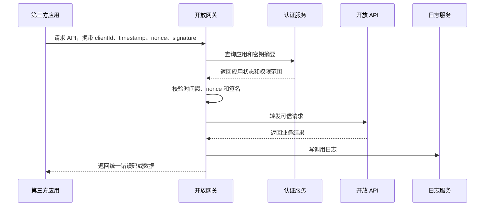
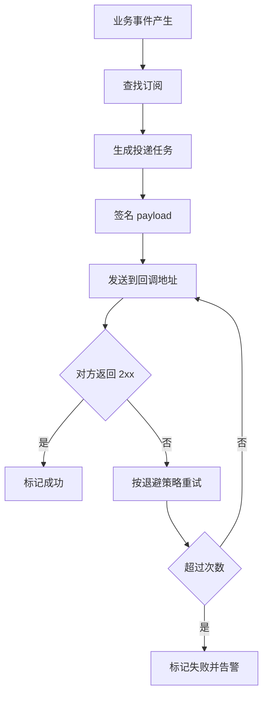

# 第三方开放平台项目案例

## 适合谁看

适合需要做开放 API、第三方应用接入、Webhook、OAuth 授权、接口签名、调用限流、开发者后台和 API 审计的开发者。

开放平台不是“把内部接口开放出去”。真实项目里，外部调用者不可信，网络环境不稳定，接口版本会演进，调用量可能突然升高，错误会直接影响合作方业务。因此开放平台必须从身份、权限、签名、限流、审计、版本和回调重试开始设计。

## 业务目标

第一版开放平台支持：

- 创建第三方应用。
- 分配 `client_id` 和 `client_secret`。
- 支持 OAuth 授权或应用级签名调用。
- 支持 API 权限范围。
- 支持接口限流。
- 支持调用日志和错误排查。
- 支持 Webhook 事件订阅。
- 支持 API 版本治理。
- 支持密钥轮换。

## 整体架构

开放平台建议和内部管理后台隔离。即使底层复用业务服务，入口层也要有单独的认证、限流、日志和错误码。

## 数据模型

## 推荐表结构

| 表 | 作用 | 关键字段 |
| --- | --- | --- |
| `developer_accounts` | 开发者账号 | `name`、`contact_email`、`status` |
| `open_apps` | 第三方应用 | `client_id`、`client_secret_hash`、`status`、`owner_id` |
| `api_scopes` | API 权限范围 | `scope_code`、`resource_name`、`action` |
| `app_api_scopes` | 应用授权范围 | `app_id`、`scope_id`、`expires_at` |
| `api_call_logs` | 调用日志 | `app_id`、`api_path`、`status_code`、`latency_ms` |
| `webhook_subscriptions` | Webhook 订阅 | `app_id`、`event_type`、`callback_url`、`secret` |
| `webhook_deliveries` | Webhook 投递记录 | `subscription_id`、`status`、`retry_count` |

`client_secret` 不要明文保存，只保存 hash。开发者只能在创建或重置时看到一次明文密钥。

## 签名调用流程

签名必须包含请求方法、路径、时间戳、随机数和请求体摘要。否则攻击者可能复制旧请求或篡改参数。

## Webhook 投递流程

Webhook 必须允许失败重试。不要在业务主事务里同步等待第三方回调成功。

## API 版本治理

| 策略 | 说明 |
| --- | --- |
| URL 版本 | 例如 `/openapi/v1/orders`，简单直观 |
| Header 版本 | URL 更稳定，但调试成本略高 |
| 废弃期 | 老版本下线前必须公告和灰度 |
| 兼容字段 | 新增字段通常安全，删除或改名是破坏性变更 |
| 错误码稳定 | 第三方会依赖错误码做逻辑判断 |

开放平台接口不要频繁破坏兼容。内部服务可以重构，但开放 API 契约必须稳定。

## 前端页面拆分

| 页面 | 作用 | 注意点 |
| --- | --- | --- |
| 开发者概览 | 展示应用、调用量、错误率 | 适合开发者快速定位问题 |
| 应用管理 | 创建应用、重置密钥 | 密钥只展示一次 |
| 权限申请 | 申请 API scope | 高风险权限需要审核 |
| API 文档 | 展示接口、参数、错误码 | 文档要和版本绑定 |
| Webhook 配置 | 配置事件和回调地址 | 支持测试发送 |
| 调用日志 | 查看请求、响应、耗时 | 敏感参数要脱敏 |

## 常见问题

### 问题 1：第三方说接口偶发签名失败

先检查时间戳误差、请求体序列化、参数排序、换行符和编码。签名算法要给出明确示例和测试工具。

### 问题 2：Webhook 重试造成对方重复处理

Webhook 接收方也要幂等。平台侧要提供唯一事件 ID，并在文档里说明同一事件可能投递多次。

### 问题 3：开放 API 被大量刷接口

必须做应用级、IP 级、用户级限流，并支持临时禁用应用。调用日志要能定位来源和影响范围。

## 验收清单

- 应用密钥不明文保存。
- API 调用需要签名或 OAuth token。
- 请求有时间戳和 nonce 防重放。
- 每个 API 有明确 scope。
- 调用日志可按应用、接口、状态码查询。
- 限流和禁用应用可生效。
- Webhook 支持签名、重试和投递日志。
- API 文档包含版本、参数、错误码和示例。
- 密钥重置和高风险权限申请有审计记录。

## 下一步学习

继续学习 [权限系统案例](/projects/permission-case-study)、[消息队列项目案例](/projects/message-queue-case) 和 [后端接口与服务问题](/projects/issues-backend)。
