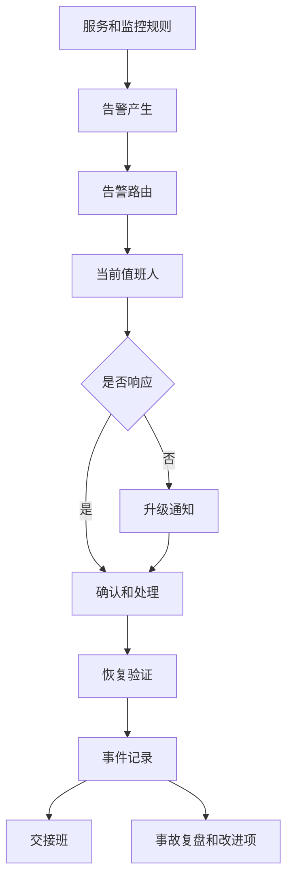
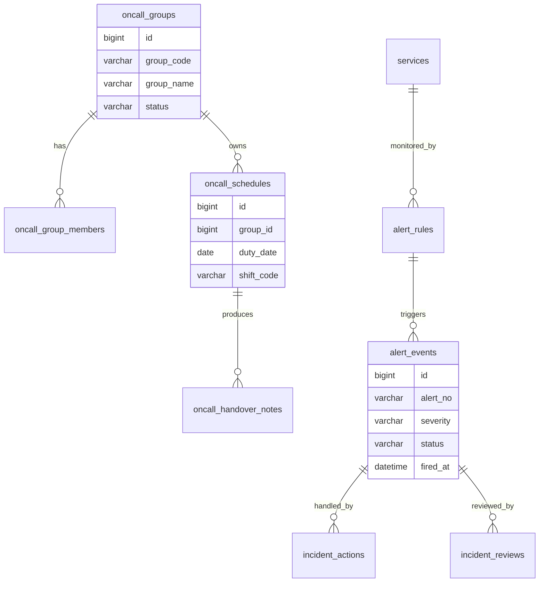
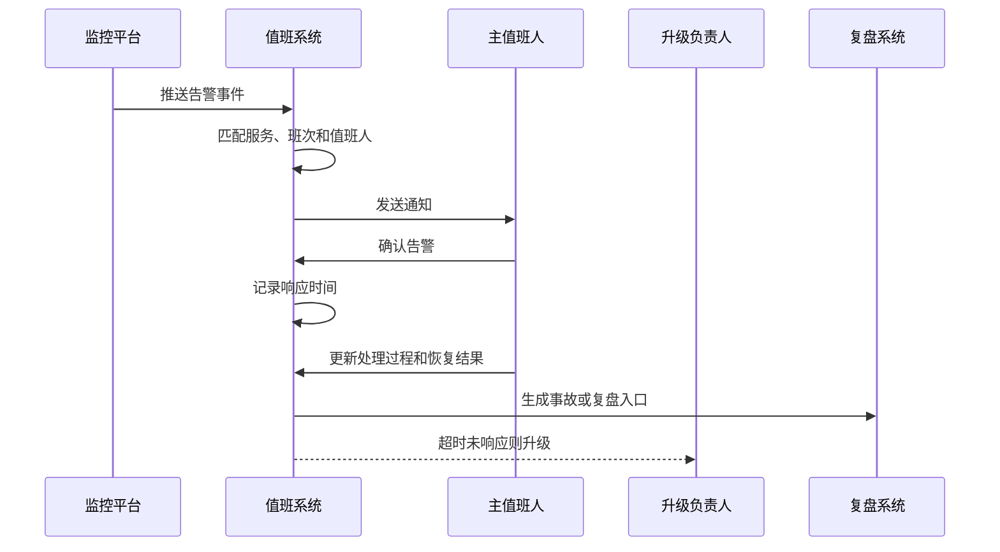

# 运维值班项目案例

## 适合谁看

适合需要做运维值班、告警分派、升级通知、事故处理、值班交接、SLO、故障复盘和生产保障平台的开发者。

运维值班不是“排个班表”。真实线上系统会同时面对监控告警、用户报障、发布变更、容量风险、第三方故障和安全事件。值班系统要回答：现在谁负责、告警应该通知谁、多久无人响应要升级、处理过程如何记录、交接时哪些风险不能丢。

## 业务目标

第一版运维值班支持：

- 维护值班组、服务和成员。
- 配置值班班次和值班日历。
- 支持主值、副值、备份人和升级人。
- 接入监控告警和用户报障。
- 根据服务、等级和时间路由告警。
- 记录响应、确认、处理和恢复过程。
- 支持交接班、值班日报和周报。
- 关联事故、复盘和改进项。
- 统计响应时间、恢复时间和 SLO 达成情况。

## 运维值班链路

值班系统的核心不是通知，而是把“谁负责、何时响应、怎么处理、结果如何”串起来。

## 核心概念

| 概念 | 说明 | 示例 |
| --- | --- | --- |
| 值班组 | 负责一组服务的团队 | 交易系统值班组 |
| 服务 | 被监控和保障的业务或技术服务 | 订单 API、支付回调 |
| 班次 | 一段值班时间 | 09:00-18:00、18:00-09:00 |
| 主值 | 当前第一响应人 | 当天主值工程师 |
| 副值 | 协助处理或备份 | 数据库工程师 |
| 升级人 | 超时未响应时通知的人 | 技术负责人 |
| 告警路由 | 根据规则找到处理人 | P0 支付告警通知主值和负责人 |
| SLO | 服务可靠性目标 | 可用性 99.9%、P95 < 300ms |

值班系统必须和服务目录绑定。只知道“谁今天值班”，不知道“这个告警属于哪个服务”，系统就无法正确路由。

## 数据模型

## 推荐表结构

| 表 | 作用 | 关键字段 |
| --- | --- | --- |
| `oncall_groups` | 值班组 | `group_code`、`group_name`、`owner_id`、`status` |
| `oncall_group_members` | 值班组成员 | `group_id`、`user_id`、`role_code`、`enabled` |
| `services` | 服务目录 | `service_code`、`service_name`、`owner_group_id`、`slo_target` |
| `oncall_schedules` | 值班排班 | `group_id`、`duty_date`、`shift_code`、`primary_user_id` |
| `oncall_escalation_rules` | 升级规则 | `group_id`、`severity`、`timeout_minutes`、`escalation_user_id` |
| `alert_rules` | 告警规则 | `service_id`、`metric_code`、`threshold`、`severity` |
| `alert_events` | 告警事件 | `alert_no`、`service_id`、`severity`、`status`、`fired_at` |
| `incident_actions` | 处理动作 | `alert_event_id`、`action_type`、`operator_id`、`content` |
| `oncall_handover_notes` | 交接班记录 | `schedule_id`、`risk_summary`、`open_issues` |
| `incident_reviews` | 事故复盘 | `alert_event_id`、`root_cause`、`followup_status` |

告警事件要保存当时匹配到的值班人快照。排班后续可能调整，但历史告警必须能追溯当时通知了谁。

## 告警处理流程

告警通知要和确认动作分开。消息发出只能说明通知已发送，不能说明有人正在处理。

## 告警等级设计

| 等级 | 含义 | 处理要求 |
| --- | --- | --- |
| P0 | 核心业务大面积不可用 | 立即通知主值、负责人和管理层 |
| P1 | 核心链路异常或大量用户受影响 | 主值必须快速确认并升级 |
| P2 | 单服务异常或部分用户受影响 | 值班人处理并记录 |
| P3 | 低风险异常或趋势预警 | 进入待处理队列 |
| P4 | 信息提示 | 可在交接班中关注 |

等级要和响应时限绑定。例如 P0 5 分钟未确认就升级，P1 10 分钟未确认升级。只定义等级，不定义处理时限，等级没有实际意义。

## 前端页面拆分

| 页面或组件 | 作用 | 注意点 |
| --- | --- | --- |
| 值班工作台 | 当前值班、未确认告警、风险事项 | 首屏突出“我现在要处理什么” |
| 值班日历 | 查看和调整排班 | 支持换班、请假和冲突提示 |
| 服务目录 | 管理服务和负责人 | 服务要绑定值班组和 SLO |
| 告警事件 | 查看告警状态和处理过程 | 支持按等级、服务、负责人筛选 |
| 告警详情 | 记录确认、处理、恢复和证据 | 时间线要清晰 |
| 升级规则 | 配置超时升级 | 不同等级不同规则 |
| 交接班 | 填写开放问题和风险 | 未关闭高等级告警必须带到下一班 |
| 值班报表 | 统计响应、恢复和 SLO | 支持按服务和团队查看 |

值班工作台不要做成普通列表。它要把当前最紧急的告警、需要交接的风险、即将开始的班次放在最明显的位置。

## 接口拆分建议

| 接口 | 作用 | 注意点 |
| --- | --- | --- |
| `GET /oncall/current` | 查询当前值班信息 | 按服务和值班组返回主值、副值和升级人 |
| `GET /oncall/schedules` | 查询排班日历 | 支持按组、成员、日期筛选 |
| `POST /oncall/schedules/swap` | 换班 | 校验冲突并记录原因 |
| `POST /alerts/events` | 接收告警事件 | 使用外部告警 ID 保证幂等 |
| `POST /alerts/{id}/ack` | 确认告警 | 记录首次响应时间 |
| `POST /alerts/{id}/actions` | 添加处理动作 | 保存证据、命令、截图或链接 |
| `POST /alerts/{id}/resolve` | 标记恢复 | 需要恢复验证说明 |
| `POST /oncall/handover` | 提交交接班 | 未关闭告警自动带入 |

## 实际项目常见问题

### 问题 1：告警发了很多群，但没人认领

群通知不是责任机制。告警必须路由到具体值班人，并要求确认。超时未确认要升级到负责人，同时记录响应时长。

### 问题 2：排班调整后历史事故查不到当时谁值班

告警事件要保存通知目标快照，包括主值、副值、升级人和通知渠道。不能只通过当前排班表反查历史。

### 问题 3：低质量告警太多，值班人开始忽略

要建立告警治理机制。统计噪声告警、重复告警和长期未处理告警，定期调整阈值、合并规则或降级等级。

### 问题 4：交接班遗漏未恢复风险

交接班页面要自动带出未关闭 P0/P1/P2 告警、未完成改进项、发布变更和容量风险。不要完全依赖值班人手写。

## 权限与审计

运维值班权限至少要区分：

- 查看值班日历。
- 编辑排班。
- 发起换班。
- 配置服务和告警规则。
- 确认告警。
- 标记恢复。
- 修改告警等级。
- 配置升级规则。
- 查看事故复盘。
- 导出值班报表。

修改排班、告警等级、恢复状态和升级规则都要记录审计。生产保障相关操作会影响事故责任追溯，不能只保留最终状态。

## 验收清单

- 服务目录和值班组绑定清晰。
- 排班支持主值、副值和升级人。
- 告警能根据服务、等级和时间找到当前值班人。
- 告警通知、确认、处理、恢复状态分离。
- 超时未确认能自动升级。
- 告警事件保存值班人快照。
- 交接班自动带出未关闭风险。
- 值班报表能统计响应时间和恢复时间。
- 高等级事故能进入复盘流程。
- 告警规则和排班变更有审计记录。

## 下一步学习

继续学习 [上线事故案例库](/projects/production-incident-cases)、[故障复盘模板](/projects/incident-review)、[任务调度项目案例](/projects/task-scheduler-case) 和 [跨区域灾备管理项目案例](/projects/disaster-recovery-case)。
