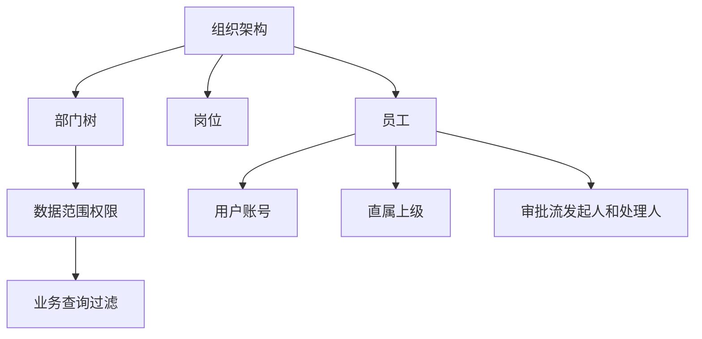
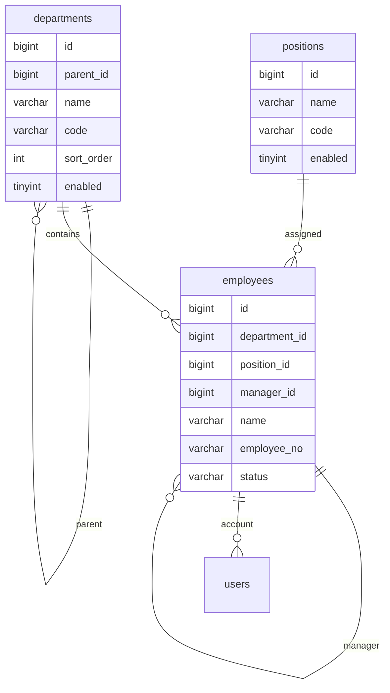
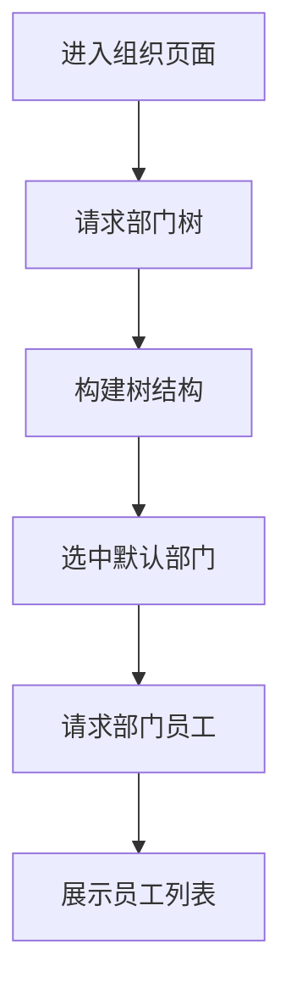

# 组织架构项目案例

## 适合谁看

适合正在做企业后台、SaaS 控制台、人事系统、权限系统，或者需要处理部门、岗位、员工、数据范围权限的开发者。

组织架构不是“一个树形部门列表”。真实项目里，它会影响用户归属、角色授权、数据权限、审批流、报表统计和离职交接。设计不好，后续每个业务模块都会被组织数据拖住。

## 业务目标

第一版组织架构模块支持：

- 维护部门树。
- 维护岗位。
- 维护员工。
- 员工绑定部门、岗位、直属上级。
- 部门负责人设置。
- 员工启用、禁用、离职。
- 支持按组织范围查询数据。
- 给权限系统提供数据范围。

## 模块关系图



组织架构通常是很多系统的基础数据。它不一定每天修改，但一旦出错，影响范围很大。

## 数据模型



关键点：

- 部门要有稳定 `code`，不要只依赖自增 ID。
- 员工要有 `employee_no`，用于和 HR、财务、考勤等系统对齐。
- 员工离职通常不直接删除，而是改状态。
- 直属上级建议放员工表，但要防止形成循环关系。

## 推荐表结构

```sql
CREATE TABLE departments (
  id BIGINT PRIMARY KEY AUTO_INCREMENT COMMENT '部门主键',
  parent_id BIGINT NULL COMMENT '父部门 ID，NULL 表示顶级部门',
  code VARCHAR(64) NOT NULL COMMENT '部门编码，稳定业务标识',
  name VARCHAR(100) NOT NULL COMMENT '部门名称',
  sort_order INT NOT NULL DEFAULT 0 COMMENT '同级排序',
  enabled TINYINT NOT NULL DEFAULT 1 COMMENT '是否启用：1 启用，0 禁用',
  created_at DATETIME NOT NULL DEFAULT CURRENT_TIMESTAMP COMMENT '创建时间',
  updated_at DATETIME NOT NULL DEFAULT CURRENT_TIMESTAMP ON UPDATE CURRENT_TIMESTAMP COMMENT '更新时间',
  UNIQUE KEY uk_departments_code (code),
  KEY idx_departments_parent_sort (parent_id, sort_order)
) COMMENT='组织部门表，用于维护企业组织树和数据范围权限';
```

```sql
CREATE TABLE employees (
  id BIGINT PRIMARY KEY AUTO_INCREMENT COMMENT '员工主键',
  employee_no VARCHAR(64) NOT NULL COMMENT '员工工号，跨系统对齐使用',
  name VARCHAR(100) NOT NULL COMMENT '员工姓名',
  department_id BIGINT NOT NULL COMMENT '所属部门 ID',
  position_id BIGINT NULL COMMENT '岗位 ID',
  manager_id BIGINT NULL COMMENT '直属上级员工 ID',
  status VARCHAR(32) NOT NULL DEFAULT 'active' COMMENT '员工状态：active 在职，disabled 停用，left 离职',
  joined_at DATE NULL COMMENT '入职日期',
  left_at DATE NULL COMMENT '离职日期',
  created_at DATETIME NOT NULL DEFAULT CURRENT_TIMESTAMP COMMENT '创建时间',
  updated_at DATETIME NOT NULL DEFAULT CURRENT_TIMESTAMP ON UPDATE CURRENT_TIMESTAMP COMMENT '更新时间',
  UNIQUE KEY uk_employees_no (employee_no),
  KEY idx_employees_department (department_id),
  KEY idx_employees_manager (manager_id),
  KEY idx_employees_status (status)
) COMMENT='员工表，用于组织归属、审批处理人、数据权限和账号绑定';
```

## 页面拆分

```text
views/organization/
├─ departments/
│  ├─ DepartmentTree.vue
│  ├─ DepartmentDetail.vue
│  └─ DepartmentFormDrawer.vue
├─ employees/
│  ├─ EmployeeSearch.vue
│  ├─ EmployeeTable.vue
│  └─ EmployeeFormDrawer.vue
└─ positions/
   ├─ PositionTable.vue
   └─ PositionFormDialog.vue
```

页面职责：

| 页面 | 重点 |
| --- | --- |
| 部门树 | 展示层级、排序、新增子部门、禁用部门 |
| 员工列表 | 搜索、筛选、分页、编辑、离职处理 |
| 岗位管理 | 岗位字典、启用停用 |
| 部门详情 | 部门负责人、成员数量、子部门 |

## 部门树加载流程



如果部门很多，不要一次性加载所有员工。部门树和员工列表应该分开请求。

## 数据范围权限

组织架构常用于数据范围过滤。

常见范围：

| 范围 | 含义 |
| --- | --- |
| self | 只能看自己创建或负责的数据 |
| department | 能看本部门数据 |
| department_tree | 能看本部门及子部门数据 |
| custom | 能看指定部门 |
| all | 能看全部 |

后端查询时要把范围转成过滤条件：

```ts
const departmentIds = await getVisibleDepartmentIds(currentUser)

return repository.findOrders({
  departmentIds,
  status: query.status
})
```

不要只在前端隐藏菜单。数据范围必须在后端查询层兜底。

## 常见问题

### 问题 1：部门被删除后，员工变成无归属

部门有员工、子部门、审批流、历史数据时，不应该直接删除。更稳妥的方式是禁用部门，或者要求先迁移员工和子部门。

### 问题 2：直属上级形成循环

例如 A 的上级是 B，B 的上级又设置成 A。保存前要检查管理链路，禁止循环。

### 问题 3：组织调整后历史报表变化

如果报表要按历史组织统计，业务数据里要保存当时的部门快照，而不是每次都用员工当前部门反查。

## 验收清单

- 部门树支持新增、编辑、禁用、排序。
- 禁用部门前检查是否有子部门和员工。
- 员工支持部门、岗位、直属上级、状态管理。
- 员工离职不直接删除历史数据。
- 数据范围权限能在后端查询中生效。
- 组织调整有审计日志。
- README 写清组织数据和权限系统的关系。

## 下一步学习

继续学习 [权限系统案例](/projects/permission-case-study)、[数据库项目落地实践](/database/project-practice) 和 [Node 权限 API 从零到项目](/node/permission-api-project)。
