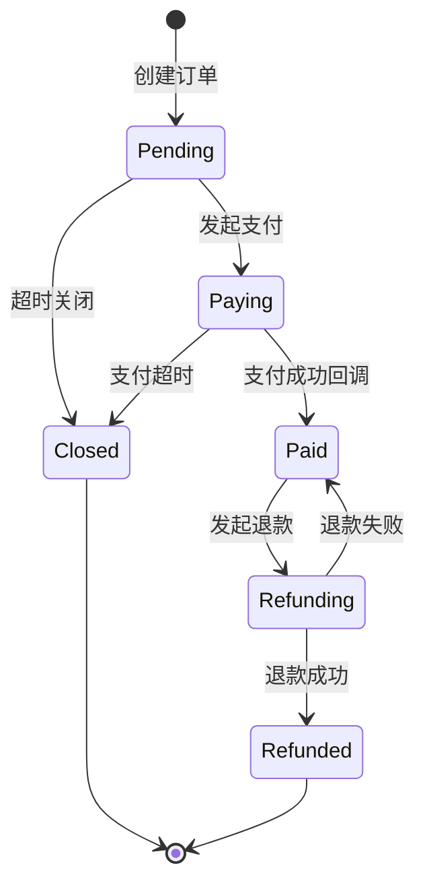
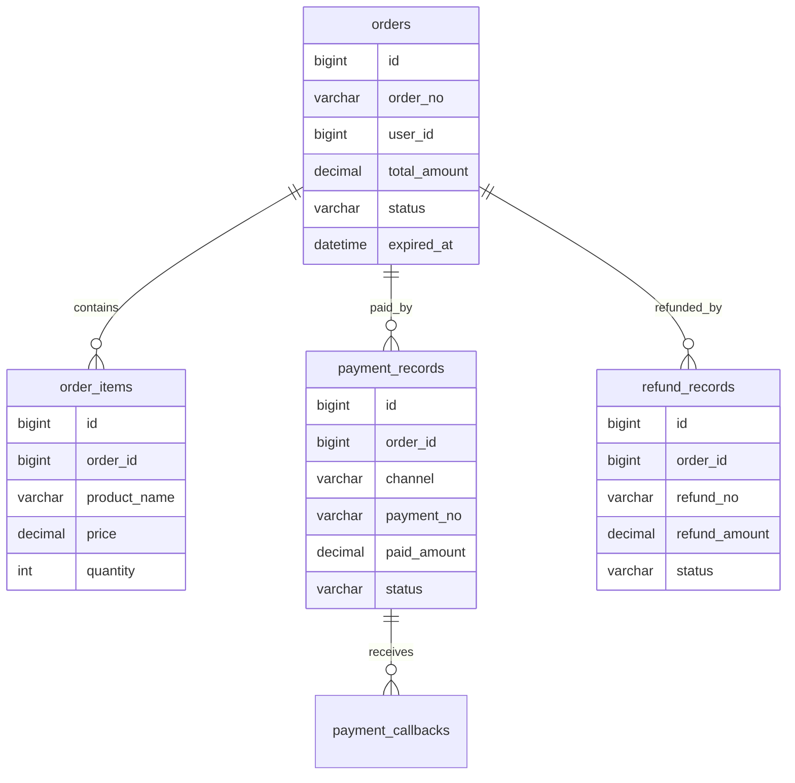
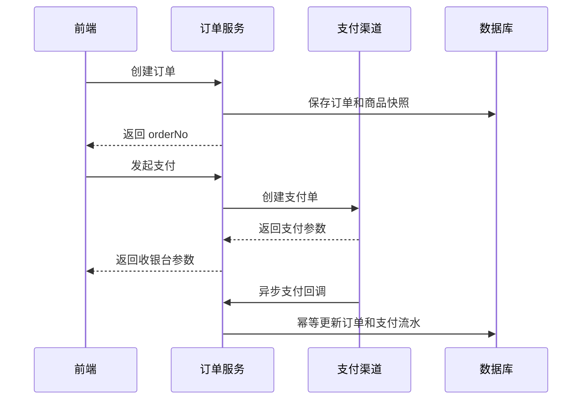

# 支付订单项目案例

## 适合谁看

适合需要做会员订阅、课程购买、SaaS 套餐、在线订单、支付回调、退款和对账的开发者。

支付订单是高风险模块。它不只是一张订单表，还涉及金额精度、订单状态机、支付渠道、回调幂等、超时关闭、退款、发票、对账和审计。这里的目标不是直接接入某个支付平台，而是先掌握通用设计。

## 业务目标

第一版支付订单模块支持：

- 创建订单。
- 锁定订单金额和商品快照。
- 发起支付。
- 接收支付回调。
- 幂等更新订单状态。
- 超时关闭未支付订单。
- 发起退款。
- 保存支付流水和回调日志。
- 支持基础对账。

## 状态机



订单状态只能按状态机流转。不要让任意接口直接把订单改成任何状态。

## 数据模型



## 推荐表结构

| 表 | 作用 | 关键字段 |
| --- | --- | --- |
| `orders` | 订单主表 | `order_no`、`user_id`、`total_amount`、`status`、`expired_at` |
| `order_items` | 订单明细 | `product_id`、`product_name`、`price`、`quantity`、`snapshot` |
| `payment_records` | 支付流水 | `channel`、`payment_no`、`paid_amount`、`status` |
| `payment_callbacks` | 支付回调日志 | `payment_no`、`raw_payload`、`signature_valid` |
| `refund_records` | 退款流水 | `refund_no`、`refund_amount`、`status` |
| `reconciliation_records` | 对账记录 | `channel`、`trade_no`、`local_status`、`remote_status` |

金额字段建议使用整数分或高精度 decimal，不要用浮点数。

## 支付流程



前端看到支付成功不等于订单已经支付成功。真正可信的状态来自服务端收到支付渠道回调并验签后更新的结果。

## 关键设计

### 1. 商品快照

下单时必须保存商品名称、价格、套餐权益等快照。否则商品后来改价，历史订单就无法解释。

```ts
interface OrderItemSnapshot {
  productId: string
  productName: string
  price: number
  benefits: string[]
}
```

### 2. 回调幂等

支付平台可能多次推送同一个回调。回调处理必须支持重复执行。

```ts
async function handlePaymentCallback(payload: PaymentCallback) {
  const payment = await paymentRepository.findByPaymentNo(payload.paymentNo)
  if (payment.status === 'paid') {
    return { ok: true }
  }

  await transaction(async () => {
    await paymentRepository.markPaid(payload.paymentNo)
    await orderRepository.markPaid(payment.orderId)
  })
}
```

### 3. 超时关闭

未支付订单不能永久占用库存或权益。可以用定时任务扫描 `expired_at < now` 的待支付订单，然后关闭。

### 4. 对账

对账用于发现“本地认为未支付，但渠道已经支付”或“本地已退款，但渠道退款失败”的情况。对账结果不能自动乱改数据，应该进入异常处理流程。

## 前端页面拆分

| 页面 | 作用 | 注意点 |
| --- | --- | --- |
| 商品选择页 | 选择套餐或商品 | 价格来自后端，不信任前端计算 |
| 订单确认页 | 展示商品、金额、协议 | 下单前明确支付金额 |
| 收银台页 | 展示支付二维码或跳转支付 | 轮询订单状态或使用 WebSocket |
| 订单详情页 | 查看支付状态、明细、退款状态 | 状态以服务端为准 |
| 退款管理页 | 发起和审核退款 | 高风险操作需要权限和审计 |
| 对账页 | 查看渠道和本地差异 | 支持人工处理异常 |

## 常见问题

### 问题 1：用户支付成功，但订单仍显示未支付

可能是回调延迟、验签失败、回调地址不可访问或本地事务失败。页面要展示“支付确认中”，并提供刷新状态能力。

### 问题 2：同一个订单被支付两次

发起支付和回调更新都要检查订单状态。对同一订单应限制有效支付流水，重复支付要进入退款或人工处理。

### 问题 3：金额出现 0.30000000000000004

使用浮点数计算金额会出精度问题。金额用整数分或 decimal，并在数据库、后端、前端类型里保持一致。

## 验收清单

- 订单号全局唯一。
- 下单保存商品快照和金额。
- 支付回调验签。
- 回调处理幂等。
- 订单状态按状态机流转。
- 未支付订单能超时关闭。
- 退款有单独流水和状态。
- 对账能发现本地和渠道状态差异。
- 金额不用浮点数保存。
- 高风险操作写审计日志。

## 下一步学习

继续学习 [数据库事务](/database/transactions)、[后端接口与服务问题](/projects/issues-backend) 和 [部署、缓存与 DevOps 问题](/projects/issues-deployment)。
