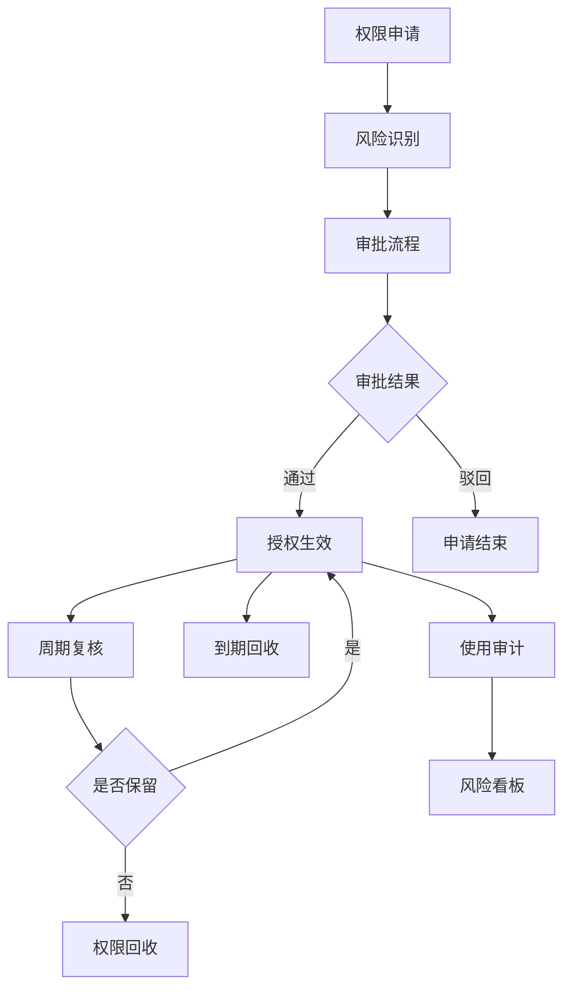
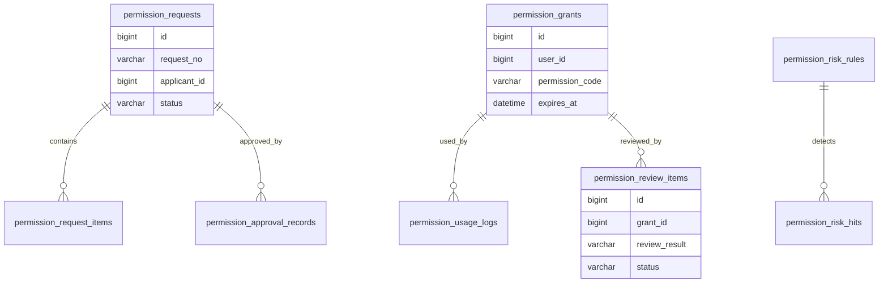
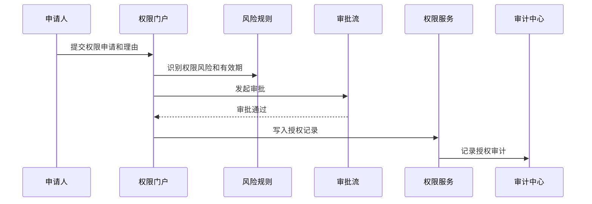

# 权限运营项目案例

## 适合谁看

适合需要做权限申请、权限审批、权限复核、权限回收、临时授权、敏感权限审计和越权风险治理的开发者。

权限运营和权限系统不是一回事。权限系统解决“能不能访问”，权限运营解决“为什么给、谁批准、什么时候过期、是否还需要、有没有风险”。真实企业项目里，权限长期不复核会越积越多，最后出现离职人员残留权限、临时权限永久有效、敏感数据被随意导出等问题。

## 业务目标

第一版权限运营支持：

- 用户发起菜单、按钮、数据和系统权限申请。
- 支持按权限风险级别走不同审批流程。
- 支持临时授权和到期自动回收。
- 支持权限复核任务。
- 支持离职、转岗、部门变更触发权限回收。
- 支持敏感权限操作审计。
- 支持权限风险看板。

## 权限运营链路

核心原则：权限要有生命周期。授权不是结束，而是从申请、审批、生效、使用、复核到回收的完整闭环。

## 数据模型

## 推荐表结构

| 表 | 作用 | 关键字段 |
| --- | --- | --- |
| `permission_requests` | 权限申请主表 | `request_no`、`applicant_id`、`reason`、`status` |
| `permission_request_items` | 申请明细 | `request_id`、`permission_code`、`scope_type`、`expire_at` |
| `permission_approval_records` | 审批记录 | `request_id`、`approver_id`、`action`、`comment` |
| `permission_grants` | 授权记录 | `user_id`、`permission_code`、`scope_value`、`expires_at` |
| `permission_usage_logs` | 权限使用日志 | `grant_id`、`action_type`、`resource_id`、`used_at` |
| `permission_review_tasks` | 复核任务 | `task_no`、`scope_type`、`reviewer_id`、`status` |
| `permission_review_items` | 复核明细 | `task_id`、`grant_id`、`review_result`、`handled_at` |
| `permission_risk_rules` | 风险规则 | `rule_code`、`risk_level`、`condition_json` |
| `permission_risk_hits` | 风险命中 | `rule_id`、`grant_id`、`risk_reason`、`status` |

授权记录不要只存角色 ID。数据范围、有效期、授权来源和审批单号都要能追踪。

## 权限风险分级

| 风险级别 | 示例 | 处理方式 |
| --- | --- | --- |
| 低风险 | 查看普通列表 | 部门主管审批 |
| 中风险 | 导出客户数据 | 数据 owner 审批 |
| 高风险 | 修改计费、删除订单 | 多级审批和审计 |
| 临时高风险 | 临时排障查看日志 | 设置短有效期 |
| 异常风险 | 离职人员仍有权限 | 自动冻结或回收 |

风险分级要影响审批流程、有效期、复核频率和审计强度。

## 权限申请流程

审批通过后要写入授权记录，而不是直接改用户角色。授权记录是后续复核、回收和审计的基础。

## 前端页面拆分

| 页面或组件 | 作用 | 注意点 |
| --- | --- | --- |
| 权限门户 | 用户申请权限 | 展示权限说明、风险和有效期 |
| 我的权限 | 查看已有权限 | 支持申请续期和主动释放 |
| 权限审批 | 处理申请 | 展示申请理由、风险和历史使用 |
| 授权台账 | 查看所有授权记录 | 支持按用户、权限、范围筛选 |
| 复核任务 | 主管或 owner 定期复核 | 支持保留、回收、延期 |
| 风险看板 | 查看高风险和异常授权 | 离职残留、长期未用、过期未回收 |
| 回收记录 | 跟踪回收结果 | 失败要告警和重试 |
| 使用审计 | 查看敏感权限使用 | 支持定位操作人和资源 |

权限运营页面要让审批人看懂“为什么要给”。只展示权限 code 会导致审批流于形式。

## 常见问题

### 问题 1：临时权限最后变成永久权限

临时授权必须设置 `expires_at`，到期自动回收。续期要重新提交理由和审批。

### 问题 2：员工转岗后仍能访问原部门数据

组织变更应触发权限复核或自动回收。数据范围权限尤其要和部门、岗位、项目关系联动。

### 问题 3：审批人不知道权限具体能做什么

权限申请页要展示权限说明、影响范围、风险级别和历史使用案例。权限命名不能只给内部 code。

### 问题 4：没人处理权限复核任务

复核任务要有截止时间、升级策略和未处理默认动作。高风险权限不能无限期等待复核。

## 验收清单

- 权限申请包含理由、范围和有效期。
- 权限风险级别影响审批流程。
- 授权记录保存来源、范围、有效期和审批单号。
- 临时权限到期能自动回收。
- 离职、转岗和部门变更触发复核或回收。
- 权限复核任务有负责人和截止时间。
- 高风险权限使用有审计日志。
- 长期未使用权限能被识别。
- 审批人能看到权限说明和影响范围。
- 回收失败有告警和重试。

## 下一步学习

继续学习 [权限系统案例](/projects/permission-case-study)、[多租户权限项目案例](/projects/multi-tenant-permission-case)、[数据权限审计项目案例](/projects/data-permission-audit-case) 和 [审计中心项目案例](/projects/audit-center-case)。
