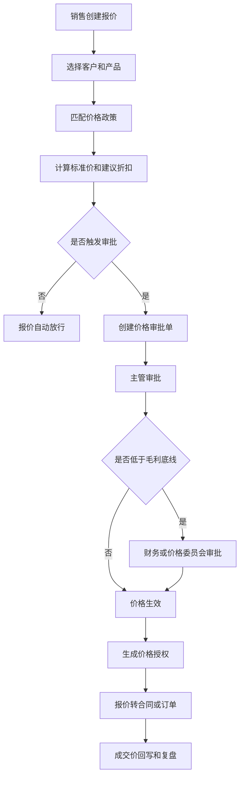
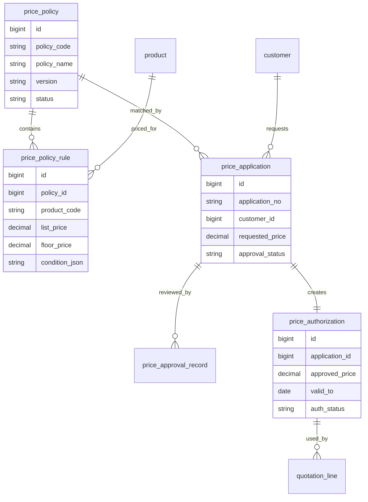
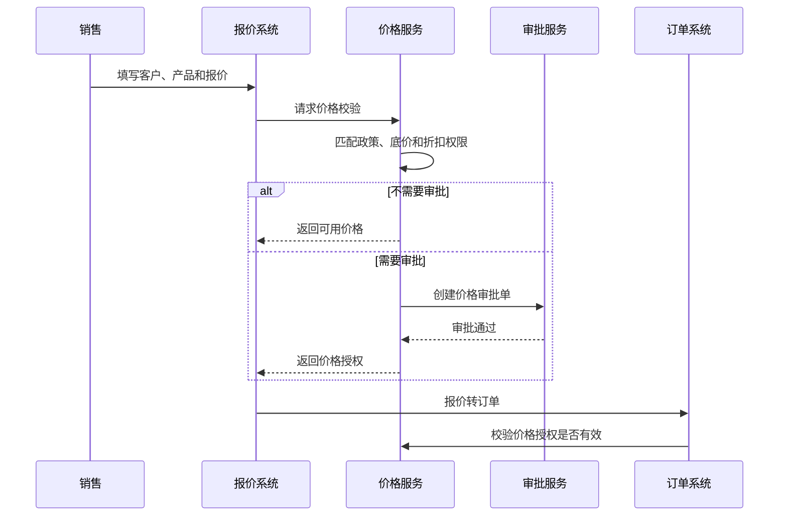
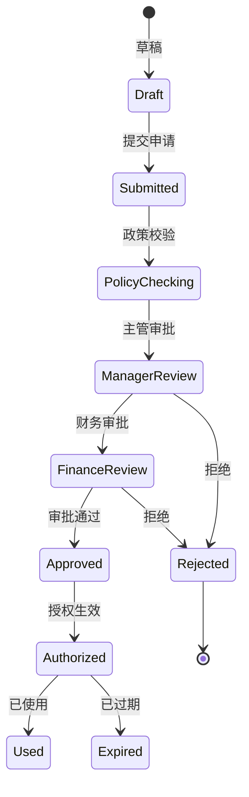
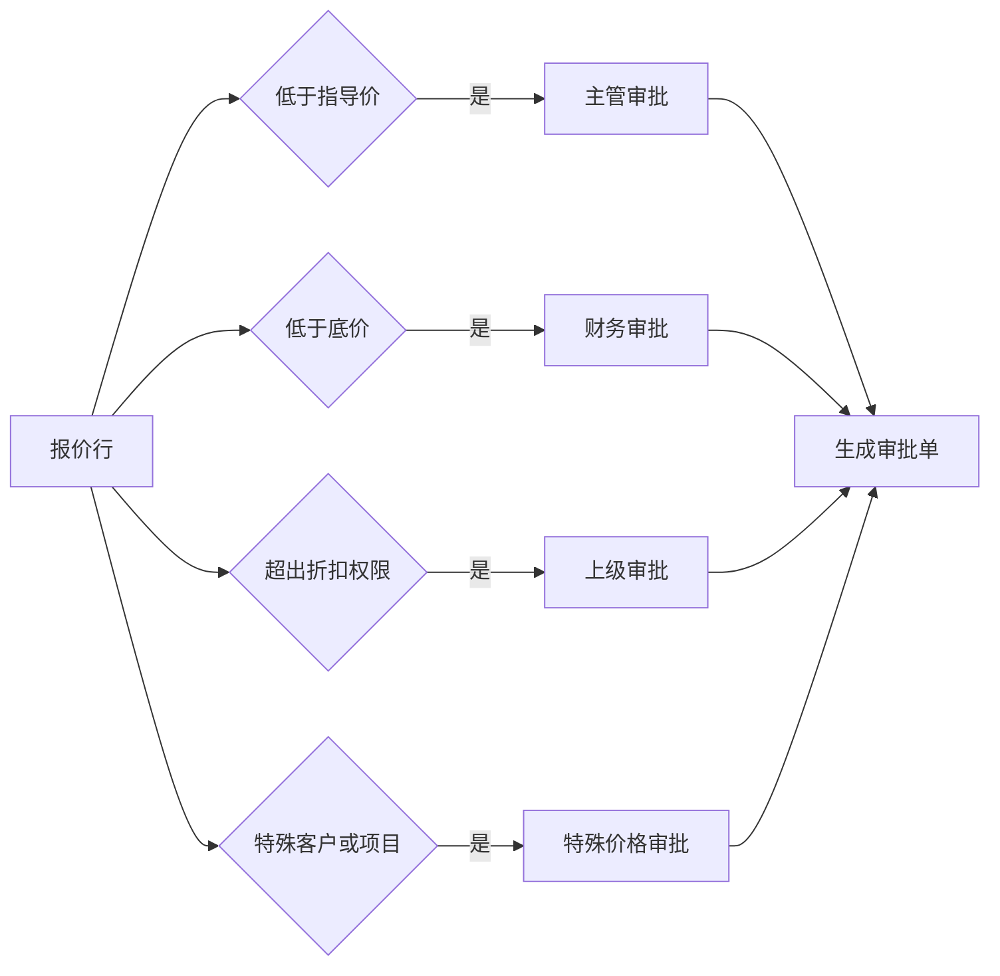

# 价格审批中心项目案例

## 适合谁看

如果你做过报价中心、CRM、合同、订单或渠道销售系统，但不清楚“为什么价格不能只放在商品表里”，可以先看这一篇。

价格审批中心解决的是企业在多客户、多渠道、多区域、多产品、多折扣场景下，如何控制成交价格、折扣底线、特殊价格、审批权限和价格变更追溯。

## 业务目标

价格审批中心要回答 6 个问题：

- 当前客户、渠道、区域和产品能使用什么价格。
- 折扣是否低于底价、毛利底线或政策范围。
- 谁可以申请特殊价格，谁可以审批。
- 价格审批通过后，报价、合同和订单如何使用。
- 价格有效期、数量阶梯、币种、税率和促销是否正确。
- 历史价格、审批意见和最终成交价能否追溯。

真实项目里，价格问题往往不是“算错一块钱”，而是权限越权、低价放行、政策过期、口径不一致和历史不可追溯。

## 价格审批中心链路

价格审批中心的核心不是审批流本身，而是“价格政策、审批权限、价格授权、业务单据使用”之间的一致性。

## 核心概念

| 概念 | 说明 | 项目里的典型字段 |
| --- | --- | --- |
| 标准价 | 产品基础价格 | list_price |
| 底价 | 不允许自动突破的最低价格 | floor_price |
| 指导价 | 推荐销售使用的价格 | guide_price |
| 特殊价格 | 针对客户或项目审批的价格 | special_price |
| 价格政策 | 适用范围和计算规则 | price_policy |
| 折扣权限 | 不同角色可审批的折扣区间 | discount_authority |
| 价格授权 | 审批通过后的可用价格凭证 | price_authorization |
| 有效期 | 价格可使用的时间范围 | valid_from、valid_to |

新手要先区分“政策价格”和“成交价格”。政策价格是规则，成交价格是业务结果。

## 数据模型

`price_authorization` 很关键。审批通过的价格不要只写回报价行，否则后续合同、订单、复购和审计都找不到授权依据。

## 推荐表结构

| 表 | 用途 | 关键字段 |
| --- | --- | --- |
| price_policy | 价格政策 | policy_code、version、scope_type、status、effective_date |
| price_policy_rule | 价格规则 | policy_id、product_code、list_price、floor_price、condition_json |
| discount_authority | 折扣权限 | role_code、discount_min、discount_max、gross_margin_min |
| price_application | 价格申请 | application_no、customer_id、project_no、requested_price、reason |
| price_approval_record | 审批记录 | application_id、approver_id、result、comment、approved_price |
| price_authorization | 价格授权 | auth_no、application_id、approved_price、valid_from、valid_to |
| price_usage_record | 使用记录 | auth_no、biz_type、biz_no、used_price、used_at |

价格相关表必须保存版本和有效期。价格政策经常调整，历史单据必须能还原当时使用的是哪版政策。

## 价格校验流程

订单使用价格时也要再次校验授权。不要只在报价阶段校验，否则过期价格可能被继续下单。

## 审批状态设计

审批通过和授权生效要分开。审批通过只是人同意，授权生效还要生成可被报价、合同和订单引用的凭证。

## 价格触发规则

触发规则要能解释给销售。只提示“价格不合法”会导致销售不知道应该补什么材料。

## 前端页面拆分

| 页面 | 主要功能 | 新手容易漏掉 |
| --- | --- | --- |
| 价格政策页 | 政策版本、适用范围、启停 | 政策发布后不能覆盖历史 |
| 产品价格页 | 标准价、指导价、底价、币种 | 底价字段需要权限控制 |
| 折扣权限页 | 角色、折扣区间、毛利底线 | 权限要按产品线或区域分层 |
| 价格申请页 | 申请特殊价、上传依据 | 展示政策命中和差异原因 |
| 审批工作台 | 审批、退回、补充材料 | 审批人要看到毛利和历史成交 |
| 价格授权页 | 授权价格、有效期、使用情况 | 授权过期和剩余次数 |
| 价格复盘页 | 低价订单、审批通过率、毛利影响 | 复盘不是审批列表统计 |

价格页面要把“政策价、申请价、审批价、成交价”并排展示，否则用户很难理解差异来自哪里。

## 接口拆分建议

| 接口 | 方法 | 说明 |
| --- | --- | --- |
| /api/price-policies | GET/POST | 查询和创建价格政策 |
| /api/price-policies/:id/rules | GET/POST | 维护价格规则 |
| /api/prices/check | POST | 报价或订单价格校验 |
| /api/price-applications | POST | 创建价格申请 |
| /api/price-applications/:id/audit | POST | 审批价格申请 |
| /api/price-authorizations | GET | 查询价格授权 |
| /api/price-authorizations/:id/use | POST | 使用价格授权 |
| /api/price-review | GET | 查询价格复盘数据 |

价格校验接口要返回结构化原因，例如 `BELOW_FLOOR_PRICE`、`DISCOUNT_OVER_AUTHORITY`，不要只返回一段错误文本。

## 实际项目常见问题

### 问题 1：报价审批通过，订单仍然下不了

常见原因是报价审批结果没有生成价格授权，订单系统也不知道该使用哪个审批结果。

解决方式：

- 审批通过后生成 `price_authorization`。
- 订单行引用授权编号。
- 订单校验授权有效期和适用范围。
- 授权使用写入使用记录。

### 问题 2：销售能看到所有产品底价

底价属于敏感经营数据，不能直接暴露给所有销售。

解决方式：

- 底价字段单独权限控制。
- 普通销售只看到“是否低于底线”和审批原因。
- 导出价格表时脱敏底价。
- 查看底价写审计日志。

### 问题 3：价格政策调整影响历史订单

页面实时读取最新政策，没有保存政策版本。

解决方式：

- 政策发布生成版本。
- 报价和订单保存当时政策版本。
- 历史单据不按新政策重新判断。
- 新政策只影响生效日期后的业务。

### 问题 4：审批人不知道为什么要审批

审批单缺少触发规则和差异说明。

解决方式：

- 保存命中的价格规则。
- 展示标准价、申请价、底价差异。
- 展示历史成交价和毛利影响。
- 审批意见和附件必须留存。

## 权限与审计

| 权限 | 建议 |
| --- | --- |
| 查看价格 | 按产品线、区域、客户范围控制 |
| 查看底价 | 只给价格、财务或管理角色 |
| 申请特殊价 | 销售或渠道经理 |
| 审批价格 | 按折扣、毛利和金额分级 |
| 发布政策 | 价格管理员，发布需要审批 |
| 导出价格 | 敏感导出水印和审计 |

价格系统是利润控制入口，不能只依赖前端隐藏按钮。

## 验收清单

- 报价和订单都能进行价格校验。
- 低于底价或超权限折扣会触发审批。
- 审批通过后生成价格授权。
- 授权有适用范围、有效期和使用记录。
- 历史报价能还原当时的价格政策版本。
- 底价和毛利字段有权限和审计。
- 价格复盘能看到低价原因和毛利影响。

## 下一步学习

建议继续阅读：

- [报价中心项目案例](/projects/quotation-center-case)
- [销售返利政策项目案例](/projects/sales-rebate-policy-case)
- [合同管理项目案例](/projects/contract-management-case)
- [数据权限审计项目案例](/projects/data-permission-audit-case)
