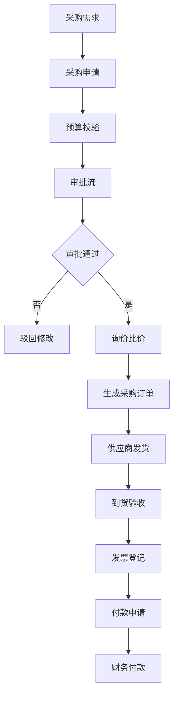
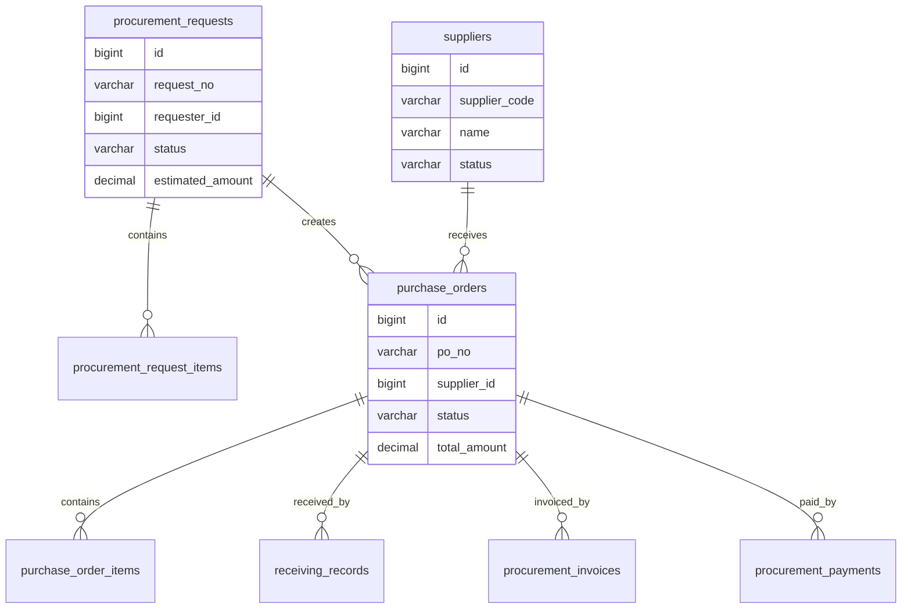
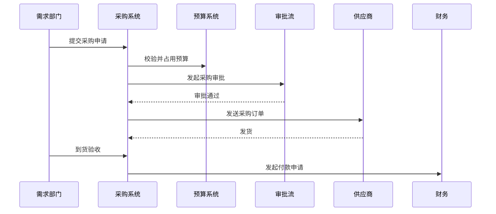

# 采购管理项目案例

## 适合谁看

适合需要做采购申请、供应商比价、采购订单、到货验收、发票、付款、预算控制和采购审批的开发者。

采购管理不是“提交一个购买申请”。真实项目里，采购会涉及需求部门、采购部门、供应商、预算、合同、订单、验收、发票和付款。它连接资产、财务、合同和审批流，任何一个环节缺少状态和凭证，后续都会出现“买了什么、谁批准、钱付到哪一步”说不清的问题。

## 业务目标

第一版采购管理支持：

- 创建采购申请。
- 维护供应商档案。
- 支持询价和比价。
- 生成采购订单。
- 管理到货验收。
- 关联发票和付款申请。
- 支持预算占用和释放。
- 支持采购审批和审计。

## 采购流程图

采购流程要和金额、品类、供应商等级关联。办公用品、IT 设备和大额服务采购的审批路径通常不同。

## 数据模型

## 推荐表结构

| 表 | 作用 | 关键字段 |
| --- | --- | --- |
| `suppliers` | 供应商档案 | `supplier_code`、`name`、`status`、`risk_level` |
| `procurement_requests` | 采购申请 | `request_no`、`requester_id`、`budget_id`、`status` |
| `procurement_request_items` | 申请明细 | `request_id`、`item_name`、`quantity`、`estimated_price` |
| `supplier_quotes` | 供应商报价 | `request_id`、`supplier_id`、`quote_amount`、`valid_until` |
| `purchase_orders` | 采购订单 | `po_no`、`supplier_id`、`total_amount`、`status` |
| `purchase_order_items` | 订单明细 | `po_id`、`item_name`、`quantity`、`unit_price` |
| `receiving_records` | 到货验收 | `po_id`、`received_quantity`、`quality_result`、`received_by` |
| `procurement_invoices` | 发票登记 | `po_id`、`invoice_no`、`invoice_amount`、`status` |
| `procurement_payments` | 付款申请 | `po_id`、`pay_amount`、`pay_status`、`paid_at` |

采购金额必须和预算、订单、验收、发票和付款关联，不能只保存在申请表里。

## 采购订单流程

预算占用要能释放。采购申请驳回、取消或订单关闭时，已占用预算必须回滚。

## 关键状态

| 对象 | 状态 | 注意点 |
| --- | --- | --- |
| 采购申请 | 草稿、审批中、已通过、已驳回、已取消 | 审批中不能改金额 |
| 报价 | 待报价、已报价、已过期、已选中 | 报价有效期要校验 |
| 采购订单 | 待发送、已发送、部分到货、已完成、已关闭 | 到货数量影响状态 |
| 验收记录 | 待验收、通过、不通过、部分通过 | 不通过要记录原因 |
| 付款申请 | 待付款、付款中、已付款、付款失败 | 付款要和发票、验收关联 |

采购状态不能只看单据是否创建。采购订单创建了，不代表货已到、票已开、款已付。

## 前端页面拆分

| 页面 | 作用 | 注意点 |
| --- | --- | --- |
| 采购申请 | 需求部门提交采购需求 | 金额和预算要清楚 |
| 供应商管理 | 维护供应商资质和风险 | 高风险供应商提示 |
| 询价比价 | 记录供应商报价 | 展示价格、交期和有效期 |
| 采购订单 | 查看订单和到货状态 | 支持部分到货 |
| 到货验收 | 录入数量和质量结果 | 不通过必须说明 |
| 发票登记 | 关联订单和发票 | 金额不能超过可开票范围 |
| 付款申请 | 申请付款 | 关联验收和发票 |
| 采购看板 | 查看采购金额、周期和供应商表现 | 指标口径固定 |

## 实际项目常见问题

### 问题 1：采购申请通过后金额还能改

审批通过后的金额是预算和付款依据，不能直接修改。需要走变更流程或重新发起审批。

### 问题 2：货到了但系统不能付款

付款通常要求订单、验收和发票都满足条件。要在付款页面明确展示阻塞原因，而不是只返回“状态不允许”。

### 问题 3：预算占用后一直没有释放

采购取消、驳回、订单关闭、部分采购都要触发预算释放或调整。

## 验收清单

- 供应商档案和采购申请清晰分离。
- 采购申请有预算校验。
- 审批中和审批通过后关键金额不可直接修改。
- 支持询价、比价和报价有效期。
- 采购订单支持部分到货。
- 验收不通过必须记录原因。
- 付款申请关联订单、验收和发票。
- 采购取消或关闭能释放预算。
- 采购关键操作有审计记录。
- 采购看板能展示采购周期和供应商表现。

## 下一步学习

继续学习 [资产管理项目案例](/projects/asset-management-case)、[合同管理项目案例](/projects/contract-management-case) 和 [复杂财务对账项目案例](/projects/finance-reconciliation-case)。
