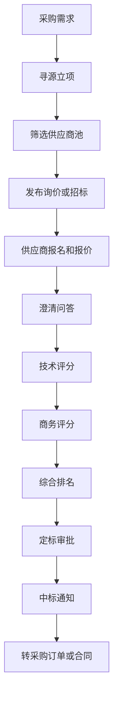
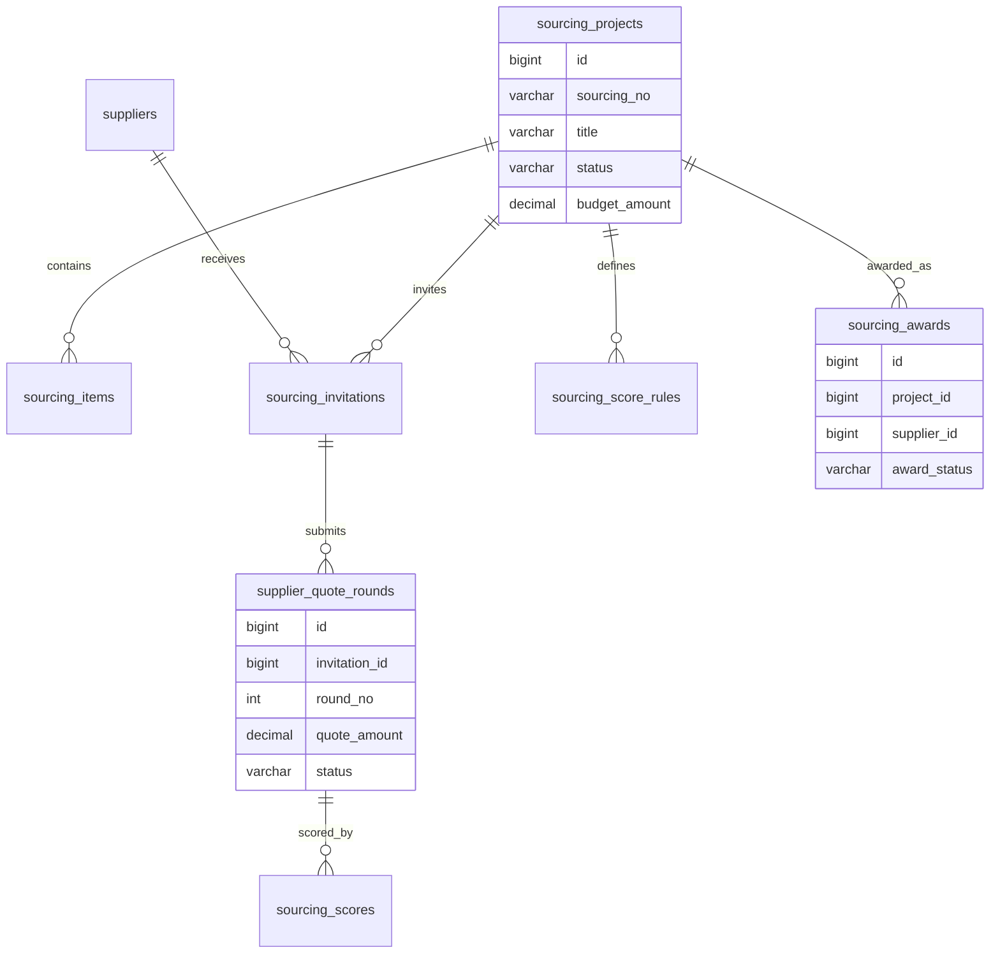
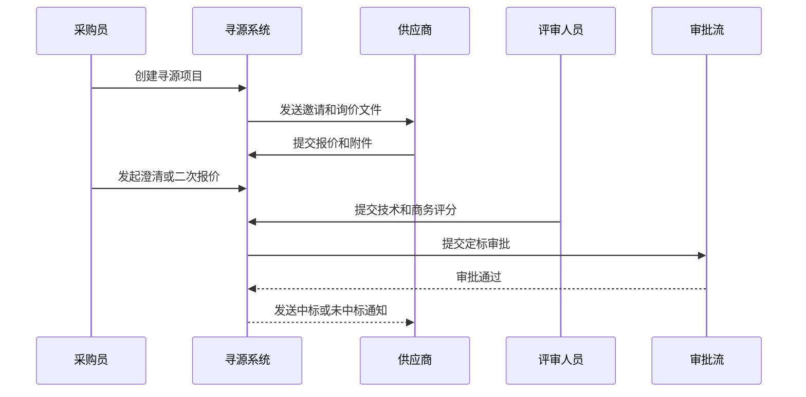

# 采购寻源项目案例

## 适合谁看

适合需要做供应商准入、询价、招标、比价、评标、定标、采购寻源和供应商协同的开发者。

采购寻源不是“找几个供应商报个价”。真实项目里，寻源会涉及需求确认、供应商池、资质筛选、询价文件、报价轮次、技术评分、商务评分、定标审批、合同转换和审计留痕。它的目标是让采购决策可比较、可追溯、可解释，而不是只凭线下聊天和 Excel 定供应商。

如果你已经看过 [采购管理项目案例](/projects/procurement-management-case)，可以把采购寻源理解为采购订单之前的“供应商选择和采购策略”阶段。

## 业务目标

第一版采购寻源支持：

- 建立供应商池和准入规则。
- 创建寻源项目。
- 配置寻源品类、预算、交期和评标方式。
- 邀请供应商参与询价或投标。
- 支持多轮报价和澄清问答。
- 支持技术评分、商务评分和综合排名。
- 支持定标审批和中标通知。
- 转换为采购申请、采购订单或合同。
- 记录全流程审计和异常风险。

## 采购寻源链路

这条链路的关键是把“供应商为什么被选中”记录下来。价格最低不一定是最佳选择，交期、质量、服务能力和风险等级都可能影响定标。

## 核心概念

| 概念 | 说明 | 示例 |
| --- | --- | --- |
| 寻源项目 | 一次供应商选择活动 | 2026 年办公电脑采购寻源 |
| 供应商池 | 可被邀请的供应商集合 | IT 设备供应商池 |
| 询价 | 向供应商收集报价 | 三家供应商报价 |
| 招标 | 更正式的竞价和评标流程 | 大额设备采购招标 |
| 报价轮次 | 允许多轮报价或议价 | 第一轮、第二轮、最终报价 |
| 评标模型 | 技术、商务、服务等评分权重 | 技术 40%、商务 50%、服务 10% |
| 定标 | 确认中标供应商 | 供应商 A 中标 |

第一版可以先支持询价和简单评标，不必一开始做完整电子招投标。但必须保留轮次、评分和审批记录。

## 数据模型

## 推荐表结构

| 表 | 作用 | 关键字段 |
| --- | --- | --- |
| `sourcing_projects` | 寻源项目 | `sourcing_no`、`title`、`category_id`、`status`、`budget_amount` |
| `sourcing_items` | 寻源明细 | `project_id`、`item_name`、`quantity`、`target_delivery_date` |
| `sourcing_supplier_filters` | 供应商筛选条件 | `project_id`、`filter_type`、`filter_value` |
| `sourcing_invitations` | 邀请记录 | `project_id`、`supplier_id`、`invite_status`、`invited_at` |
| `supplier_quote_rounds` | 供应商报价轮次 | `invitation_id`、`round_no`、`quote_amount`、`valid_until` |
| `supplier_quote_items` | 报价明细 | `quote_id`、`item_id`、`unit_price`、`delivery_days` |
| `sourcing_clarifications` | 澄清问答 | `project_id`、`supplier_id`、`question`、`answer` |
| `sourcing_score_rules` | 评分规则 | `project_id`、`score_type`、`weight`、`max_score` |
| `sourcing_scores` | 评分记录 | `quote_id`、`rule_id`、`score`、`comment` |
| `sourcing_awards` | 定标结果 | `project_id`、`supplier_id`、`award_reason`、`award_status` |
| `sourcing_audit_logs` | 审计日志 | `project_id`、`action_type`、`operator_id`、`created_at` |

报价金额、交期和评分要保存快照。供应商后续报价变化不能影响已经归档的评标结果。

## 寻源评标流程

供应商报价截止后要锁定。否则供应商在评审阶段修改报价，会让评标结果失去可信度。

## 评标模型设计

| 评分维度 | 说明 | 示例 |
| --- | --- | --- |
| 价格 | 报价金额、付款条件、税费 | 报价最低得满分 |
| 交期 | 预计到货时间和履约能力 | 7 天内到货得高分 |
| 技术 | 参数匹配、方案完整性 | 是否满足技术规格 |
| 质量 | 历史合格率和退货率 | 近半年质检通过率 |
| 服务 | 售后响应、驻场支持 | 是否提供 7x24 支持 |
| 风险 | 黑名单、合规、财务风险 | 高风险供应商降权 |

评分模型要在报价前确定并锁定。评标过程中临时改权重，会带来审计风险。

## 前端页面拆分

| 页面或组件 | 作用 | 注意点 |
| --- | --- | --- |
| 寻源项目列表 | 查看项目状态和负责人 | 支持品类、金额、状态筛选 |
| 寻源项目详情 | 展示需求、供应商、报价、评分和定标 | 信息要按流程组织 |
| 供应商邀请 | 选择供应商池并发出邀请 | 显示资质和风险等级 |
| 报价管理 | 查看报价轮次和明细 | 过期报价不可选中 |
| 澄清问答 | 处理供应商问题 | 问答要同步给相关供应商 |
| 评标面板 | 技术和商务评分 | 权重和总分实时展示 |
| 定标审批 | 确认中标供应商 | 展示排名和选择理由 |
| 寻源看板 | 统计节约金额和周期 | 指标口径要固定 |

寻源项目详情页要像时间线一样展示过程。采购员需要快速回答：邀请了谁、谁报价了、评分多少、为什么选这家。

## 接口拆分建议

| 接口 | 作用 | 注意点 |
| --- | --- | --- |
| `POST /sourcing/projects` | 创建寻源项目 | 校验预算、品类和寻源方式 |
| `POST /sourcing/projects/{id}/invite` | 邀请供应商 | 校验供应商状态和准入条件 |
| `POST /sourcing/projects/{id}/quotes` | 提交报价 | 供应商端要做截止时间校验 |
| `POST /sourcing/projects/{id}/clarifications` | 提交澄清 | 区分公开澄清和私有澄清 |
| `POST /sourcing/projects/{id}/scores` | 提交评分 | 保存评分人和评分理由 |
| `POST /sourcing/projects/{id}/award` | 提交定标 | 校验报价锁定和审批权限 |
| `POST /sourcing/projects/{id}/convert` | 转订单或合同 | 防止重复转换 |

## 实际项目常见问题

### 问题 1：供应商报价截止后还能改价格

报价截止后必须锁定报价轮次。若业务确实需要二次报价，应该创建新轮次，并保留上一轮报价记录，而不是直接覆盖原报价。

### 问题 2：评标结果被质疑不透明

要保存评分模型、评分人、评分明细和定标理由。定标结果如果不是综合分第一，要强制填写原因，例如交期风险、资质不满足或长期服务能力不足。

### 问题 3：供应商线下发了新报价，系统里还是旧价格

寻源系统要规定报价以系统提交为准。线下沟通可以作为附件或澄清记录，但不能绕过系统直接影响定标。

### 问题 4：中标后重复生成采购订单

定标转换要有唯一约束。一个中标结果只能转换一次采购申请、采购订单或合同，重复点击只返回已有转换结果。

## 权限与审计

采购寻源权限至少要区分：

- 创建寻源项目。
- 邀请供应商。
- 查看供应商报价。
- 提交技术评分。
- 提交商务评分。
- 修改评分模型。
- 提交定标审批。
- 查看审计记录。
- 转采购订单或合同。

报价查看权限要特别谨慎。报价未截止前，采购员是否能看到供应商报价，需要按企业制度决定。

## 验收清单

- 寻源项目有品类、预算、交期和负责人。
- 供应商邀请基于供应商池和准入条件。
- 报价支持轮次、有效期和锁定。
- 澄清问答可追溯。
- 评分模型有权重和锁定机制。
- 评分记录保存评分人和理由。
- 定标结果需要审批。
- 中标原因和未选择原因可追溯。
- 定标可转换为采购订单或合同，并防重。
- 全流程有审计记录。

## 下一步学习

继续学习 [采购管理项目案例](/projects/procurement-management-case)、[供应商绩效项目案例](/projects/supplier-performance-case)、[合同管理项目案例](/projects/contract-management-case) 和 [预算管理项目案例](/projects/budget-management-case)。
