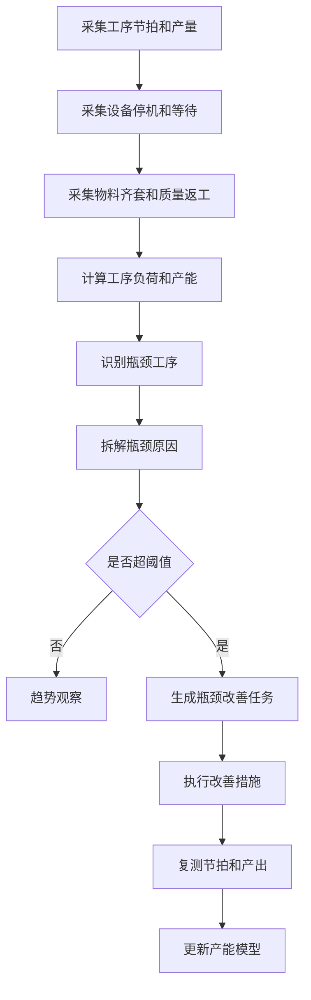
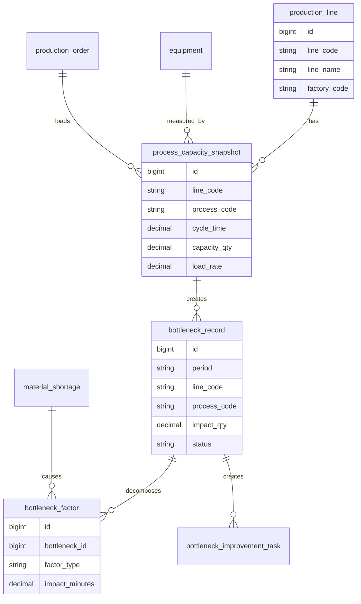
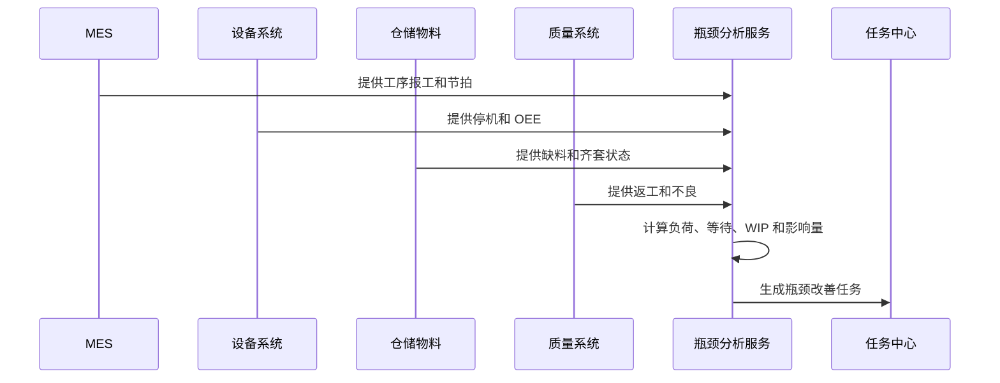
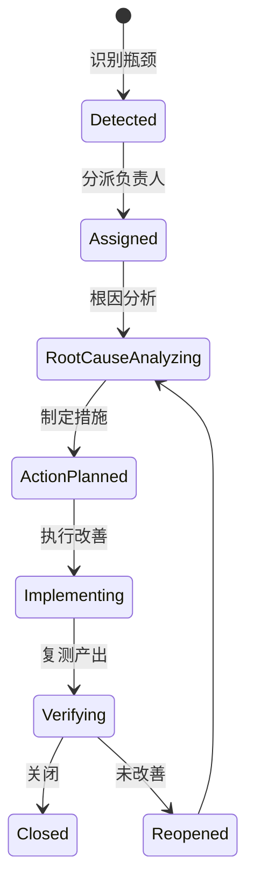
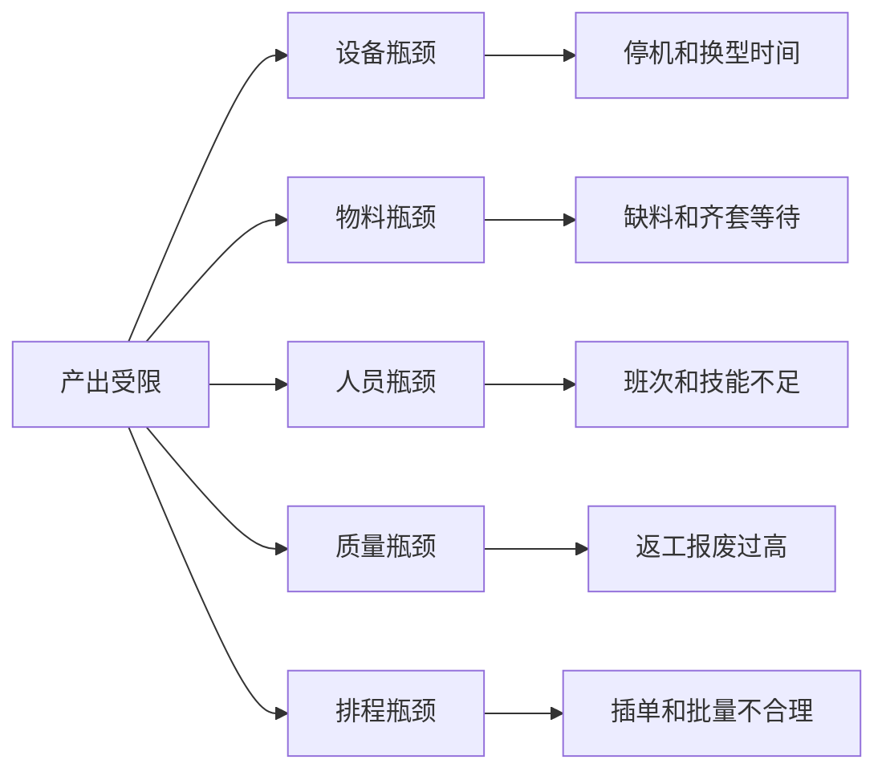

# 生产瓶颈分析项目案例

## 适合谁看

如果你做过生产排程、生产制造、设备异常或良率分析，但还不清楚“为什么整条线总是卡在某个工序”，可以先看这一篇。

生产瓶颈分析关注的是产线、工序、设备、人员、物料和质量之间的节拍失衡。它要找出限制整体产出的环节，并把瓶颈原因变成改善任务。

## 业务目标

生产瓶颈分析要回答 6 个问题：

- 当前产线的瓶颈工序在哪里。
- 瓶颈来自设备停机、工时不足、物料等待、质量返工还是排程冲突。
- 瓶颈是短期异常，还是长期能力不足。
- 瓶颈对交期、产量、成本和良率有什么影响。
- 应该通过调班、换线、维修、补料、外协还是工艺改善解决。
- 改善后瓶颈是否转移，整体产出是否提升。

瓶颈分析不是单纯找“最慢的设备”，而是找“限制系统产出的约束点”。

## 生产瓶颈分析链路

瓶颈会转移。解决一个瓶颈后，新的瓶颈可能出现在下游工序，因此分析要持续运行。

## 核心概念

| 概念 | 说明 | 项目里的典型字段 |
| --- | --- | --- |
| 节拍 | 单位产品生产所需时间 | cycle_time |
| 产能 | 单位时间可生产数量 | capacity_qty |
| 负荷 | 当前计划占用产能比例 | load_rate |
| 等待时间 | 因物料、设备、人员等待的时间 | wait_time |
| 瓶颈工序 | 限制整体产出的工序 | bottleneck_process |
| OEE | 设备综合效率 | oee |
| 在制品 | 工序间等待的半成品 | wip_qty |
| 改善任务 | 针对瓶颈原因的处理闭环 | improvement_task |

节拍、负荷、等待、在制品要一起看。只看产量很容易错判瓶颈。

## 数据模型

瓶颈记录要保存影响量，例如影响产量、影响工时或影响交期。没有影响量，改善优先级就很难排序。

## 推荐表结构

| 表 | 用途 | 关键字段 |
| --- | --- | --- |
| process_capacity_snapshot | 工序产能快照 | line_code、process_code、cycle_time、capacity_qty、load_rate |
| process_wip_snapshot | 在制品快照 | line_code、process_code、wip_qty、snapshot_time |
| bottleneck_record | 瓶颈记录 | period、line_code、process_code、impact_qty、risk_level |
| bottleneck_factor | 瓶颈因素 | bottleneck_id、factor_type、impact_minutes、reason_code |
| bottleneck_threshold | 瓶颈阈值 | line_code、process_code、load_rate_threshold、wait_time_threshold |
| bottleneck_improvement_task | 改善任务 | bottleneck_id、owner_id、due_date、status、result |

瓶颈数据最好按快照保存，因为排程、设备、物料和工单状态都在不断变化。

## 瓶颈识别流程

瓶颈分析需要跨系统数据。只看 MES 报工无法解释设备停机、物料等待和质量返工。

## 改善任务状态设计

瓶颈任务关闭前必须看改善后的产出、节拍或等待时间，而不是只看动作是否完成。

## 瓶颈原因拆解

这种拆解能指导不同部门行动：设备维修、供应链补料、生产调班、质量改善或计划重排。

## 前端页面拆分

| 页面 | 主要功能 | 新手容易漏掉 |
| --- | --- | --- |
| 瓶颈总览 | 产线、工序、影响量、风险等级 | 同时展示当前瓶颈和趋势瓶颈 |
| 工序负荷页 | 产能、负荷、节拍、在制品 | 负荷要关联计划和实际 |
| 设备瓶颈页 | 停机、OEE、换型时间 | 设备异常要能跳转 |
| 物料等待页 | 缺料、齐套、等待时间 | 物料瓶颈不是生产问题 |
| 瓶颈任务页 | 原因、措施、负责人、验证 | 关闭前要复测 |
| 产能模型页 | 工序产能、瓶颈阈值、版本 | 工艺变更后要更新 |
| 改善复盘页 | 瓶颈迁移、产出变化、收益 | 只看单点改善不够 |

瓶颈页面要突出“影响量”和“责任部门”，否则用户只会看到一堆指标。

## 接口拆分建议

| 接口 | 方法 | 说明 |
| --- | --- | --- |
| /api/production-bottlenecks/overview | GET | 查询瓶颈总览 |
| /api/production-bottlenecks/calculate | POST | 执行瓶颈识别 |
| /api/production-bottlenecks/:id | GET | 查询瓶颈详情 |
| /api/production-bottlenecks/:id/factors | GET | 查询瓶颈因素 |
| /api/production-bottleneck-tasks | GET/POST | 查询和创建改善任务 |
| /api/process-capacity | GET/POST | 查询和维护产能模型 |
| /api/production-bottlenecks/review | GET | 查询改善复盘 |

瓶颈计算接口建议异步执行，并保存计算批次，便于对比改善前后。

## 实际项目常见问题

### 问题 1：系统总把最慢工序当瓶颈

最慢不一定限制系统产出，可能是计划量少或下游不受影响。

解决方式：

- 同时看负荷、等待、WIP 和影响产量。
- 计算瓶颈对交期和产出的影响。
- 对短期异常和长期瓶颈分开标识。
- 支持人工确认瓶颈原因。

### 问题 2：瓶颈改善后产出没提升

可能真正瓶颈在下游，或者改善动作没有解决根因。

解决方式：

- 关闭任务前复测产出。
- 观察瓶颈是否转移。
- 保存改善前后指标。
- 未达标任务自动重新打开。

### 问题 3：瓶颈原因都写成其他

原因字典不清晰，责任部门无法处理。

解决方式：

- 建立设备、物料、人员、质量、排程原因字典。
- 高频其他原因定期治理。
- 原因和责任部门映射。
- 任务分派依据原因类型。

### 问题 4：计划重排造成新的瓶颈

只优化单条线，没有看上下游。

解决方式：

- 分析上下游 WIP。
- 重排后模拟工序负荷。
- 对关键瓶颈设置保护产能。
- 复盘瓶颈迁移。

## 权限与审计

| 权限 | 建议 |
| --- | --- |
| 查看瓶颈 | 按工厂、产线、产品线授权 |
| 执行计算 | 生产计划或系统任务 |
| 维护产能模型 | 工艺或生产管理员 |
| 分派任务 | 生产主管 |
| 关闭任务 | 生产负责人或改善负责人 |
| 导出报表 | 管理层和生产运营，导出审计 |

产能和瓶颈数据属于运营敏感信息，不宜对所有人员开放。

## 验收清单

- 瓶颈识别能同时考虑产能、负荷、等待、WIP 和影响量。
- 瓶颈原因能拆成设备、物料、人员、质量和排程。
- 超阈值瓶颈能生成改善任务。
- 改善任务关闭前有复测数据。
- 瓶颈迁移能被记录和复盘。
- 产能模型有版本和维护权限。
- 报表能按产线、工序、产品和期间下钻。

## 下一步学习

建议继续阅读：

- [生产排程项目案例](/projects/production-scheduling-case)
- [生产设备异常项目案例](/projects/production-equipment-exception-case)
- [生产良率分析项目案例](/projects/production-yield-analysis-case)
- [制造成本差异分析项目案例](/projects/manufacturing-cost-variance-case)
