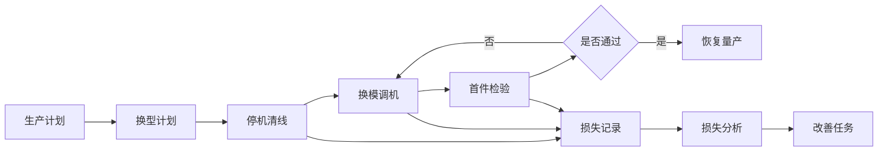
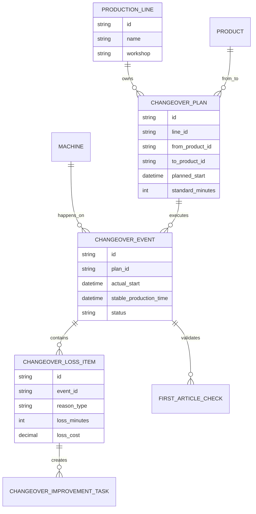
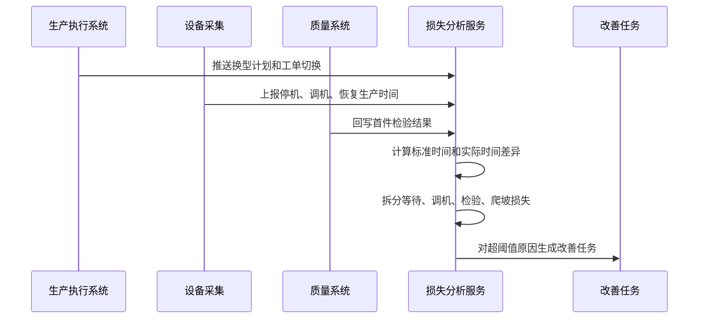
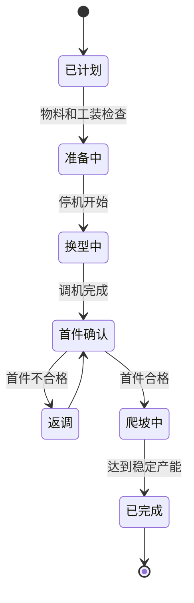
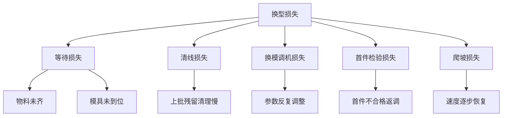

# 生产换型损失分析项目案例

## 适合谁看

如果你已经了解生产排程、生产良率或设备异常，但不清楚“换型为什么会影响产能和成本”，可以从这个案例入手。

生产换型指从生产一种产品切换到另一种产品时，需要停机、清线、换模、调机、首件确认和重新爬坡的过程。换型损失分析就是把这些时间和成本拆清楚，帮助工厂减少无效停机。

## 业务目标

生产换型损失分析要回答：

1. 哪些产线、设备、班组的换型损失最大？
2. 换型时间花在了哪里？
3. 是排程不合理、物料未齐、模具问题、人员操作，还是设备调试导致？
4. 优化后是否真的减少停机和损耗？

它不是单纯统计“停机多久”，而是把换型计划、实际执行、设备状态、物料准备、质量确认和改善任务连起来。

## 生产换型损失链路

这条链路里，损失不是只发生在停机阶段。首件不合格、调机反复、物料等待和恢复爬坡慢，都会形成换型损失。

## 核心概念

| 概念 | 含义 | 初学者理解 |
| --- | --- | --- |
| 换型 | 从一个产品切换到另一个产品的准备过程 | 机器要重新准备，不能马上生产 |
| 换型时间 | 从停机开始到稳定量产的时间 | 这段时间通常不产生合格产出 |
| 清线 | 清理上一批产品、物料和工装 | 防止混料、混批、污染 |
| 换模 | 更换模具、夹具或工装 | 不同产品需要不同生产条件 |
| 首件确认 | 换型后第一批产品质量确认 | 防止错误配置导致批量不良 |
| 爬坡损失 | 恢复生产后效率未达到标准的损失 | 刚开始生产可能速度低、废品多 |

## 数据模型

这里建议把 `CHANGEOVER_PLAN` 和 `CHANGEOVER_EVENT` 分开。计划说明“应该怎么换”，事件记录“实际怎么换”。损失分析必须基于实际事件。

## 推荐表结构

| 表 | 作用 | 关键字段 |
| --- | --- | --- |
| `production_line` | 产线主档 | 车间、产线、负责人、标准产能 |
| `machine` | 设备主档 | 设备类型、产线、状态、维护等级 |
| `changeover_plan` | 换型计划 | 前产品、后产品、计划时间、标准换型时长 |
| `changeover_event` | 换型执行记录 | 实际开始、实际结束、稳定量产时间、班组 |
| `changeover_loss_item` | 损失明细 | 损失类型、损失分钟、损失成本、责任归因 |
| `first_article_check` | 首件检验 | 检验项、结果、返调次数、不合格原因 |
| `changeover_improvement_task` | 改善任务 | 原因、负责人、目标时长、完成效果 |

## 换型损失计算流程

如果没有设备采集，也可以先由班组长手工记录。但字段要按未来自动采集设计，避免后续重构。

## 换型事件状态设计

“完成”不应该只等于设备重新开机，而应该等于达到稳定产能。否则爬坡阶段的效率损失会被忽略。

## 损失原因拆解

损失原因拆得越清楚，改善动作越具体。不要只写“换型慢”，要能定位是等待、调机、检验还是爬坡。

## 前端页面拆分

| 页面 | 核心内容 | 设计建议 |
| --- | --- | --- |
| 换型损失看板 | 总损失时间、损失成本、产线排行、原因分布 | 用排行快速定位重点产线 |
| 换型事件列表 | 计划、实际、标准时长、超时、状态、班组 | 支持按产线、产品、班组筛选 |
| 换型详情 | 时间轴、损失明细、首件结果、设备状态 | 时间轴最适合解释换型过程 |
| 标准换型配置 | 产品组合、标准时长、标准步骤 | 用于计算是否超标 |
| 改善任务 | 责任人、目标、措施、完成效果 | 闭环管理，不只是统计 |
| 复盘报表 | 换型频次、平均时长、改善前后对比 | 关注趋势而不是单点数字 |

## 接口拆分建议

| 接口 | 说明 |
| --- | --- |
| `GET /api/changeover/dashboard` | 查询换型损失总览 |
| `GET /api/changeover/events` | 查询换型事件列表 |
| `GET /api/changeover/events/:id` | 查询换型详情、时间轴和损失明细 |
| `POST /api/changeover/events/:id/loss-items` | 补录或调整损失明细 |
| `GET /api/changeover/standards` | 查询标准换型时长配置 |
| `PUT /api/changeover/standards/:id` | 更新标准换型配置 |
| `POST /api/changeover/improvement-tasks` | 创建改善任务 |
| `GET /api/changeover/reports/trend` | 查询换型损失趋势 |

## 实际项目常见问题

### 1. 设备开机了，但产能还没有恢复

很多系统只统计停机到开机时间，忽略恢复生产后的低速和报废。

解决方式：

- 把“设备开机”和“稳定量产”分成两个时间点。
- 用连续若干分钟达到标准节拍作为稳定量产判断。
- 首件合格后仍然记录爬坡损失。
- 报表中单独展示停机损失和爬坡损失。

### 2. 换型原因全靠人工填写，数据不可信

人工填写容易事后补录，也容易统一写“其他”。

解决方式：

- 尽量从工单切换、设备状态、质检结果自动生成基础时间。
- 人工只补充系统无法识别的原因。
- 原因选项不要太多，先用 8 到 12 个高频原因。
- 对“其他”原因要求填写说明，并定期治理。

### 3. 标准换型时间一直变

如果标准时间没有版本，历史对比会失真。

解决方式：

- 标准换型配置必须按产品组合、产线和生效日期管理。
- 每次换型事件保存命中的标准版本。
- 标准调整需要审批或至少记录原因。
- 报表支持按当时标准和当前标准分别查看。

### 4. 换型频次太高，但每次损失不大

单次损失小不代表总损失小。排程不合理可能导致频繁换型。

解决方式：

- 统计单位时间换型次数。
- 按产品组合计算换型矩阵成本。
- 给排程系统提供“换型成本”参数。
- 分析是否可以合并小批量订单。

### 5. 改善任务完成后看不到效果

如果任务不关联指标，完成只是流程结束。

解决方式：

- 改善任务必须绑定目标指标，例如平均换型时间降低 15%。
- 完成后对比改善前后同类换型事件。
- 未达到目标时进入复盘，不直接关闭。
- 报表展示改善收益，例如节省分钟和成本。

## 权限与审计

| 权限点 | 控制原因 |
| --- | --- |
| 查看全部产线损失 | 涉及工厂经营效率 |
| 补录损失原因 | 会影响责任归因 |
| 修改标准换型时间 | 会影响绩效评价 |
| 关闭改善任务 | 需要确认指标达成 |
| 导出损失报表 | 涉及成本和产能数据 |

审计日志要记录标准配置变更、损失明细调整、事件状态修改、改善任务关闭和数据导出。

## 验收清单

- 能区分换型计划和换型执行事件。
- 能记录停机、清线、调机、首件确认和稳定量产时间。
- 能拆分等待、调机、检验和爬坡损失。
- 能按产线、产品组合、班组和原因分析损失。
- 标准换型时间支持版本和生效日期。
- 超阈值损失能生成改善任务。
- 改善任务能复盘实际节省时间和成本。

## 下一步学习

- [生产排程项目案例](/projects/production-scheduling-case)
- [生产瓶颈分析项目案例](/projects/production-bottleneck-analysis-case)
- [生产良率分析项目案例](/projects/production-yield-analysis-case)
- [生产设备异常项目案例](/projects/production-equipment-exception-case)
