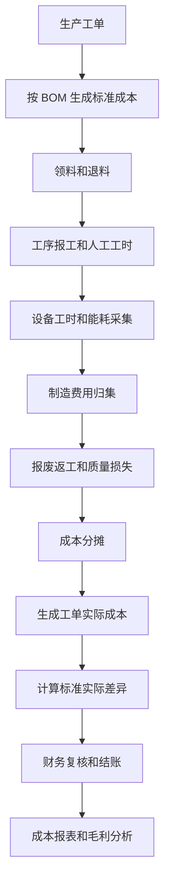
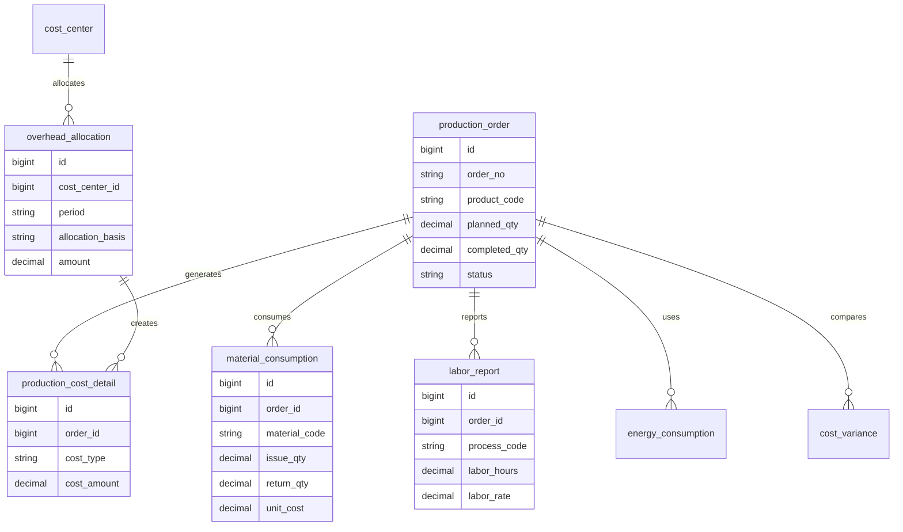
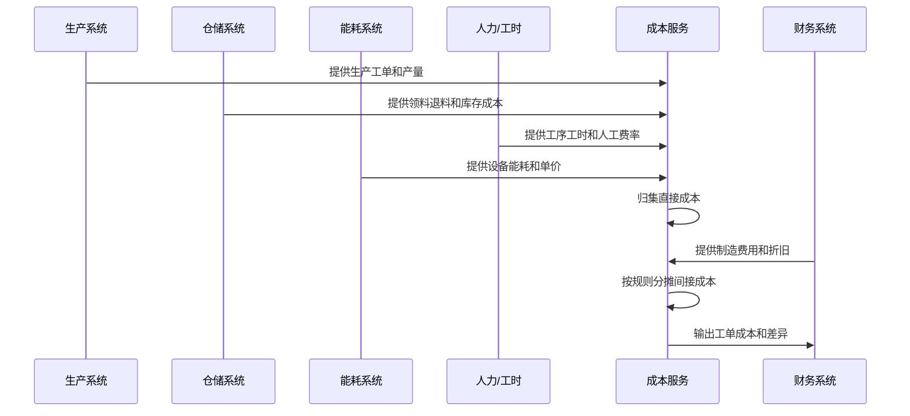
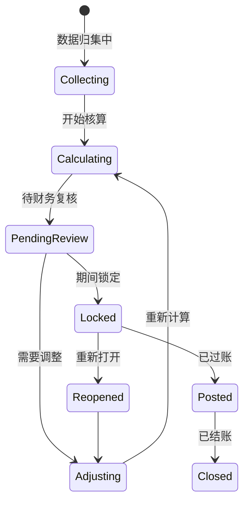

# 生产成本核算项目案例

## 适合谁看

如果你做过生产、库存、采购或财务系统，但不清楚“产品成本为什么不是简单材料价格相加”，可以先看这一篇。

生产成本核算要把材料、人工、制造费用、能耗、设备折旧、返工报废和工序产出关联起来，最终算出产品、批次、工单或订单的成本。

## 业务目标

生产成本系统要帮助企业回答 6 个问题：

- 每个产品或批次真实花了多少钱。
- 材料、人工、能耗和制造费用分别占多少。
- 标准成本和实际成本差异在哪里。
- 报废、返工、停机和良率对成本影响多大。
- 成本如何分摊到工单、批次、产品和销售订单。
- 财务结账时成本数据是否可追溯、可调整、可审计。

新手容易把它理解成“BOM 数量乘采购价”。真实项目里，BOM 只是材料理论消耗，实际成本还要看领料、退料、报工、能耗、工时、费用分摊和产出数量。

## 生产成本核算链路

这条链路里，成本核算不是生产系统最后加一个报表，而是贯穿领料、报工、质检、能耗和财务结账。

## 核心概念

| 概念 | 说明 | 项目里的典型字段 |
| --- | --- | --- |
| 标准成本 | 计划或预算下的理论成本 | standard_cost |
| 实际成本 | 按实际消耗和分摊计算的成本 | actual_cost |
| 直接材料 | 可直接归属到产品的材料 | material_cost |
| 直接人工 | 可归属到工单或工序的人工 | labor_cost |
| 制造费用 | 折旧、维修、租金、间接人工等 | overhead_cost |
| 成本中心 | 费用归集和分摊单位 | cost_center_id |
| 分摊规则 | 按工时、机时、产量、金额等分摊 | allocation_basis |
| 成本差异 | 标准和实际之间的差额 | variance_amount |

生产成本核算的核心是“归集”和“分摊”。能直接归属的就直接归属，不能直接归属的才按规则分摊。

## 数据模型

`production_cost_detail` 最好按成本类型拆明细，而不是只在工单上保存一个总成本。否则后面分析材料涨价、能耗异常或人工效率时没有数据依据。

## 推荐表结构

| 表 | 用途 | 关键字段 |
| --- | --- | --- |
| production_order | 生产工单 | order_no、product_code、planned_qty、completed_qty、status |
| standard_cost_version | 标准成本版本 | product_code、version、effective_date、standard_cost |
| material_consumption | 材料消耗 | order_id、material_code、issue_qty、return_qty、unit_cost |
| labor_report | 人工报工 | order_id、process_code、labor_hours、labor_rate |
| energy_consumption | 能耗消耗 | order_id、meter_code、energy_type、usage_amount、unit_price |
| overhead_allocation | 制造费用分摊 | cost_center_id、period、allocation_basis、amount |
| production_cost_detail | 成本明细 | order_id、cost_type、source_no、cost_amount |
| cost_variance | 成本差异 | order_id、variance_type、standard_amount、actual_amount |

成本表要保留期间字段和版本字段。成本不是永远实时变化的，它通常按月结、按批次或按结账期间确认。

## 成本归集流程

成本服务要能接受多系统数据，不要只依赖生产系统。生产系统知道产量，但不一定知道库存成本、工资费率和财务费用。

## 成本结账状态设计

成本期间锁定后，不应该随意改历史数据。必须通过调整单或重开期间来处理，否则报表会和财务账不一致。

## 前端页面拆分

| 页面 | 主要功能 | 新手容易漏掉 |
| --- | --- | --- |
| 成本总览 | 产品、工单、期间成本概览 | 要区分标准成本和实际成本 |
| 标准成本页 | 成本版本、BOM 成本、工艺成本 | 标准成本要有生效日期 |
| 工单成本页 | 材料、人工、能耗、费用明细 | 明细要能追到来源单据 |
| 费用分摊页 | 成本中心、分摊规则、分摊结果 | 分摊前后要能对账 |
| 成本差异页 | 价格差异、数量差异、效率差异 | 差异原因要支持分类 |
| 成本结账页 | 数据检查、计算、锁定、过账 | 结账前要有检查清单 |
| 毛利分析页 | 销售收入、成本、毛利率 | 成本期间和收入期间要匹配 |

成本页面要避免只做“财务报表”。业务人员需要看到问题来自材料、工时、能耗还是报废。

## 接口拆分建议

| 接口 | 方法 | 说明 |
| --- | --- | --- |
| /api/cost/standard-costs | GET/POST | 维护标准成本版本 |
| /api/cost/production-orders/:id | GET | 查询工单成本详情 |
| /api/cost/periods/:period/collect | POST | 归集期间成本数据 |
| /api/cost/periods/:period/calculate | POST | 执行期间成本核算 |
| /api/cost/periods/:period/review | POST | 财务复核 |
| /api/cost/periods/:period/lock | POST | 锁定成本期间 |
| /api/cost/allocations | GET/POST | 查询和维护分摊规则 |
| /api/cost/variances | GET | 查询成本差异 |

成本核算接口要异步执行。一个期间可能涉及大量工单、领料、报工和分摊数据，同步请求很容易超时。

## 实际项目常见问题

### 问题 1：工单成本和库存金额对不上

常见原因是领料、退料、报废和入库时间点不一致。

解决方式：

- 成本期间内统一截断时间。
- 领料和退料都进入成本归集。
- 半成品和成品入库要有成本转移记录。
- 结账前跑数据完整性检查。

### 问题 2：标准成本改了，历史毛利全变了

通常是没有标准成本版本。

解决方式：

- 标准成本按版本和生效日期管理。
- 销售毛利使用当时生效的成本版本或已结账成本。
- 历史报表不读取当前标准成本。
- 调整必须生成差异记录。

### 问题 3：制造费用分摊被业务质疑

分摊规则不透明，业务不知道为什么这个产品分了这么多费用。

解决方式：

- 展示分摊基础，例如工时、机时、产量或金额。
- 保存分摊前总额、分摊比例和分摊结果。
- 分摊规则变更要审批。
- 支持按成本中心查看分摊明细。

### 问题 4：生产异常没有进入成本

报废、返工、停机没有被纳入成本明细。

解决方式：

- 质量异常和设备异常要能关联工单。
- 报废材料、返工工时和额外能耗形成成本明细。
- 成本差异报表展示异常原因。
- 对高额异常成本设置审批和预警。

## 权限与审计

| 权限 | 建议 |
| --- | --- |
| 查看成本 | 按工厂、成本中心、产品线授权 |
| 维护标准成本 | 财务或成本会计，必须有版本记录 |
| 执行核算 | 成本会计角色，记录批次和参数 |
| 调整成本 | 财务负责人审批，保存调整原因 |
| 锁定期间 | 少数结账角色，二次确认 |
| 导出报表 | 敏感数据导出审计和水印 |

成本数据直接影响毛利和财务报表，权限应该比普通生产数据更严格。

## 验收清单

- 标准成本和实际成本能按版本追溯。
- 材料、人工、能耗和制造费用都有来源单据。
- 分摊规则和分摊结果可解释。
- 结账期间锁定后不会被普通操作改写。
- 报废、返工和停机成本能进入差异分析。
- 成本核算失败可以定位到具体数据问题。
- 成本报表和财务过账结果能对账。

## 下一步学习

建议继续阅读：

- [生产制造项目案例](/projects/manufacturing-execution-case)
- [生产能耗分析项目案例](/projects/production-energy-analysis-case)
- [生产质量异常项目案例](/projects/production-quality-exception-case)
- [财务对账项目案例](/projects/finance-reconciliation-case)
