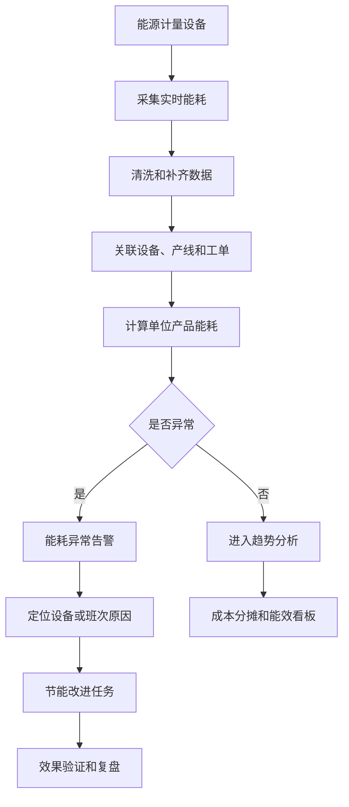
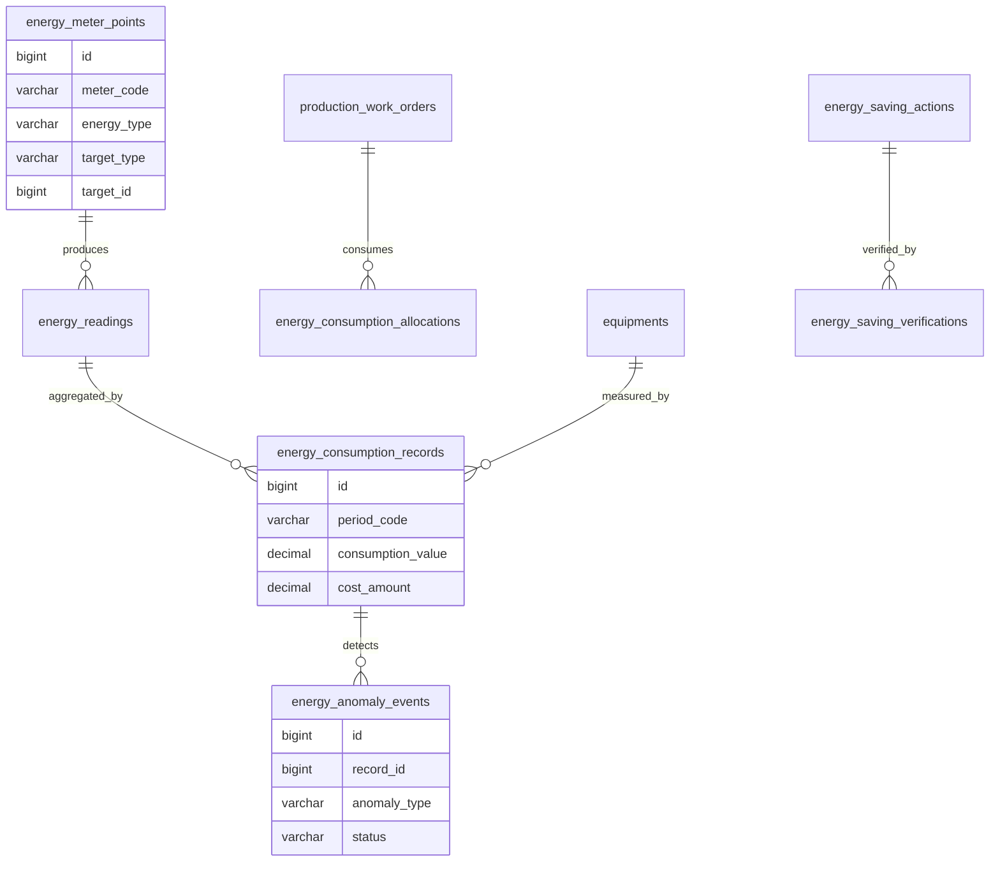
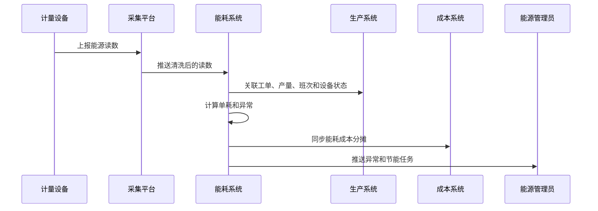

# 生产能耗分析项目案例

## 适合谁看

适合需要做生产用电、用气、用水、设备能耗、产线能效、单位产品能耗、能耗异常、节能改进和能源管理看板的开发者。

生产能耗分析不是“画一个电表趋势图”。真实制造项目里，能耗会连接设备、产线、工单、产量、班次、天气、能源价格、碳排放和成本核算。系统要能回答：哪条产线能耗高、单位产品能耗是否异常、停机空转浪费多少、能耗成本如何分摊、节能措施是否有效。

## 业务目标

第一版生产能耗分析支持：

- 接入电表、水表、气表、蒸汽表和设备能耗数据。
- 支持按工厂、车间、产线、设备、工单和班次归集能耗。
- 支持单位产量能耗、单位工时能耗、空转能耗和峰谷电费分析。
- 支持能耗异常识别和告警。
- 支持能耗成本分摊到产品、工单、车间和设备。
- 支持节能措施、目标值、实际效果和复盘。
- 支持能源指标看板、趋势分析和对标。
- 支持碳排放、能源审计和管理改进。

## 生产能耗分析链路

能耗分析的关键是“能耗和产量关联”。只看总用电量没有意义，必须结合产量、工时、设备状态和产品结构。

## 核心概念

| 概念 | 说明 | 示例 |
| --- | --- | --- |
| 能源介质 | 被消耗的能源类型 | 电、水、气、蒸汽 |
| 计量点 | 能源采集位置 | 车间总表、设备分表 |
| 单耗 | 单位产品或工时能耗 | 每件 1.2 kWh |
| 空转能耗 | 无有效产出时的能耗 | 设备待机用电 |
| 峰谷电价 | 不同时段能源价格 | 峰时电价高 |
| 能耗基线 | 正常情况下的能耗水平 | 历史平均单耗 |
| 能耗异常 | 偏离基线的能耗事件 | 单耗上升 30% |
| 节能措施 | 降低能耗的改进行动 | 调整开机策略 |

能耗指标要有口径。按产量、按工时、按设备运行时间得出的结论可能不同。

## 数据模型

## 推荐表结构

| 表 | 作用 | 关键字段 |
| --- | --- | --- |
| `energy_meter_points` | 能源计量点 | `meter_code`、`energy_type`、`target_type`、`target_id`、`enabled` |
| `energy_readings` | 原始读数 | `meter_id`、`reading_time`、`reading_value`、`quality_status` |
| `energy_consumption_records` | 能耗汇总 | `period_code`、`target_type`、`target_id`、`consumption_value`、`cost_amount` |
| `energy_consumption_allocations` | 能耗分摊 | `record_id`、`work_order_id`、`product_id`、`allocated_value` |
| `energy_baselines` | 能耗基线 | `target_type`、`target_id`、`metric_code`、`baseline_value`、`version_no` |
| `energy_anomaly_events` | 能耗异常 | `record_id`、`anomaly_type`、`deviation_rate`、`status` |
| `energy_saving_actions` | 节能措施 | `action_name`、`owner_id`、`expected_saving`、`status` |
| `energy_saving_verifications` | 节能验证 | `action_id`、`actual_saving`、`verified_period`、`conclusion` |

原始读数和汇总记录要分开。原始读数用于追溯，汇总记录用于分析和看板。

## 能耗归集流程

能耗数据质量很重要。断点、跳变、倒表、表计更换都要记录，否则趋势和单耗会失真。

## 能耗状态设计

| 状态 | 含义 | 注意点 |
| --- | --- | --- |
| 待采集 | 计量点已配置但未采集 | 检查设备 |
| 正常采集 | 数据持续进入 | 可分析 |
| 数据异常 | 读数跳变、缺失或倒表 | 需要修正 |
| 待归集 | 有能耗但未关联业务对象 | 不能用于成本 |
| 已归集 | 能耗已关联设备、产线或工单 | 可分摊 |
| 异常待处理 | 能耗偏离基线 | 生成任务 |
| 改进中 | 已创建节能措施 | 跟踪效果 |
| 已验证 | 节能效果完成验证 | 进入复盘 |

数据异常和能耗异常不是一回事。数据异常是采集质量问题，能耗异常是业务能效问题。

## 前端页面拆分

| 页面或组件 | 作用 | 注意点 |
| --- | --- | --- |
| 能耗总览 | 查看工厂、车间、产线、设备能耗 | 支持能源类型切换 |
| 计量点管理 | 配置电表、水表、气表和归属对象 | 表计更换要留痕 |
| 单耗分析 | 分析单位产品、工单、班次能耗 | 关联产量 |
| 峰谷成本 | 分析不同时段能源成本 | 支持电价配置 |
| 能耗异常 | 查看偏离基线事件 | 支持原因归类 |
| 成本分摊 | 将能耗成本分配到产品和工单 | 规则可解释 |
| 节能任务 | 跟踪节能措施和验证结果 | 量化收益 |
| 能效看板 | 趋势、排名、对标和节能效果 | 支持管理层视角 |

能耗看板要避免只展示总量。更有价值的是单耗、峰谷成本、空转占比和异常贡献。

## 接口拆分建议

| 接口 | 作用 | 注意点 |
| --- | --- | --- |
| `POST /energy-meter-points` | 创建计量点 | 绑定设备或产线 |
| `POST /energy-readings/import` | 导入能耗读数 | 校验数据质量 |
| `POST /energy-consumption/aggregate` | 汇总能耗 | 按周期和对象 |
| `POST /energy-consumption/allocate` | 能耗分摊 | 按工单、产量或工时 |
| `POST /energy-anomalies/detect` | 检测异常 | 基于基线和阈值 |
| `POST /energy-saving-actions` | 创建节能措施 | 设置预期收益 |
| `POST /energy-saving-actions/{id}/verify` | 验证节能效果 | 对比基线 |
| `GET /energy-analysis/dashboard` | 查询能耗看板 | 支持多维筛选 |

## 实际项目常见问题

### 问题 1：总能耗下降，但单位产品能耗上升

总量受产量影响。必须看单位产品能耗、设备运行时间和产品结构，不能只看总电量。

### 问题 2：设备空转没人发现

能耗要结合设备状态和产量。设备运行但无产出时，应识别为空转能耗并推送改善。

### 问题 3：表计数据断点导致趋势异常

读数缺失、跳变和表计更换要记录数据质量状态。异常读数不能直接进入正式分析。

### 问题 4：节能项目做了但无法证明效果

节能措施要有基线、预期收益、验证周期和实际节省值。没有基线就无法判断是否真的节能。

## 权限与审计

生产能耗分析权限至少要区分：

- 查看能耗看板。
- 配置计量点。
- 导入或修正读数。
- 配置基线和阈值。
- 处理能耗异常。
- 创建节能措施。
- 验证节能效果。
- 导出能源审计数据。

计量点配置、读数修正、基线变更、分摊规则、异常关闭和节能验证都要审计。能耗数据会影响成本、绩效和能源审计。

## 验收清单

- 支持电、水、气、蒸汽等能源介质。
- 计量点能绑定工厂、车间、产线、设备。
- 原始读数和汇总数据分离。
- 能耗能关联工单、产量、班次和设备状态。
- 支持单位产品能耗和空转能耗分析。
- 支持峰谷电价和成本分摊。
- 能识别数据异常和能耗异常。
- 支持节能措施和效果验证。
- 能耗看板支持趋势、排名和对标。
- 关键配置和修正动作有审计记录。

## 下一步学习

继续学习 [生产制造项目案例](/projects/manufacturing-execution-case)、[生产设备异常项目案例](/projects/production-equipment-exception-case)、[IoT 设备管理项目案例](/projects/iot-device-management-case) 和 [数据看板项目案例](/projects/analytics-dashboard-case)。
