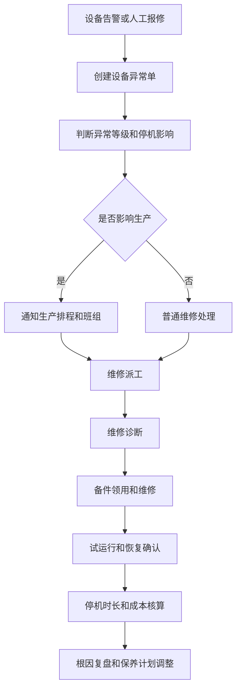
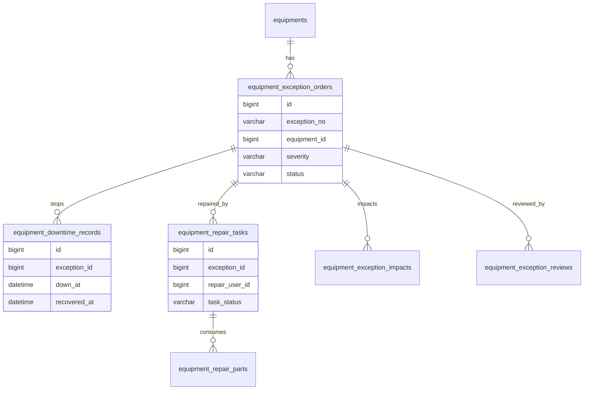
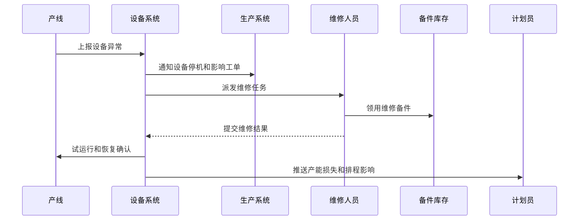

# 生产设备异常项目案例

## 适合谁看

适合需要做设备异常上报、停机记录、维修派工、备件领用、恢复确认、MTTR/MTBF、预防性维护和设备异常复盘的开发者。

生产设备异常不是“设备坏了报修”。真实制造项目里，设备异常会影响生产排程、工单产量、质量结果、人员调度、备件库存和交付承诺。系统要能回答：哪台设备异常、什么时候停机、影响哪些工单、谁在维修、用了哪些备件、何时恢复、是否复发、是否需要调整保养计划。

## 业务目标

第一版生产设备异常支持：

- 从产线、设备点检、IoT 告警、人工报修创建异常。
- 支持异常分级、停机影响、产线影响和工单影响分析。
- 支持维修派工、到场、诊断、维修、试运行和恢复确认。
- 支持备件领用、维修工时、外协维修和维修成本记录。
- 支持 MTTR、MTBF、停机时长、故障类型和复发率分析。
- 支持临时修复、根因分析、预防性维护和保养计划调整。
- 支持设备异常看板、产能影响和交付风险预警。

## 生产设备异常链路

设备异常的关键是“影响生产”。维修系统不能只记录维修过程，还要把停机影响传递给生产排程和交付计划。

## 核心概念

| 概念 | 说明 | 示例 |
| --- | --- | --- |
| 设备异常 | 设备状态不符合生产要求 | 传送带故障 |
| 停机事件 | 设备无法继续生产的时间段 | 停机 2 小时 |
| 维修派工 | 分派维修人员处理异常 | 机修工接单 |
| 故障类型 | 异常原因分类 | 电气、机械、软件 |
| MTTR | 平均修复时间 | 平均 45 分钟 |
| MTBF | 平均故障间隔 | 平均 12 天故障一次 |
| 临时修复 | 暂时恢复生产但未根治 | 临时更换零件 |
| 预防性维护 | 为避免复发调整保养计划 | 增加点检频率 |

设备异常和设备维保要关联但分开。异常是已经发生的问题，维保是计划性预防动作。

## 数据模型

## 推荐表结构

| 表 | 作用 | 关键字段 |
| --- | --- | --- |
| `equipment_exception_orders` | 设备异常单 | `exception_no`、`equipment_id`、`source_type`、`severity`、`status` |
| `equipment_downtime_records` | 停机记录 | `exception_id`、`down_at`、`recover_at`、`downtime_minutes` |
| `equipment_exception_impacts` | 影响范围 | `exception_id`、`work_order_id`、`line_id`、`lost_output_qty` |
| `equipment_repair_tasks` | 维修任务 | `exception_id`、`repair_user_id`、`assigned_at`、`arrived_at`、`finished_at` |
| `equipment_repair_parts` | 维修备件 | `repair_task_id`、`part_id`、`quantity`、`cost_amount` |
| `equipment_exception_causes` | 故障原因 | `exception_id`、`fault_type`、`root_cause`、`evidence` |
| `equipment_exception_reviews` | 异常复盘 | `exception_id`、`review_result`、`preventive_action`、`owner_id` |
| `equipment_maintenance_adjustments` | 保养计划调整 | `exception_id`、`plan_id`、`adjust_type`、`reason` |

停机开始和恢复时间要准确。停机时长是产能损失、设备效率和维修绩效的核心指标。

## 维修恢复流程

设备恢复不只由维修人员确认。生产班组通常也要确认试运行结果，避免设备刚修完又影响质量。

## 异常状态设计

| 状态 | 含义 | 注意点 |
| --- | --- | --- |
| 待确认 | 异常刚上报 | 判断是否停机 |
| 已停机 | 设备停止生产 | 开始计算停机 |
| 已派工 | 维修任务已分派 | 跟踪到场时间 |
| 诊断中 | 正在判断故障原因 | 可申请备件 |
| 维修中 | 正在维修或外协 | 记录工时 |
| 试运行 | 维修完成等待验证 | 生产确认 |
| 已恢复 | 设备恢复生产 | 结束停机 |
| 待复盘 | 高风险或重复异常 | 分析根因 |
| 已关闭 | 复盘和预防动作完成 | 只读归档 |

临时恢复和彻底修复要区分。临时恢复可以减少停机，但仍需要后续根治任务。

## 前端页面拆分

| 页面或组件 | 作用 | 注意点 |
| --- | --- | --- |
| 设备异常工作台 | 查看待确认、停机、维修中、超时异常 | 按产线和等级优先 |
| 异常上报 | 人工创建异常或接收 IoT 告警 | 支持移动端扫码设备 |
| 停机影响 | 展示影响工单、产线、产量和交付 | 给计划员使用 |
| 维修派工 | 分派维修人员、外协或班组 | 支持到场计时 |
| 维修记录 | 记录诊断、工时、备件、结果 | 证据和图片 |
| 恢复确认 | 维修和生产共同确认恢复 | 支持试运行结果 |
| 异常复盘 | 分析根因、复发和预防动作 | 和维保计划联动 |
| 设备异常看板 | 分析 MTTR、MTBF、停机和成本 | 按设备、产线、故障类型 |

设备异常页面要突出时间轴：上报、停机、派工、到场、修复、试运行、恢复。维修效率主要看这些时间点。

## 接口拆分建议

| 接口 | 作用 | 注意点 |
| --- | --- | --- |
| `POST /equipment-exceptions` | 创建设备异常 | 支持人工和 IoT 来源 |
| `POST /equipment-exceptions/{id}/downtime` | 登记停机 | 幂等记录停机开始 |
| `POST /equipment-exceptions/{id}/assign` | 维修派工 | 保存维修人员和 SLA |
| `POST /equipment-exceptions/{id}/diagnose` | 提交诊断 | 记录故障类型和原因 |
| `POST /equipment-exceptions/{id}/repair-parts` | 登记维修备件 | 关联库存出库 |
| `POST /equipment-exceptions/{id}/recover` | 恢复确认 | 结束停机计时 |
| `POST /equipment-exceptions/{id}/review` | 异常复盘 | 生成预防动作 |
| `GET /equipment-exceptions/metrics` | 查询设备异常指标 | MTTR、MTBF、停机时长 |

## 实际项目常见问题

### 问题 1：设备停机时间不准

停机开始、维修到场、修复完成、生产确认要分开记录。只记录工单创建和关闭时间会严重失真。

### 问题 2：设备恢复了，但排程没有调整

设备异常要把停机时长和产能损失推送给生产排程。否则计划员不知道哪些工单需要重排。

### 问题 3：同一故障反复出现

要按设备、故障类型、备件、班次、产线统计复发。重复异常应触发复盘和预防性维护调整。

### 问题 4：维修用了备件但库存没扣

维修备件领用要关联库存流水。维修任务关闭前要校验备件消耗、退料和成本。

## 权限与审计

生产设备异常权限至少要区分：

- 上报设备异常。
- 确认停机影响。
- 分派维修任务。
- 登记维修诊断。
- 领用维修备件。
- 确认设备恢复。
- 创建复盘和预防动作。
- 查看设备异常指标。

停机、派工、恢复、备件领用、外协维修、复盘关闭和保养计划调整都要审计。设备异常会影响产能、质量和交付。

## 验收清单

- 异常可从人工、点检和 IoT 告警创建。
- 能记录停机开始、到场、修复和恢复时间。
- 能分析影响工单、产线、产量和交付。
- 支持维修派工、诊断、维修和试运行。
- 维修备件能关联库存和成本。
- 支持临时恢复和彻底修复区分。
- 支持 MTTR、MTBF、停机时长和复发率分析。
- 高风险或重复异常可进入复盘。
- 复盘可调整预防性维护计划。
- 关键操作有审计记录。

## 下一步学习

继续学习 [设备维保项目案例](/projects/equipment-maintenance-case)、[生产制造项目案例](/projects/manufacturing-execution-case)、[生产排程项目案例](/projects/production-scheduling-case) 和 [IoT 设备管理项目案例](/projects/iot-device-management-case)。
