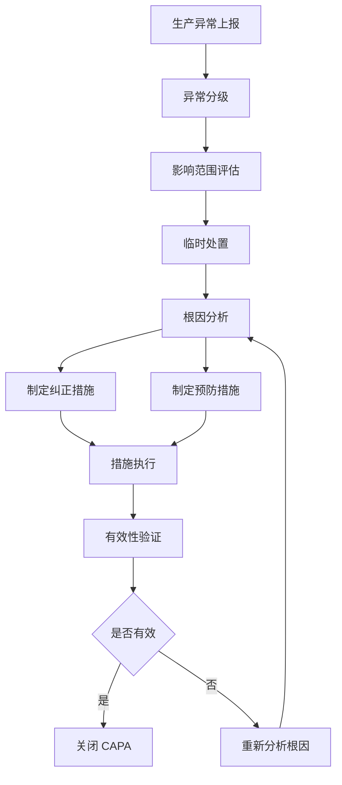
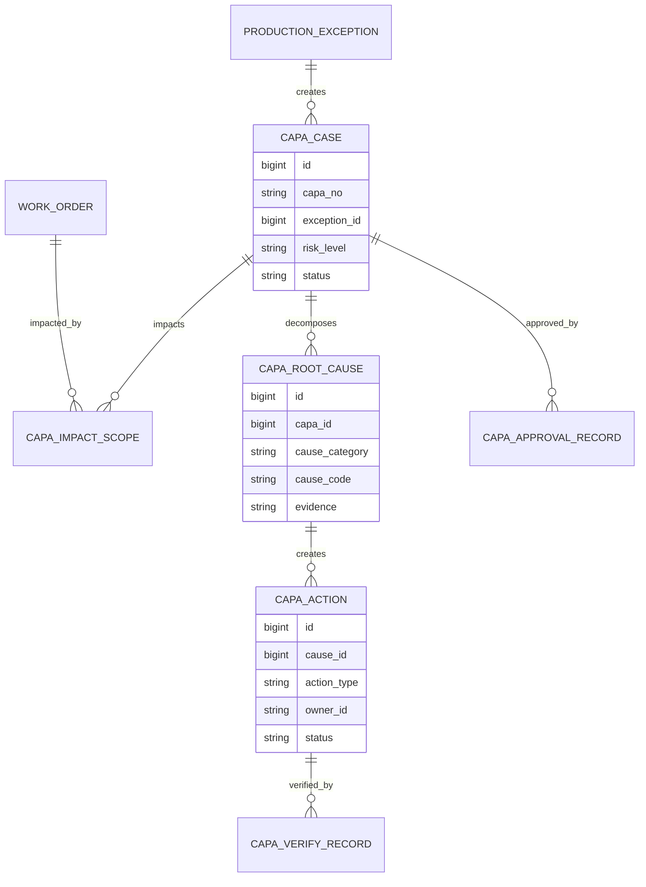
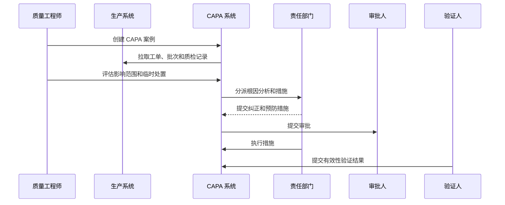
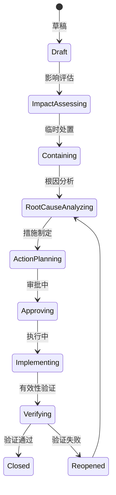
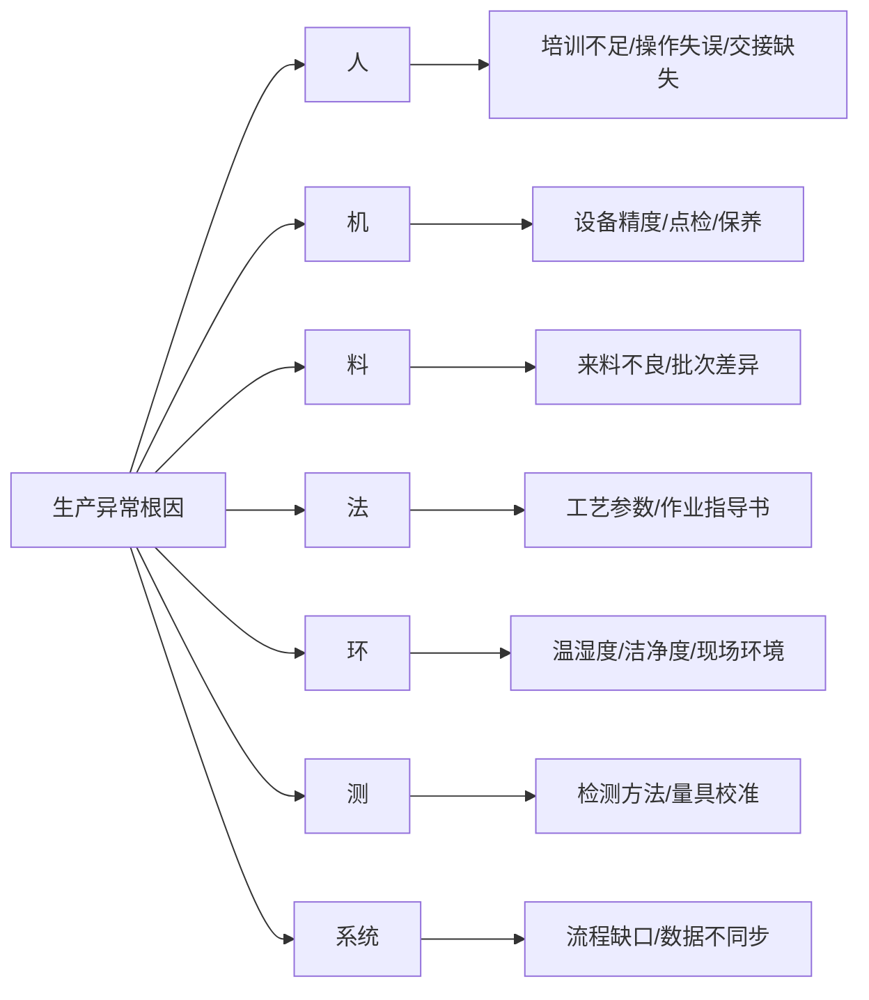

# 生产异常 CAPA 项目案例

## 适合谁看

如果你做过生产质量异常、质量追溯、生产良率分析或生产停线损失复盘，但还不清楚如何把异常处理升级为纠正预防闭环，可以学习这个案例。

CAPA 是 Corrective Action and Preventive Action，通常翻译为纠正措施和预防措施。它的目标不是把异常单处理掉，而是找到根因、纠正当前问题、预防再次发生，并验证措施是否真的有效。

## 业务目标

生产异常 CAPA 要回答 6 个问题：

- 哪些生产异常需要进入 CAPA，而不是普通处理。
- 异常影响哪些批次、工单、客户订单、库存和发货。
- 根因来自人、机、料、法、环、测还是系统流程。
- 当前应该隔离、返工、报废、放行、召回还是停线。
- 纠正措施和预防措施分别是什么，由谁负责。
- 措施完成后，同类异常是否减少，质量指标是否改善。

在真实项目中，CAPA 最大的问题是“写了原因和措施，但没有验证”。所以系统设计必须把有效性验证作为关闭条件。

## 生产异常 CAPA 链路

临时处置解决当前风险，纠正措施解决已发生问题，预防措施解决未来复发问题。三者不能混为一谈。

## 核心概念

| 概念 | 说明 | 新手理解 |
| --- | --- | --- |
| 生产异常 | 生产过程偏离标准的事件 | 质量、设备、工艺、物料异常 |
| CAPA | 纠正和预防闭环 | 不只处理异常，还要防止复发 |
| 临时处置 | 先控制风险的动作 | 隔离、停线、返工、加检 |
| 根因分析 | 找真正原因 | 不是只写“员工操作失误” |
| 纠正措施 | 修正已经发生的问题 | 返工、重检、参数调整 |
| 预防措施 | 防止再次发生 | 标准更新、培训、防错、监控 |
| 有效性验证 | 判断措施是否真的有用 | 看异常是否下降、指标是否改善 |

CAPA 项目要特别避免“原因模板化”。所有异常都写成操作不规范，就无法推动工艺、设备和供应链改进。

## 数据模型

CAPA 案例要和生产异常分开。不是所有异常都需要 CAPA，只有高风险、重复发生、影响客户或违反质量体系的异常才进入 CAPA。

## 推荐表结构

| 表 | 用途 | 关键字段 |
| --- | --- | --- |
| `production_exception` | 生产异常 | exception_no、line_code、work_order_no、exception_type、status |
| `capa_case` | CAPA 案例 | capa_no、exception_id、risk_level、owner_id、status |
| `capa_impact_scope` | 影响范围 | capa_id、object_type、object_id、impact_level、action_required |
| `capa_root_cause` | 根因项 | capa_id、cause_category、cause_code、evidence、responsible_dept |
| `capa_action` | 措施 | cause_id、action_type、action_plan、owner_id、due_date、status |
| `capa_verify_record` | 有效性验证 | action_id、verify_method、verify_result、evidence_file_id |
| `capa_approval_record` | 审批记录 | capa_id、approval_node、approver_id、result、comment |
| `capa_recurrence_monitor` | 复发监控 | capa_id、monitor_period、recurrence_count、status |

措施表里的 `action_type` 建议区分 corrective 和 preventive。否则复盘时不知道团队是在处理当前问题，还是在防止未来复发。

## CAPA 执行流程

CAPA 要跨部门协作。质量团队负责流程和验证，生产、设备、工艺、供应链负责根因和措施。

## CAPA 状态设计

CAPA 关闭前必须完成验证。如果只看措施是否填完，系统会变成表单归档工具。

## 根因分析拆解

这种拆解常见于制造质量分析。它能帮助团队避免把所有问题都归结到个人操作。

## 前端页面拆分

| 页面 | 核心内容 | 设计建议 |
| --- | --- | --- |
| CAPA 总览 | 未关闭、逾期、高风险、复发率 | 管理层关注风险和逾期 |
| 异常转 CAPA | 异常详情、触发条件、风险等级 | 明确为什么需要 CAPA |
| 影响范围页 | 批次、工单、库存、客户订单 | 帮助决定隔离或召回 |
| 根因分析页 | 多根因、证据、责任部门 | 支持 5Why 或鱼骨图附件 |
| 措施计划页 | 纠正、预防、负责人、截止时间 | 两类措施分开展示 |
| 审批页 | 风险、根因、措施、影响 | 审批人看摘要和证据 |
| 验证复盘页 | 验证方法、结果、复发监控 | 关闭前必须完成 |

CAPA 页面要减少“填表感”，突出风险、责任、措施和验证。

## 接口拆分建议

| 接口 | 方法 | 说明 |
| --- | --- | --- |
| `/api/production-exceptions` | GET/POST | 查询和创建生产异常 |
| `/api/capa-cases` | GET/POST | 查询和创建 CAPA |
| `/api/capa-cases/:id/impact-scope` | GET/POST | 维护影响范围 |
| `/api/capa-cases/:id/root-causes` | GET/POST | 提交根因分析 |
| `/api/capa-cases/:id/actions` | GET/POST | 创建纠正和预防措施 |
| `/api/capa-cases/:id/submit-approval` | POST | 提交审批 |
| `/api/capa-actions/:id/verify` | POST | 提交有效性验证 |
| `/api/capa-cases/review` | GET | 查询 CAPA 复盘指标 |

CAPA 相关接口要保存操作历史。根因和措施变更频繁，后续审计需要知道每次调整原因。

## 实际项目常见问题

### 1. 所有异常都进入 CAPA，团队处理不过来

CAPA 门槛太低，会导致流程拥堵。

解决方式：

- 设置 CAPA 触发条件。
- 高风险、重复发生、客户投诉、法规影响才强制 CAPA。
- 普通异常走快速处理流程。
- CAPA 总览监控逾期和积压。

### 2. 根因写得很浅

例如只写“员工操作失误”，没有分析为什么会失误。

解决方式：

- 使用人机料法环测分类。
- 允许多根因和证据附件。
- 根因必须关联责任部门。
- 主管复核高风险 CAPA 根因。

### 3. 纠正措施和预防措施混在一起

团队只处理当前批次，没有防复发动作。

解决方式：

- 措施类型强制区分纠正和预防。
- 预防措施必须有制度、流程、设备、系统或培训动作。
- 关闭时检查两类措施是否完成。
- 复发则自动重开。

### 4. 有效性验证走形式

只上传一张截图或写“已完成”。

解决方式：

- 验证方法提前定义。
- 验证结果要有指标或样本。
- 验证期内监控复发。
- 验证失败自动退回根因分析。

### 5. CAPA 和质量追溯割裂

无法知道影响了哪些批次和客户。

解决方式：

- CAPA 影响范围关联批次、工单、库存和发货。
- 必要时触发隔离、召回或客户通知。
- 质量追溯页面能反查 CAPA。
- CAPA 关闭后回写质量知识库。

## 权限与审计

| 权限点 | 控制原因 |
| --- | --- |
| 创建 CAPA | 会触发跨部门质量流程 |
| 修改影响范围 | 影响隔离、召回和客户风险 |
| 提交根因 | 影响责任归属 |
| 提交措施 | 影响整改计划 |
| 审批 CAPA | 决定措施是否可执行 |
| 关闭 CAPA | 代表验证通过 |

审计日志要记录 CAPA 创建、风险等级调整、影响范围变更、根因变更、措施变更、审批意见、验证结果和重新打开。

## 验收清单

- 生产异常能按规则触发 CAPA。
- CAPA 能评估批次、工单、库存、客户订单等影响范围。
- 根因分析支持人机料法环测和多根因。
- 措施能区分纠正和预防。
- CAPA 有审批、执行和验证流程。
- 验证失败能重新打开。
- CAPA 数据能反哺质量追溯、培训和流程改进。

## 下一步学习

建议继续阅读：

- [生产质量异常项目案例](/projects/production-quality-exception-case)
- [质量追溯项目案例](/projects/quality-traceability-case)
- [生产良率分析项目案例](/projects/production-yield-analysis-case)
- [生产停线损失复盘项目案例](/projects/production-line-stop-loss-review-case)
