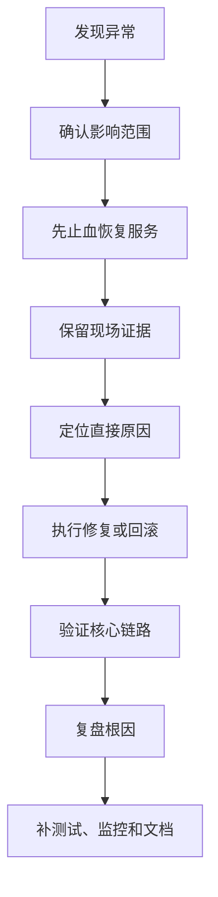
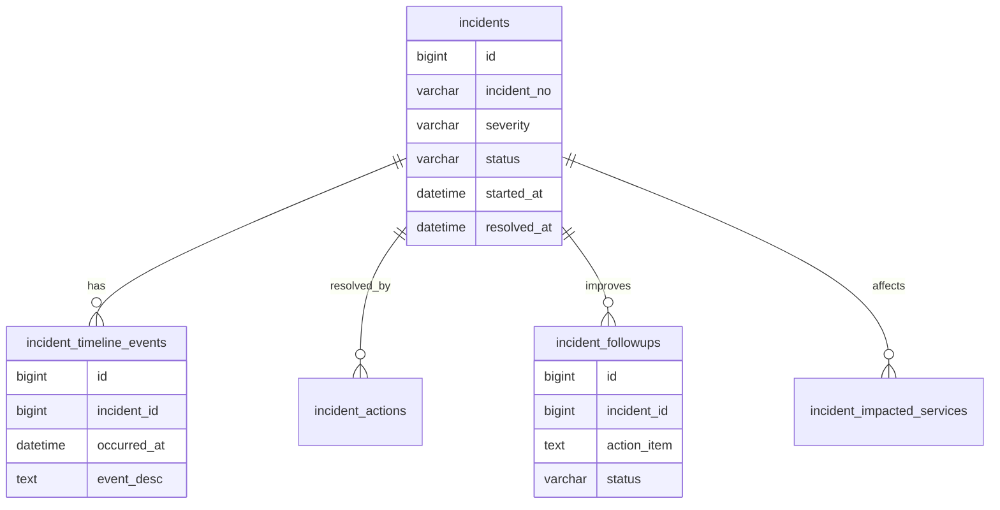

# 上线事故案例库

## 适合谁看

适合需要把线上事故、发布问题、性能问题、权限问题、缓存问题和数据问题沉淀成团队经验的开发者。

这个页面不是复盘模板，而是常见事故案例库。它把事故按“现象、影响、根因、恢复、预防”拆开，方便你在上线前做检查，也方便事故后快速定位同类问题。

如果你要写完整复盘，先看 [故障复盘模板](/projects/incident-review)。如果你要上线前检查，先看 [项目交付检查清单](/projects/delivery-checklist)。

## 事故处理总流程

线上事故处理顺序很重要：先恢复，再分析，再改进。不要在服务不可用时长时间争论根因。

## 事故数据模型

如果团队有事故平台，可以把事故、时间线、处理动作和改进项结构化保存。没有事故平台时，也应该按同样结构写进文档。

## 案例 1：发布后白屏

### 现象

- 用户打开页面只看到白屏。
- 浏览器 Console 报资源加载失败或运行时错误。
- 刷新后仍然失败。

### 影响范围

通常影响刚发布版本的前端页面，可能只影响部分浏览器、部分地区或命中 CDN 旧缓存的用户。

### 常见根因

- 新 JS 文件发布了，但 `index.html` 仍引用旧文件。
- CDN 没有刷新入口 HTML。
- 构建产物路径和部署路径不一致。
- 运行时环境变量缺失。
- 代码里访问了不存在的全局配置。

### 恢复方式

1. 回滚入口 HTML 或回滚整包。
2. 刷新 CDN 的 `index.html`。
3. 验证静态资源路径是否可访问。
4. 用无缓存窗口访问核心页面。

### 预防方式

- `index.html` 使用短缓存。
- 静态资源文件名带 hash。
- 发布后验证首页、登录页、核心二级路由。
- 环境变量缺失时构建阶段失败，而不是运行时报错。

## 案例 2：接口 401 和 403 混乱

### 现象

- 用户已经登录，但接口返回 401。
- 无权限接口有时返回 403，有时返回 500。
- 前端无法判断是跳登录页还是展示无权限。

### 影响范围

影响登录态、权限系统、菜单按钮和接口拦截器。

### 常见根因

- 认证失败和授权失败没有分清。
- Token 过期、用户禁用、角色变更都返回同一个错误码。
- 前端拦截器只处理 401，没有处理 403。
- 后端异常被统一包装成 500。

### 恢复方式

1. 临时修复错误码映射。
2. 确认登录过期统一返回 401。
3. 确认无权限统一返回 403。
4. 前端分别处理跳登录和无权限提示。

### 预防方式

- 错误码规范写进联调文档。
- 权限测试覆盖“未登录、已登录无权限、角色变更、账号禁用”。
- 网关、业务服务和前端拦截器使用同一套错误码约定。

## 案例 3：数据库慢查询拖垮接口

### 现象

- 某个列表页突然加载很慢。
- API P95、P99 延迟升高。
- 数据库 CPU 或慢查询数量上升。

### 影响范围

通常影响高频列表、搜索、导出、统计和后台管理页面。

### 常见根因

- 新增筛选条件没有对应索引。
- `WHERE` 和 `ORDER BY` 组合没有复合索引。
- 测试环境数据量太小，没暴露性能问题。
- 导出接口复用了分页查询但没有限制总量。

### 恢复方式

1. 降级或关闭高风险查询入口。
2. 回滚查询逻辑。
3. 添加临时索引或限制筛选条件。
4. 排查慢查询日志和执行计划。

### 预防方式

- 重要列表上线前跑 `EXPLAIN`。
- 大表新增查询必须评审索引。
- 导出任务异步化并限制范围。
- 对核心接口配置 P95 告警。

## 案例 4：缓存没有失效导致权限错乱

### 现象

- 管理员修改角色后，用户仍然看到旧菜单。
- 按钮隐藏了，但接口还能访问。
- 部分用户权限正常，部分用户权限异常。

### 影响范围

影响菜单、按钮权限、接口权限、数据范围和租户隔离。

### 常见根因

- 角色变更后只更新数据库，没有清理权限缓存。
- 菜单缓存、按钮缓存和接口权限缓存失效策略不一致。
- 前端本地缓存没有随权限版本更新。
- 后端接口授权缺失，只依赖前端隐藏。

### 恢复方式

1. 清理用户、角色和菜单相关缓存。
2. 强制用户重新获取权限版本。
3. 检查高风险接口后端授权。
4. 对异常用户重新生成权限上下文。

### 预防方式

- 权限变更发布权限版本号。
- 前端缓存按权限版本失效。
- 后端接口必须独立鉴权。
- 权限变更加入审计和自动化测试。

## 案例 5：队列积压导致任务延迟

### 现象

- 用户操作成功，但异步结果迟迟不出现。
- 消息队列积压持续升高。
- 消费者日志出现大量重试或超时。

### 影响范围

影响消息通知、数据同步、导入导出、报表生成、订单状态同步等异步链路。

### 常见根因

- 消费者处理单条消息太慢。
- 下游接口异常导致重试风暴。
- 消息没有幂等，失败后无法安全重试。
- 队列没有积压告警。

### 恢复方式

1. 暂停非核心生产者。
2. 扩容消费者或降低单条处理耗时。
3. 将持续失败消息转入死信队列。
4. 对下游异常做降级或限流。

### 预防方式

- 队列配置积压和消费延迟告警。
- 消费者具备幂等能力。
- 失败消息进入死信队列。
- 下游不可用时使用限流、熔断和补偿。

## 案例 6：AI 文档问答泄露无权限内容

### 现象

- 普通用户问到了管理员文档内容。
- 页面入口没有管理员菜单，但 AI 回答里出现了敏感资料。
- 引用来源指向用户无权访问的文档。

### 影响范围

影响 RAG 检索、文档权限、引用展示和 AI 工程安全。

### 常见根因

- 文档页面做了权限，向量检索没有做权限过滤。
- 文档 chunk 没有保存权限元数据。
- 评测集没有覆盖越权问题。
- 引用链接没有再次校验权限。

### 恢复方式

1. 暂停高敏知识库检索。
2. 为 chunk 补充权限范围。
3. 检索时带用户权限上下文。
4. 回答前过滤无权限引用。

### 预防方式

- 文档导入时保存权限元数据。
- 检索层和详情层都做权限过滤。
- 评测集中加入越权样例。
- AI 回答引用必须可追溯、可授权。

## 事故复盘检查清单

| 检查项 | 要确认什么 |
| --- | --- |
| 影响范围 | 影响用户、业务、接口、数据和持续时间 |
| 恢复动作 | 是否已经止血，是否需要回滚 |
| 直接原因 | 哪个变更或状态触发事故 |
| 系统原因 | 测试、发布、监控、权限、文档哪里缺失 |
| 改进项 | 是否有负责人、截止时间和验收方式 |
| 文档回写 | 是否更新问题库、交付清单或技术模块 |

## 下一步学习

继续学习 [故障复盘模板](/projects/incident-review)、[项目交付检查清单](/projects/delivery-checklist) 和 [部署、缓存与 DevOps 问题](/projects/issues-deployment)。
