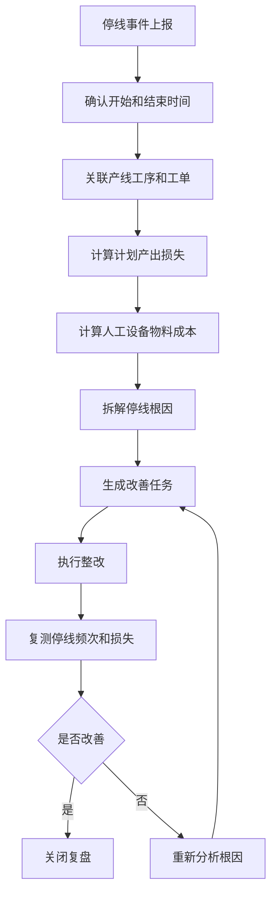
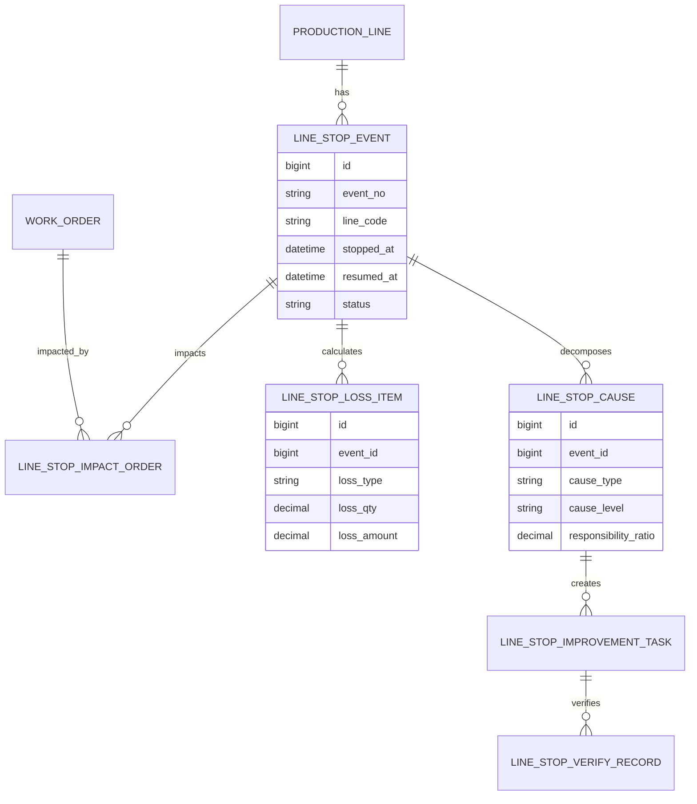
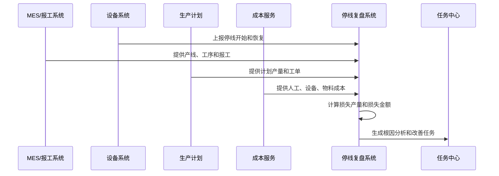
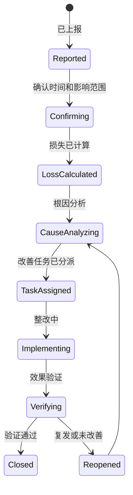
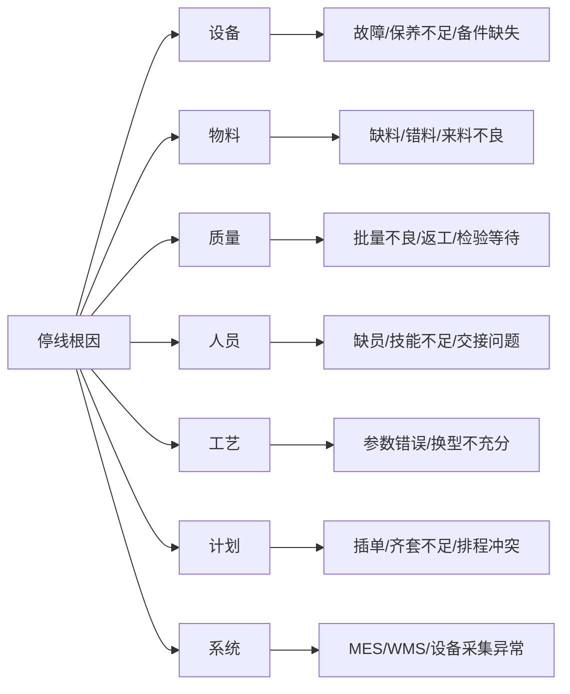

# 生产停线损失复盘项目案例

## 适合谁看

如果你做过生产制造、生产设备异常、生产瓶颈分析或生产计划达成分析，但还不清楚停线后如何计算损失、归因责任和推动改善，可以学习这个案例。

生产停线损失复盘关注的是产线停止生产后产生的产量损失、人工等待、设备空转、订单延期、物料报废、能耗浪费和客户交付风险。它不是简单记录“停机 30 分钟”，而是把停线事件、影响范围、损失计算、根因分析、改善任务和验证结果串起来。

## 业务目标

生产停线损失复盘要回答 6 个问题：

- 哪条产线、哪个工序、什么时间发生了停线。
- 停线影响了哪些工单、订单、产品和交期。
- 停线损失应该按产量、工时、订单延期、成本还是毛利计算。
- 根因来自设备、物料、质量、人员、工艺、计划还是外部系统。
- 改善任务由谁负责，何时完成，如何验证。
- 同类停线是否减少，损失是否下降。

真实项目中，停线复盘最容易变成“写原因、走流程、没有改变”。所以系统必须把损失金额和改善验证放在核心位置。

## 生产停线损失复盘链路

这条链路强调两件事：先量化影响，再追踪改善。没有影响量，复盘无法排序；没有验证，复盘无法闭环。

## 核心概念

| 概念 | 说明 | 项目里的典型字段 |
| --- | --- | --- |
| 停线事件 | 产线停止或产出为零的事件 | line_stop_event |
| 停线时长 | 从开始到恢复的时间 | stop_minutes |
| 影响工单 | 受停线影响的生产工单 | impacted_work_order |
| 损失产量 | 停线期间理论可生产数量 | lost_output_qty |
| 损失成本 | 人工、设备、物料、延期成本 | loss_amount |
| 根因分类 | 停线的一级和二级原因 | root_cause_type |
| 改善任务 | 针对根因的整改闭环 | improvement_task |
| 复发监控 | 判断同类问题是否再次发生 | recurrence_monitor |

停线损失复盘要区分“现象原因”和“根因”。例如设备停机是现象，备件保养周期不合理才可能是根因。

## 数据模型

停线损失建议拆成多条损失项。产量损失、人工损失、订单延期和物料报废的计算口径不同，不能塞到一个金额字段里。

## 推荐表结构

| 表 | 用途 | 关键字段 |
| --- | --- | --- |
| `line_stop_event` | 停线事件 | event_no、line_code、process_code、stopped_at、resumed_at、status |
| `line_stop_impact_order` | 影响工单 | event_id、work_order_no、planned_qty、lost_output_qty、delay_minutes |
| `line_stop_loss_item` | 损失项 | event_id、loss_type、loss_qty、unit_cost、loss_amount |
| `line_stop_cause` | 停线原因 | event_id、cause_type、cause_code、responsibility_dept、ratio |
| `line_stop_improvement_task` | 改善任务 | event_id、owner_id、action_plan、due_date、status |
| `line_stop_verify_record` | 验证记录 | task_id、verify_period、stop_count_after、loss_after、result |
| `line_stop_threshold` | 告警阈值 | line_code、stop_minutes_threshold、loss_amount_threshold |

如果有 MES 或设备系统，停线事件可以自动采集；如果没有，也要允许班组长手工上报并补充证据。

## 停线损失计算流程

损失计算要允许人工调整，但调整必须记录原因。系统自动算出的损失和人工确认的损失都要保留。

## 停线复盘状态设计

复盘关闭条件不能只是“任务完成”。必须验证后续一段时间内同类停线是否减少，损失是否下降。

## 停线根因拆解

根因分类要和责任部门绑定。否则所有问题最后都会变成“生产处理”，无法推动设备、供应链、质量和 IT 协同改进。

## 前端页面拆分

| 页面 | 主要功能 | 设计建议 |
| --- | --- | --- |
| 停线总览 | 今日停线、损失金额、Top 产线、Top 原因 | 管理层先看影响排序 |
| 停线事件详情 | 时间、产线、工序、证据、影响工单 | 时间线要清晰 |
| 损失计算页 | 产量、人工、设备、物料、延期损失 | 公式和调整原因可见 |
| 根因分析页 | 原因分类、责任部门、责任比例 | 支持多原因和多部门 |
| 改善任务页 | 措施、负责人、截止时间、状态 | 任务要能追踪延期 |
| 验证复盘页 | 改善前后停线次数和损失对比 | 不达标自动重开 |
| 趋势分析页 | 产线、班组、工序、原因趋势 | 帮助发现长期问题 |

停线系统的页面重点不是漂亮图表，而是让用户能快速判断“这次损失多大、谁负责改、什么时候验证”。

## 接口拆分建议

| 接口 | 方法 | 说明 |
| --- | --- | --- |
| `/api/line-stops/events` | GET/POST | 查询和上报停线事件 |
| `/api/line-stops/events/:id/confirm` | POST | 确认停线时间和影响范围 |
| `/api/line-stops/events/:id/loss-calculate` | POST | 计算停线损失 |
| `/api/line-stops/events/:id/causes` | GET/POST | 查询和提交根因 |
| `/api/line-stops/tasks` | GET/POST | 查询和创建改善任务 |
| `/api/line-stops/tasks/:id/verify` | POST | 提交改善验证 |
| `/api/line-stops/overview` | GET | 查询停线损失总览 |

停线事件如果来自设备采集，要考虑重复上报、恢复时间缺失、设备离线和跨班次归属问题。

## 实际项目常见问题

### 1. 停线开始时间和恢复时间不准

班组手工填报延迟，设备采集又可能存在误报。

解决方式：

- 设备自动采集作为候选时间。
- 班组长确认最终时间。
- 保存自动时间和人工确认时间。
- 时间调整必须写原因和审批。

### 2. 损失金额被质疑

生产、财务、计划对损失计算口径不一致。

解决方式：

- 损失项拆成产量、人工、设备、延期、报废。
- 每类损失有明确公式和数据来源。
- 人工调整单独记录，不覆盖系统计算值。
- 月度复盘固定口径，不频繁改公式。

### 3. 根因总是归到设备故障

设备停了，但真正原因可能是缺料、质量等待或计划切换。

解决方式：

- 根因支持多级分类和责任比例。
- 设备原因需要故障单或点检证据。
- 缺料原因关联齐套和仓储记录。
- 质量原因关联检验和返工记录。

### 4. 改善任务完成后同类问题复发

任务只做了临时处理，没有验证长期效果。

解决方式：

- 任务关闭后设置验证周期。
- 验证期内同类停线自动关联原任务。
- 未达标任务自动重开。
- 复盘看板展示复发率。

### 5. 部门互相推责

根因和损失没有证据，责任部门难以确认。

解决方式：

- 事件详情保存时间线和证据。
- 每个原因项绑定责任部门和责任比例。
- 复核结论由生产、设备、质量或供应链确认。
- 高损失事件进入专项会议。

## 权限与审计

| 权限点 | 控制原因 |
| --- | --- |
| 上报停线 | 班组和生产管理人员 |
| 确认停线时间 | 会影响损失计算 |
| 调整损失金额 | 涉及财务口径和责任 |
| 提交根因 | 会影响责任部门 |
| 关闭改善任务 | 会影响复盘结论 |
| 导出损失报表 | 涉及生产运营敏感数据 |

审计日志要记录停线时间调整、损失公式版本、人工调整、根因变更、任务延期、验证结论和复盘关闭。

## 验收清单

- 能上报或自动采集停线事件。
- 能确认停线时间、影响工单和影响范围。
- 能按多类损失项计算产量、人工、设备、物料和延期损失。
- 能拆解根因并关联责任部门。
- 能生成改善任务并跟踪延期。
- 能验证改善前后停线次数和损失变化。
- 能按产线、工序、原因、班组和责任部门复盘趋势。

## 下一步学习

建议继续阅读：

- [生产设备异常项目案例](/projects/production-equipment-exception-case)
- [生产瓶颈分析项目案例](/projects/production-bottleneck-analysis-case)
- [生产计划达成分析项目案例](/projects/production-plan-attainment-case)
- [制造成本差异分析项目案例](/projects/manufacturing-cost-variance-case)
