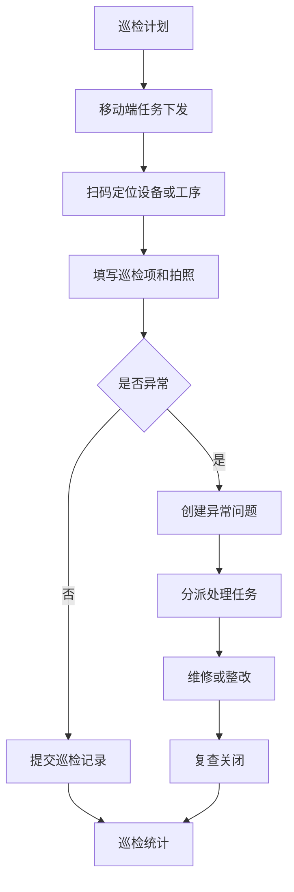
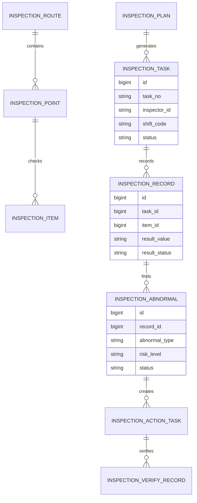
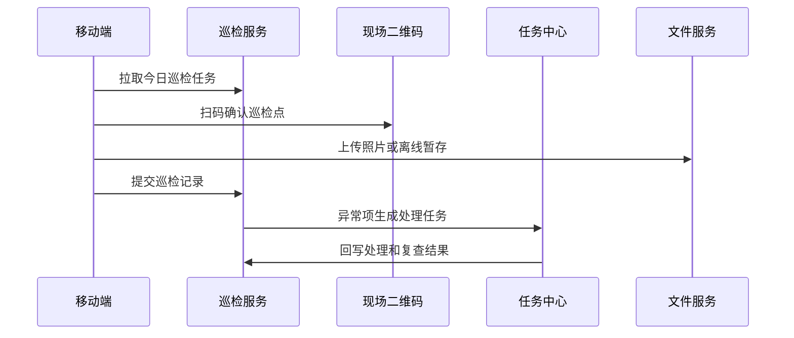
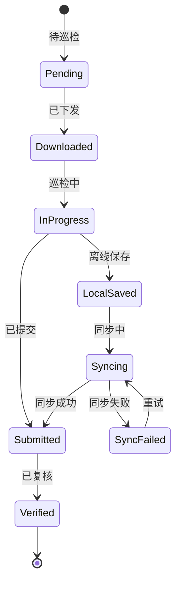
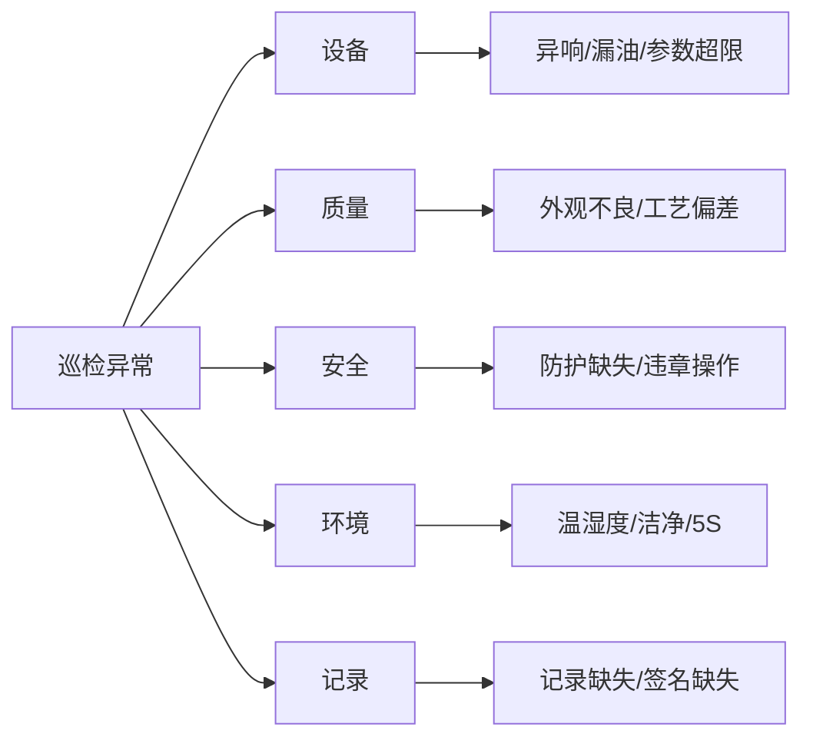

# 生产巡检移动端项目案例

## 适合谁看

如果你做过生产过程审核、设备维保、生产质量异常或 IoT 设备管理，但还不清楚如何把现场巡检从纸质表单变成移动端闭环，可以学习这个案例。

生产巡检移动端关注的是班组、设备、工序、环境、质量和安全点检在手机或平板上的执行。它要解决巡检漏检、补填、证据不足、问题不闭环、弱网不可用和现场操作复杂的问题。

## 业务目标

生产巡检移动端要回答 6 个问题：

- 哪些产线、设备、工序和班次需要巡检。
- 巡检项应该按时间、设备、工单还是异常触发。
- 现场人员如何快速扫码、拍照、填写结果和提交异常。
- 弱网、离线和补传如何处理。
- 巡检发现的问题如何变成维修、质量或 CAPA 任务。
- 巡检结果如何用于设备、质量、安全和班组绩效复盘。

真实项目中，移动巡检最大的挑战不是页面开发，而是现场可用性。现场人员手套、噪音、弱网、赶产能，系统必须足够轻。

## 生产巡检移动端链路

移动端巡检要把“发现问题”直接接到任务中心，否则巡检只是在收集表单。

## 核心概念

| 概念 | 说明 | 新手理解 |
| --- | --- | --- |
| 巡检计划 | 谁在什么时候巡检哪里 | 排班和任务 |
| 巡检点 | 需要检查的位置或对象 | 设备、工序、区域 |
| 巡检项 | 具体检查内容 | 温度、压力、外观、记录 |
| 扫码定位 | 通过二维码确认现场对象 | 防止不到现场补填 |
| 异常问题 | 巡检发现的不正常情况 | 漏油、异响、参数超限 |
| 离线草稿 | 无网时暂存的数据 | 回到网络后补传 |
| 复查关闭 | 异常处理后的确认 | 防止问题悬空 |

移动巡检的关键不是表单字段多，而是任务清楚、输入快、证据足、问题能闭环。

## 数据模型

巡检点、巡检项和巡检记录要分开。巡检项是模板，巡检记录是某次任务的实际结果。

## 推荐表结构

| 表 | 用途 | 关键字段 |
| --- | --- | --- |
| `inspection_plan` | 巡检计划 | plan_no、scope_type、frequency、shift_rule、status |
| `inspection_route` | 巡检路线 | route_code、line_code、sequence_no、status |
| `inspection_point` | 巡检点 | route_id、point_code、qr_code、location_desc |
| `inspection_item` | 巡检项 | point_id、item_name、input_type、normal_range、required_evidence |
| `inspection_task` | 巡检任务 | plan_id、inspector_id、shift_code、due_time、status |
| `inspection_record` | 巡检记录 | task_id、item_id、result_value、evidence_file_id、submitted_at |
| `inspection_abnormal` | 巡检异常 | record_id、abnormal_type、risk_level、status |
| `inspection_action_task` | 处理任务 | abnormal_id、owner_id、action_type、due_date、status |

移动端需要本地草稿字段，例如 `local_draft_id`、`sync_status`、`synced_at`，便于弱网补传和重复提交控制。

## 移动巡检流程

如果现场网络不稳定，移动端应先保存本地，再异步同步。同步失败要能提示用户重试。

## 巡检任务状态设计

离线状态要显式展示。用户必须知道哪些记录还没同步成功。

## 巡检异常拆解

异常类型决定后续流向：设备异常走维修，质量异常走质量处理，安全异常走 EHS。

## 前端页面拆分

| 页面 | 核心内容 | 设计建议 |
| --- | --- | --- |
| 今日任务 | 待巡检、进行中、未同步、逾期 | 移动端首页直接进入任务 |
| 扫码巡检 | 二维码、巡检点、设备信息 | 支持扫码失败手动搜索 |
| 巡检表单 | 快捷选项、数值、拍照、备注 | 控件要大，输入要少 |
| 异常上报 | 异常类型、等级、照片、语音备注 | 支持快速提交 |
| 离线记录 | 本地草稿、同步状态、失败原因 | 弱网场景必须有 |
| 处理任务 | 异常处理、维修、复查 | 与任务中心打通 |
| 巡检看板 | 完成率、异常率、逾期率、复发 | 管理端查看 |

移动端不要做复杂表格。现场用户需要的是任务卡片、扫码、拍照和少量输入。

## 接口拆分建议

| 接口 | 方法 | 说明 |
| --- | --- | --- |
| `/api/mobile-inspections/tasks/today` | GET | 查询今日巡检任务 |
| `/api/mobile-inspections/points/:qrCode` | GET | 扫码查询巡检点 |
| `/api/mobile-inspections/tasks/:id/records` | POST | 提交巡检记录 |
| `/api/mobile-inspections/tasks/:id/sync` | POST | 批量同步离线记录 |
| `/api/mobile-inspections/abnormals` | GET/POST | 查询和创建巡检异常 |
| `/api/mobile-inspections/abnormals/:id/actions` | POST | 创建处理任务 |
| `/api/mobile-inspections/dashboard` | GET | 查询巡检看板 |

同步接口要做幂等。移动端重复点击、网络重试、离线补传都可能提交同一条记录。

## 实际项目常见问题

### 1. 现场人员不愿意用移动端

页面太复杂，填写时间比纸质表还长。

解决方式：

- 首页只展示今日任务。
- 高频结果用单选和快捷按钮。
- 支持扫码自动定位。
- 非必填项减少，异常时再补充证据。

### 2. 弱网导致数据丢失

车间网络不稳定，提交失败后用户以为完成了。

解决方式：

- 本地保存草稿。
- 同步状态明确展示。
- 失败可重试。
- 服务端按客户端唯一 ID 幂等处理。

### 3. 巡检被补填

人员没有到现场，事后统一填完。

解决方式：

- 扫码确认巡检点。
- 记录扫码时间和位置。
- 关键项要求现场照片。
- 异常补填需要主管审核。

### 4. 异常只记录不处理

巡检发现问题后没有责任人。

解决方式：

- 异常自动生成处理任务。
- 按异常类型分派责任部门。
- 逾期升级。
- 复查通过后才能关闭。

### 5. 检查项不适合移动端

纸质表原样搬到手机上，字段太多。

解决方式：

- 检查项按移动端重构。
- 长文本改为选项和拍照。
- 数值项设置正常范围。
- 分页或分组展示，避免一屏过长。

## 权限与审计

| 权限点 | 控制原因 |
| --- | --- |
| 查看巡检任务 | 按班组、产线、角色授权 |
| 提交巡检记录 | 影响质量和安全证据 |
| 补传离线记录 | 需要防重复和防篡改 |
| 关闭异常 | 代表问题已处理 |
| 维护检查项 | 影响现场执行标准 |
| 导出巡检记录 | 涉及生产现场数据 |

审计日志要记录任务下发、扫码、记录提交、离线补传、异常创建、处理关闭和检查项变更。

## 验收清单

- 移动端能拉取今日巡检任务。
- 能扫码定位巡检点并提交巡检记录。
- 支持拍照、数值、单选、备注等常用输入。
- 支持离线保存和失败重试。
- 巡检异常能生成处理任务并复查关闭。
- 管理端能查看完成率、异常率、逾期率和复发趋势。

## 下一步学习

建议继续阅读：

- [生产过程审核项目案例](/projects/production-process-audit-case)
- [设备维保项目案例](/projects/equipment-maintenance-case)
- [生产异常 CAPA 项目案例](/projects/production-exception-capa-case)
- [IoT 设备管理项目案例](/projects/iot-device-management-case)
