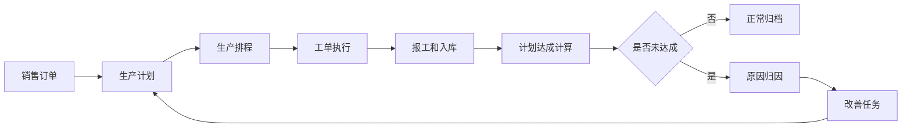
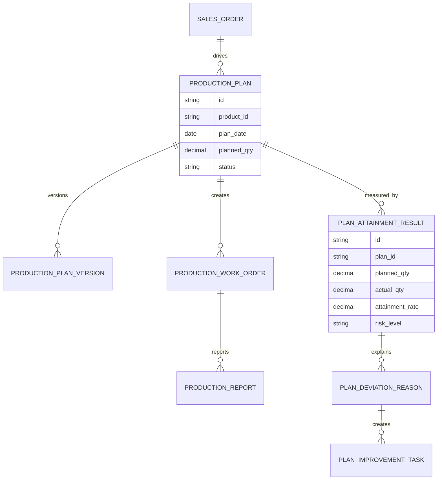
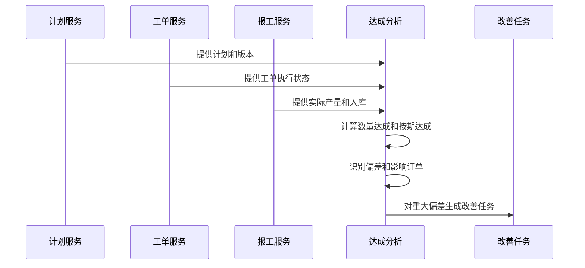
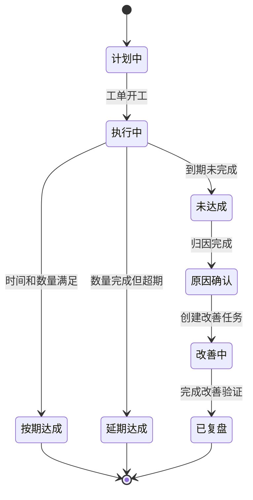
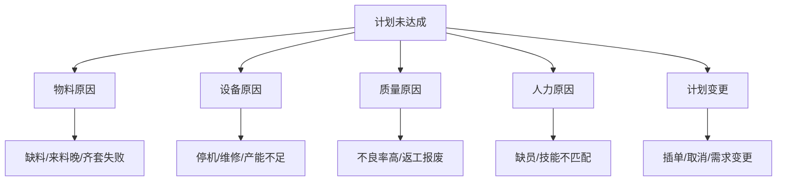

# 生产计划达成分析项目案例

## 适合谁看

如果你做过生产排程、产能负荷预测、生产瓶颈分析或生产质量异常，但不清楚如何衡量“计划有没有按时按量完成”，可以学习这个案例。

生产计划达成分析关注计划、排程、实际产出、延期原因和改善闭环，目标是让计划部门知道：哪些计划没有达成、为什么没达成、影响了哪些订单、下次如何改善。

## 业务目标

生产计划达成分析要回答：

1. 计划产量和实际产量差多少？
2. 哪些订单、产线、班组、产品达成率低？
3. 未达成原因是物料、设备、质量、人力、排程还是需求变更？
4. 计划偏差是否影响交付和客户承诺？

它不是简单统计产量，而是把“计划承诺”和“执行事实”放到一起比较。

## 生产计划达成链路

达成分析应该从计划开始，而不是从实际产量开始。没有计划基准，就无法判断实际结果是好还是差。

## 核心概念

| 概念 | 含义 | 初学者理解 |
| --- | --- | --- |
| 计划达成率 | 实际完成 / 计划目标 | 计划 100 件，做了 90 件，达成率 90% |
| 按期达成 | 在计划时间内完成 | 不只是完成数量，还要按时 |
| 计划版本 | 计划调整后的版本记录 | 防止计划被改掉后看不出偏差 |
| 偏差原因 | 未达成的主要原因 | 物料、设备、质量、人力等 |
| 影响订单 | 计划偏差影响到的客户订单 | 用于判断业务后果 |
| 改善闭环 | 针对偏差原因制定行动 | 不是只做报表 |

## 数据模型

计划版本非常重要。如果计划每天被调整但没有版本，达成率会被人为“修正”到看起来很好。

## 推荐表结构

| 表 | 作用 | 关键字段 |
| --- | --- | --- |
| `production_plan` | 生产计划 | 产品、日期、计划数量、交期、负责人 |
| `production_plan_version` | 计划版本 | 版本号、调整原因、调整前后数量 |
| `production_work_order` | 生产工单 | 计划、产线、班组、工序、状态 |
| `production_report` | 报工记录 | 工单、良品数、不良数、报工时间 |
| `plan_attainment_result` | 达成结果 | 计划量、实际量、按期量、达成率 |
| `plan_deviation_reason` | 偏差原因 | 原因类型、影响数量、责任部门 |
| `plan_improvement_task` | 改善任务 | 问题、措施、负责人、目标日期 |

## 达成计算流程

达成计算要明确口径：是报工算完成，还是质检合格入库算完成。不同企业可能不一样，但必须固定。

## 达成状态设计

延期达成和未达成要区分。延期达成可能影响客户交期，未达成还会影响库存和后续排程。

## 偏差原因拆解

原因拆解要和改善任务对应。不能所有原因都写“生产异常”，否则无法改善。

## 前端页面拆分

| 页面 | 核心内容 | 设计建议 |
| --- | --- | --- |
| 达成分析看板 | 达成率、延期率、未达成计划数、影响订单 | 管理层先看趋势和风险 |
| 计划列表 | 计划量、实际量、按期量、达成率、状态 | 支持按产线、产品、日期筛选 |
| 计划详情 | 版本、工单、报工、入库、偏差原因 | 让计划员看到完整证据链 |
| 原因分析 | 原因分布、影响数量、责任部门 | 用帕累托图找主要问题 |
| 改善任务 | 责任人、措施、目标、复盘结果 | 达成分析必须闭环 |
| 版本对比 | 计划调整前后差异 | 防止频繁改计划掩盖问题 |

## 接口拆分建议

| 接口 | 说明 |
| --- | --- |
| `GET /api/plan-attainment/dashboard` | 查询计划达成总览 |
| `GET /api/plan-attainment/plans` | 查询计划达成列表 |
| `GET /api/plan-attainment/plans/:id` | 查询计划详情 |
| `POST /api/plan-attainment/plans/:id/reasons` | 录入偏差原因 |
| `POST /api/plan-attainment/improvement-tasks` | 创建改善任务 |
| `GET /api/production-plans/:id/versions` | 查询计划版本 |
| `GET /api/plan-attainment/reports/reasons` | 查询原因分析报表 |

## 实际项目常见问题

### 1. 计划经常被改，达成率看起来一直很好

这是没有冻结计划版本。

解决方式：

- 设定计划冻结时间。
- 冻结后调整必须记录版本和原因。
- 达成率可以同时展示原始计划和最新计划口径。
- 管理报表优先看冻结计划达成率。

### 2. 产量完成了，但客户仍然延期

可能计划数量完成，但不是客户需要的订单或批次。

解决方式：

- 达成结果关联销售订单和批次。
- 区分总量达成和订单达成。
- 计划详情展示影响订单。
- 延期订单进入交付风险跟踪。

### 3. 原因归因互相推诿

计划、采购、生产、质量都可能影响达成。

解决方式：

- 原因分类标准化。
- 原因录入必须关联证据。
- 允许多原因分摊影响数量。
- 高影响偏差需要主管复核。

### 4. 报工数据不准

如果报工延迟或虚报，达成分析也不准。

解决方式：

- 以质检合格入库作为关键口径。
- 报工时间和入库时间都保留。
- 异常报工进入数据质量检查。
- 报工修正要保留审计。

### 5. 改善任务没有复盘

只创建任务，不验证后续是否改善，问题会重复发生。

解决方式：

- 改善任务绑定指标，例如达成率提升到 95%。
- 下周期自动对比同类计划。
- 未达目标自动重新打开复盘。
- 报表展示重复发生问题。

## 权限与审计

| 权限点 | 控制原因 |
| --- | --- |
| 修改生产计划 | 会影响达成率和交付承诺 |
| 调整计划版本 | 可能掩盖计划偏差 |
| 录入偏差原因 | 影响责任归因 |
| 关闭改善任务 | 需要确认改善效果 |
| 导出达成报表 | 涉及产能和交付数据 |

审计日志要记录计划调整、版本冻结、原因修改、任务关闭、报工修正和数据导出。

## 验收清单

- 能按计划、产线、产品和日期计算达成率。
- 能区分数量达成、按期达成和订单达成。
- 支持计划版本和冻结计划口径。
- 未达成计划能录入标准化原因。
- 重大偏差能生成改善任务。
- 能复盘改善后达成率是否提升。
- 关键操作有权限控制和审计。

## 下一步学习

- [产能负荷预测项目案例](/projects/capacity-load-forecast-case)
- [生产排程项目案例](/projects/production-scheduling-case)
- [生产瓶颈分析项目案例](/projects/production-bottleneck-analysis-case)
- [生产换型损失分析项目案例](/projects/production-changeover-loss-analysis-case)
