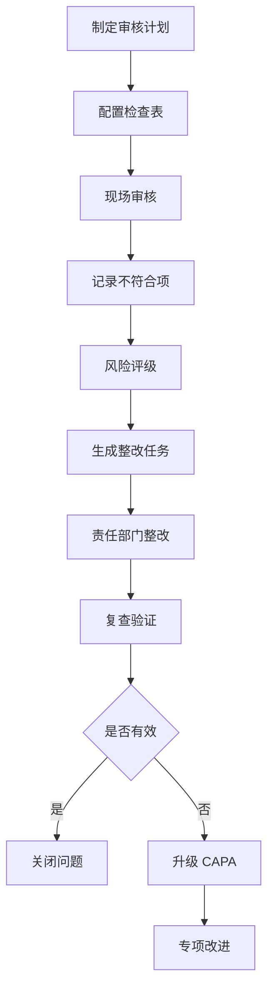
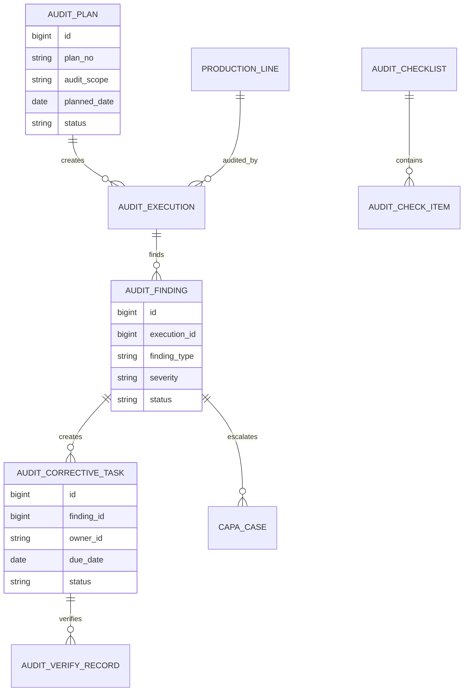
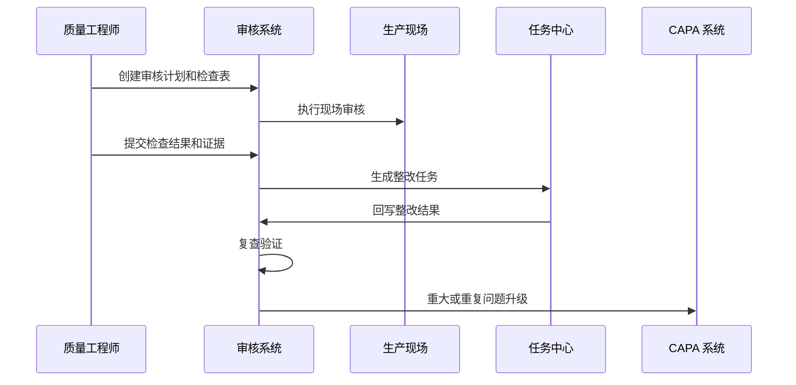
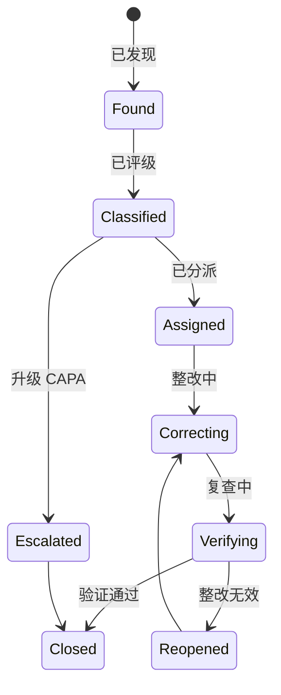
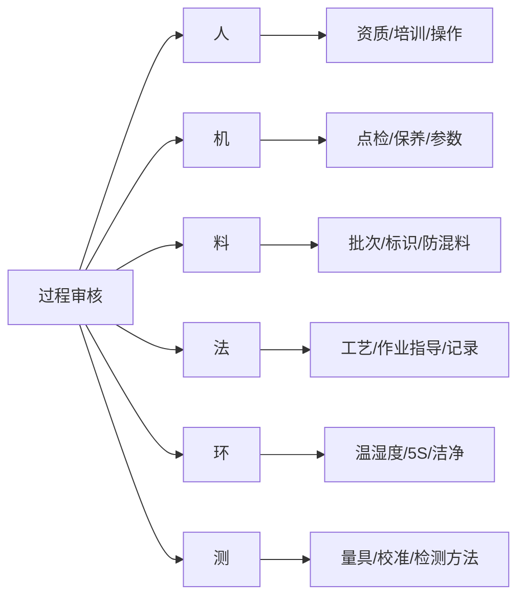

# 生产过程审核项目案例

## 适合谁看

如果你做过生产异常 CAPA、质量追溯、生产质量异常或生产良率分析，但还不清楚如何把现场审核、问题整改和质量改进做成系统闭环，可以学习这个案例。

生产过程审核关注的是对生产现场、工艺执行、设备点检、物料使用、人员操作、环境控制和记录完整性的检查。它不是一次性打分，而是用审核计划、检查项、问题记录、整改任务、复查验证来降低过程失控风险。

## 业务目标

生产过程审核要回答 6 个问题：

- 哪些产线、工序、产品和班组需要审核。
- 检查项来自工艺文件、质量标准、客户要求还是历史问题。
- 审核发现了哪些不符合项，严重程度如何。
- 不符合项是否生成整改任务，并按期关闭。
- 整改后是否复查有效，是否需要 CAPA。
- 审核结果如何反哺工艺、培训、设备和质量治理。

真实项目中，过程审核常见问题是“现场打分完成，问题没人跟”。系统要把审核问题和整改验证作为核心，而不是只做检查表。

## 生产过程审核链路

过程审核强调“预防”。它要在客户投诉、批量不良或停线之前发现现场执行偏差。

## 核心概念

| 概念 | 说明 | 新手理解 |
| --- | --- | --- |
| 审核计划 | 哪天审核哪条线 | 审核安排 |
| 检查表 | 审核要看的项目 | 点检清单 |
| 不符合项 | 现场发现的问题 | 工艺未执行、记录缺失 |
| 风险评级 | 问题严重程度 | 一般、严重、关键 |
| 整改任务 | 责任部门要处理的动作 | 改流程、补培训、修设备 |
| 复查验证 | 检查整改是否有效 | 不是只看是否提交 |
| 升级 CAPA | 重大或重复问题进入 CAPA | 更严格的纠正预防 |

审核问题要有证据，例如照片、记录编号、设备号、批次号和现场描述。

## 数据模型

审核计划、执行记录、问题、整改任务要分开。一次计划可以有多次执行，一次执行可以发现多个问题。

## 推荐表结构

| 表 | 用途 | 关键字段 |
| --- | --- | --- |
| `audit_plan` | 审核计划 | plan_no、audit_scope、line_code、planned_date、status |
| `audit_checklist` | 检查表 | checklist_code、version、product_scope、status |
| `audit_check_item` | 检查项 | checklist_id、item_code、standard_desc、risk_level |
| `audit_execution` | 审核执行 | plan_id、auditor_id、started_at、finished_at、score |
| `audit_finding` | 不符合项 | execution_id、item_id、severity、evidence、status |
| `audit_corrective_task` | 整改任务 | finding_id、owner_id、action_plan、due_date、status |
| `audit_verify_record` | 复查记录 | task_id、verify_result、evidence_file_id、comment |
| `audit_trend_summary` | 趋势汇总 | period、line_code、finding_count、closure_rate |

检查表要版本化。工艺或客户标准变化后，新审核使用新版本，历史审核保持原版本。

## 审核执行流程

现场审核最好支持移动端。审核人员在现场拍照、记录问题、扫描设备或工单，比回办公室补录更准确。

## 审核问题状态设计

不符合项不能由责任人自己关闭。至少要由审核人或质量负责人复查。

## 审核维度拆解

这种维度拆解和生产异常 CAPA 一致，便于后续把审核问题升级为 CAPA。

## 前端页面拆分

| 页面 | 核心内容 | 设计建议 |
| --- | --- | --- |
| 审核计划 | 审核对象、时间、审核人、状态 | 支持周期计划 |
| 检查表管理 | 检查项、标准、版本、适用范围 | 版本变更要审批 |
| 移动审核页 | 检查项、拍照、扫码、备注 | 现场使用要轻量 |
| 问题工作台 | 不符合项、等级、责任人、状态 | 逾期问题突出显示 |
| 整改任务页 | 措施、证据、复查结果 | 关闭前必须复查 |
| 审核趋势页 | 问题类型、产线、班组、关闭率 | 发现长期薄弱点 |
| CAPA 升级页 | 重复或重大问题升级 | 与 CAPA 打通 |

审核页面要支持现场快速录入，但后台分析要足够细，能按产线、工序、问题类型复盘。

## 接口拆分建议

| 接口 | 方法 | 说明 |
| --- | --- | --- |
| `/api/process-audits/plans` | GET/POST | 查询和创建审核计划 |
| `/api/process-audits/checklists` | GET/POST | 查询和维护检查表 |
| `/api/process-audits/executions` | GET/POST | 创建审核执行记录 |
| `/api/process-audits/findings` | GET/POST | 查询和提交不符合项 |
| `/api/process-audits/findings/:id/tasks` | POST | 创建整改任务 |
| `/api/process-audits/tasks/:id/verify` | POST | 提交复查结果 |
| `/api/process-audits/findings/:id/escalate-capa` | POST | 升级 CAPA |
| `/api/process-audits/trends` | GET | 查询审核趋势 |

审核接口要支持离线或弱网补传，现场网络不稳定很常见。

## 实际项目常见问题

### 1. 审核只是打分，没有整改

审核结束后只生成分数，没有问题任务。

解决方式：

- 每个不符合项必须生成责任和整改。
- 严重问题必须设置截止时间。
- 关闭前必须复查。
- 趋势看板跟踪关闭率和逾期率。

### 2. 检查表长期不更新

工艺变了，审核项还是旧版本。

解决方式：

- 检查表版本化。
- 工艺文件变更触发检查表复核。
- 新版本发布后旧版本只读。
- 历史审核保留当时版本。

### 3. 现场证据不足

审核问题只有文字，责任部门不认可。

解决方式：

- 支持照片、视频、扫码和记录编号。
- 证据和检查项绑定。
- 修改证据需要审计。
- 高风险问题要求复核人确认。

### 4. 重复问题没有升级

同一个问题每次审核都出现，但只是单次整改。

解决方式：

- 按问题类型、产线、班组统计复发。
- 超阈值自动升级 CAPA。
- CAPA 关闭后回写审核趋势。
- 重复问题进入培训或工艺改进。

### 5. 移动端审核不好用

现场审核人员不愿意用系统。

解决方式：

- 每个检查项保持简短。
- 支持扫码带出设备、工单和批次。
- 照片上传支持压缩和补传。
- 常用结论提供快捷选项。

## 权限与审计

| 权限点 | 控制原因 |
| --- | --- |
| 创建审核计划 | 影响生产现场安排 |
| 维护检查表 | 影响审核标准 |
| 提交审核结果 | 影响质量结论 |
| 关闭整改任务 | 代表问题已解决 |
| 升级 CAPA | 触发更高等级流程 |
| 导出审核报告 | 涉及质量体系和客户审核 |

审计日志要记录检查表版本、审核执行、问题评级、整改提交、复查结果、CAPA 升级和报告导出。

## 验收清单

- 能维护检查表和检查项版本。
- 能创建审核计划并执行现场审核。
- 能记录不符合项、证据和风险等级。
- 能把问题转为整改任务。
- 整改关闭前需要复查验证。
- 重复或重大问题能升级 CAPA。
- 能按产线、工序、班组和问题类型复盘趋势。

## 下一步学习

建议继续阅读：

- [生产异常 CAPA 项目案例](/projects/production-exception-capa-case)
- [生产质量异常项目案例](/projects/production-quality-exception-case)
- [质量追溯项目案例](/projects/quality-traceability-case)
- [生产良率分析项目案例](/projects/production-yield-analysis-case)
