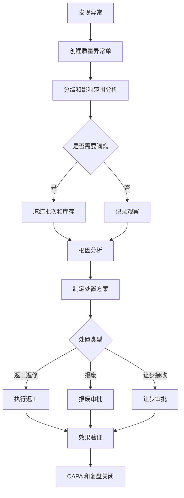
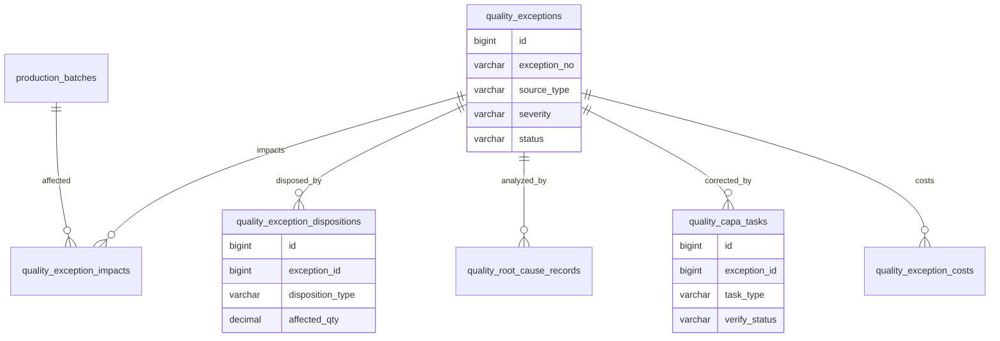
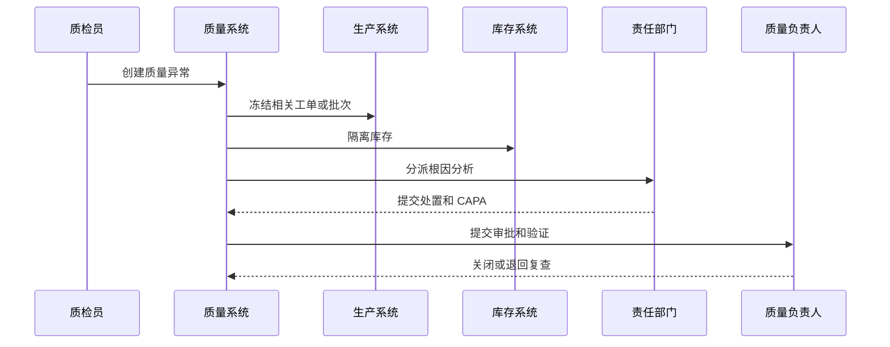

# 生产质量异常项目案例

## 适合谁看

适合需要做生产异常、不合格品、质量隔离、根因分析、纠正预防、返工返修、报废、让步接收和 CAPA 闭环的开发者。

生产质量异常不是“质检不合格打个标记”。真实制造项目里，质量异常会影响工单、批次、库存、设备、人员、供应商、客户交付和质量成本。系统要能回答：异常在哪里发现、影响哪些批次、是否要停线、谁分析根因、处理动作是什么、是否验证有效、后续如何避免复发。

## 业务目标

第一版生产质量异常支持：

- 从质检、生产报工、设备告警、客户反馈和巡检创建异常。
- 支持异常分级、影响范围、批次隔离和停线建议。
- 支持原因调查、责任部门、临时处置和长期纠正预防。
- 支持返工、返修、报废、让步接收和供应商退货。
- 支持 CAPA 任务、验证、复盘和复发监控。
- 支持异常成本、质量损失和责任归因。
- 支持异常看板、缺陷趋势和质量改进分析。

## 生产质量异常链路

质量异常的关键是“先控制风险，再分析根因”。在影响范围不明确前，相关批次、库存和工单不能继续流转。

## 核心概念

| 概念 | 说明 | 示例 |
| --- | --- | --- |
| 质量异常 | 生产或检验中发现的不符合 | 尺寸超差 |
| 不合格品 | 不满足标准的物料或产品 | 外观划伤 |
| 隔离 | 暂停批次或库存使用 | 冻结成品批次 |
| 临时处置 | 先控制影响的短期动作 | 停线、返检 |
| 根因分析 | 找到异常真正原因 | 设备夹具磨损 |
| CAPA | 纠正和预防措施 | 更换夹具并增加点检 |
| 让步接收 | 不完全符合但批准使用 | 非关键外观缺陷 |
| 效果验证 | 检查整改是否有效 | 连续三批合格 |

不合格记录和 CAPA 不要混为一谈。低风险不合格可以记录和处理，高风险或重复异常才需要完整 CAPA。

## 数据模型

## 推荐表结构

| 表 | 作用 | 关键字段 |
| --- | --- | --- |
| `quality_exceptions` | 质量异常主表 | `exception_no`、`source_type`、`severity`、`defect_type`、`status` |
| `quality_exception_impacts` | 影响范围 | `exception_id`、`target_type`、`target_id`、`affected_qty`、`freeze_status` |
| `quality_exception_dispositions` | 处置记录 | `exception_id`、`disposition_type`、`handled_qty`、`approval_status` |
| `quality_root_cause_records` | 根因分析 | `exception_id`、`analysis_method`、`root_cause`、`evidence` |
| `quality_capa_tasks` | CAPA 任务 | `exception_id`、`task_type`、`owner_id`、`due_date`、`verify_status` |
| `quality_exception_costs` | 质量成本 | `exception_id`、`cost_type`、`amount`、`cost_owner` |
| `quality_exception_files` | 证据附件 | `exception_id`、`file_id`、`file_type`、`uploaded_by` |
| `quality_exception_reviews` | 复盘记录 | `exception_id`、`review_result`、`preventive_action`、`closed_at` |

影响范围要能关联工单、批次、库存、设备、供应商和客户发货记录。否则异常处理只能停留在局部。

## 异常处理流程

质量异常要能触发跨系统控制。只在质量系统里记录异常，但库存仍可出库，问题会继续扩大。

## 异常状态设计

| 状态 | 含义 | 注意点 |
| --- | --- | --- |
| 待确认 | 异常刚被上报 | 需要质量确认 |
| 已隔离 | 相关批次或库存已冻结 | 记录冻结范围 |
| 分析中 | 责任部门分析根因 | 可要求补证据 |
| 待处置 | 等待返工、报废或让步方案 | 高风险走审批 |
| 处置中 | 正在执行处理动作 | 跟踪数量 |
| 待验证 | CAPA 或返工结果待验证 | 需要验收标准 |
| 已关闭 | 风险控制和验证完成 | 保存复盘 |
| 已复发 | 同类异常再次发生 | 升级 CAPA |

异常关闭必须有关闭条件。比如影响批次处理完成、库存解冻或报废完成、CAPA 验证通过。

## 前端页面拆分

| 页面或组件 | 作用 | 注意点 |
| --- | --- | --- |
| 质量异常工作台 | 查看待确认、待分析、待验证、超期异常 | 按等级优先 |
| 异常上报 | 创建异常并上传图片、批次、工序 | 现场快速录入 |
| 影响范围分析 | 关联工单、批次、库存、发货 | 支持正反向追溯 |
| 隔离控制 | 冻结或解冻相关批次 | 解冻需审批 |
| 根因分析 | 填写原因、证据和责任部门 | 支持 5Why 等模板 |
| 处置方案 | 返工、返修、报废、让步接收 | 数量必须守恒 |
| CAPA 任务 | 跟踪纠正和预防动作 | 验证标准明确 |
| 质量异常看板 | 分析缺陷、产线、供应商和成本 | 支持趋势 |

处置方案页面要严格校验数量。受影响 100 件，返工、报废、让步、待处理的数量之和必须可解释。

## 接口拆分建议

| 接口 | 作用 | 注意点 |
| --- | --- | --- |
| `POST /quality-exceptions` | 创建异常 | 支持质检、生产、客户反馈来源 |
| `POST /quality-exceptions/{id}/impacts` | 登记影响范围 | 关联批次和库存 |
| `POST /quality-exceptions/{id}/freeze` | 冻结影响对象 | 跨系统幂等 |
| `POST /quality-exceptions/{id}/root-cause` | 提交根因分析 | 保存证据 |
| `POST /quality-exceptions/{id}/dispositions` | 提交处置方案 | 校验数量 |
| `POST /quality-exceptions/{id}/capa` | 创建 CAPA 任务 | 设置验证标准 |
| `POST /quality-exceptions/{id}/verify` | 验证整改效果 | 不通过退回 |
| `POST /quality-exceptions/{id}/close` | 关闭异常 | 检查处置和验证完成 |

## 实际项目常见问题

### 问题 1：异常发现后库存仍然可以出库

质量异常确认后要联动库存冻结。冻结要有对象、数量、原因和解冻审批。

### 问题 2：返工数量和报废数量对不上

处置数量必须守恒。受影响数量、返工数量、报废数量、让步数量、待处理数量要能合计解释。

### 问题 3：根因分析变成填空题

根因分析需要证据和方法。可以提供 5Why、鱼骨图字段、设备点检、人员操作、物料批次等结构化输入。

### 问题 4：CAPA 做完后问题继续复发

CAPA 要有验证标准和观察期。比如连续三批合格、同缺陷 30 天未复发，不能任务完成就关闭。

## 权限与审计

生产质量异常权限至少要区分：

- 创建异常。
- 确认异常等级。
- 冻结和解冻批次。
- 提交根因分析。
- 制定处置方案。
- 审批报废和让步接收。
- 创建和验证 CAPA。
- 查看质量成本和看板。

异常等级、影响范围、冻结解冻、处置方案、报废、让步接收、CAPA 验证和关闭都要审计。这些操作影响产品质量和客户交付。

## 验收清单

- 异常可从质检、生产、客户反馈等来源创建。
- 异常等级和影响范围清晰。
- 可冻结相关批次、工单和库存。
- 支持根因分析和证据附件。
- 支持返工、返修、报废、让步接收。
- 处置数量可校验。
- 高风险异常可创建 CAPA。
- CAPA 有负责人、截止时间和验证标准。
- 异常关闭前检查处置和验证完成。
- 看板可分析缺陷趋势、责任部门和质量成本。

## 下一步学习

继续学习 [质量追溯项目案例](/projects/quality-traceability-case)、[生产制造项目案例](/projects/manufacturing-execution-case)、[生产排程项目案例](/projects/production-scheduling-case) 和 [供应商绩效项目案例](/projects/supplier-performance-case)。
