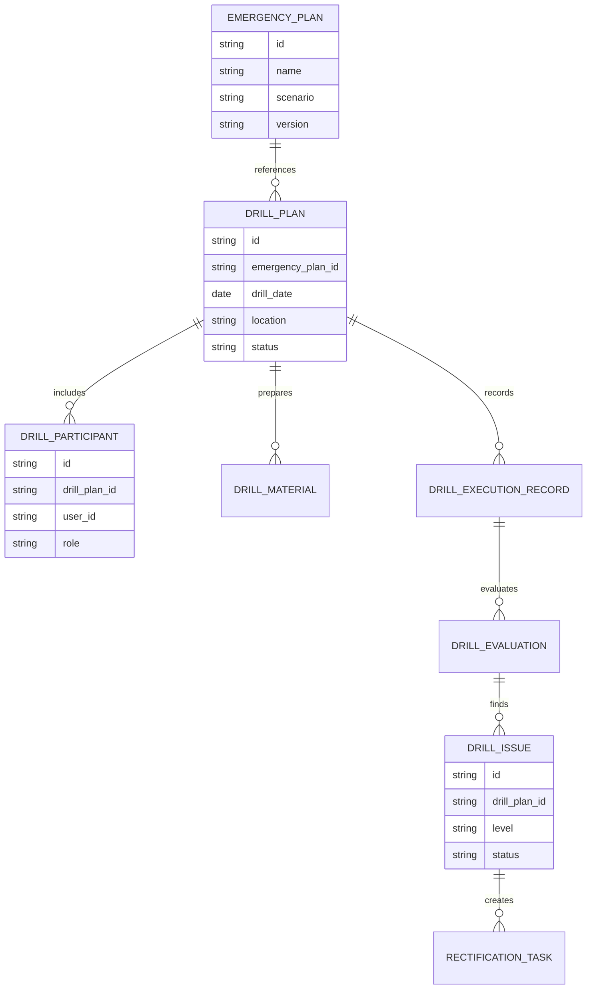
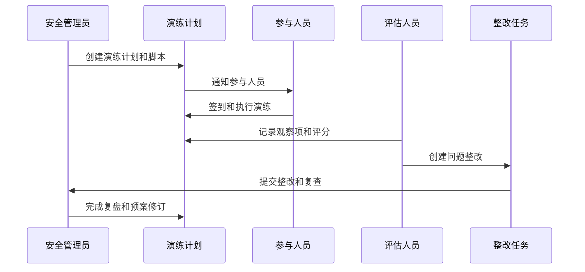
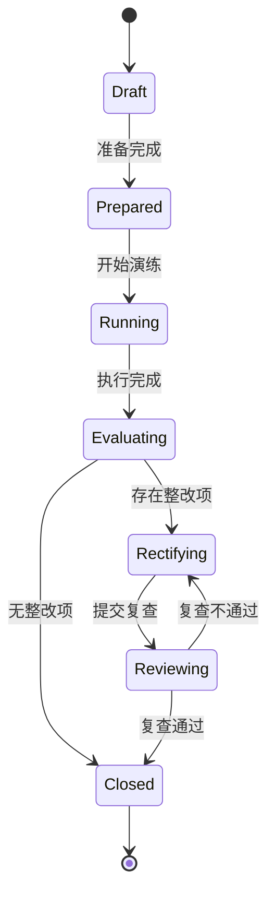
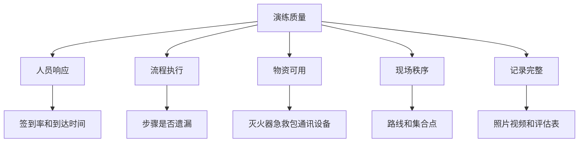

# 生产安全应急演练项目案例

## 适合谁看

- 想理解生产安全、应急预案、演练任务和复盘整改关系的前端开发者。
- 正在做 EHS、安全管理、制造现场管理或培训考试系统的团队。
- 希望把纸质演练记录升级为“计划、执行、签到、评估、整改闭环”的项目负责人。

## 业务目标

生产安全应急演练的目标，是验证预案是否可执行、人员是否知道怎么做、物资是否可用、现场响应是否及时，并把演练暴露的问题转成整改任务。

常见演练场景包括：

- 火灾疏散演练。
- 化学品泄漏应急演练。
- 设备伤害应急演练。
- 停电停气异常演练。
- 高温、有限空间、特种作业事故演练。

## 应急演练链路

应急演练不是培训签到。真正的价值在于发现预案和现场能力之间的差距。

## 核心概念

| 概念 | 说明 | 例子 |
| --- | --- | --- |
| 应急预案 | 事故发生时的处理方案 | 火灾疏散预案 |
| 演练计划 | 某次演练的时间、地点、人员和目标 | 7 月一车间消防演练 |
| 演练脚本 | 演练步骤和触发事件 | 模拟烟雾、人员撤离、灭火器使用 |
| 观察项 | 评估人员记录的检查点 | 响应时间、路线是否正确 |
| 整改项 | 演练暴露的问题 | 指示牌缺失、物资过期 |
| 预案修订 | 根据复盘更新预案 | 调整集合点或责任人 |

## 数据模型

## 推荐表结构

| 表 | 关键字段 | 作用 |
| --- | --- | --- |
| `emergency_plan` | `name`、`scenario`、`version`、`owner_id`、`status` | 应急预案 |
| `drill_plan` | `emergency_plan_id`、`drill_date`、`location`、`status` | 演练计划 |
| `drill_participant` | `drill_plan_id`、`user_id`、`role`、`sign_status` | 参与人员 |
| `drill_material` | `drill_plan_id`、`material_name`、`quantity`、`check_status` | 物资准备 |
| `drill_execution_record` | `drill_plan_id`、`event_time`、`event_type`、`description` | 执行记录 |
| `drill_evaluation` | `drill_plan_id`、`score`、`evaluator_id`、`summary` | 评估结果 |
| `drill_issue` | `drill_plan_id`、`level`、`description`、`owner_id`、`status` | 问题和整改 |

## 演练执行流程

## 演练状态设计

## 演练评估拆解

## 前端页面拆分

| 页面 | 主要内容 | 设计重点 |
| --- | --- | --- |
| 应急预案库 | 预案名称、场景、版本、适用区域、状态 | 支持版本管理 |
| 演练计划列表 | 演练日期、区域、预案、负责人、状态 | 突出待准备和待复盘 |
| 演练执行页 | 签到、脚本步骤、过程记录、照片附件 | 适合移动端现场使用 |
| 演练评估页 | 评分项、观察记录、问题清单 | 让评估标准结构化 |
| 整改跟踪页 | 问题、责任人、截止时间、复查结果 | 保证闭环 |

## 接口拆分建议

| 接口 | 方法 | 说明 |
| --- | --- | --- |
| `/api/emergency-plans` | GET | 查询应急预案 |
| `/api/safety-drills` | POST | 创建演练计划 |
| `/api/safety-drills/:id/participants` | POST | 添加参与人员 |
| `/api/safety-drills/:id/start` | POST | 开始演练 |
| `/api/safety-drills/:id/records` | POST | 新增过程记录 |
| `/api/safety-drills/:id/evaluations` | POST | 提交评估 |
| `/api/safety-drills/:id/issues` | POST | 创建整改问题 |

## 实际项目常见问题

### 1. 演练只做签到，没有过程证据

签到只能证明人到了，不能证明演练有效。应记录关键时间点、现场照片、评估表和问题证据。

移动端执行页要支持快速拍照和离线草稿，现场网络不好时也能记录。

### 2. 演练计划和应急预案脱节

每次演练必须关联预案版本。复盘后如果发现预案不合理，要生成预案修订任务。

否则同样的问题下次演练还会重复出现。

### 3. 整改项没人跟进

演练问题要自动转整改任务，并设置责任人、截止时间和复查人。

不要只把问题写在复盘报告里。

### 4. 评估标准太主观

评估表应拆成结构化项目，例如响应时间、集合人数、物资可用、关键步骤完成情况。

每个评分项要有扣分说明，便于后续比较。

### 5. 演练影响生产排班

演练计划要提前关联班组和产线，避免和关键生产任务冲突。

如果必须临时演练，要提供影响说明和审批记录。

## 权限与审计

| 动作 | 权限建议 | 审计内容 |
| --- | --- | --- |
| 创建预案 | 安全管理员 | 预案版本和适用范围 |
| 创建演练计划 | 安全管理员或车间主管 | 时间、地点、人员 |
| 现场记录 | 执行人员 | 记录时间和附件 |
| 提交评估 | 评估人员 | 评分和问题 |
| 关闭整改 | 复查人员 | 复查证据 |

## 验收清单

- 演练计划能关联应急预案版本。
- 现场执行能记录签到、步骤、照片和关键时间点。
- 评估表可以结构化打分。
- 演练问题能生成整改任务。
- 整改完成后需要复查关闭。
- 复盘能推动预案修订。

## 下一步学习

完成这个案例后，可以继续学习：

- [生产现场安全隐患项目案例](/projects/production-safety-hazard-case)
- [生产安全风险画像项目案例](/projects/production-safety-risk-profile-case)
- [生产安全考试认证项目案例](/projects/production-safety-exam-certification-case)

