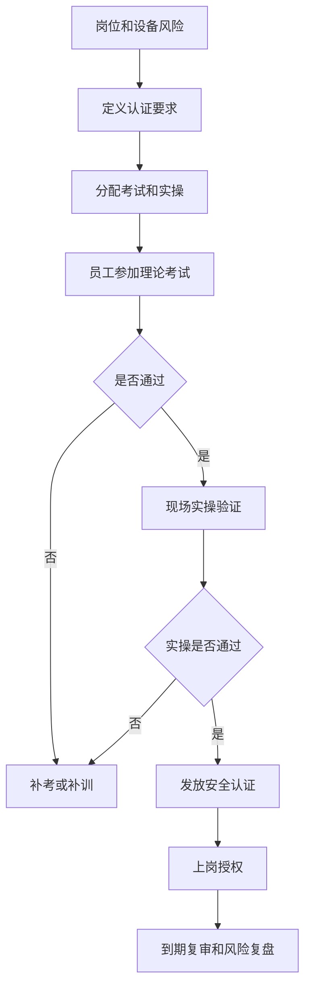
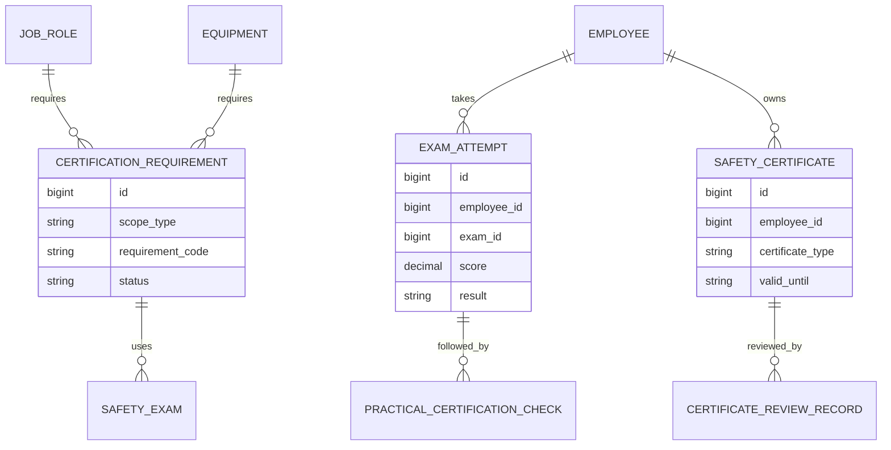
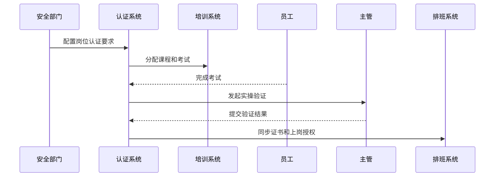
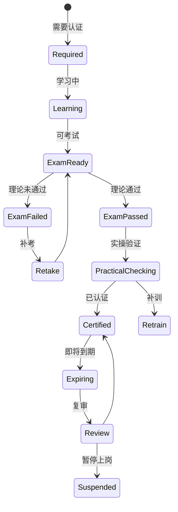
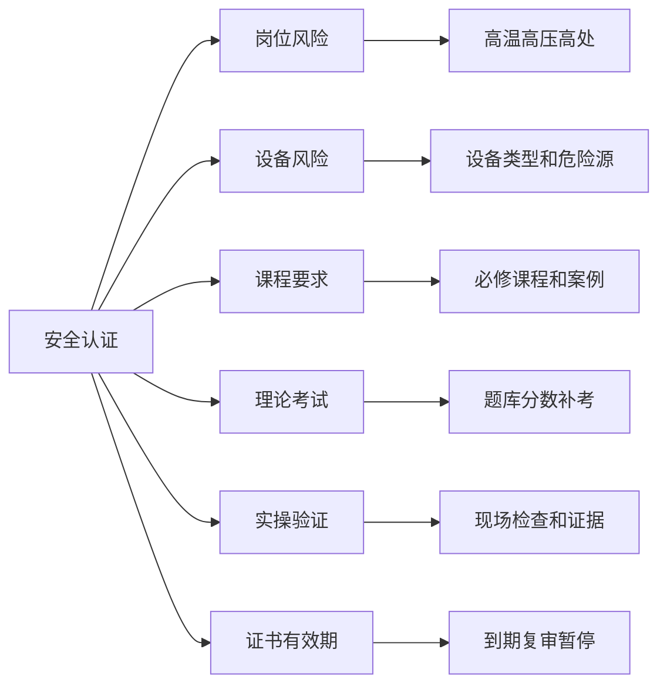

# 生产安全考试认证项目案例

## 适合谁看

如果你做过生产安全培训闭环、生产现场安全隐患、教育培训平台、设备维保或生产过程审核，但还不清楚安全考试、实操认证、证书有效期和上岗授权如何落地，可以学习这个案例。

生产安全考试认证关注的是员工在高风险岗位、设备、工序和特殊作业前必须完成培训、考试、实操验证和证书授权。它不是简单做在线考试，而是把题库、考试、实操、证书、有效期、复审和上岗限制串成闭环。

## 业务目标

生产安全考试认证要回答 6 个问题：

- 哪些岗位、设备和工序需要安全认证。
- 员工是否已经完成必修课程、理论考试和实操验证。
- 证书是否有效，是否快到期，是否需要复审。
- 未认证人员是否被限制上岗。
- 考试题库和实操检查项是否覆盖真实风险。
- 认证结果如何影响现场排班、设备操作和安全审计。

真实项目里，安全培训完成不代表可以上岗。高风险作业需要明确的认证和有效期管理。

## 生产安全考试认证链路

这条链路说明，考试认证不仅是学习系统，还会影响员工是否能操作设备或进入岗位。

## 核心概念

| 概念 | 说明 | 新手理解 |
| --- | --- | --- |
| 认证要求 | 上岗前必须满足的条件 | 课程、考试、实操 |
| 理论考试 | 检查安全知识掌握 | 在线答题 |
| 实操验证 | 检查现场操作是否合格 | 主管现场打分 |
| 安全证书 | 通过认证后的资格 | 有效期和范围 |
| 复审 | 到期前重新验证 | 防止资质长期失效 |
| 上岗授权 | 是否允许排班和操作 | 证书有效才允许 |
| 题库治理 | 题目是否覆盖风险 | 题目要持续更新 |

考试认证的核心是“认证范围”。某员工可以操作 A 设备，不代表可以操作 B 设备。

## 数据模型

证书要关联范围，例如岗位、设备、工序或特殊作业类型。不要只给员工一个笼统的“已认证”。

## 推荐表结构

| 表 | 用途 | 关键字段 |
| --- | --- | --- |
| `certification_requirement` | 认证要求 | scope_type、scope_id、required_course、required_exam、valid_days |
| `safety_question_bank` | 安全题库 | topic、risk_type、difficulty、status、version |
| `safety_exam` | 考试 | exam_name、question_scope、pass_score、retry_limit |
| `exam_attempt` | 考试记录 | exam_id、employee_id、score、result、attempt_no |
| `practical_certification_check` | 实操验证 | employee_id、requirement_id、checker_id、result、evidence_file |
| `safety_certificate` | 安全证书 | employee_id、certificate_type、scope_id、valid_until、status |
| `certificate_review_record` | 复审记录 | certificate_id、review_result、comment、next_review_date |

题库要按风险主题维护。隐患和事故复盘后，题库也要更新。

## 认证流程

认证系统要和排班或设备操作权限联动，否则未认证人员仍可能上岗。

## 认证状态设计

证书到期前要预警。过期后应该自动限制上岗，而不是只在报表里显示。

## 认证因素拆解

安全认证要覆盖知识和动作。会答题不代表会安全操作，所以高风险场景必须有实操验证。

## 前端页面拆分

| 页面 | 核心内容 | 设计建议 |
| --- | --- | --- |
| 认证要求页 | 岗位、设备、课程、考试、有效期 | 按岗位和设备查询 |
| 题库管理页 | 风险主题、题目、答案、版本 | 题目变更要审核 |
| 员工考试页 | 考试入口、倒计时、成绩、补考 | 移动端可用 |
| 实操验证页 | 检查项、照片、签名、结论 | 适合现场主管使用 |
| 证书台账页 | 员工、证书、范围、有效期 | 到期预警 |
| 上岗限制页 | 未认证、过期、暂停人员 | 给排班和主管使用 |
| 认证复盘页 | 通过率、事故隐患关联、题库优化 | 判断认证是否有效 |

题库和证书台账是后台管理，员工考试和实操验证要更轻量。

## 接口拆分建议

| 接口 | 方法 | 说明 |
| --- | --- | --- |
| `/api/safety-certifications/requirements` | GET/POST | 查询和维护认证要求 |
| `/api/safety-certifications/question-bank` | GET/POST | 查询和维护题库 |
| `/api/safety-certifications/exams` | GET/POST | 查询和创建考试 |
| `/api/safety-certifications/exams/:id/submit` | POST | 提交考试结果 |
| `/api/safety-certifications/practical-checks` | POST | 提交实操验证 |
| `/api/safety-certifications/certificates` | GET | 查询证书台账 |
| `/api/safety-certifications/work-authorization` | GET | 查询上岗授权 |

上岗授权接口要能被排班、门禁或设备操作系统调用。

## 实际项目常见问题

### 1. 培训完成就默认认证

员工看完课程，但未必掌握操作要点。

解决方式：

- 认证要求拆成课程、考试、实操。
- 高风险岗位必须实操验证。
- 证书发放依赖完整通过。
- 未通过自动进入补训或补考。

### 2. 证书没有范围

员工拿到一个证书后，被安排到不熟悉设备。

解决方式：

- 证书关联岗位、设备或工序范围。
- 排班时校验具体范围。
- 设备变更后重新认证。
- 特殊作业单独认证。

### 3. 证书过期仍可上岗

到期提醒没有和业务系统联动。

解决方式：

- 到期前自动提醒复审。
- 过期后自动暂停授权。
- 复审通过恢复授权。
- 特殊延期需要审批。

### 4. 题库长期不更新

现场隐患和事故变了，考试题还是旧内容。

解决方式：

- 隐患和事故复盘生成题库优化任务。
- 题目按风险主题和版本管理。
- 高频错题进入培训重点。
- 题库变更需要审核。

### 5. 实操验证流于形式

主管只点通过，没有现场证据。

解决方式：

- 实操检查项结构化。
- 关键步骤必须上传照片或签名。
- 高风险认证抽检复核。
- 验证人和时间地点留痕。

## 权限与审计

| 权限点 | 控制原因 |
| --- | --- |
| 配置认证要求 | 影响岗位上岗门槛 |
| 维护题库 | 影响考试公平和覆盖度 |
| 提交实操验证 | 影响证书发放 |
| 手动调整证书 | 高风险例外 |
| 放行未认证人员 | 涉及安全责任 |
| 导出认证记录 | 用于审计和监管 |

手动发证、延期和放行必须审批并审计。

## 验收清单

- 能按岗位、设备和工序配置认证要求。
- 能维护题库、考试和补考规则。
- 员工可以完成考试并生成成绩。
- 高风险认证支持实操验证。
- 证书有范围、有效期和状态。
- 证书过期或未认证能限制上岗。
- 题库和认证结果能根据隐患事故复盘优化。

## 下一步学习

学完这个案例后，可以继续看：

- [生产安全培训闭环项目案例](/projects/production-safety-training-closed-loop-case)
- [生产现场安全隐患项目案例](/projects/production-safety-hazard-case)
- [教育培训平台项目案例](/projects/education-training-platform-case)
- [设备维保项目案例](/projects/equipment-maintenance-case)

