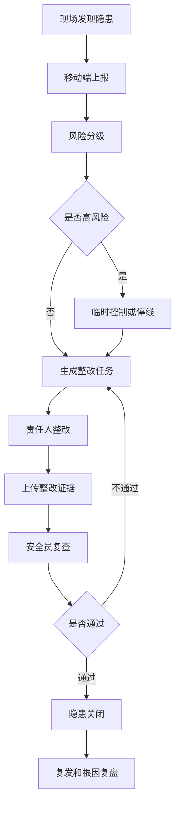
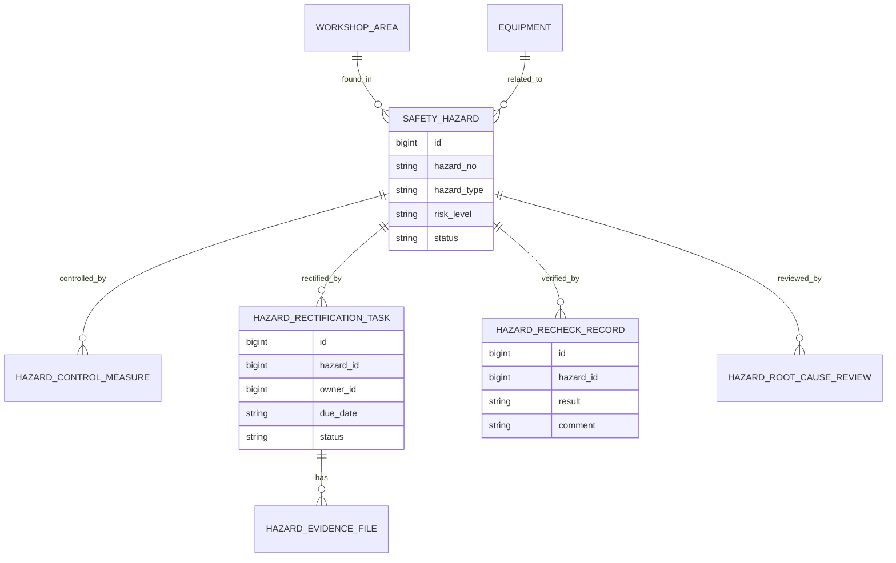
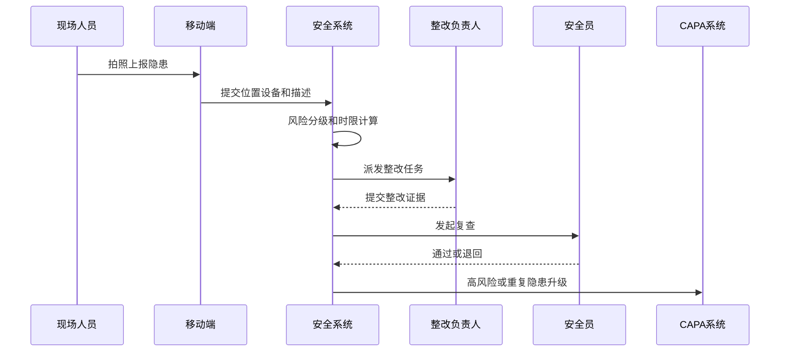
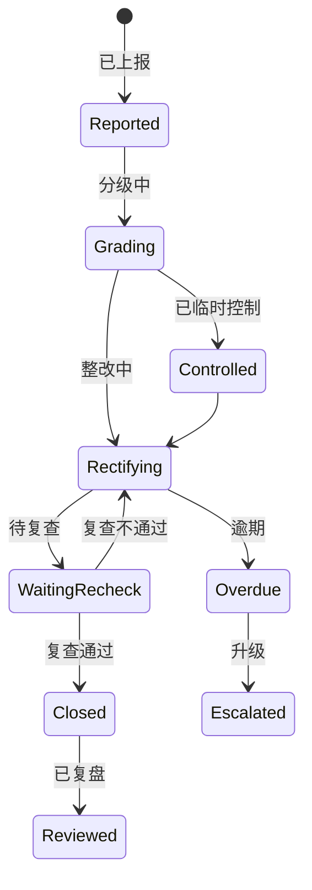
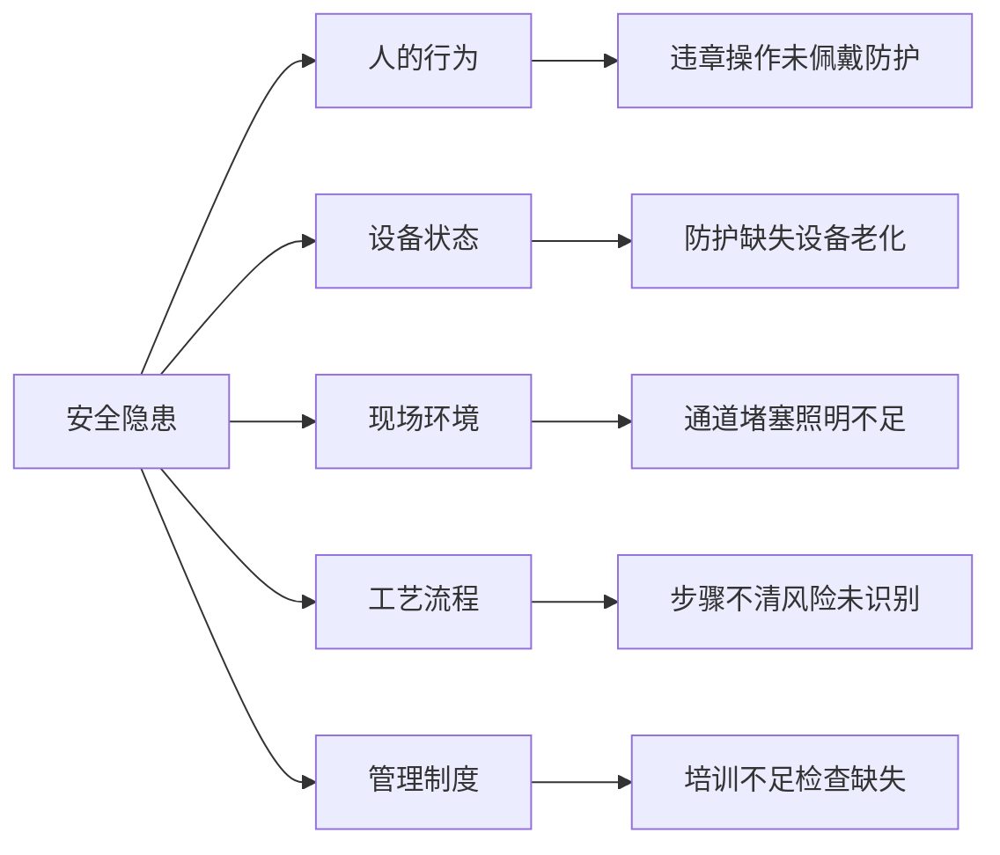

# 生产现场安全隐患项目案例

## 适合谁看

如果你做过生产巡检移动端、生产过程审核、生产异常 CAPA、设备维保或生产设备异常，但还不清楚现场安全隐患如何上报、分级、整改、复查和闭环，可以学习这个案例。

生产现场安全隐患关注的是车间、产线、设备、工位、仓库和人员操作中的安全风险。它不是简单的“拍照上报”，而是要把隐患识别、风险分级、整改责任、临时控制、复查验证、重复发生和安全培训串起来。

## 业务目标

生产现场安全隐患系统要回答 6 个问题：

- 哪些区域、设备、工序和岗位存在安全隐患。
- 隐患严重程度如何分级，是否需要停线、隔离或立即处理。
- 整改任务由谁负责，什么时候完成，是否需要临时控制措施。
- 整改完成后谁复查，证据是否充分，风险是否真正消除。
- 哪些隐患重复发生，根因是设备、流程、培训还是管理问题。
- 隐患数据如何反哺安全培训、工艺优化和现场审核。

真实项目里，安全隐患如果只做上报列表，很快会变成“拍照归档”。系统要推动闭环，而不是只保存问题。

## 生产现场安全隐患链路

这条链路说明，隐患闭环至少包含上报、分级、整改、复查和复盘，不应该只有一个状态字段。

## 核心概念

| 概念 | 说明 | 新手理解 |
| --- | --- | --- |
| 安全隐患 | 可能导致事故的现场问题 | 护栏缺失、违章操作 |
| 风险分级 | 判断隐患严重程度 | 一般、较大、重大 |
| 临时控制 | 整改前降低风险的措施 | 警戒线、停机、隔离 |
| 整改任务 | 指派责任人解决隐患 | 谁在何时完成 |
| 复查验证 | 安全员确认整改有效 | 不是上传照片就完事 |
| 重复隐患 | 同类问题反复出现 | 说明根因没解决 |
| CAPA 升级 | 转入纠正预防流程 | 高风险或重复隐患 |

安全隐患的核心是“风险控制”。系统要优先保证高风险隐患被快速处理。

## 数据模型

隐患、临时控制、整改任务和复查记录要分开建模。一个隐患可能有多个整改动作和多次复查。

## 推荐表结构

| 表 | 用途 | 关键字段 |
| --- | --- | --- |
| `safety_hazard` | 隐患主表 | hazard_no、area_id、equipment_id、hazard_type、risk_level、status |
| `hazard_control_measure` | 临时控制措施 | hazard_id、measure_type、owner_id、effective_until、status |
| `hazard_rectification_task` | 整改任务 | hazard_id、owner_id、due_date、rectification_plan、status |
| `hazard_evidence_file` | 隐患和整改证据 | hazard_id、task_id、file_id、evidence_type、verify_status |
| `hazard_recheck_record` | 复查记录 | hazard_id、rechecker_id、result、comment、recheck_time |
| `hazard_root_cause_review` | 根因复盘 | hazard_id、root_cause、preventive_action、capa_required |
| `safety_training_feedback` | 安全培训反馈 | hazard_id、training_topic、target_role、complete_rate |

高风险隐患要保存临时控制措施。否则整改周期内仍然可能发生事故。

## 隐患处理流程

流程设计要把“谁负责、多久完成、谁验证”写清楚。否则隐患会卡在无人处理状态。

## 隐患状态设计

逾期和升级要作为明确状态或事件，不要只靠颜色提醒。这样才能统计责任和时效。

## 安全隐患因素拆解

做复盘时不能只写“员工不规范”。要判断是培训不到位、流程不清、设备问题还是管理检查缺失。

## 前端页面拆分

| 页面 | 核心内容 | 设计建议 |
| --- | --- | --- |
| 隐患上报移动页 | 拍照、位置、设备、类型、描述 | 尽量减少输入步骤 |
| 隐患工作台 | 风险等级、逾期、责任人、状态 | 高风险和逾期置顶 |
| 隐患详情页 | 问题描述、照片、位置、分级依据 | 证据要清晰可追溯 |
| 整改任务页 | 计划、负责人、截止时间、证据 | 支持多次整改 |
| 复查验证页 | 对比整改前后、复查结论 | 不通过要写原因 |
| 隐患分析页 | 区域、类型、设备、重复率 | 发现高发区域 |
| 安全培训页 | 隐患转培训主题和完成情况 | 让复盘落到行动 |

移动端上报要快，后台处理要严。两个端的设计目标不同，不要把后台复杂表单搬到手机上。

## 接口拆分建议

| 接口 | 方法 | 说明 |
| --- | --- | --- |
| `/api/safety-hazards` | GET/POST | 查询和上报隐患 |
| `/api/safety-hazards/:id/grade` | POST | 风险分级 |
| `/api/safety-hazards/:id/control-measures` | GET/POST | 查询和创建临时控制措施 |
| `/api/safety-hazards/:id/tasks` | GET/POST | 查询和创建整改任务 |
| `/api/safety-hazards/tasks/:id/evidence` | POST | 上传整改证据 |
| `/api/safety-hazards/:id/recheck` | POST | 提交复查结论 |
| `/api/safety-hazards/analysis` | GET | 查询隐患统计分析 |

高风险接口要考虑消息通知和升级机制。比如重大隐患上报后自动通知安全主管和生产负责人。

## 实际项目常见问题

### 1. 隐患只上传照片，没有结构化信息

照片能看出问题，但系统无法统计类型、区域和责任。

解决方式：

- 上报时选择区域、设备、隐患类型和风险等级。
- 图片作为证据，不替代结构化字段。
- 必填字段根据隐患类型动态变化。
- 分析报表按类型和区域聚合。

### 2. 高风险隐患没有临时控制

整改可能需要几天，但期间风险一直存在。

解决方式：

- 高风险隐患必须填写临时控制措施。
- 支持停机、隔离、警戒、替代流程。
- 临时控制设置有效期。
- 过期未整改自动升级。

### 3. 整改照片无法证明问题解决

只上传一张照片，无法判断前后变化。

解决方式：

- 保存整改前后对比证据。
- 复查人必须给出通过或不通过理由。
- 关键隐患要求现场复查。
- 证据文件保留时间、地点和上传人。

### 4. 重复隐患一直出现

每次都关闭，但同一问题反复发生。

解决方式：

- 按区域、设备、类型识别重复隐患。
- 超过阈值自动升级 CAPA。
- 根因复盘必须有预防措施。
- 预防措施完成后继续监控复发。

### 5. 移动端离线后数据丢失

车间网络不稳定，上报失败后用户不再补录。

解决方式：

- 移动端本地暂存草稿。
- 图片先压缩再上传。
- 支持恢复网络后自动重试。
- 同步状态明确显示。

## 权限与审计

| 权限点 | 控制原因 |
| --- | --- |
| 上报隐患 | 所有现场人员应可操作 |
| 风险分级 | 需要安全员或主管确认 |
| 指派整改 | 涉及责任和时限 |
| 提交整改 | 责任人负责上传证据 |
| 复查关闭 | 必须由安全员或授权人员执行 |
| 导出隐患记录 | 涉及安全审计和事故调查 |

隐患关闭必须审计。谁关闭、凭什么关闭、证据是什么，都要留痕。

## 验收清单

- 现场人员可以快速上报隐患和照片。
- 隐患可以按区域、设备、类型和风险等级管理。
- 高风险隐患可以生成临时控制措施。
- 整改任务有负责人、截止日期和证据。
- 复查不通过可以退回整改。
- 重复隐患可以触发根因复盘或 CAPA。
- 移动端弱网场景下数据不丢失。

## 下一步学习

学完这个案例后，可以继续看：

- [生产巡检移动端项目案例](/projects/production-mobile-inspection-case)
- [生产过程审核项目案例](/projects/production-process-audit-case)
- [生产异常 CAPA 项目案例](/projects/production-exception-capa-case)
- [设备维保项目案例](/projects/equipment-maintenance-case)

