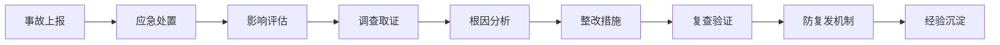
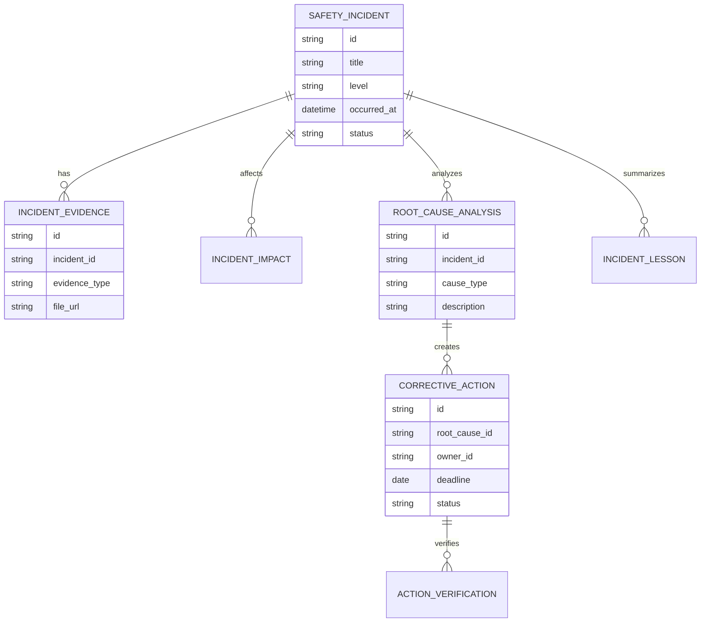
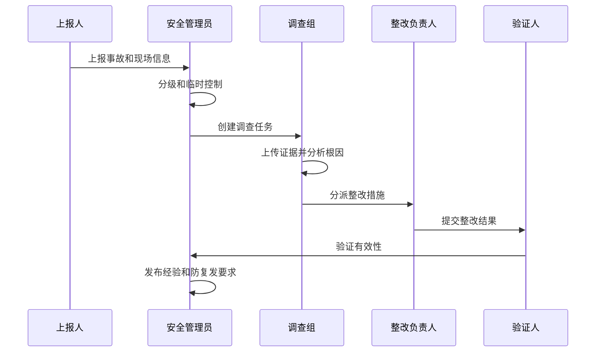
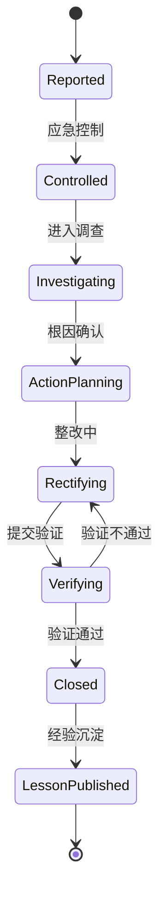
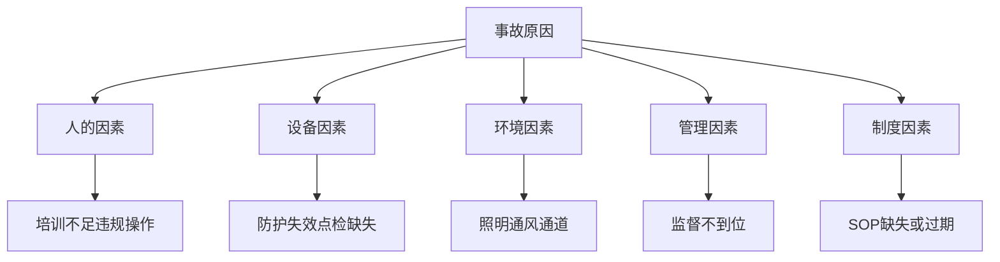

# 生产安全事故复盘项目案例

## 适合谁看

- 想理解安全事故上报、调查、根因分析、整改和防复发闭环的前端开发者。
- 正在做 EHS、安全管理、制造现场、质量异常或 CAPA 系统的团队。
- 希望把事故复盘从 Word 报告升级为结构化、可追踪、可验证系统的项目负责人。

## 业务目标

生产安全事故复盘的目标，不是简单记录事故经过，而是通过事实收集、影响评估、根因分析、责任措施和整改验证，降低同类事故再次发生的概率。

一个合格的事故复盘系统要回答：

1. 事故发生了什么，影响范围是什么。
2. 直接原因、管理原因和系统原因分别是什么。
3. 临时控制措施是否已执行。
4. 长期整改措施是否有效。
5. 同类风险是否已经扩散排查。

## 事故复盘链路

可以把它理解成“安全事故的结构化学习系统”。它的重点不是追责，而是让组织以后不再用同样方式出错。

## 核心概念

| 概念 | 说明 | 例子 |
| --- | --- | --- |
| 事故等级 | 按伤害、损失和影响范围分级 | 一般、较大、重大 |
| 直接原因 | 事故现场直接触发因素 | 防护罩缺失、违规操作 |
| 根本原因 | 管理或系统层面的深层原因 | 培训不足、点检制度缺失 |
| 临时控制 | 防止风险扩大的短期措施 | 停机、隔离、封锁区域 |
| 长期整改 | 防止复发的制度或工程措施 | 改造设备、更新 SOP |
| 效果验证 | 确认整改是否真正有效 | 复查、抽查、演练 |

## 数据模型

## 推荐表结构

| 表 | 关键字段 | 作用 |
| --- | --- | --- |
| `safety_incident` | `title`、`level`、`occurred_at`、`location`、`status` | 事故主记录 |
| `incident_evidence` | `incident_id`、`evidence_type`、`file_url`、`description` | 证据材料 |
| `incident_impact` | `incident_id`、`impact_type`、`impact_value`、`scope` | 影响评估 |
| `root_cause_analysis` | `incident_id`、`cause_type`、`description`、`method` | 根因分析 |
| `corrective_action` | `root_cause_id`、`action_type`、`owner_id`、`deadline_at`、`status` | 整改措施 |
| `action_verification` | `action_id`、`verifier_id`、`result`、`evidence_url` | 效果验证 |
| `incident_lesson` | `incident_id`、`lesson_type`、`summary`、`publish_status` | 经验沉淀 |

## 事故复盘流程

## 复盘状态设计

## 根因分析拆解

根因分析不要只停留在“员工操作不当”。如果没有继续追问为什么操作不当、为什么没有发现、为什么制度没有约束，整改很难有效。

## 前端页面拆分

| 页面 | 主要内容 | 设计重点 |
| --- | --- | --- |
| 事故上报 | 时间、地点、人员、等级、现场描述、附件 | 移动端快速提交 |
| 事故详情 | 经过、影响、证据、处置、调查组、状态 | 信息按时间线组织 |
| 根因分析 | 原因分类、5 Why、鱼骨图、证据关联 | 帮助团队从现象走向根因 |
| 整改措施 | 措施、负责人、截止时间、验证方式 | 每个根因至少有措施 |
| 经验库 | 事故教训、适用场景、防复发要求 | 让经验可被后续搜索 |

## 接口拆分建议

| 接口 | 方法 | 说明 |
| --- | --- | --- |
| `/api/safety-incidents` | POST | 上报事故 |
| `/api/safety-incidents` | GET | 查询事故列表 |
| `/api/safety-incidents/:id` | GET | 查询事故详情 |
| `/api/safety-incidents/:id/evidence` | POST | 上传证据 |
| `/api/safety-incidents/:id/root-causes` | POST | 提交根因分析 |
| `/api/safety-incidents/:id/actions` | POST | 创建整改措施 |
| `/api/corrective-actions/:id/verify` | POST | 提交验证结果 |

## 实际项目常见问题

### 1. 事故报告写完就结束

复盘系统必须把根因转成整改措施，并验证措施有效。只有报告没有整改闭环，不能算事故关闭。

关闭条件应该包括：措施完成、验证通过、经验沉淀。

### 2. 根因分析流于形式

前端可以用结构化问题引导，例如“直接原因是什么”“为什么没有被发现”“制度上是否有缺口”“同类区域是否排查”。

不要只提供一个大文本框。

### 3. 证据材料散落在聊天和邮件里

事故详情要统一管理照片、视频、监控截图、点检记录、培训记录和设备日志。

每条根因最好能关联证据，否则复盘结论很难站住。

### 4. 整改措施无法验证

措施创建时就要填写验证方式，例如现场复查、抽查记录、演练结果或设备改造验收。

如果验证方式为空，后续只能靠主观判断。

### 5. 同类事故反复发生

事故复盘要支持相似事故检索。创建事故时可以提示历史相似案例和已发布的经验。

这能帮助团队避免重复犯错。

## 权限与审计

| 动作 | 权限建议 | 审计内容 |
| --- | --- | --- |
| 上报事故 | 全员或现场负责人 | 上报时间、地点、附件 |
| 调整事故等级 | 安全主管 | 调整前后等级和原因 |
| 提交根因分析 | 调查组 | 根因内容和证据 |
| 关闭整改措施 | 验证人 | 验证结果和证据 |
| 发布事故经验 | 安全管理员 | 发布范围和版本 |

## 验收清单

- 事故能完成上报、分级和临时控制。
- 事故详情能管理证据、影响和时间线。
- 根因分析能分类并关联证据。
- 每个关键根因能创建整改措施。
- 整改关闭前必须有验证结果。
- 事故经验能沉淀到知识库并支持检索。

## 下一步学习

完成这个案例后，可以继续学习：

- [生产安全风险画像项目案例](/projects/production-safety-risk-profile-case)
- [生产安全应急演练项目案例](/projects/production-safety-emergency-drill-case)
- [生产异常 CAPA 项目案例](/projects/production-exception-capa-case)

