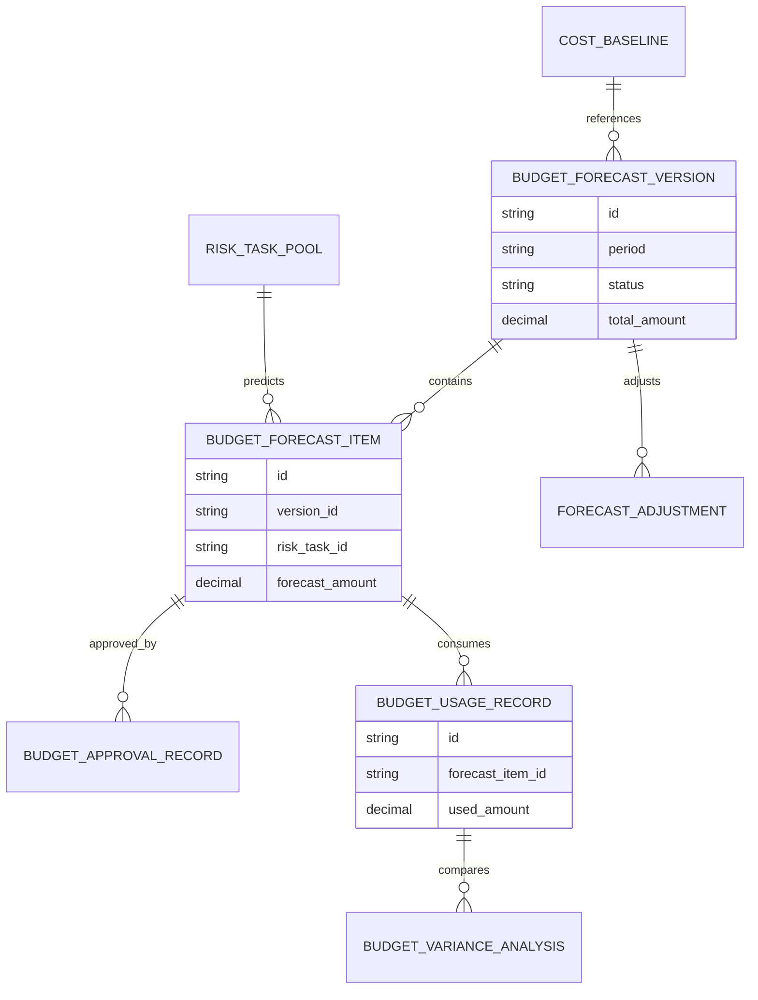
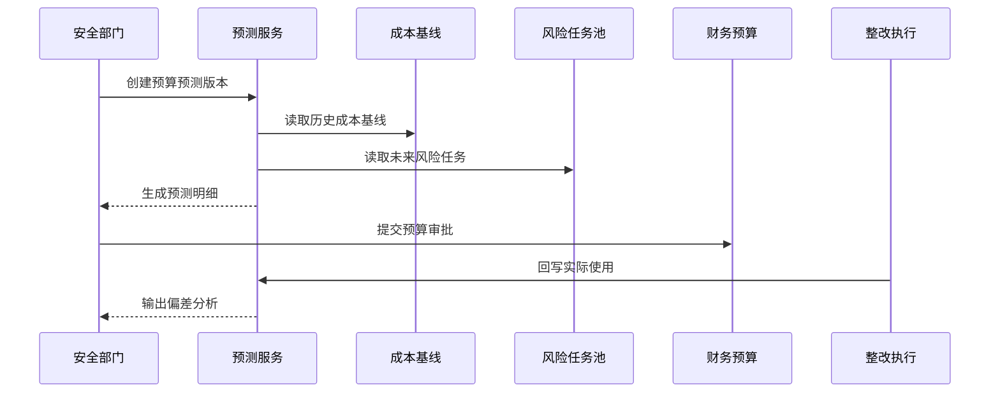
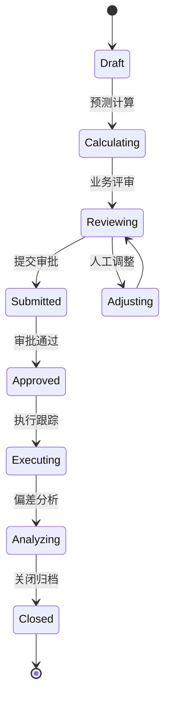
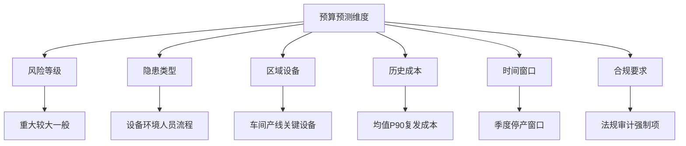

# 生产安全整改预算预测项目案例

## 适合谁看

- 想理解安全整改预算如何基于风险、历史成本和整改计划进行预测的前端开发者。
- 正在做 EHS、安全管理、预算管理、生产维修、设备改造或经营计划系统的团队。
- 希望把安全预算从“拍脑袋申请”升级为“有依据、有优先级、可滚动预测”的项目负责人。

## 业务目标

生产安全整改成本复盘能看清过去花了多少钱，预算预测要回答未来还需要多少钱、花在哪里、什么时候花。

它要解决：

- 哪些隐患、设备、区域未来可能产生整改费用。
- 高风险整改是否有足够预算。
- 重复隐患是否应该改成设备改造或专项治理。
- 预算不足时如何排序，哪些任务不能延后。
- 实际花费偏离预测后如何修正模型。

## 预算预测链路

预算预测不是财务部门单独完成的，它需要安全、生产、设备、采购和财务一起确认口径。

## 核心概念

| 概念 | 说明 |
| --- | --- |
| 成本基线 | 根据历史整改成本计算的参考成本。 |
| 风险任务池 | 未来可能需要整改的隐患、设备、区域和专项计划。 |
| 预算版本 | 某一次预测形成的预算方案，可对比、审批和锁定。 |
| 优先级排序 | 根据风险等级、合规要求、复发概率和成本收益排序。 |
| 预算占用 | 整改任务实际执行时对预算版本的占用。 |
| 偏差分析 | 预测金额和实际花费的差异原因分析。 |

## 数据模型

预算版本要可冻结。审批通过后不能随意改历史版本，只能创建调整版本。

## 推荐表结构

| 表 | 作用 | 关键字段 |
| --- | --- | --- |
| `cost_baseline` | 保存成本基线 | `issue_type`、`area_id`、`avg_cost`、`p90_cost`、`sample_count` |
| `risk_task_pool` | 保存风险任务池 | `risk_type`、`risk_level`、`area_id`、`expected_time`、`status` |
| `budget_forecast_version` | 保存预算预测版本 | `period`、`total_amount`、`status`、`created_by` |
| `budget_forecast_item` | 保存预测明细 | `version_id`、`risk_task_id`、`forecast_amount`、`priority` |
| `budget_usage_record` | 保存预算使用 | `forecast_item_id`、`task_id`、`used_amount`、`used_at` |
| `budget_variance_analysis` | 保存偏差分析 | `usage_id`、`variance_amount`、`reason_type`、`comment` |
| `forecast_adjustment` | 保存预测调整 | `version_id`、`adjustment_type`、`amount_delta`、`reason` |

## 预算预测流程

预测结果要能人工调整。模型给出的是建议，业务可以基于合规、停产窗口和设备计划做修正。

## 预算版本状态设计

预算预测是滚动过程，不是年初做一次就结束。执行中出现重大偏差时要能创建调整版本。

## 预测维度拆解

高风险和强合规任务不应该只按成本排序。低成本高风险任务通常要优先处理。

## 前端页面拆分

| 页面 | 核心内容 | 设计重点 |
| --- | --- | --- |
| 预算预测版本 | 周期、总额、状态、审批人、偏差 | 支持版本对比。 |
| 预测明细 | 风险任务、预测金额、成本基线、优先级 | 能看到预测依据。 |
| 预算审批 | 调整说明、风险影响、预算占用 | 财务和安全都能理解。 |
| 执行跟踪 | 预算占用、实际花费、剩余额度、超支预警 | 关注偏差和风险。 |
| 偏差分析 | 预测值、实际值、原因、模型修正建议 | 为下一轮预测提供反馈。 |

## 接口拆分建议

| 接口 | 作用 |
| --- | --- |
| `GET /api/safety-budget-forecasts` | 查询预算预测版本。 |
| `POST /api/safety-budget-forecasts` | 创建预算预测版本。 |
| `POST /api/safety-budget-forecasts/:id/calculate` | 执行预测计算。 |
| `GET /api/safety-budget-forecasts/:id/items` | 查询预测明细。 |
| `POST /api/safety-budget-forecast-items/:id/adjust` | 调整预测明细。 |
| `POST /api/safety-budget-forecasts/:id/submit` | 提交预算审批。 |
| `GET /api/safety-budget-forecasts/:id/usages` | 查询预算使用。 |
| `GET /api/safety-budget-forecasts/:id/variance` | 查询偏差分析。 |

## 实际项目常见问题

### 1. 预算只按去年金额平移

忽略了风险变化和新增隐患。解决方式是把风险任务池和历史成本基线结合起来预测。

### 2. 预测金额没有依据

业务只看到一个总数，不知道怎么算出来。解决方式是展示样本数量、成本基线、风险等级和人工调整原因。

### 3. 预算审批只看金额，不看风险

容易砍掉高风险任务预算。解决方式是在审批页展示风险等级、法规要求和延期影响。

### 4. 实际花费不回写

预测模型无法变好。解决方式是整改任务执行时必须回写预算使用和偏差原因。

### 5. 超支后才发现

没有过程预警。解决方式是按预算项设置占用阈值和超支预警。

## 权限与审计

| 权限 | 说明 |
| --- | --- |
| 创建预测版本 | 可以生成预算预测方案。 |
| 调整预测明细 | 可以人工调整金额和优先级。 |
| 提交审批 | 可以把预算版本提交财务审批。 |
| 查看实际花费 | 可以查看预算使用和偏差。 |
| 关闭版本 | 可以归档预算周期。 |

预算调整、审批、实际使用和偏差原因都要审计，避免预算被随意挪用。

## 验收清单

- 能根据历史成本和风险任务池生成预算预测版本。
- 能查看每个预测项的成本基线和风险依据。
- 能人工调整预测金额并记录原因。
- 能按风险等级和合规要求排序预算优先级。
- 能审批预算版本并冻结历史口径。
- 能跟踪预算实际使用和超支预警。
- 能输出预测偏差分析并修正下一轮预测。

## 下一步学习

- [生产安全整改成本复盘项目案例](/projects/production-safety-rectification-cost-review-case)
- [生产安全整改 SLA 项目案例](/projects/production-safety-rectification-sla-case)
- [预算管理项目案例](/projects/budget-management-case)
