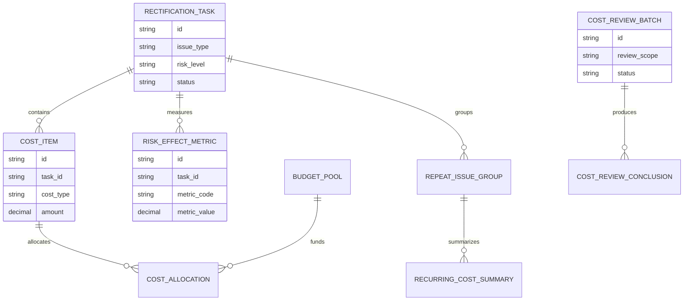
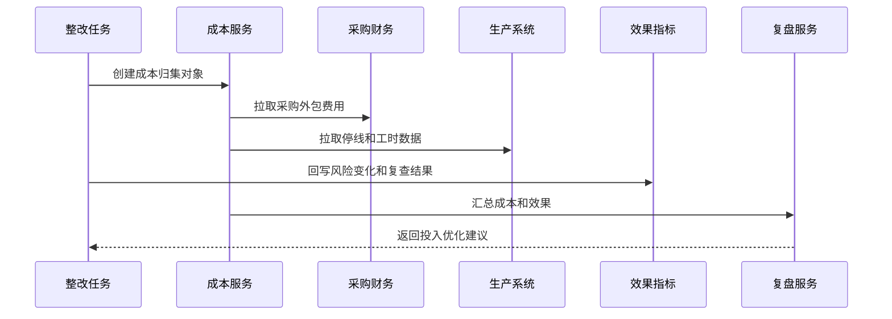
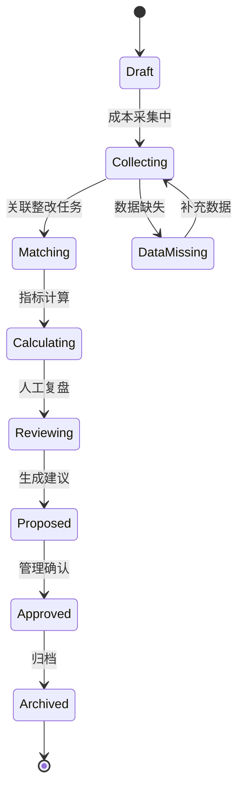
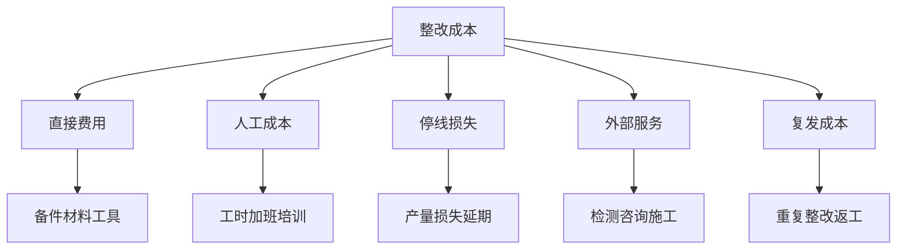

# 生产安全整改成本复盘项目案例

## 适合谁看

- 想理解生产安全整改不仅看是否完成，还要看投入、效果和复发成本的前端开发者。
- 正在做 EHS、安全整改、生产管理、预算管理、维修工单或风险治理系统的团队。
- 希望把安全整改从“花钱处理问题”升级为“看清成本、效果和投入优先级”的项目负责人。

## 业务目标

生产安全整改 SLA 能保证任务按时推进，但管理层还会关心：整改投入是否合理、哪些问题反复花钱、哪些措施真正降低风险。

生产安全整改成本复盘要回答：

- 每类隐患整改花了多少钱、人力和停线时间。
- 高风险整改是否优先获得资源。
- 哪些整改投入后风险明显下降。
- 哪些整改反复发生，说明根因没有解决。
- 安全预算应该如何分配到区域、设备、培训和流程优化。

这个模块不用于压低安全投入，而是帮助企业把有限资源投到最能降低风险的地方。

## 成本复盘链路

安全整改成本不只是采购费用，还包括人工、停线、外部检测、培训、备件和复查成本。

## 核心概念

| 概念 | 说明 |
| --- | --- |
| 整改成本 | 为完成整改产生的直接和间接成本。 |
| 成本归集 | 按任务、区域、设备、隐患类型、部门等维度汇总成本。 |
| 风险效果 | 整改后风险等级、复发次数、复查通过率等变化。 |
| 复发成本 | 同类隐患反复发生造成的重复投入。 |
| 预算占用 | 整改成本对安全预算或部门预算的占用情况。 |
| 投入优先级 | 根据风险等级、复发概率和整改效果决定资源优先级。 |

## 数据模型

成本项建议细分。只有总金额无法分析到底是备件贵、停线贵、外包贵，还是反复返工导致成本高。

## 推荐表结构

| 表 | 作用 | 关键字段 |
| --- | --- | --- |
| `cost_item` | 保存整改成本项 | `task_id`、`cost_type`、`amount`、`source_type`、`occurred_at` |
| `cost_allocation` | 保存成本分摊 | `cost_item_id`、`budget_pool_id`、`dept_id`、`allocated_amount` |
| `risk_effect_metric` | 保存整改效果指标 | `task_id`、`metric_code`、`before_value`、`after_value` |
| `repeat_issue_group` | 保存重复隐患分组 | `issue_type`、`area_id`、`equipment_id`、`repeat_count` |
| `recurring_cost_summary` | 保存复发成本汇总 | `repeat_group_id`、`total_cost`、`period`、`trend` |
| `cost_review_batch` | 保存成本复盘批次 | `review_scope`、`start_date`、`end_date`、`status` |
| `cost_review_conclusion` | 保存复盘结论 | `batch_id`、`conclusion_type`、`proposal`、`owner_id` |

## 成本采集流程

成本数据通常来自多个系统。前端要显示数据来源和更新时间，否则业务很难信任成本结果。

## 成本复盘状态设计

成本复盘最常见的问题是数据缺失。状态里要显式表达缺失，不能把它当成普通失败。

## 成本类型拆解

把成本拆细后，复盘结论才有意义。例如同样花 10 万，设备改造和反复返工代表完全不同的问题。

## 前端页面拆分

| 页面 | 核心内容 | 设计重点 |
| --- | --- | --- |
| 成本复盘列表 | 复盘范围、成本总额、高风险任务、状态 | 管理者先看范围和异常。 |
| 成本复盘详情 | 成本构成、风险效果、预算占用、趋势 | 图表要能下钻到任务。 |
| 整改成本明细 | 成本项、来源、金额、归属部门、证据 | 支持核对数据来源。 |
| 重复隐患成本 | 重复次数、累计成本、责任区域、根因 | 突出“反复花钱”的问题。 |
| 投入建议 | 优先级、预算建议、整改策略建议 | 建议要有数据依据。 |

## 接口拆分建议

| 接口 | 作用 |
| --- | --- |
| `GET /api/safety-rectification-cost-reviews` | 查询成本复盘批次。 |
| `POST /api/safety-rectification-cost-reviews` | 创建成本复盘。 |
| `GET /api/safety-rectification-cost-reviews/:id` | 查询复盘详情。 |
| `POST /api/safety-rectification-cost-reviews/:id/collect` | 触发成本采集。 |
| `GET /api/safety-rectification-cost-reviews/:id/items` | 查询成本明细。 |
| `GET /api/safety-rectification-cost-reviews/:id/repeat-costs` | 查询重复隐患成本。 |
| `POST /api/safety-rectification-cost-reviews/:id/conclusions` | 提交复盘结论。 |
| `POST /api/safety-rectification-cost-reviews/:id/proposals` | 生成投入优化建议。 |

## 实际项目常见问题

### 1. 把安全成本当成单纯费用控制

安全整改成本复盘不是为了少花钱，而是为了让投入更有效。解决方式是同时展示风险下降、复查通过和复发次数。

### 2. 停线损失没有纳入成本

只看采购金额会低估真实整改成本。解决方式是接入生产系统，估算停线、等待和产能损失。

### 3. 成本和整改任务对不上

费用在财务系统里，整改在 EHS 系统里，缺少关联字段。解决方式是成本项支持任务号、设备号、采购单和部门多种匹配方式。

### 4. 重复隐患没有累计成本

每次整改都看起来不贵，但长期累计很高。解决方式是按隐患类型、区域和设备建立重复隐患分组。

### 5. 复盘建议无法落地

复盘只写结论，没有进入预算或整改策略。解决方式是生成预算调整建议、设备改造建议或培训专项任务。

## 权限与审计

| 权限 | 说明 |
| --- | --- |
| 查看成本复盘 | 可以查看汇总指标和趋势。 |
| 查看成本明细 | 可以查看具体金额、来源和证据。 |
| 补充成本项 | 可以手工补充缺失成本。 |
| 提交复盘结论 | 可以填写根因和投入建议。 |
| 确认预算建议 | 可以把建议转入预算或整改计划。 |

成本数据可能涉及财务敏感信息。前端要按角色控制金额明细、导出能力和跨部门可见范围。

## 验收清单

- 能按整改任务归集采购、人工、停线、外包和复发成本。
- 能展示成本数据来源和更新时间。
- 能把成本和风险效果指标放在同一复盘页面。
- 能识别重复隐患的累计成本。
- 能按区域、部门、设备和隐患类型下钻。
- 能生成投入优先级和预算优化建议。
- 能把复盘结论转成整改策略或预算任务。

## 下一步学习

- [生产安全整改 SLA 项目案例](/projects/production-safety-rectification-sla-case)
- [生产安全整改看板项目案例](/projects/production-safety-rectification-dashboard-case)
- [生产安全事故复盘项目案例](/projects/production-safety-incident-review-case)
