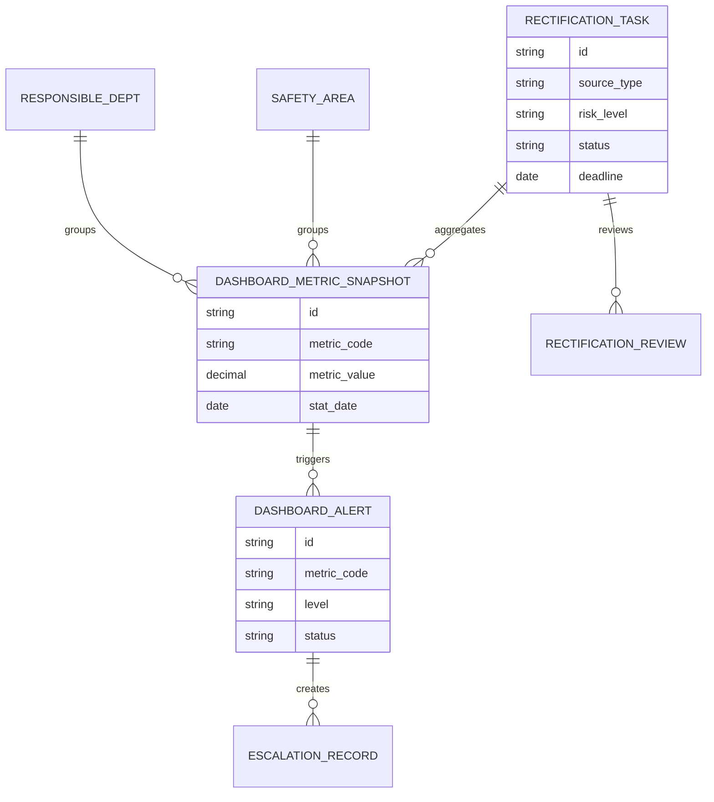
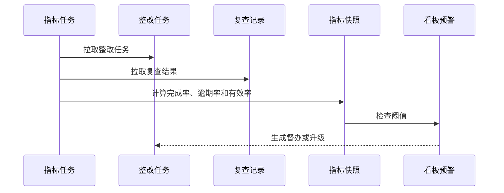
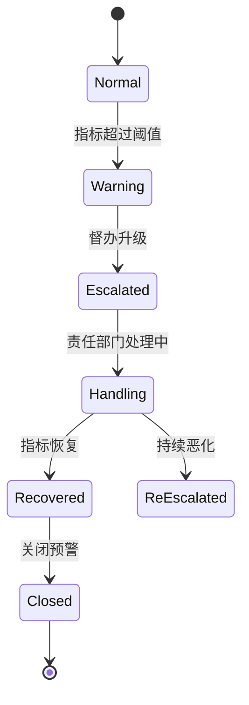
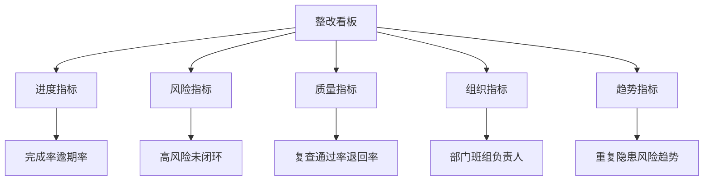

# 生产安全整改看板项目案例

## 适合谁看

- 想理解安全整改数据如何被汇总成管理看板的前端开发者。
- 正在做 EHS、安全隐患、整改闭环、车间管理或风险画像系统的团队。
- 希望把散落在任务列表里的整改信息，变成管理者能一眼看懂的风险治理看板的项目负责人。

## 业务目标

生产安全整改看板的目标，是集中展示隐患、事故、演练、风险画像触发的整改任务，帮助管理者看到整改进度、逾期风险、重复问题、责任部门和高风险区域。

它要解决：

- 整改任务很多，不知道哪些最危险。
- 只知道完成率，不知道风险是否下降。
- 逾期任务没有升级。
- 同类问题反复出现。
- 不同车间、班组、设备的数据难比较。

## 整改看板链路

可以把它理解成“安全整改的指挥台”。任务列表关注单个任务，看板关注整体风险和管理动作。

## 核心概念

| 概念 | 说明 | 举例 |
| --- | --- | --- |
| 整改完成率 | 已关闭任务占比 | 本月完成率 86% |
| 逾期率 | 超过截止时间仍未关闭的比例 | 高风险逾期 12% |
| 高风险未闭环 | 高风险且未复查通过的问题 | 设备防护缺失未关闭 |
| 重复隐患 | 同区域或同类型多次出现的问题 | 同产线连续 3 次通道堵塞 |
| 整改有效率 | 复查通过的整改占比 | 第一次复查通过率 78% |
| 督办升级 | 对逾期或高风险问题升级提醒 | 推送给车间主管 |

## 数据模型

## 推荐表结构

| 表 | 关键字段 | 作用 |
| --- | --- | --- |
| `rectification_task` | `source_type`、`risk_level`、`area_id`、`dept_id`、`deadline_at`、`status` | 整改任务 |
| `rectification_review` | `task_id`、`review_result`、`reviewed_at` | 复查结果 |
| `dashboard_metric_snapshot` | `metric_code`、`group_type`、`group_id`、`metric_value`、`stat_date` | 指标快照 |
| `dashboard_alert` | `metric_code`、`level`、`trigger_reason`、`status` | 看板预警 |
| `escalation_record` | `alert_id`、`target_role`、`reason`、`handled_status` | 督办升级 |
| `repeat_issue_group` | `issue_type`、`area_id`、`count`、`period` | 重复隐患分组 |

## 指标计算流程

## 看板预警状态设计

## 看板指标拆解

看板不要只堆 KPI。关键是让管理者能从指标直接进入问题清单，并发起督办动作。

## 前端页面拆分

| 页面 | 主要内容 | 设计重点 |
| --- | --- | --- |
| 整改总览 | 完成率、逾期率、高风险未闭环、重复隐患 | 第一屏突出风险 |
| 区域看板 | 车间、产线、设备区域的整改情况 | 支持热力图和下钻 |
| 部门看板 | 责任部门、负责人、逾期和退回 | 适合管理问责 |
| 高风险清单 | 高风险未关闭任务、整改证据、复查状态 | 支持督办升级 |
| 趋势复盘 | 周/月趋势、重复问题、整改有效率 | 观察治理是否变好 |

## 接口拆分建议

| 接口 | 方法 | 说明 |
| --- | --- | --- |
| `/api/safety-rectification-dashboard/overview` | GET | 查询总览指标 |
| `/api/safety-rectification-dashboard/areas` | GET | 查询区域指标 |
| `/api/safety-rectification-dashboard/departments` | GET | 查询部门指标 |
| `/api/safety-rectification-dashboard/high-risk` | GET | 查询高风险清单 |
| `/api/safety-rectification-dashboard/repeat-issues` | GET | 查询重复隐患 |
| `/api/safety-dashboard-alerts/:id/escalate` | POST | 发起督办升级 |
| `/api/safety-rectification-dashboard/trends` | GET | 查询趋势 |

## 实际项目常见问题

### 1. 完成率很好，但风险没有下降

完成率只能说明任务关闭，不代表整改有效。看板必须同时展示复查通过率、高风险未闭环和重复隐患。

### 2. 指标口径争议

每个指标要定义清楚分子、分母和统计时间。高风险整改完成率与所有整改完成率不能混在一起。

### 3. 看板只能看，不能处理

看板要支持下钻到任务和发起督办。否则管理者看到问题后还要去另一个系统查明细。

### 4. 部门排名导致数据造假

排名可以作为辅助，但不要只展示排名。应同时展示问题等级、任务复杂度和复查结果。

### 5. 实时性要求过高

整改看板通常不需要秒级实时。每日或每小时快照更稳定，也便于追溯历史口径。

## 权限与审计

| 动作 | 权限建议 | 审计内容 |
| --- | --- | --- |
| 查看总览 | 安全管理员、管理层 | 查询范围 |
| 查看部门明细 | 部门主管、安全管理员 | 部门范围 |
| 发起督办 | 安全主管 | 督办原因 |
| 导出看板 | 安全管理员 | 导出字段和范围 |
| 修改阈值 | 系统管理员 | 阈值变化 |

## 验收清单

- 能展示整改完成率、逾期率和复查通过率。
- 能按区域、部门、风险等级下钻。
- 高风险未闭环任务能直接进入明细。
- 重复隐患能按类型和区域统计。
- 指标超过阈值能生成看板预警。
- 看板预警能发起督办升级。

## 下一步学习

完成这个案例后，可以继续学习：

- [生产安全风险整改复查项目案例](/projects/production-safety-risk-rectification-review-case)
- [生产安全风险画像项目案例](/projects/production-safety-risk-profile-case)
- [生产现场安全隐患项目案例](/projects/production-safety-hazard-case)

