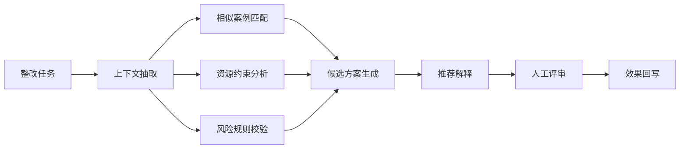
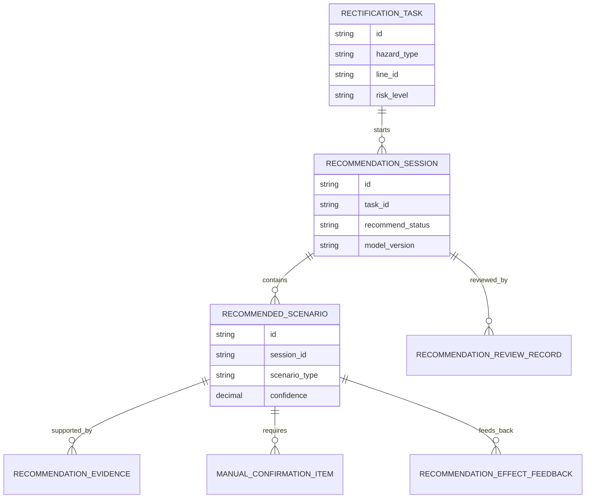
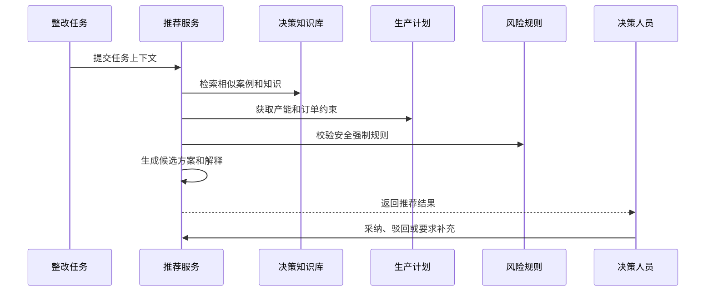
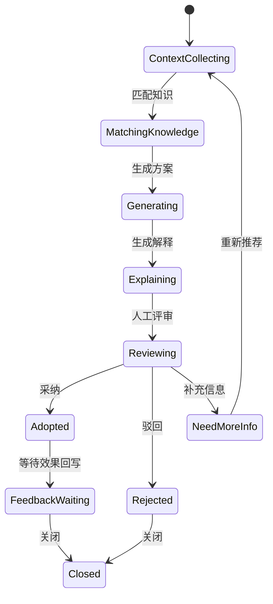
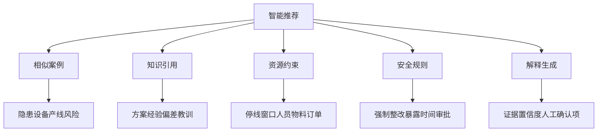
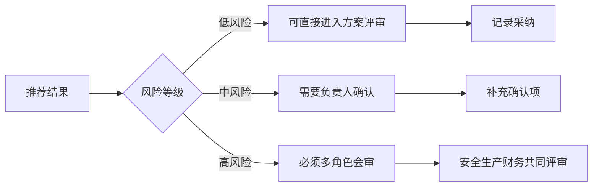

# 生产安全整改决策智能推荐项目案例

## 适合谁看

- 想理解生产安全整改如何从知识检索升级为方案智能推荐的前端开发者。
- 正在做 EHS、安全整改、生产计划、知识库、决策支持或 AI 工程落地的团队。
- 希望避免“系统有很多历史知识，但用户仍要自己查、自己比、自己判断”的项目负责人。

## 业务目标

生产安全整改决策知识库让历史案例可检索，但决策人员仍然需要把当前任务、产线约束、风险等级、历史案例和资源情况拼在一起。智能推荐要基于当前整改任务自动推荐候选方案、风险提示、相似案例、资源约束和需要人工确认的问题，帮助团队更快进入多方案评审。

智能推荐要解决：

- 当前整改任务需要什么类型的推荐。
- 推荐依据来自历史案例、知识库、资源排期还是风险规则。
- 推荐结果如何解释，避免用户盲目相信系统。
- 哪些场景必须人工确认，不能自动推荐结论。
- 推荐被采纳后的效果如何回写并持续优化。

## 智能推荐链路

智能推荐不是替代决策，而是让决策人员更快看到可行方案和风险边界。

## 核心概念

| 概念 | 说明 |
| --- | --- |
| 推荐上下文 | 当前隐患、产线、设备、订单、成本、风险等级和资源窗口。 |
| 候选方案 | 系统推荐的整改执行方式，例如立即停线、计划停线、局部隔离或替代产线。 |
| 推荐依据 | 相似案例、知识条目、历史偏差、资源约束和强制规则。 |
| 置信度 | 系统对推荐方案适用性的估计。 |
| 人工确认项 | 系统无法确定或风险较高，需要人工补充判断的事项。 |
| 效果回写 | 推荐方案被采纳后，将实际执行结果和偏差反馈给推荐模型。 |

## 数据模型

推荐会话要记录模型版本和证据。后续如果推荐效果不好，才能知道是模型、数据还是规则问题。

## 推荐表结构

| 表 | 作用 | 关键字段 |
| --- | --- | --- |
| `recommendation_session` | 保存推荐会话 | `task_id`、`recommend_status`、`model_version`、`created_at` |
| `recommended_scenario` | 保存推荐方案 | `session_id`、`scenario_type`、`confidence`、`summary` |
| `recommendation_evidence` | 保存推荐证据 | `scenario_id`、`evidence_type`、`source_id`、`weight` |
| `manual_confirmation_item` | 保存人工确认项 | `scenario_id`、`question`、`risk_level`、`answer_status` |
| `recommendation_review_record` | 保存评审记录 | `session_id`、`reviewer_role`、`decision`、`comment` |
| `recommendation_effect_feedback` | 保存效果反馈 | `scenario_id`、`adopted`、`actual_result`、`deviation_summary` |

## 推荐生成流程

推荐结果必须展示证据和人工确认项，不能只给一个“推荐方案 A”。

## 推荐状态设计

用户驳回推荐同样有价值，要记录驳回原因。

## 推荐能力拆解

智能推荐页面要把能力拆开展示，让用户知道推荐不是凭空生成。

## 人机协同边界

高风险整改不能让智能推荐直接给最终结论，必须进入多角色会审。

## 前端页面拆分

| 页面 | 核心内容 | 设计重点 |
| --- | --- | --- |
| 推荐入口 | 当前整改上下文、推荐状态、触发按钮 | 让用户知道系统需要哪些信息。 |
| 推荐结果 | 候选方案、置信度、证据、风险提示 | 推荐必须可解释。 |
| 人工确认 | 待补充问题、风险等级、负责人、确认记录 | 防止系统跳过不确定项。 |
| 推荐评审 | 采纳、驳回、调整、评审意见 | 与多方案决策衔接。 |
| 效果回写 | 实际执行、预测偏差、采纳效果、改进建议 | 用结果优化推荐。 |

## 接口拆分建议

| 接口 | 作用 |
| --- | --- |
| `POST /api/safety-rectification-tasks/:id/recommendations` | 为整改任务生成推荐。 |
| `GET /api/safety-rectification-recommendations/:id` | 查询推荐详情。 |
| `POST /api/safety-rectification-recommendations/:id/confirm-items` | 提交人工确认项。 |
| `POST /api/safety-rectification-recommendations/:id/review` | 提交推荐评审。 |
| `POST /api/safety-rectification-recommended-scenarios/:id/adopt` | 采纳推荐方案。 |
| `POST /api/safety-rectification-recommended-scenarios/:id/reject` | 驳回推荐方案。 |
| `POST /api/safety-rectification-recommended-scenarios/:id/feedback` | 回写执行效果。 |

## 实际项目常见问题

### 1. 推荐没有解释

用户不知道为什么推荐这个方案。解决方式是展示相似案例、资源约束、风险规则和置信度。

### 2. 历史案例质量差

旧案例没有复盘或标签错误。解决方式是推荐只引用已审核知识，并展示知识质量等级。

### 3. 高风险场景自动给结论

安全责任不可接受。解决方式是高风险场景只给参考方案，必须人工会审。

### 4. 用户驳回原因没有记录

模型无法改进。解决方式是驳回时选择原因并允许补充说明。

### 5. 推荐效果不回写

系统无法知道推荐是否有效。解决方式是执行复盘时自动关联推荐会话。

## 权限与审计

| 权限 | 说明 |
| --- | --- |
| 生成推荐 | 可以基于整改任务生成候选方案。 |
| 查看推荐证据 | 可以查看相似案例和知识来源。 |
| 提交确认项 | 可以补充推荐所需人工判断。 |
| 评审推荐 | 可以采纳、驳回或调整推荐方案。 |
| 查看模型版本 | 可以查看推荐使用的规则和模型版本。 |

推荐上下文、证据、模型版本、确认项、评审意见和效果反馈都要保留审计。

## 验收清单

- 能根据整改任务生成候选方案。
- 能展示推荐证据、置信度和风险提示。
- 能识别必须人工确认的问题。
- 能支持采纳、驳回和调整推荐。
- 能把推荐方案转入多方案决策。
- 能回写执行效果和偏差。
- 能记录模型版本和推荐审计。

## 下一步学习

- [生产安全整改决策知识库项目案例](/projects/production-safety-rectification-decision-knowledge-base-case)
- [生产安全整改多方案决策项目案例](/projects/production-safety-rectification-multi-scenario-decision-case)
- [AI 文档问答从零到项目](/ai-engineering/doc-qa-project)
