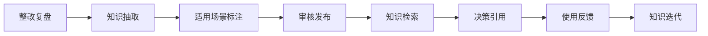
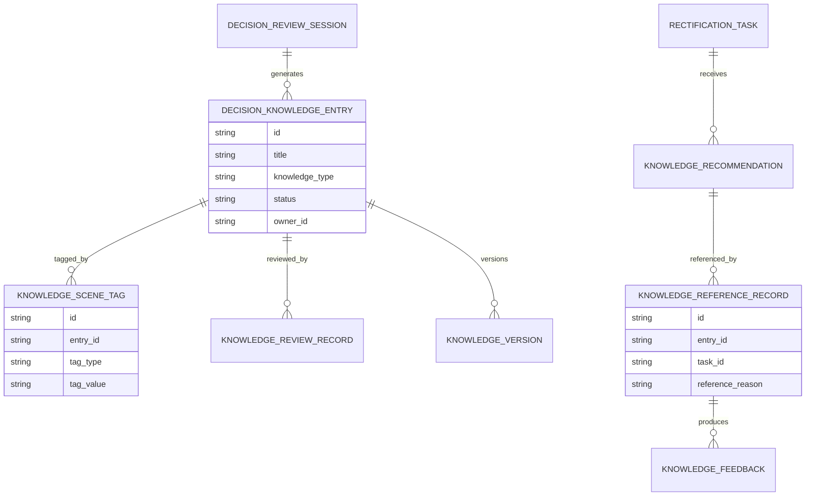
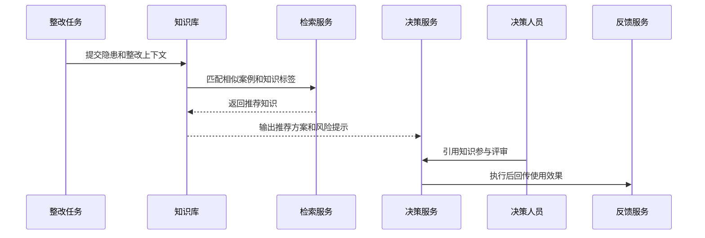
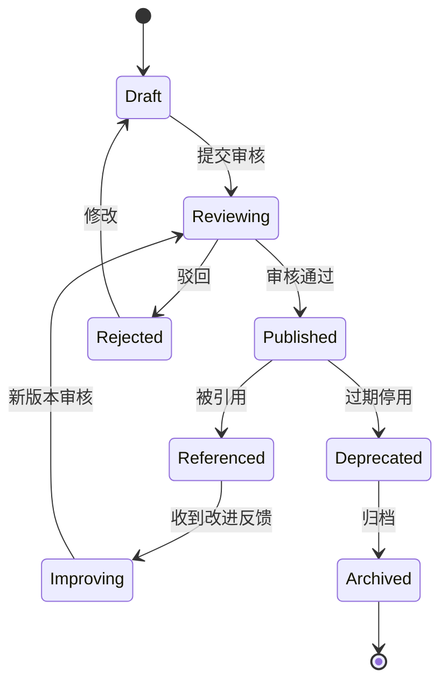
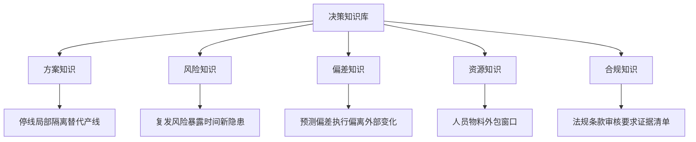
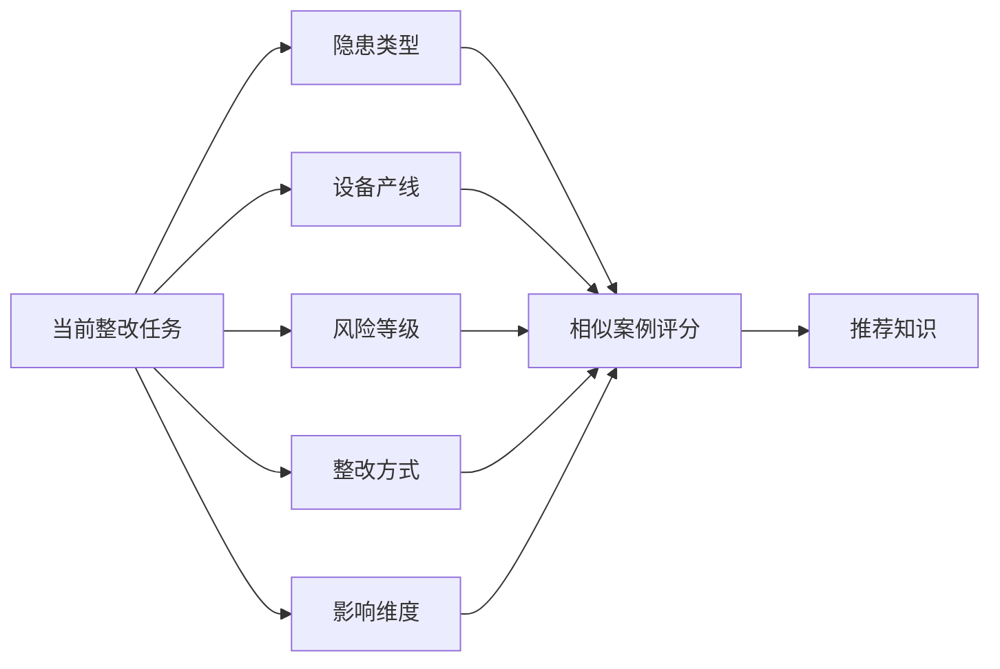

# 生产安全整改决策知识库项目案例

## 适合谁看

- 想理解生产安全整改复盘经验如何沉淀为可检索知识的前端开发者。
- 正在做 EHS、安全整改、生产计划、事故复盘、知识库或智能问答系统的团队。
- 希望避免“每次整改都重新讨论，过去的方案、偏差和风险提示没有被复用”的项目负责人。

## 业务目标

生产安全整改决策复盘能记录预测和实际偏差，但如果复盘结论只留在单个任务里，后续整改仍然很难复用经验。决策知识库要把历史整改任务、候选方案、决策理由、执行偏差、事故教训、风险提示和推荐方案结构化沉淀，让新整改任务可以快速参考相似案例。

决策知识库要解决：

- 复盘结论如何转成可检索、可引用、可维护的知识。
- 新整改任务如何匹配相似历史案例。
- 知识条目如何区分适用场景、风险边界和过期条件。
- 决策人员如何在方案评审时引用知识证据。
- 知识使用后如何反馈有效性并持续更新。

## 知识沉淀链路

知识库不是复盘材料归档，而是要在下一次决策时主动提供参考。

## 核心概念

| 概念 | 说明 |
| --- | --- |
| 决策知识 | 从历史整改决策和复盘中沉淀的方案、风险、偏差原因和建议。 |
| 适用场景 | 知识适用的产线、设备、隐患类型、风险等级、停线窗口和资源条件。 |
| 相似案例 | 与当前整改任务在隐患、设备、产线、影响维度上相近的历史案例。 |
| 引用证据 | 决策过程中引用知识条目的记录，用于解释方案选择依据。 |
| 知识有效性 | 知识被引用后是否帮助降低偏差、缩短决策或减少风险。 |
| 过期条件 | 设备改造、法规变化、工艺变化或组织调整后知识不再适用的条件。 |

## 数据模型

知识条目必须有版本。整改经验会随着设备、法规、工艺和组织能力变化而变化。

## 推荐表结构

| 表 | 作用 | 关键字段 |
| --- | --- | --- |
| `decision_knowledge_entry` | 保存知识条目 | `title`、`knowledge_type`、`summary`、`status`、`owner_id` |
| `knowledge_scene_tag` | 保存适用场景 | `entry_id`、`tag_type`、`tag_value`、`weight` |
| `knowledge_version` | 保存知识版本 | `entry_id`、`version_no`、`change_reason`、`published_at` |
| `knowledge_review_record` | 保存审核记录 | `entry_id`、`review_result`、`reviewer_id`、`comment` |
| `knowledge_recommendation` | 保存推荐记录 | `task_id`、`entry_id`、`match_score`、`recommend_reason` |
| `knowledge_reference_record` | 保存引用记录 | `task_id`、`entry_id`、`scenario_id`、`reference_reason` |
| `knowledge_feedback` | 保存使用反馈 | `reference_id`、`usefulness`、`feedback_text`、`improvement_suggestion` |

## 知识推荐流程

知识推荐要进入决策流程，而不是只提供一个独立搜索框。

## 知识状态设计

知识被引用不代表永远有效。使用反馈和外部条件变化都可能触发新版本审核。

## 知识分类拆解

不同类型知识的展示方式不同。方案知识适合对比，风险知识适合提示，合规知识适合清单。

## 相似案例匹配维度

相似度要可解释，用户需要知道系统为什么推荐这个历史案例。

## 前端页面拆分

| 页面 | 核心内容 | 设计重点 |
| --- | --- | --- |
| 知识库首页 | 知识分类、热门知识、待审核、过期风险 | 让用户快速找到可用经验。 |
| 知识详情 | 适用场景、方案建议、风险提示、历史案例、版本 | 强调适用边界，不让用户误用。 |
| 决策推荐侧栏 | 当前任务相似知识、匹配原因、引用按钮 | 嵌入多方案决策页面。 |
| 引用记录 | 哪些决策引用了知识、引用原因、执行效果 | 评估知识价值。 |
| 知识治理 | 审核、过期、反馈、新版本、负责人 | 保证知识持续可信。 |

## 接口拆分建议

| 接口 | 作用 |
| --- | --- |
| `GET /api/safety-rectification-decision-knowledge` | 查询知识库列表。 |
| `POST /api/safety-rectification-decision-knowledge` | 创建知识条目。 |
| `GET /api/safety-rectification-decision-knowledge/:id` | 查询知识详情。 |
| `POST /api/safety-rectification-decision-knowledge/:id/review` | 审核知识条目。 |
| `GET /api/safety-rectification-tasks/:id/knowledge-recommendations` | 查询任务推荐知识。 |
| `POST /api/safety-rectification-tasks/:id/knowledge-references` | 引用知识到决策。 |
| `POST /api/safety-rectification-knowledge-references/:id/feedback` | 提交知识使用反馈。 |
| `POST /api/safety-rectification-decision-knowledge/:id/deprecate` | 停用过期知识。 |

## 实际项目常见问题

### 1. 知识库只是文档归档

用户仍然靠人找经验。解决方式是把知识推荐嵌入整改决策流程。

### 2. 知识没有适用边界

历史方案被错误套用到不同产线。解决方式是每条知识必须标注适用场景和不适用条件。

### 3. 推荐结果不可解释

用户不相信系统推荐。解决方式是展示隐患类型、设备、风险等级和影响维度的匹配原因。

### 4. 知识过期没人发现

设备改造后旧方案仍被引用。解决方式是配置过期条件和定期复核任务。

### 5. 使用效果没有反馈

知识被频繁引用，但不知道是否有用。解决方式是执行复盘时回填知识引用效果。

## 权限与审计

| 权限 | 说明 |
| --- | --- |
| 查看知识 | 可以检索和查看已发布知识。 |
| 创建知识 | 可以从复盘中沉淀知识条目。 |
| 审核知识 | 可以审核发布、驳回或停用知识。 |
| 引用知识 | 可以在决策方案中引用知识证据。 |
| 反馈知识 | 可以提交使用效果和改进建议。 |

知识创建、审核、发布、引用、反馈、版本变更和停用都要保留审计。

## 验收清单

- 能从决策复盘创建知识条目。
- 能维护适用场景、标签、版本和过期条件。
- 能审核发布知识。
- 能为整改任务推荐相似案例和知识。
- 能解释推荐原因。
- 能在决策方案中引用知识。
- 能回收使用反馈并触发知识迭代。

## 下一步学习

- [生产安全整改决策复盘项目案例](/projects/production-safety-rectification-decision-review-case)
- [生产安全整改多方案决策项目案例](/projects/production-safety-rectification-multi-scenario-decision-case)
- [知识库平台项目案例](/projects/knowledge-base-case)
