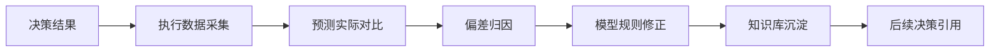
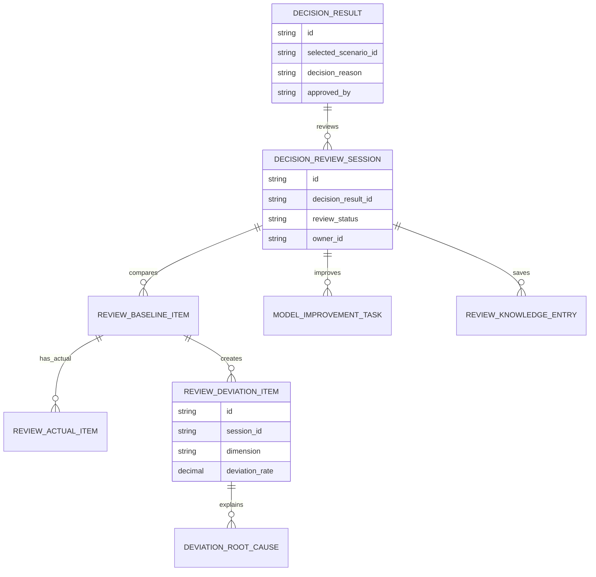
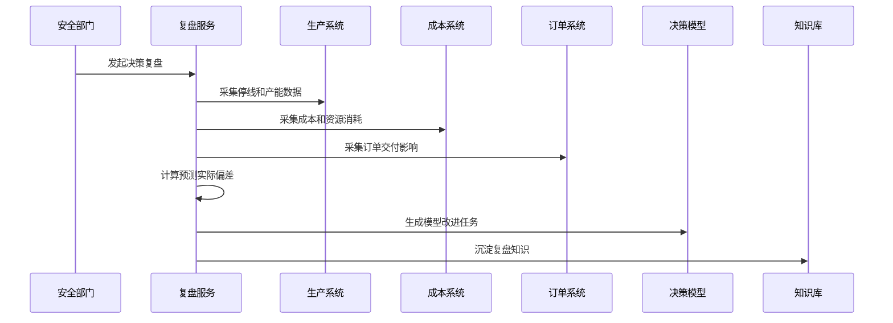
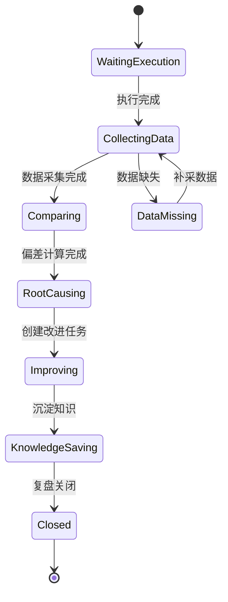
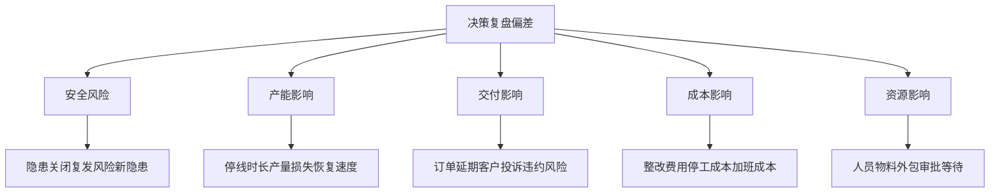
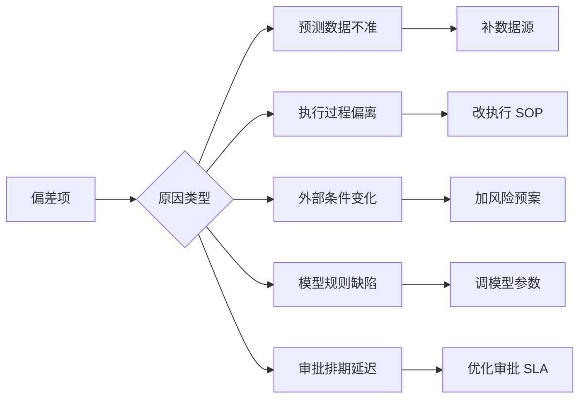

# 生产安全整改决策复盘项目案例

## 适合谁看

- 想理解生产安全整改方案执行后如何复盘预测与实际差异的前端开发者。
- 正在做 EHS、安全整改、生产计划、设备维保、成本复盘或经营分析系统的团队。
- 希望避免“决策时算得很细，执行完却没人复盘模型是否准确”的项目负责人。

## 业务目标

生产安全整改多方案决策能在执行前比较安全、生产、交付和成本影响，但真正提升决策质量的是执行后的复盘。复盘要把当初预测的停线时间、产能损失、订单延误、预算成本和风险下降，与实际执行结果对比，找出偏差原因，修正后续模型和规则。

决策复盘要解决：

- 决策时的预测数据和实际执行数据如何统一口径对比。
- 安全风险是否真正降低，是否出现新的隐患。
- 停线、成本、交付和资源占用偏差来自哪里。
- 哪些评分模型、约束规则或审批要求需要调整。
- 复盘结论如何进入知识库，供后续整改决策参考。

## 决策复盘链路

复盘不是追责会议，而是把决策模型变准，把组织经验沉淀为可复用的规则和知识。

## 核心概念

| 概念 | 说明 |
| --- | --- |
| 预测基线 | 决策发布时记录的停线、成本、交付、风险和资源预测。 |
| 实际结果 | 执行完成后从生产、成本、订单、EHS 和质检系统采集的真实数据。 |
| 偏差项 | 预测值和实际值之间的差异。 |
| 偏差归因 | 判断偏差来自数据不准、执行偏离、外部变化、模型缺陷还是审批延误。 |
| 模型修正 | 调整评分权重、约束规则、风险阈值或影响计算公式。 |
| 复盘知识 | 可被后续决策复用的经验、风险提示和方案建议。 |

## 数据模型

复盘会话要绑定决策结果，而不是绑定整改任务。因为同一个整改任务可能经历多次决策。

## 推荐表结构

| 表 | 作用 | 关键字段 |
| --- | --- | --- |
| `decision_review_session` | 保存复盘会话 | `decision_result_id`、`review_status`、`owner_id`、`completed_at` |
| `review_baseline_item` | 保存预测基线 | `session_id`、`dimension`、`metric_code`、`predicted_value` |
| `review_actual_item` | 保存实际结果 | `baseline_id`、`actual_value`、`data_source`、`collected_at` |
| `review_deviation_item` | 保存偏差项 | `session_id`、`dimension`、`deviation_value`、`deviation_rate` |
| `deviation_root_cause` | 保存偏差归因 | `deviation_id`、`cause_type`、`evidence`、`owner_role` |
| `model_improvement_task` | 保存模型改进 | `session_id`、`model_type`、`task_status`、`acceptance_rule` |
| `review_knowledge_entry` | 保存复盘知识 | `session_id`、`knowledge_type`、`summary`、`applicable_scene` |

## 复盘执行流程

复盘数据要尽量从业务系统采集。只靠人工填写，会导致复盘变成主观总结。

## 复盘状态设计

数据缺失不能直接关闭复盘。要记录缺失来源，并推动业务系统补齐采集点。

## 偏差维度拆解

复盘页面要把偏差拆到可行动的维度，而不是只展示“实际超预算 20%”。

## 偏差归因矩阵

归因结果必须带改进动作，否则复盘只会停留在原因分析。

## 前端页面拆分

| 页面 | 核心内容 | 设计重点 |
| --- | --- | --- |
| 复盘列表 | 整改任务、决策方案、执行状态、复盘状态、偏差等级 | 优先显示高偏差和逾期复盘。 |
| 预测实际对比 | 各维度预测值、实际值、偏差值、偏差率 | 支持趋势和明细展开。 |
| 偏差归因 | 偏差类型、证据、负责人、改进动作 | 让复盘结论可执行。 |
| 模型改进 | 评分权重、约束规则、阈值调整、验收结果 | 把复盘反馈给决策模型。 |
| 复盘知识库 | 适用场景、经验结论、推荐方案、风险提示 | 支持后续整改决策引用。 |

## 接口拆分建议

| 接口 | 作用 |
| --- | --- |
| `GET /api/safety-rectification-decision-reviews` | 查询决策复盘列表。 |
| `POST /api/safety-rectification-decision-reviews` | 创建复盘会话。 |
| `GET /api/safety-rectification-decision-reviews/:id` | 查询复盘详情。 |
| `POST /api/safety-rectification-decision-reviews/:id/collect-data` | 采集实际执行数据。 |
| `POST /api/safety-rectification-decision-reviews/:id/compare` | 计算预测实际偏差。 |
| `POST /api/safety-rectification-decision-reviews/:id/root-causes` | 提交偏差归因。 |
| `POST /api/safety-rectification-decision-reviews/:id/model-tasks` | 创建模型改进任务。 |
| `POST /api/safety-rectification-decision-reviews/:id/knowledge` | 沉淀复盘知识。 |

## 实际项目常见问题

### 1. 复盘只写文字总结

没有预测值、实际值和偏差率，后续无法判断模型是否进步。解决方式是每个维度都保存结构化对比数据。

### 2. 实际数据采集口径不一致

生产系统的停线时间和财务系统的停工成本对不上。解决方式是复盘前定义指标口径和数据源优先级。

### 3. 偏差都归因给外部原因

团队不愿承认模型缺陷。解决方式是归因必须有证据，并允许多原因分摊权重。

### 4. 模型改进没有验收

参数改了，但不知道是否减少偏差。解决方式是模型改进任务要有后续样本验证。

### 5. 复盘知识没人用

知识库只是归档材料。解决方式是在新决策创建时自动推荐相似复盘案例。

## 权限与审计

| 权限 | 说明 |
| --- | --- |
| 创建复盘 | 可以为决策结果发起复盘。 |
| 查看敏感数据 | 可以查看成本、订单和产能实际数据。 |
| 提交归因 | 可以维护偏差原因和证据。 |
| 创建模型改进 | 可以调整评分模型和约束规则。 |
| 发布复盘知识 | 可以把结论沉淀到知识库。 |

预测基线、实际采集、偏差计算、归因结论、模型改进和知识发布都要写入审计记录。

## 验收清单

- 能从决策结果创建复盘会话。
- 能采集生产、成本、订单和安全实际数据。
- 能按维度对比预测值和实际值。
- 能计算偏差率并标记偏差等级。
- 能为偏差项维护原因、证据和改进动作。
- 能创建模型改进任务并跟踪验收。
- 能把复盘结论沉淀到知识库并供后续引用。

## 下一步学习

- [生产安全整改多方案决策项目案例](/projects/production-safety-rectification-multi-scenario-decision-case)
- [生产安全整改产线影响评估项目案例](/projects/production-safety-rectification-line-impact-assessment-case)
- [生产安全事故复盘项目案例](/projects/production-safety-incident-review-case)
