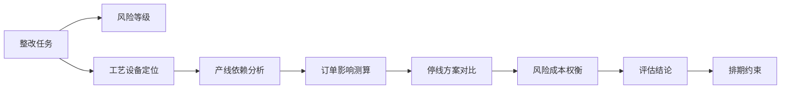
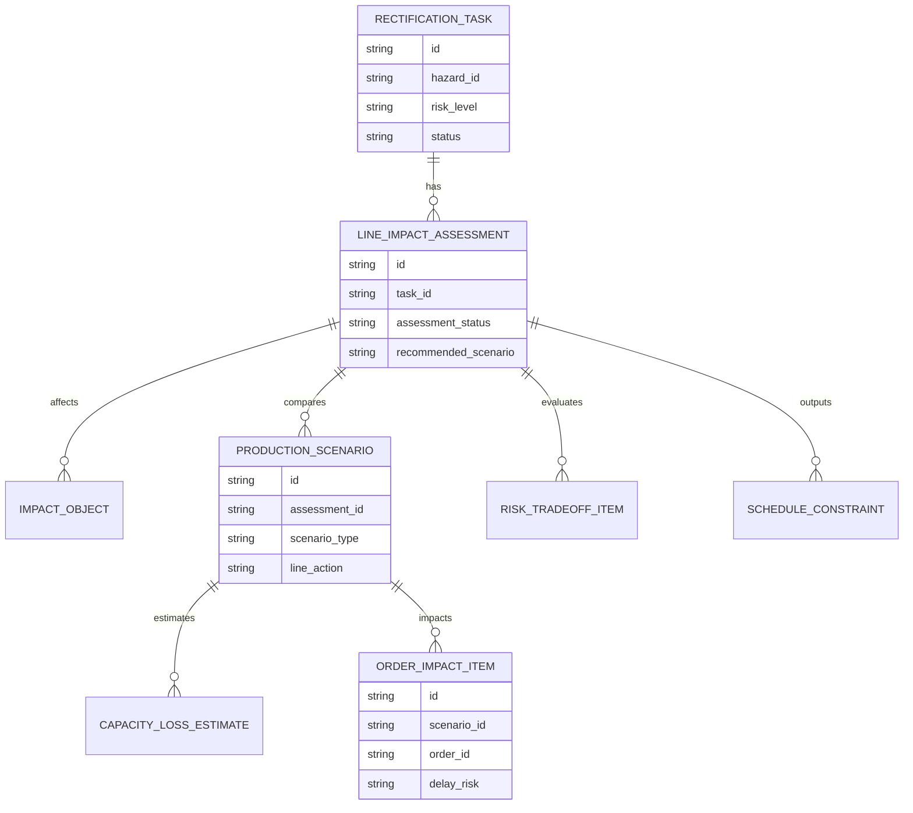
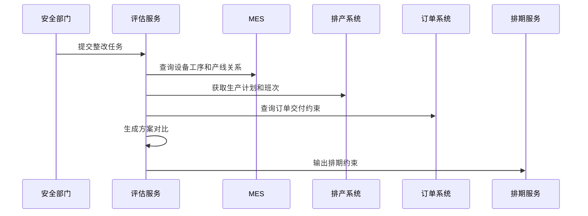
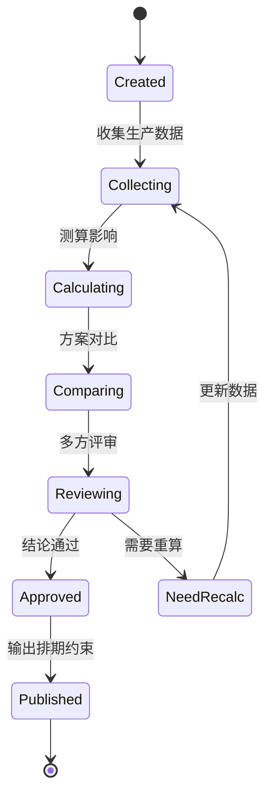
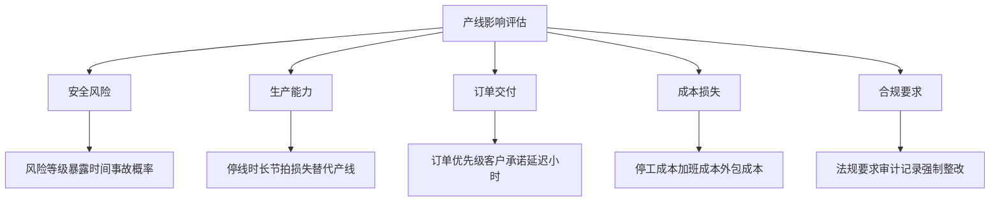

# 生产安全整改产线影响评估项目案例

## 适合谁看

- 想理解安全整改任务如何评估对产线、产能、订单和交付影响的前端开发者。
- 正在做 EHS、安全整改、生产计划、MES、APS、设备维保或工厂协同系统的团队。
- 希望避免“安全整改必须做，但一停线就影响交期，业务无法决策”的项目负责人。

## 业务目标

生产安全整改资源排期解决“任务怎么排”的问题，但排期前还要判断整改对生产线的影响。高风险隐患可能需要立即停线整改，低风险问题可能可以安排到检修窗口。不同选择对产能、订单、成本和风险暴露时间影响不同。

产线影响评估要解决：

- 整改是否需要停线、限速、换线或绕行。
- 影响哪些产线、工序、设备、产品、订单和班次。
- 延期整改会增加多少风险暴露时间。
- 立即整改会造成多少产能损失和交付风险。
- 多个方案之间如何做安全、生产和成本权衡。

## 影响评估链路

评估结论要输出给资源排期系统，成为排期算法和人工调整的约束条件。

## 核心概念

| 概念 | 说明 |
| --- | --- |
| 影响对象 | 被整改任务影响的产线、工序、设备、产品、订单、班次和人员。 |
| 停线方案 | 立即停线、计划停线、局部停线、限速生产或不停线整改等方案。 |
| 产能损失 | 由于停线、限速或绕线导致的产出减少。 |
| 交付风险 | 受影响订单无法按期完成的风险。 |
| 风险暴露 | 隐患未整改期间持续存在的安全风险。 |
| 权衡结论 | 在安全风险、产能、交付、成本和合规之间选择的推荐方案。 |

## 数据模型

一个整改任务可以有多个方案。系统不应只保存最终选择，否则后续无法解释为什么没有选择其他方案。

## 推荐表结构

| 表 | 作用 | 关键字段 |
| --- | --- | --- |
| `rectification_task` | 保存整改任务 | `hazard_id`、`risk_level`、`sla_due_at`、`status` |
| `line_impact_assessment` | 保存影响评估 | `task_id`、`assessment_status`、`recommended_scenario`、`owner_id` |
| `impact_object` | 保存影响对象 | `assessment_id`、`object_type`、`object_id`、`impact_level` |
| `production_scenario` | 保存生产方案 | `assessment_id`、`scenario_type`、`line_action`、`start_at` |
| `capacity_loss_estimate` | 保存产能损失 | `scenario_id`、`line_id`、`loss_hours`、`loss_quantity` |
| `order_impact_item` | 保存订单影响 | `scenario_id`、`order_id`、`delay_hours`、`delay_risk` |
| `risk_tradeoff_item` | 保存权衡项 | `assessment_id`、`dimension`、`score`、`reason` |
| `schedule_constraint` | 输出排期约束 | `assessment_id`、`constraint_type`、`constraint_value`、`priority` |

## 影响测算流程

产线影响评估必须连接生产计划和订单系统，否则只能得到安全视角，无法支持经营决策。

## 评估状态设计

当生产计划或订单优先级变化时，评估需要重算，不能继续沿用旧结论。

## 影响维度拆解

影响评估页面要把每个方案的优缺点展开，而不是只给一个“建议排期”。

## 前端页面拆分

| 页面 | 核心内容 | 设计重点 |
| --- | --- | --- |
| 评估列表 | 整改任务、风险等级、产线、评估状态、推荐方案 | 优先展示高风险和影响大订单的任务。 |
| 评估详情 | 影响对象、生产计划、订单列表、方案对比 | 让安全和生产团队看到同一份依据。 |
| 方案对比 | 立即停线、计划停线、局部整改、限速生产 | 用表格展示风险、产能、交付和成本。 |
| 订单影响 | 受影响订单、客户、交付时间、延误风险 | 方便销售和计划团队参与决策。 |
| 排期约束 | 必须停线、可用窗口、禁止时间段、优先级 | 直接传递给资源排期模块。 |

## 接口拆分建议

| 接口 | 作用 |
| --- | --- |
| `GET /api/safety-line-impact-assessments` | 查询产线影响评估列表。 |
| `POST /api/safety-line-impact-assessments` | 创建影响评估。 |
| `GET /api/safety-line-impact-assessments/:id` | 查询评估详情。 |
| `POST /api/safety-line-impact-assessments/:id/calculate` | 执行影响测算。 |
| `GET /api/safety-line-impact-assessments/:id/scenarios` | 查询方案对比。 |
| `POST /api/safety-line-impact-assessments/:id/review` | 提交评审意见。 |
| `POST /api/safety-line-impact-assessments/:id/publish-constraints` | 输出排期约束。 |

## 实际项目常见问题

### 1. 只看安全风险，不看订单影响

安全团队要求立即整改，生产团队担心交付。解决方式是评估页面同时展示安全风险和订单影响。

### 2. 产线依赖关系不准确

设备和工序关系维护不完整，导致影响范围漏算。解决方式是从 MES、设备台账和工艺路线共同校验。

### 3. 方案对比缺少统一口径

每个部门只看自己的指标。解决方式是统一风险、产能、交付、成本和合规五个维度。

### 4. 评估结果没有进入排期

评估报告写完后，排期系统仍然不知道约束。解决方式是输出结构化排期约束。

### 5. 生产计划变更后没有重评估

订单插单或产线负荷变化后，原方案失效。解决方式是监听生产计划变化并提示重算。

## 权限与审计

| 权限 | 说明 |
| --- | --- |
| 创建评估 | 可以从整改任务发起产线影响评估。 |
| 查看生产影响 | 可以查看产线、订单和成本影响。 |
| 提交评审 | 可以从安全、生产、计划和销售角度给意见。 |
| 发布约束 | 可以把结论输出给排期模块。 |
| 发起重算 | 可以在数据变化后重新测算。 |

评估输入、方案测算、评审意见、推荐方案和约束发布都要留痕。

## 验收清单

- 能从整改任务创建产线影响评估。
- 能识别受影响产线、工序、设备、产品和订单。
- 能比较多个整改方案的风险、产能、交付和成本。
- 能输出推荐方案和原因。
- 能把评估结论转成排期约束。
- 能在生产计划变化后提示重算。
- 能保留评审和决策审计记录。

## 下一步学习

- [生产安全整改资源排期项目案例](/projects/production-safety-rectification-resource-scheduling-case)
- [生产安全整改预算预测项目案例](/projects/production-safety-rectification-budget-forecast-case)
- [生产排程项目案例](/projects/production-scheduling-case)
